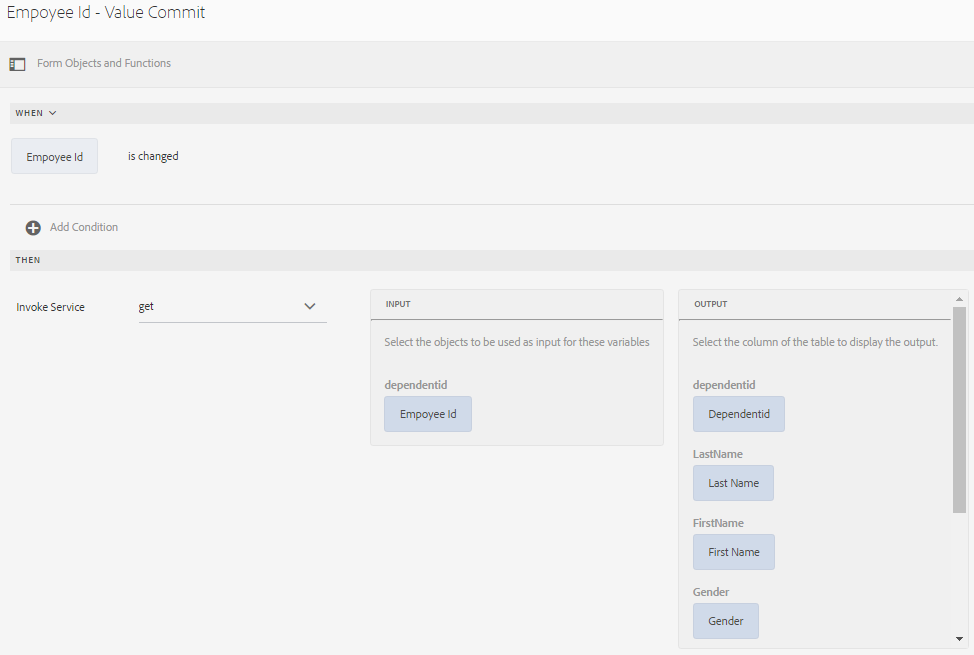

# 양식 데이터 모델 사용 {#use-form-data-model}

| 버전 | 문서 링크 |
| -------- | ---------------------------- |
| AEM 6.5 | [여기 클릭](https://experienceleague.adobe.com/docs/experience-manager-65/forms/form-data-model/using-form-data-model.html) |
| AEM as a Cloud Service | 이 문서 |

[!DNL Experience Manager Forms] 데이터 통합을 사용하면 서로 다른 백엔드 데이터 소스를 사용하여 다양한 적응형 Forms에서 스키마로 사용할 수 있는 양식 데이터 모델을 만들 수 있습니다 <!--and interactive communications--> 워크플로. 데이터 소스에서 사용할 수 있는 데이터 모델 개체 및 서비스를 기반으로 데이터 소스를 구성하고 양식 데이터 모델을 만들어야 합니다. 자세한 내용은 다음을 참조하십시오.

* [[!DNL Experience Manager Forms] 데이터 통합](data-integration.md)
* [데이터 소스 구성](configure-data-sources.md)
* [양식 데이터 모델 만들기](create-form-data-models.md)
* [양식 데이터 모델 작업](work-with-form-data-model.md)

양식 데이터 모델은 다음과 같은 작업에 사용할 수 있는 JSON 스키마의 확장입니다.

* [적응형 Forms 및 조각 만들기](#create-af)
  <!--* [Create interactive communications and building blocks like text, list, and condition fragments](#create-ic)-->
* [샘플 데이터로 미리 보기](#preview-ic)
* [양식 데이터 모델 서비스 사용](#prefill)
* [제출된 적응형 양식 데이터를 데이터 소스에 다시 쓰기](#write-af)
* [적응형 양식 규칙을 사용하여 서비스 호출](#invoke-services)

## 적응형 Forms 및 조각 만들기 {#create-af}

다음을 만들 수 있습니다. [적응형 Forms](creating-adaptive-form.md) 및 적응형 양식 단편 <!-- [Adaptive Form Fragments](adaptive-form-fragments.md) --> 양식 데이터 모델을 기반으로 합니다. 적응형 양식 또는 적응형 양식 단편을 만들 때 양식 데이터 모델을 사용하려면 다음을 수행하십시오.

1. 속성 추가 화면의 양식 모델 탭에서 **[!UICONTROL 양식 데이터 모델]** 다음에서 **[!UICONTROL 다음에서 선택]** 드롭다운 목록입니다.

   

1. 탭하여 확장 **[!UICONTROL 양식 데이터 모델 선택]**. 사용 가능한 모든 양식 데이터 모델이 나열됩니다.

   데이터 모델에서 을(를) 선택합니다.

   

1. (**적응형 양식 조각만**) 양식 데이터 모델의 데이터 모델 개체 하나만 기반으로 적응형 양식 조각을 만들 수 있습니다. 확장 **[!UICONTROL 양식 데이터 모델 정의]** 드롭다운. 지정된 양식 데이터 모델의 모든 데이터 모델 개체를 나열합니다. 목록에서 데이터 모델 개체를 선택합니다.

   

   양식 데이터 모델을 기반으로 하는 적응형 양식 또는 적응형 양식 조각이 만들어지면 양식 데이터 모델 개체가에 나타납니다. **[!UICONTROL 데이터 소스]** 적응형 양식 편집기에서 컨텐츠 브라우저의 탭입니다.

   >[!NOTE]
   >
   >적응형 양식 조각의 경우 작성 시 선택한 데이터 모델 개체 및 연관된 데이터 모델 개체만 데이터 소스 탭에 나타납니다.

   

   데이터 모델 개체를 적응형 양식 또는 조각으로 드래그 앤 드롭하여 양식 필드를 추가할 수 있습니다. 추가된 양식 필드는 메타데이터 속성 및 데이터 모델 개체 속성을 사용한 바인딩을 유지합니다. 바인딩을 사용하면 양식을 제출할 때 해당 데이터 소스에서 필드 값을 업데이트하고 양식을 렌더링할 때 미리 채워집니다.

<!-- ## Create interactive communications {#create-ic}

You can create an interactive communication based on a Form Data Model that you can use to prefill interactive communication with data from configured data sources. In addition, the building blocks of an interactive communication, such as text, list, and condition document fragments can be based on a form data model.

You can choose a Form Data Model when creating an interactive communication or a document fragment. The following image shows the General tab of the Create Interactive Communication dialog.

General tab of Create Interactive Communication dialog

For more information, see:

[Create an interactive communication](create-interactive-communication.md)

[Text in Interactive Communications](texts-interactive-communications.md)

[Conditions in Interactive Communications](conditions-interactive-communications.md)

[List fragments](lists.md) -->

## 샘플 데이터로 미리 보기 {#preview-ic}

양식 데이터 모델 편집기를 사용하면 양식 데이터 모델에서 데이터 모델 개체에 대한 샘플 데이터를 생성하고 편집할 수 있습니다. 이 데이터를 사용하여 미리 보고 테스트할 수 있습니다 <!--interactive communications and--> 적응형 Forms. 에 설명된 대로 미리 보기 전에 샘플 데이터를 생성해야 합니다 [양식 데이터 모델 작업](work-with-form-data-model.md#sample).

<!--To preview an interactive communication with sample Form Data Model data:

1. On [!DNL  Experience Manager] author instance, navigate to **[!UICONTROL Forms > Forms & Documents]**.
1. Select an interactive communication and tap **[!UICONTROL Preview]** in the toolbar to select **[!UICONTROL Web Channel]**, **[!UICONTROL Print Channel]**, or **[!UICONTROL Both Channels]** to preview the interactive communication.
1. In the Preview [*channel*] dialog, ensure that **[!UICONTROL Test Data of Form Data Model]** is selected and tap **[!UICONTROL Preview]**.

The interactive communication opens with prefilled sample data.

-->

샘플 데이터가 있는 적응형 양식을 미리 보려면 작성자 모드에서 적응형 양식을 열고 을 누릅니다 **[!UICONTROL 미리 보기]**.

## 양식 데이터 모델 서비스를 사용하여 미리 채우기 {#prefill}

[!DNL Experience Manager Forms] 는 적응형 Forms에 대해 활성화할 수 있는 기본 양식 데이터 모델 미리 채우기 서비스를 제공합니다 <!--and interactive communications--> 양식 데이터 모델을 기반으로 합니다. 미리 채우기 서비스는 적응형 양식의 데이터 모델 개체에 대한 데이터 소스를 쿼리합니다 <!--and interactive communication--> 따라서 양식을 렌더링하거나 통신을 렌더링하는 동안 데이터를 미리 채웁니다.

적응형 양식에 대해 양식 데이터 모델 미리 채우기 서비스를 활성화하려면 적응형 양식 컨테이너 속성을 열고 다음을 선택합니다 **[!UICONTROL 양식 데이터 모델 미리 채우기 서비스]** 다음에서 **[!UICONTROL 미리 채우기 서비스]** 기본 아코디언에 있는 드롭다운 그런 다음 속성을 저장합니다.

<!--To configure Form Data Model prefill service in an interactive communication, you can select Form Data Model Prefill Service in the Prefill Service drop-down while creating it or later by modifying the properties.

Edit Properties dialog for an interactive communication-->

## 제출된 적응형 양식 데이터를 데이터 소스에 쓰기 {#write-af}

사용자가 양식 데이터 모델을 기반으로 양식을 제출할 때 데이터 모델 개체에 대해 제출된 데이터를 해당 데이터 소스에 기록하도록 양식을 구성할 수 있습니다. 이 사용 사례를 달성하려면 [!DNL Experience Manager Forms] 제공 [양식 데이터 모델 제출 액션](configuring-submit-actions.md): 양식 데이터 모델을 기반으로 하는 적응형 Forms에 대해서만 즉시 사용할 수 있습니다. 데이터 소스에 데이터 모델 개체에 대해 제출된 데이터를 기록합니다.

양식 데이터 모델 제출 액션을 구성하려면 적응형 양식 컨테이너 속성을 열고 을 선택합니다 **[!UICONTROL 양식 데이터 모델을 사용하여 제출]** 제출 아코디언 아래의 제출 액션 드롭다운에서 참조할 수 있습니다. 그런 다음 데이터 모델 개체를 찾아보고 **[!UICONTROL 제출할 데이터 모델 개체의 이름]** 드롭다운. 속성을 저장합니다.

양식 제출 시 구성된 데이터 모델 개체의 데이터가 해당 데이터 소스에 기록됩니다.

<!---->

이진 데이터 모델 개체 속성을 사용하여 데이터 소스에 양식 첨부 파일을 제출할 수도 있습니다. 다음을 수행하여 첨부 파일을 JDBC 데이터 소스에 제출합니다.

1. 양식 데이터 모델에 이진 속성을 포함하는 데이터 모델 개체를 추가합니다.
1. 적응형 양식에서 을(를) 드래그 앤 드롭합니다 **[!UICONTROL 첨부 파일]** 구성 요소 브라우저의 구성 요소를 적응형 양식으로 전환합니다.
1. 탭하여 추가된 구성 요소를 선택하고 탭합니다.  구성 요소에 대한 속성 브라우저를 엽니다.
1. 바인드 참조 필드에서 을 누릅니다.  그리고 양식 데이터 모델에 추가한 이진 속성을 선택하여 이동합니다. 필요에 따라 다른 속성을 구성합니다.

   누르기  속성을 저장합니다. 이제 첨부 파일 필드가 양식 데이터 모델의 이진 속성에 바인딩됩니다.

1. 적응형 양식 컨테이너 속성의 제출 섹션에서 을 활성화합니다 **[!UICONTROL 양식 첨부 파일 제출]**. 양식을 제출할 때 이진 속성 필드의 첨부 파일을 데이터 소스에 제출합니다.

## 규칙을 사용하여 적응형 Forms에서 서비스 호출 {#invoke-services}

양식 데이터 모델을 기반으로 하는 적응형 양식에서 다음을 수행할 수 있습니다 [규칙 만들기](rule-editor.md) 양식 데이터 모델에 구성된 서비스를 호출합니다. 다음 **[!UICONTROL 서비스 호출]** 규칙의 작업은 양식 데이터 모델에서 사용 가능한 모든 서비스를 나열하며 서비스에 대한 입력 및 출력 필드를 선택할 수 있도록 해줍니다. 다음을 사용할 수도 있습니다 **[!UICONTROL 값 설정]** 양식 데이터 모델 서비스를 호출하고 필드의 값을 서비스에서 반환되는 출력으로 설정하는 규칙 유형입니다.

예를 들어, 다음 규칙은 직원 ID를 입력으로 취하며 반환된 값이 양식의 해당 종속 ID, 성, 이름 및 성별 필드에 채워지는 get 서비스를 호출합니다.

또한 `guidelib.dataIntegrationUtils.executeOperation` 규칙 편집기의 코드 편집기에서 JavaScript를 작성하는 API입니다. <!-- For API details, see [API to invoke Form Data Model service](invoke-form-data-model-services.md).-->

### 사용자 지정 함수를 사용하여 양식 데이터 모델 호출 {#invoke-form-data-model-using-custom-functions}

다음을 수행할 수 있습니다. [사용자 지정 함수를 사용하여 규칙 편집기에서 양식 데이터 모델 호출](/help/forms/rule-editor.md#custom-functions-in-rule-editor-custom-functions). 양식 데이터 모델을 호출하려면 양식 데이터 모델을 허용 목록에 추가하다에 추가합니다. 허용 목록에 양식 데이터 모델을 추가하려면 다음을 수행합니다.

1. 다음 위치에서 Experience Manager 웹 콘솔로 이동 `https://server:host/system/console/configMgr`.
1. 찾기 **[!UICONTROL 서비스 호출을 위한 양식 데이터 모델의 적응형 양식 수준 화이트리스트 - 구성 팩토리]**.
1. 클릭  구성 추가 아이콘..
1. 추가 **[!UICONTROL 컨텐츠 경로 패턴]** 를 클릭하여 적응형 Forms의 위치를 지정하십시오.  기본적으로 값은 입니다. `/content/forms/af/(.*)` 모든 적응형 Forms이 포함됩니다. 특정 적응형 양식의 경로를 지정할 수도 있습니다.
1. 추가 **[!UICONTROL 양식 데이터 모델 경로 패턴]** 양식 데이터 모델의 위치를 지정합니다. 기본적으로 값은 입니다. `/content/dams/formsanddocuments-fdm/(.*)` 모든 양식 데이터 모델을 포함합니다. 특정 양식 데이터 모델의 경로를 지정할 수도 있습니다.
1. 설정을 저장합니다.

추가된 구성은 **[!UICONTROL 서비스 호출을 위한 양식 데이터 모델의 적응형 양식 수준 화이트리스트 - 구성 팩토리]** 옵션을 선택합니다.

>[!VIDEO](https://video.tv.adobe.com/v/3423977/adaptive-forms-custom-function-rule-editor)

>[!NOTE]
>
> AEM Archetype 프로젝트를 통해 사용자 정의 함수를 사용하여 규칙 편집기에서 양식 데이터 모델을 호출하려면 다음을 수행합니다.
>
>1. [구성 파일 만들기](https://github.com/adobe/aem-core-forms-components/blob/master/it/config/src/main/content/jcr_root/apps/system/config/com.adobe.aemds.guide.factory.impl.AdaptiveFormFDMConfigurationFactoryImpl~core-components-it.cfg.json).
>1. getContentPathPattern 및 getFormDataModelPathPattern의 속성을 설정합니다.
>1. 프로젝트 배포.
