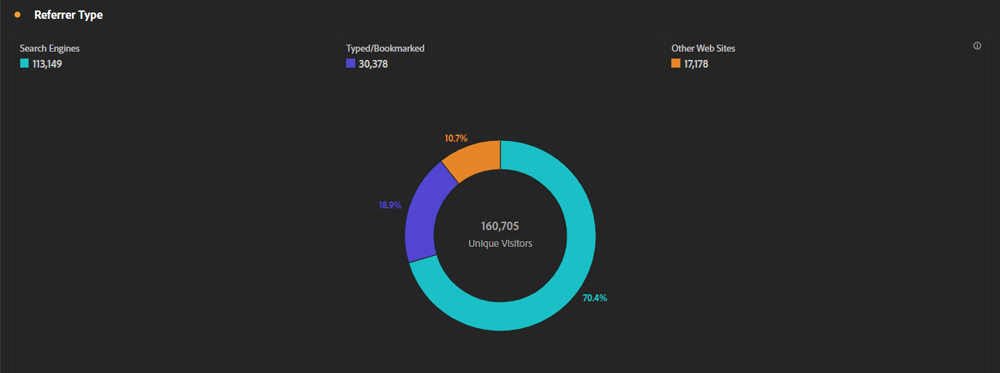
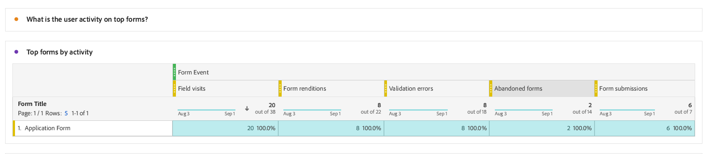

# 적응형 Forms 분석 보고서 보기 및 이해 {#viewing-and-understanding-aem-forms-analytics-reports}

빠르게 진화하는 디지털 분석 환경에서 정보에 입각한 의사 결정을 내리고 디지털 경험을 최적화하기 위해서는 글로벌 트렌드에 주의해야 합니다. 이를 해결하기 위해 적응형 Forms은 Adobe Analytics과 원활하게 통합되어 게시된 양식 및 문서에 대한 성능 지표를 캡처하고 추적합니다. 이러한 지표를 분석하는 목표는 지표와 분석을 사용하여 양식의 유용성과 효율성을 향상시켜 데이터 중심의 결정을 내리는 것입니다.

주요 성과 지표를 캡처하고 추적하여 기업은 개선 분야를 식별하고 사용자 경험을 최적화하며 궁극적으로 더 나은 결과를 도출하여 탁월한 고객 경험을 만들 수 있습니다.

## Adobe Analytics을 적응형 Forms으로 설정 {#setup-adobe-analytics-to-aem-forms}

AEM Forms Analytics 보고서의 경우 먼저 Experience Cloud 설정 자동화를 통해 Adobe Analytics을 AEM Forms에 통합합니다. 적응형 Forms에서 Experience Cloud 설정 자동화를 사용하려면 Adobe Analytics 라이선스, 추적 스크립트를 관리할 데이터 수집(이전 Adobe Launch)이 필요하며 간소화된 데이터 집계와 통찰력 생성을 위해 Experience Platform Launch API와의 통합이 필요합니다. 방문 [Experience Cloud 설정 자동화를 사용하여 적응형 양식용 Adobe Analytics 활성화](/help/forms/forms-experience-cloud-setup-automation.md) 전체 설정 정보.

## 적응형 Forms Adobe Analytics 보고서 보기 {#view-adobe-analytics-report}

1. AEM 인스턴스에서 **[!UICONTROL Forms]** >> **[!UICONTROL Forms 및 문서]**.
1. 양식을 선택하면 Adobe Analytics이 왼쪽과 같이 Adobe Analytics용으로 활성화된 Forms에 통합됩니다.

   

1. 클릭 **Adobe Analytics** 보고서를 보고 성과 데이터를 분석합니다.

## 적응형 Forms 분석 보고서 이해 {#understanding-aem-forms-analytics-reports}

Adobe Analytics은 양식 사용에 대한 중요한 통찰력을 제공하도록 설계된 포괄적인 적응형 Forms 성능 지표 배열을 제공합니다. 다음 지표는 다음과 같습니다.

### **적응형 Forms의 성과는 어떻습니까?** {#how-your-adaptive-form-is-performing}

여기에는 양식의 사용 및 효과를 평가할 수 있는 지표 양식 렌디션, 양식 제출, 유효성 검사 오류 및 고유 방문자 수가 포함되어 있습니다.

* **양식 표현물**: 양식 표현물은 양식이 렌더링되거나 열린 횟수를 보여줍니다.

* **양식 제출**: 양식 제출은 사용자가 적응형 양식을 성공적으로 완료하고 제출한 횟수를 나타냅니다.

* **유효성 검사 오류**: 유효성 검사 오류에 양식의 필드에서 발생한 총 유효성 검사 관련 오류 수가 표시됩니다.

* **고유 방문자 수**: 고유 방문자 수는 방문자가 양식을 렌더링한 횟수를 나타냅니다. 고유 방문자에 대한 자세한 내용은 [고유 방문자 수, 방문 횟수 및 고객 행동](https://experienceleague.adobe.com/docs/analytics/components/metrics/visits.html).

  

### **양식 방문자** {#visitors-to-your-forms}

이를 통해 양식의 방문자 활동에 대한 중요한 통찰력을 얻을 수 있습니다.

* **방문 및 제출**: 이 클릭에 대한 자세한 내용은 날짜 범위에서 양식에 대한 방문 빈도와 양식 제출 수에 대해 설명합니다 [방문 횟수](https://experienceleague.adobe.com/docs/analytics/components/metrics/visits.html).
* **고유 방문자 수 및 총 방문 횟수**: 새 사용자와 재방문 사용자를 구별합니다. 예를 들어 방문자는 한 달 동안 매일 사이트를 방문할 수 있지만 여전히 하나의 고유 방문자로 계산됩니다. 방문 [고유 방문자 수](https://experienceleague.adobe.com/docs/analytics/components/metrics/unique-visitors.html) 을 참조하십시오.

  

### **장치 유형** {#device-type}

장치 유형은 양식에 액세스하는 데 사용되는 장치 유형을 식별하는 데 도움이 됩니다. 장치 유형을 모바일 장치 유형으로 분류합니다. 예를 들어, 이 경우 모바일 디바이스 유형: 기타 및 모바일 디바이스 유형: 휴대폰입니다. 다양한 유형의 모바일 장치에는 휴대폰, 태블릿, 미디어 플레이어, 게임 콘솔 등이 포함됩니다.

### **지리적 분류** {#geographical-breakdown}

Forms이 액세스되는 위치를 표시합니다. 양식 사용자에 대한 지역별 정보를 제공합니다. 예를 들어, 그림과 같이 양식 사용자에 대한 지역별 정보가 인도임을 확인할 수 있습니다.

### **트래픽 및 인기 있는 양식의 주요 소스** {#top-sources-of-traffic-and-popular-forms}

이렇게 하면 양식을 참조하는 기본 소스 또는 링크를 식별하는 데 도움이 됩니다. 예를 들어 아래 주어진 이미지에서 18.9%가 다음과 같은 적응형 양식에 대한 검색 인스턴스를 볼 수 있습니다 **입력/책갈피 표시**, 70.49% 기반 **검색 엔진**, 24%는 다음에서 **기타 웹 사이트**. 요구 사항을 기반으로 차원 항목을 정의할 수 있습니다. 또한 가장 많이 방문한 양식과 인기 있는 양식을 구분할 수도 있습니다.

### **상위 양식의 사용자 활동** {#user-activity-on-top-forms}

필드 방문, 양식 렌디션, 유효성 검사 오류, 포기한 양식 및 양식 제출과 함께 사용자 참여를 종합적으로 봄으로써 가장 활동적인 양식에 대한 통찰력을 제공합니다. 아래 이미지에서 애플리케이션 양식이 양식 이벤트 지표를 기반으로 가장 활동적임을 알 수 있습니다.

### **양식 체류 시간 타임라인** {#timeline-for-time-spent-on-forms}

이는 사용자가 시간이 지남에 따라 양식에 소비하는 시간이며, 이를 통해 참여 패턴을 식별할 수 있습니다.

### **방문자가 양식 작성에 도움이 필요한 영역** {#areas-requiring-assistance}

도움말 보기, 유효성 검사 오류 및 필드 방문과 같은 지표는 사용자의 도움이 필요한 위치나 필드에서 오류를 추적하는 방법을 보여 줍니다. 예를 들어 아래 이미지에서는 와 같은 필드가 있는 폼에 **전체 이름**, **전화 번호**, **DoB**. 다음 **전체 이름** 필드에는 12개의 방문이 있고, 12개의 방문 중 8개의 방문에 유효성 검사 오류가 있으며, 이 필드의 도움말 보기에 대해 도움말 아이콘을 클릭한 방문이 1개입니다. 다른 양식 필드에 대한 지표 데이터를 볼 수 있습니다.

### **방문자가 양식을 포기하기 전에 본 마지막 양식 필드** {#last-form-field-that-visitors-viewed}

사용자가 양식을 중단하기 전에 시간을 보낸 양식 필드를 분석하는 데 도움이 됩니다. 예를 들어 아래 이미지에서 5개의 포기된 양식 중 2개는 필드에 남아 있습니다 **전체 이름**&#x200B;필드에 2개 남음 **전화 번호**, 필드에 왼쪽 1개 **텍스트 입력**.

