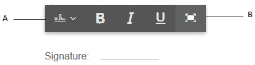
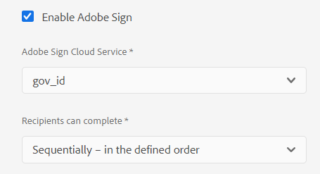
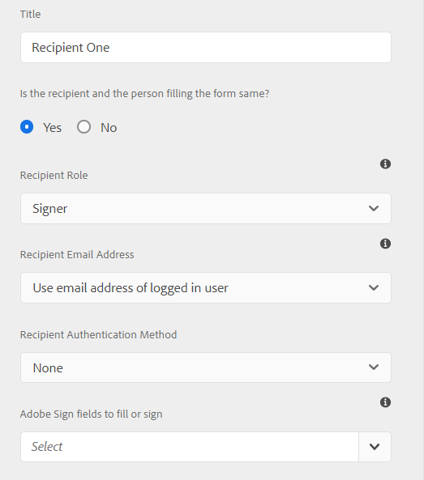

# 사용 [!DNL Adobe Sign] 적응형 양식에 {#using-adobe-sign-in-an-adaptive-form}


>[!NOTE]
>
>적응형 양식에서 Adobe Sign 역할을 사용하는 기능은 2021년 8월 사전 릴리스 채널에 있습니다. 이 기능은 일반적으로 2021년 9월 릴리스에서 제공됩니다.


[!DNL Adobe Sign]은 적응형 양식용 전자 서명 워크플로를 가능하게 합니다. 전자 서명은 법률, 영업, 급여, 인적 자원 관리 등 다양한 분야에 대한 문서를 처리하기 위한 워크플로우를 개선합니다.

일반적인 [!DNL Adobe Sign] 및 응용 Forms 시나리오에서 사용자는 하나 이상의 당사자의 서명을 필요로 하는 서비스에 적용되도록 적응형 양식을 채웁니다. 예를 들어, 대출 및 신용 카드 신청은 모든 대출자와 공동 지원자의 법적 서명을 필요로 합니다. 유사한 시나리오에 대해 전자 서명 워크플로우를 활성화하려면 를 통합할 수 있습니다 [!DNL Adobe Sign] 적응형 양식 사용. 몇 가지 예를 더 들자면 [!DNL Adobe Sign] 변환:

* 완전히 자동화된 제안, 견적 및 계약 프로세스를 사용하여 모든 장치의 거래를 마감합니다.
* 인적 자원 프로세스를 보다 신속하게 완료하고 직원들에게 디지털 경험을 제공합니다.
* 계약 주기를 단축하고 공급업체 가입을 보다 신속하게 처리합니다.
* 공통 프로세스를 자동화하는 디지털 워크플로우를 구축할 수 있습니다.

[!DNL Adobe Sign] 통합 [!DNL AEM Forms] 지원:

* 단일 및 다중 사용자 서명 워크플로우
* 순차적 및 동시 서명 워크플로우
* 양식을 익명 또는 로그인 사용자로 서명
* 동적 서명 프로세스(와 통합) [!DNL AEM Forms] 워크플로우)
* 기술 자료, 전화, 소셜 프로필 및 정부 ID를 통한 인증
* 각 계약 수신자에게 역할을 할당합니다. Adobe Sign for business 및 enterprise 서비스 수준에는 [계약 수신자의 역할](#addsignerstoanadaptiveform).

<!-- * In-form and out-of-form signing experiences -->

## 사전 요구 사항 {#prerequisites}

사용하기 전 [!DNL Adobe Sign] 적응형 양식에서:

* 확인 [!DNL AEM Forms] as a Cloud Service은 Adobe Sign을 사용하도록 구성되어 있습니다. 자세한 내용은 [Adobe Sign과 통합 [!DNL AEM Forms]](adobe-sign-integration-adaptive-forms.md).
* 수신자 목록을 준비합니다. 모든 수신자에 대해 최소 이메일 주소가 필요합니다.

## 구성 [!DNL Adobe Sign] 적용형 양식 {#configure-adobe-sign-for-an-adaptive-form}

구성하려면 [!DNL Adobe Sign] 적응형 양식의 경우:

1. [활성화 [!DNL Adobe Sign] 적용형 양식](#enableadobsignforanadaptiveform)
1. [추가 [!DNL Adobe Sign] 적응형 양식에 대한 필드](#addadobesignfieldstoanadaptiveform)
1. [선택 [!DNL Adobe Sign] 적응형 양식에 대한 Cloud Service](#select-adobe-sign-cloud-service-and-signing-order)

1. [추가 [!DNL Adobe Sign] 적응형 양식에 대한 수신자](#addsignerstoanadaptiveform)
1. [적응형 양식에 대한 제출 작업 선택](#selectsubmitactionforanadaptiveform)


### 활성화 [!DNL Adobe Sign] 적용형 양식  {#enableadobesign}

다음을 활성화할 수 있습니다 [!DNL Adobe Sign] 기존 적응형 양식에 대해 또는 [!DNL Adobe Sign] 적응형 양식을 활성화했습니다. 다음 중 하나를 선택합니다.

* [만들기 [!DNL Adobe Sign] 적응형 양식 사용](#create-an-adaptive-form-for-adobe-sign)
* [활성화 [!DNL Adobe Sign] 기존 적응형 양식](#editafsign).

#### Adobe Sign용 적응형 양식 만들기 {#create-an-adaptive-form-for-adobe-sign}

서명 사용 적응형 양식을 만들려면 다음을 수행하십시오.

1. 다음으로 이동 **[!UICONTROL Adobe Experience Manager]** > **[!UICONTROL Forms]** > **[!UICONTROL Forms 및 문서]**.
1. 탭 **[!UICONTROL 만들기]** 을(를) 선택합니다. **[!UICONTROL 적응형 양식]**. 템플릿 목록이 나타납니다. 템플릿을 선택하고 탭합니다 **[!UICONTROL 다음]**.
1. 에서 **[!UICONTROL 기본]** 탭:

   1. 을(를) 지정합니다. **[!UICONTROL 이름]** 및 **[!UICONTROL 제목]** 추가 정보.

   1. 을(를) 선택합니다 [구성 컨테이너](adobe-sign-integration-adaptive-forms.md#configure-adobe-sign-with-aem-forms) 다음 기간 동안 [통합 [!DNL Adobe Sign] with [!DNL AEM Forms]](adobe-sign-integration-adaptive-forms.md).
   구성 컨테이너에는 [!DNL Adobe Sign] 환경에 대해 구성된 Cloud Services. 이러한 서비스는 적응형 양식 편집기에서 선택할 수 있습니다.

1. 에서 **[!UICONTROL 양식 모델]** 탭에서 다음 옵션 중 하나를 선택합니다.

   * 사용자 지정 양식 서식 파일이 있고 양식 서식 파일을 기반으로 한 기록 문서가 필요한 경우 **[!UICONTROL 양식 서식 파일을 레코드 문서로 연결]** 옵션을 선택하고 레코드 문서 템플릿을 선택합니다. 옵션을 사용하면 서명을 위해 전송된 문서가 연관된 양식 템플릿을 기반으로 하는 필드만 표시됩니다. 적용형 양식의 모든 필드가 표시되지 않습니다.

   * 사용자 지정 양식 템플릿이 없는 경우 **[!UICONTROL 기록 문서 생성]** 선택 사항입니다. 옵션을 사용하면 서명을 위해 전송된 문서에 적응형 양식의 모든 필드가 표시됩니다.

1. 탭 **[!UICONTROL 만들기.]** 서명 사용 적응형 양식이 만들어집니다. 을(를) 추가할 수 있습니다 [!DNL Adobe Sign] 필드를 양식에 입력하고 서명을 위해 전송합니다.

#### 활성화 [!DNL Adobe Sign] 적용형 양식 {#editafsign}

를 사용하려면 [!DNL Adobe Sign] 기존 적응형 양식에서:

1. 다음으로 이동 **[!UICONTROL Adobe Experience Manager]** > **[!UICONTROL Forms]** > **[!UICONTROL Forms 및 문서]**.
1. 적응형 양식을 선택하고 탭합니다 **[!UICONTROL 속성]**.
1. 에서 **[!UICONTROL 기본]** 탭에서 을 선택합니다 [구성 컨테이너](adobe-sign-integration-adaptive-forms.md#configure-adobe-sign-with-aem-forms) 통합 중 생성됨 [!DNL Adobe Sign] with [!DNL AEM Forms].
1. 에서 **[!UICONTROL 양식 모드]** 탭에서 다음 옵션 중 하나를 선택합니다.

   * 사용자 지정 양식 서식 파일이 있고 양식 서식 파일을 기반으로 한 기록 문서가 필요한 경우 **[!UICONTROL 양식 서식 파일을 레코드 문서로 연결]** 옵션을 선택하고 레코드 문서 템플릿을 선택합니다. 옵션을 사용하면 서명을 위해 전송된 문서가 연관된 양식 템플릿을 기반으로 하는 필드만 표시됩니다. 적용형 양식의 모든 필드가 표시되지 않습니다.

   * 사용자 지정 양식 템플릿이 없는 경우 **[!UICONTROL 기록 문서 생성]** 선택 사항입니다. 옵션을 사용하면 서명을 위해 전송된 문서에 적응형 양식의 모든 필드가 표시됩니다.

1. 탭 **[!UICONTROL 저장 및 닫기]**. 적응형 양식은 다음에 대해 활성화됩니다. [!DNL Adobe Sign]. 이제 [!DNL Adobe Sign] 필드를 양식에 입력하고 서명을 위해 전송합니다.

### 추가 [!DNL Adobe Sign] 적응형 양식에 대한 필드 {#addadobesignfieldstoanadaptiveform}

[!DNL Adobe Sign] 에는 적응형 양식에 배치할 수 있는 다양한 필드가 있습니다. 이러한 필드는 서명, 이니셜, 회사 또는 제목과 같은 다양한 유형의 데이터를 허용하며 서명과 함께 서명 중에 추가 정보를 수집하는 데 도움이 됩니다. 를 사용할 수 있습니다 [!DNL Adobe Sign] 배치할 블록 구성 요소 [!DNL Adobe Sign] 적응형 양식의 다양한 위치에 있는 필드.

적응형 양식에 필드를 추가하고 이러한 필드와 관련된 다양한 옵션을 사용자 지정하려면 다음을 수행하십시오.

1. 드래그 앤 드롭 **[!UICONTROL Adobe Sign 블록]** 구성 요소 브라우저에서 적응형 양식에 이르기까지 구성 요소를 결합합니다. 다음 [!DNL Adobe Sign] 블록 구성 요소에 지원되는 모든 항목이 있습니다 [!DNL Adobe Sign] 필드. 기본적으로 **[!UICONTROL 서명]** 필드를 적응형 양식에 추가합니다.

   

   기본적으로 [!DNL Adobe Sign] 게시된 적응형 양식에 블록이 표시되지 않습니다. 서명 문서에서만 볼 수 있습니다. 가시성을 변경할 수 있습니다 [!DNL Adobe Sign] 의 속성에서 차단 [!DNL Adobe Sign] 블록 구성 요소입니다.

   >[!NOTE]
   >
   >  * 사용 [!DNL Adobe Sign] 블록은 필수가 아닙니다. [!DNL Adobe Sign] ( 적응형 양식) 아래에 그룹화됩니다. 사용하지 않는 경우 [!DNL Adobe Sign] 수신자의 필드를 차단하고 추가하면 서명 문서 하단에 기본 서명 필드가 표시됩니다.
   >  * 사용 [!DNL Adobe Sign] 자동으로 레코드 문서를 생성하는 적응형 Forms에 대해서만 차단. 사용자 지정 XDP를 사용하여 레코드 문서 또는 적응형 양식 기반의 양식 템플릿을 생성하는 경우 [!DNL Adobe Sign] 블록이 지원되지 않습니다.


1. 을(를) 선택합니다 **[!UICONTROL Adobe Sign 블록]** 구성 요소 및 탭 **[!UICONTROL 편집]**  아이콘. 필드의 필드와 형식 모양을 추가하는 옵션이 표시됩니다.

   

   **A.** 선택 및 추가 [!DNL Adobe Sign] 필드. **B.** 를 확장합니다. [!DNL Adobe Sign] 전체 화면 보기로 블록

1. 탭하기 **[!UICONTROL Adobe Sign]** 필드  아이콘. 선택 및 추가 옵션이 표시됩니다 [!DNL Adobe Sign] 필드.

   를 확장합니다. **[!UICONTROL 유형]** 드롭다운 필드를 선택하여 [!DNL Adobe Sign] Done 필드를 입력하고  아이콘 을 클릭하여 선택한 필드를 [!DNL Adobe Sign] 차단. 다음 **[!UICONTROL 유형]** 드롭다운 필드에는 서명, 수신자 정보 및 데이터 필드 유형이 포함됩니다. [!DNL Adobe Sign] AEM과 통합 [!DNL Forms] 에 나열된 지원 필드 [!UICONTROL 유형] 드롭다운 상자만 추가합니다. 에 대한 자세한 정보 [!DNL Adobe Sign] 필드 [Adobe Sign 설명서](https://helpx.adobe.com/sign/help/field-types.html).

   

   필드에 고유한 이름을 입력해야 합니다. 필수 필드를 선택하여 표시할 수도 있습니다. 추가 **[!UICONTROL 이름]** 및 **[!UICONTROL 필수 여부]** 옵션, 일부 [!DNL Adobe Sign] 필드에 더 많은 옵션이 있습니다. 예를 들어, 마스크 및 여러 줄. 또한 각각에 대해 고유한 이름을 지정합니다 [!DNL Adobe Sign] 필드가 동일한지 다른 필드인지 여부 [!DNL Adobe Sign] 블록.

   선택하는 경우 **[!UICONTROL 디지털 서명]** 드롭다운 목록에서 적응형 양식에 디지털 서명을 적용할 수 있습니다.

   * 클라우드 서명을 사용하여 온라인으로 서명 [디지털 ID](https://helpx.adobe.com/sign/kb/digital-certificate-providers.html) 트러스트 서비스 공급자가 호스팅합니다.
   * 스마트 카드, USB 토큰 또는 파일 기반 디지털 ID를 사용하여 Adobe Acrobat 또는 Reader으로 문서를 로컬로 다운로드하십시오.

### 활성화 [!DNL Adobe Sign] 적용형 양식 {#enableadobsignforanadaptiveform}

즉시 [!DNL Adobe Sign] 적응형 양식에 대해 활성화되어 있지 않습니다. 활성화하려면

1. 콘텐츠 브라우저에서 **[!UICONTROL 양식 컨테이너]**&#x200B;를 누르고 를 누릅니다 **[!UICONTROL 구성]**  아이콘. 속성 브라우저를 열고 적응형 양식 컨테이너 속성을 표시합니다.
1. 속성 브라우저에서 **[!UICONTROL 전자 서명]** 아코디언을 선택하고 **[!UICONTROL Adobe Sign 활성화]** 선택 사항입니다. 이 기능은 [!DNL Adobe Sign] 적용형 양식에 대해 설명합니다.

### 선택 [!DNL Adobe Sign] Cloud Service 및 서명 순서 {#select-adobe-sign-cloud-service-and-signing-order}

여러 항목을 구성할 수 있습니다 [!DNL Adobe Sign] AEM 인스턴스에 대한 서비스 [!DNL Forms]. 각 기능(인사, 재무 등)에 대해 별도의 서비스 세트를 갖는 것이 좋습니다. 서명된 문서를 보다 쉽게 추적 및 보고할 수 있습니다. 예를 들어, 은행에는 여러 부서가 있습니다. 문서 추적을 더 잘 하기 위해 각 부서에 대해 별도의 구성을 지정할 수 있습니다.

한 문서에 여러 수신자가 있을 수도 있습니다. 예를 들어 신용 카드 지원에는 여러 명의 지원자가 있을 수 있습니다. 은행은 지원서를 처리하기 전에 모든 지원자의 서명을 받아야 한다. 다중 수신자 시나리오의 경우 순차적 또는 동시 순서로 문서에 서명하도록 선택할 수 있습니다.

Cloud Service 및 서명 순서를 선택하려면 다음을 수행합니다.



1. 콘텐츠 브라우저에서 **[!UICONTROL 양식 컨테이너]**&#x200B;를 누르고 를 누릅니다 **[!UICONTROL 구성]**  아이콘. 속성 브라우저를 열고 적응형 양식 컨테이너 속성을 표시합니다.
1. 속성 브라우저에서 **[!UICONTROL 전자 서명]** 아코디언을 선택하고 **[!UICONTROL Adobe Sign 활성화]** 선택 사항입니다. 이 기능은 [!DNL Adobe Sign] 적용형 양식에 대해 설명합니다.
1. 이미 구성된 목록에서 Cloud Service을 선택합니다 [!DNL Adobe Sign] Cloud Services.

   만약 **[!UICONTROL Adobe Sign Cloud Service]** 목록이 비어 있는 경우 다음을 수행합니다 [구성 [!DNL Adobe Sign] with [!DNL AEM Forms]](adobe-sign-integration-adaptive-forms.md) 서비스 구성 문서 .

   드롭다운에 `global` 도구 > 의 폴더 **[!UICONTROL Cloud Services]** > **[!UICONTROL Adobe Sign]**. 또한 드롭다운에는 **[!UICONTROL 구성 컨테이너]** 적응형 양식을 만들 때 필드를 선택합니다.

1. 에서 서명 순서를 선택합니다 **[!UICONTROL 수신자가 완료 가능]** 대화 상자 수신자는 적응형 양식에 서명할 수 있습니다 **[!UICONTROL 순차적]** - 다른 수신자의 다음 또는 **[!UICONTROL 동시에]** - 어떤 순서로

   순차적 순서로 한 명의 수신자는 한 번에 Adobe Sign 계약서를 받습니다. 수신자가 지정된 작업을 완료하면 다음 수신자에게 계약이 전송됩니다.

   동시에 모든 수신자는 Adobe Sign 계약을 수신하고 서로 동시에 조치를 취할 수 있습니다.

1. 계약 ID 필드를 사용하여 바인드레이를 계약 ID(agreementId)에 연결합니다. 스키마 기반 양식을 위한 데이터 제출 데이터의 afBoundData 섹션에 계약 ID를 추가합니다. 또한 계약 ID는 모든 Adobe Sign 지원 양식에 대해 제출된 데이터의 afSubmissionInfo 섹션에도 추가됩니다. 사용자 지정 코드를 사용하여 계약 상태를 추적하는 데 계약 ID를 사용할 수 있습니다(사용자 지정 구현 필요).

1. [적응형 양식에 수신자 추가](working-with-adobe-sign.md#addsignerstoanadaptiveform) 완료 를 탭하고  아이콘을 클릭하여 변경 사항을 저장합니다.

### 적응형 양식에 수신자 추가 {#addsignerstoanadaptiveform}

Adobe Sign 계약에 대해 수신자를 한 명 또는 여러 명 보유할 수 있습니다. 수신자를 추가할 때 수신자에 대한 인증 세부 사항을 구성하고 양식 필러 및 수신자가 동일한지 여부를 선택할 수도 있습니다. 수신자에 대해 다양한 세부 정보를 추가하고 제공하려면 다음 단계를 수행하십시오.

1. 콘텐츠 브라우저에서 **[!UICONTROL 양식 컨테이너]**&#x200B;를 누르고 를 누릅니다 **[!UICONTROL 구성]**  아이콘. 응용 양식 컨테이너 속성이 있는 속성 브라우저를 엽니다.
1. 속성 브라우저에서 **[!UICONTROL 전자 서명]** 아코디언을 선택하고 **[!UICONTROL Adobe Sign 활성화]** 선택 사항입니다. 이 기능은 [!DNL Adobe Sign] 적용형 양식에 대해 설명합니다.
1. 탭 **[!UICONTROL 수신자 추가]**. 적응형 양식에 수신자를 추가합니다. 여러 수신자를 적응형 양식에 추가할 수 있습니다. 모든 수신자는 적응형 양식 제출에 대한 Adobe Sign 계약서를 받습니다.
   

1. 을(를) 클릭합니다. **[!UICONTROL 편집]**  아이콘 을 클릭하여 수신자에 대한 다음 정보를 지정합니다.

   * **[!UICONTROL 제목]:** 수신자를 고유하게 식별할 제목을 지정합니다.

   * **[!UICONTROL 해당 수신자 및 인원이 동일한 양식을 작성 중입니까?]:** 선택 **[!UICONTROL 예]**&#x200B;와 같은 경우 양식 필러와 첫 번째 수신자가 동일합니다. <!-- If the option is set to **No,** then do not use the signature step component in the Adaptive Form. If the form contains a Signature Step component, then the field is automatically set to Yes. -->

   * **[!UICONTROL 수신자 역할]:** 수신자의 역할을 선택합니다. Adobe Sign for business 및 enterprise 서비스 수준에는 [계약 수신자의 역할](https://helpx.adobe.com/sign/using/set-up-signer-approver-roles.html), 단지 **서명자**&#x200B;을 추가하여 워크플로우 요구 사항과 더 잘 일치하도록 합니다.

   * **[!UICONTROL 수신자 이메일 주소]:** 수신자의 이메일 주소를 지정합니다. 수신자는 지정된 이메일 주소에서 Adobe Sign 계약서를 받습니다. 양식 필드에 제공된 이메일 주소를 사용하거나, 로그인한 사용자의 Experience Manager 사용자 프로필에 사용하거나, 수동으로 이메일 주소를 입력할 수 있습니다. 이것은 필수 단계입니다.

      >[!NOTE]
      >
      >첫 번째 수신자 또는 유일한 수신자(단일 수신자가 있는 경우)의 이메일 주소가 동일하지 않은지 확인합니다 [!DNL Adobe Sign] aem 클라우드 서비스를 구성하는 데 사용되는 계정입니다.

   * **[!UICONTROL 받는 사람 인증 방법]:** Adobe Sign 계약을 열기 전에 수신자를 인증하는 방법을 지정합니다. 전화, 기술 자료, 소셜 ID 기반 인증 및 [정부 ID](https://helpx.adobe.com/sign/using/adobesign-authentication-government-id.html).
   >[!NOTE]
   >
   >    * 기본적으로 소셜 ID 기반 인증은 Facebook, Google 및 LinkedIn을 사용하여 인증할 수 있는 옵션을 제공합니다. 연락하시면 됩니다 [!DNL Adobe Sign] 다른 소셜 인증 공급자를 사용하도록 지원합니다.


   * **[!DNL Adobe Sign]채우거나 서명할 필드:** 선택 [!DNL Adobe Sign] 수신자의 필드. 적응형 양식에는 여러 개가 있을 수 있습니다 [!DNL Adobe Sign] 필드. 수신자에 대해 특정 필드를 활성화하도록 선택할 수 있습니다. 필드에 사용 가능한 모든 항목이 표시됩니다 [!DNL Adobe Sign] 블록. 블록을 선택하면 블록의 모든 필드가 선택됩니다. X 아이콘을 사용하여 필드를 선택 취소할 수 있습니다.

   

   위의 이미지에는 두 가지 예제가 있습니다 [!DNL Adobe Sign] 블록: 개인 정보 및 Office 세부 정보

   탭하기  아이콘. 수신자가 추가됩니다.

### 적응형 양식에 대한 제출 작업 선택 {#selectsubmitactionforanadaptiveform}

후에 을 추가합니다 [!DNL Adobe Sign] 적응형 양식에 대한 필드를 설정하고 [!DNL Adobe Sign] 양식 컨테이너에서 을 선택합니다. [!DNL Adobe Sign] Cloud Service 및 Adobe Sign 계약 수신자를 추가하고 적응형 양식에 적합한 제출 작업을 선택합니다. 적응형 Forms 제출 작업에 대한 자세한 내용은 [제출 작업 구성](configuring-submit-actions.md).

양식에 서명하고 제출하는 것은 서로 독립적입니다. 적응형 양식 제출은 사용자가 양식을 제출한 후 Adobe Sign 계약이 만들어지자마자 발생합니다. [!DNL AEM Forms] as a Cloud Service은 수신자가 서명하거나 다른 작업을 완료하여 적응형 양식을 제출할 때까지 기다리지 않습니다. 사용자가 제출 단추를 클릭하거나 요약 단계에서 양식 요약이 표시되는 즉시 양식이 제출됩니다.

또한, [!DNL Adobe Sign] 적응형 양식이 활성화되면 데이터를 제출할 Adobe Sign 계약 ID가 포함됩니다. 사용자 지정 코드를 사용하여 계약 상태를 추적하는 데 계약 ID를 사용할 수 있습니다(사용자 지정 구현 필요).

Adobe Sign 계약 ID(agreementId)는 적응형 양식의 제출 데이터에 포함됩니다. 기본적으로 계약 ID는 `afSubmissionInfo` 노드 아래에 나열된 상태로 남아 있습니다.

```xml
   <?xml version="1.0" encoding="UTF-8"?>
   <afData>
      <afUnboundData>
         <data>
            <textbox1613455050902>ff</textbox1613455050902>
         </data>
      </afUnboundData>
      <afBoundData>
         <data xmlns:xfa="http://www.xfa.org/schema/xfa-data/1.0/" />
      </afBoundData>
      <afSubmissionInfo>
         <lastFocusItem>guide[0].guide1[0].guideRootPanel[0].textbox1613455050902[0]</lastFocusItem>
         <stateOverrides />
         <signers>
            <signer0>
               <email />
            </signer0>
         </signers>
         <afPath>/content/dam/formsanddocuments/testsign</afPath>
         <afSubmissionTime>20210311031009</afSubmissionTime>
         <agreementId>xxxxxxxxxxxxxxxxxxxxxxxxxxxxxxxxxxxxxxxxxxxxx</agreementId>
      </afSubmissionInfo>
   </afData>
```

또한 바인드론을 계약 ID(agreementId)에 연관시킬 수도 있습니다. 제출된 데이터의 afBoundData 섹션에 계약 ID가 추가됩니다. 예를 들어 다음 제출된 데이터에서 계약 ID는 `<userName>` 노드:

```xml
      <?xml version="1.0" encoding="UTF-8"?>
      <afData>
         <afUnboundData>
            <data />
         </afUnboundData>
         <afBoundData>
            <config xmlns:xfa="http://www.xfa.org/schema/xfa-data/1.0/" xmlns:xsi="http://www.w3.org/2001/XMLSchema-instance">
               <agreementID>3AAABLblqZhC2MWu7GFauKh45j_t2ih8mAtmbdIcNSl1HgQubhMJfDaDfylyN7NQiYRam_44ISKm45enIOafHqWZrdaxShf9r</agreementID>
               <dateOfBirth>0001-01-01</dateOfBirth>
            </config>
         </afBoundData>
         <afSubmissionInfo>
            <lastFocusItem>guide[0].guide1[0].guideRootPanel[0].projectDetails[0]</lastFocusItem>
            <stateOverrides />
            <signers>
               <signer0>
                  <email />
               </signer0>
            </signers>
            <afPath>/content/dam/formsanddocuments/testathon2021-1/gaurav/xsd-based</afPath>
            <afSubmissionTime>20210311095211</afSubmissionTime>
            <agreementId>xxxxxxxxxxxxxxxxxxxxxxxxxxxxxxxxxxxxxxxxxxxx</agreementId>
         </afSubmissionInfo>
      </afData>
```

<!-- Remove when forms portal goes live
>[!NOTE]
>
>Data of the Adaptive Form is stored temporarily on Forms Portal. It is recommended to use [custom storage for Forms Portal](/help/forms/using/configuring-draft-submission-storage.md). It ensures that the PII (personally identifiable information) data is not stored on AEM servers. 
-->

양식 서명 경험이 준비되었습니다. 양식을 미리 보고 서명 경험을 확인할 수 있습니다. 게시된 양식에서 [!DNL Adobe Sign] 수신자가 전자 메일을 통해 서명할 양식을 수신하면 블록 필드가 표시됩니다. 이 **[!UICONTROL 수신자와 양식 작성자는 언제 됩니까?]** 옵션이 yes로 표시되고 조건이 충족되면 사용자가 제출 후 Adobe Sign 계약으로 리디렉션되며 전자 메일에 계약이 표시될 때까지 기다리지 않고 즉시 문서에 서명할 수 있습니다.

## 적응형 양식에 대한 클라우드 서명 구성 {#configure-cloud-signatures-for-an-adaptive-form}

클라우드 기반의 디지털 서명 또는 원격 서명은 데스크탑, 모바일 및 웹에서 작동하는 새로운 차원의 디지털 서명으로, 수신자 인증을 위한 최고 수준의 규정 준수 및 보증을 충족합니다. 클라우드 기반 디지털 서명을 사용하여 적응형 양식에 서명할 수 있습니다.

후 [Adobe Sign에 대한 적응형 양식 속성 편집](working-with-adobe-sign.md#enableadobesign)적응형 양식에 클라우드 서명 필드를 추가하려면 다음 단계를 수행하십시오.

1. 드래그 앤 드롭 **[!UICONTROL Adobe Sign 블록]** 구성 요소 브라우저에서 적응형 양식에 이르기까지 구성 요소를 결합합니다. 다음 [!UICONTROL Adobe Sign 블록] 구성 요소에 지원되는 모든 항목이 있습니다 [!DNL Adobe Sign] 필드. 기본적으로 **[!UICONTROL 서명]** 필드를 적응형 양식에 추가합니다.

   

1. 을(를) 선택합니다 **[!UICONTROL Adobe Sign 블록]** 구성 요소 및 탭 **[!UICONTROL 편집]**  아이콘. 필드의 필드와 형식 모양을 추가하는 옵션이 표시됩니다.

   

   **A.** 선택 및 추가 [!DNL Adobe Sign] 필드. **B.** 를 확장합니다. [!DNL Adobe Sign] 전체 화면 보기로 블록

1. 탭하기 **[!UICONTROL Adobe Sign 필드]**  아이콘. 선택 및 추가 옵션이 표시됩니다 [!DNL Adobe Sign] 필드.

   를 확장합니다. **[!UICONTROL 유형]** 선택할 드롭다운 필드 **[!UICONTROL 디지털 서명]** 을(를) 탭하고 **[!UICONTROL 완료]** 아이콘 을 클릭하여 선택한 필드를 [!DNL Adobe Sign] 차단.

   

   필드에 고유한 이름을 입력해야 합니다.

   다음을 사용하여 적응형 양식에 디지털 서명을 적용합니다.

   * 클라우드 서명: 로그인하여 [디지털 ID](https://helpx.adobe.com/sign/kb/digital-certificate-providers.html) 트러스트 서비스 공급자가 호스팅합니다.
   * Adobe Acrobat 또는 Reader: 스마트 카드, USB 토큰 또는 파일 기반 디지털 ID를 사용하여 서명하려면 Adobe Acrobat 또는 Reader으로 문서를 다운로드하여 엽니다.

   적응형 양식에 클라우드 서명 필드를 추가한 후 다음 단계를 수행하여 구성 프로세스를 완료합니다.

   * [적응형 양식에 Adobe Sign 활성화](#enableadobsignforanadaptiveform)
   * [적응형 양식에 대한 Adobe Sign Cloud Service 선택](#selectadobesigncloudserviceforanadaptiveform)
   * [적응형 양식에 수신자 추가](#addsignerstoanadaptiveform)
   * [적응형 양식에 대한 제출 작업 선택](#selectsubmitactionforanadaptiveform)


### 감사 인사 페이지 또는 요약 단계 구성 요소 구성 {#configure-the-thank-you-page-or-summary-step-component}

다음 **[!UICONTROL 요약 단계]** 구성 요소는 양식을 자동으로 제출하고, 사용자 지정된 요약 페이지 내의 정보를 채우고, 제출된 양식의 요약을 표시합니다. 요약 단계 구성 요소는 양식에 사용할 수 있는 전체 너비를 설정합니다. 요약 단계 구성 요소가 포함된 섹션에는 다른 구성 요소가 없는 것이 좋습니다.

## 자주 묻는 질문 {#frequently-asked-questions}

**Q:** 적응형 양식을 다른 적응형 양식에 포함할 수 있습니다. 포함된 적응형 양식을 [!DNL Adobe Sign] 활성화했습니까?
**Ans:** 아니요. Experience Manager Forms은 다음을 포함하는 적응형 양식 사용을 지원하지 않습니다 [!DNL Adobe Sign] 서명을 위한 적응형 양식 사용

**Q:** 고급 템플릿을 사용하여 적응형 양식을 만들고 편집할 수 있도록 열면 &quot;전자 서명 또는 수신자가 올바르게 구성되지 않았습니다.&quot;라는 오류 메시지가 표시됩니다. 이 나타납니다. 오류 메시지를 해결하는 방법
**Ans:** 고급 템플릿을 사용하여 만든 적응형 양식이 을 사용하도록 구성되었습니다 [!DNL Adobe Sign]. 오류를 해결하려면 다음을 만들고 선택합니다 [!DNL Adobe Sign] 클라우드 구성 및 구성 [!DNL Adobe Sign] 적응형 양식의 수신자.

**Q:** 사용할 수 있나요 [!DNL Adobe Sign] 적응형 양식의 정적 텍스트 구성 요소에 있는 텍스트 태그?
**Ans:** 예, 텍스트 구성 요소에서 텍스트 태그를 사용하여 추가할 수 있습니다 [!DNL Adobe Sign] 필드를 기록 문서(자동 생성된 레코드 문서 옵션만 해당)로 활성화된 적응형 양식에 추가합니다. 텍스트 태그를 만드는 절차 및 규칙에 대해 알아보려면 [Adobe Sign 설명서](https://helpx.adobe.com/sign/using/text-tag.html). 또한 적응형 Forms은 텍스트 태그에 대한 지원이 제한적입니다. 텍스트 태그를 사용하여 [Adobe Sign 블록](working-with-adobe-sign.md#configure-cloud-signatures-for-an-adaptive-form) 을 지원합니다.

## 문제 해결 {#troubleshoot}

### [!DNL Adobe Sign] 계약 실패 {#adobe-sign-agreement-failures}

**문제**
When [!DNL Adobe Sign] 서비스가 적응형 양식에 대해 구성되어 있어서 서비스가 [!DNL Adobe Sign] 기본 적응형 양식에 대한 계약.

**해결**

* 을(를) 확인합니다. [Adobe Sign Cloud Service 구성](adobe-sign-integration-adaptive-forms.md) 적응형 양식에 사용됩니다.
* API 애플리케이션이 켜져 있는지 확인합니다. [!DNL Adobe Sign] 구성하는 데 사용되는 서버 [!DNL Adobe Sign] Cloud Service에 필요한 권한이 있습니다.
* 여러 항목을 사용하는 경우 [!DNL Adobe Sign] Cloud Services, **[!UICONTROL oAuth URL]** 모든 서비스를 동일하게 **[!UICONTROL Adobe Sign 샤드]**.

* 별도의 이메일 주소를 사용하여 구성 [!DNL Adobe Sign] 첫 번째 또는 단일 수신자에 대해 및 계정을 사용할 수 있습니다. 첫 번째 수신자 또는 유일한 수신자(단일 수신자가 있는 경우)의 전자 메일 주소는 동일할 수 없습니다 [!DNL Adobe Sign] aem 클라우드 서비스를 구성하는 데 사용되는 계정입니다.

## 관련 문서 {#related-articles}

* [통합 [!DNL Adobe Sign] with [!DNL AEM Forms]](adobe-sign-integration-adaptive-forms.md)
* [사용 우수 사례 [!DNL Adobe Sign] 응용 Forms 사용](https://medium.com/adobetech/using-adobe-sign-to-e-sign-an-adaptive-form-heres-the-best-way-to-do-it-dc3e15f9b684)
