# 변형 생성 {#generate-variations}

디지털 채널을 최적화하고 컨텐츠 생성을 가속화하는 방법을 찾고 있다면 변형 생성을 사용할 수 있습니다. 변형 생성 은 생성 AI(인공 지능)를 사용하여 프롬프트에 따라 콘텐츠 변형을 만듭니다. 이러한 프롬프트는 Adobe이 제공하거나 사용자가 만들고 관리합니다. 변형을 만든 후에는 웹 사이트의 콘텐츠를 사용하고 을 사용하여 성공을 측정할 수도 있습니다. [실험](https://www.aem.live/docs/experimentation) 기능 [Edge Delivery Services](/help/edge/overview.md).

다음을 수행할 수 있습니다. [변형 생성 액세스](#access-generate-variations) 출처:

<!-- 
* [within Adobe Experience Manager (AEM) as a Cloud Service](#access-aemaacs)
-->

* [AEM Edge Delivery Services Sidekick](#access-aem-sidekick)

이후에 다음과 같은 작업을 수행할 수 있습니다.

* [시작](#get-started) Adobe이 특정 사용 사례에 대해 만든 프롬프트 템플릿을 사용합니다.
* 다음을 수행할 수 있습니다. [기존 프롬프트 편집](#edit-the-prompt)
* 또는 [자신만의 프롬프트 작성 및 사용](#create-prompt):
   * [프롬프트 저장](#save-prompt) 차후 사용을 위해
   * [공유 프롬프트 액세스 및 사용](#select-prompt) 조직 전체에서
* 다음을 정의합니다. [대상자](#audiences) 다음 경우에 프롬프트에서 사용할 세그먼트 [개인화된 대상별 콘텐츠 생성](#generate-copy).
* 필요한 경우 수정 및 결과를 구체화하기 전에 프롬프트와 함께 출력을 미리 봅니다.
* 사용 [이미지 생성 Adobe Express](#generate-image) 사본 변형을 기반으로 Firefly의 생성 AI 기능을 사용합니다.
* 웹 사이트 또는 실험에서 사용할 콘텐츠를 선택합니다.

## 법률 및 사용 노트 {#legal-usage-note}

AEM용 생성 AI 및 변형 생성은 강력한 도구이지만 **본인** 은(는) 출력의 사용을 담당합니다.

서비스에 대한 입력은 컨텍스트에 연결되어 있어야 합니다. 이 컨텍스트는 브랜딩 자료, 웹 사이트 콘텐츠, 데이터, 이러한 데이터의 스키마, 템플릿 또는 기타 신뢰할 수 있는 문서일 수 있습니다.

사용 사례에 맞게 출력의 정확성을 평가해야 합니다.

변형 생성을 사용하기 전에 다음 내용에 동의해야 합니다. [Adobe 생성 AI 사용자 지침](https://www.adobe.com/legal/licenses-terms/adobe-dx-gen-ai-user-guidelines.html).

[변형 생성 사용](#generative-action-usage) 는 생성적 행위의 소비와 관련이 있습니다.

## 개요 {#overview}

변형 생성 을 열고 왼쪽 패널을 확장하면 다음과 같이 표시됩니다.

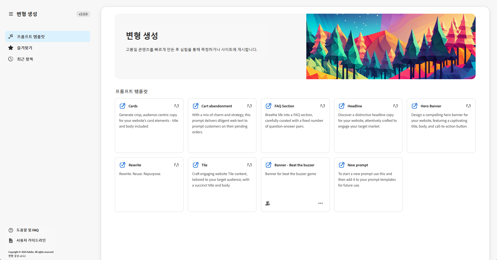

* 오른쪽 패널
   * 이는 왼쪽 탐색에서 선택한 항목에 따라 다릅니다.
   * 기본적으로, **프롬프트 템플릿** 이 표시됩니다.
* 왼쪽 탐색
   * 의 왼쪽에 **변형 생성**&#x200B;왼쪽 탐색 패널을 확장하거나 숨길 수 있는 옵션(샌드위치 메뉴)이 있습니다.
   * **프롬프트 템플릿**:
      * 다양한 프롬프트에 대한 링크를 표시합니다. 여기에는 프롬프트가 포함될 수 있습니다.
         * 콘텐츠를 생성하는 데 도움이 되도록 Adobe에서 제공합니다. Adobe 아이콘으로 플래그가 지정됩니다.
         * 직접 만든 것입니다.
         * IMS 조직 내에서 만들어지며, 여러 헤드를 표시하는 아이콘으로 플래그가 지정됩니다.
      * 다음을 포함합니다. [새 프롬프트](#create-prompt) 나만의 프롬프트를 만들기 위한 링크.
      * 다음을 수행할 수 있습니다. **삭제** 은 직접 또는 IMS 조직 내에서 만든 메시지입니다. 이 작업은 해당 카드의 타원으로 액세스할 수 있는 메뉴를 사용하여 수행됩니다.
   * [즐겨찾기](#favorites): 즐겨찾기로 플래그 지정한 이전 세대의 결과를 표시합니다.
   * [최근 항목](#recents): 최근에 사용한 프롬프트 및 해당 입력에 대한 링크를 제공합니다.
   * **도움말 및 FAQ**: FAQ를 포함한 설명서 링크.
   * **사용자 지침**: 법률 지침 링크.

## 시작하기 {#get-started}

인터페이스는 콘텐츠를 생성하는 프로세스를 안내합니다. 인터페이스를 연 후 첫 번째 단계는 사용할 프롬프트를 선택하는 것입니다.

### 프롬프트 선택 {#select-prompt}

기본 패널에서 다음을 선택할 수 있습니다.

* 콘텐츠 생성을 시작하기 위해 Adobe에서 제공한 프롬프트 템플릿,
* 다음 [새 프롬프트](#create-prompt) 자신만의 프롬프트를 만들려면,
* 사용자 전용으로만 만든 템플릿
* 사용자 또는 조직의 누군가가 만든 템플릿입니다.

구분하려면 다음을 수행하십시오.

* Adobe이 제공한 프롬프트는 Adobe 아이콘으로 플래그가 지정됩니다
* IMS 조직 전체에서 사용할 수 있는 프롬프트는 여러 헤드 아이콘으로 플래그가 지정됩니다.
* 비공개 프롬프트에 특정 플래그가 지정되지 않았습니다.

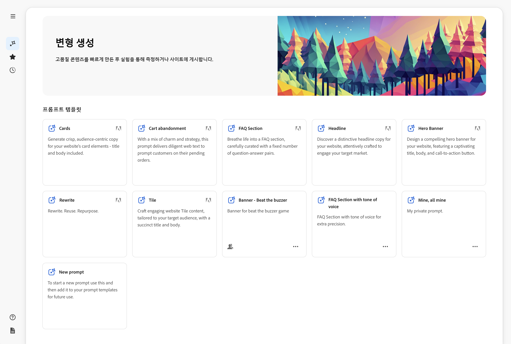

### 입력 제공 {#provide-inputs}

각 프롬프트는 생성 AI에서 적절한 콘텐츠를 다시 가져올 수 있도록 특정 정보를 제공해야 합니다.

입력 필드는 필요한 정보를 안내합니다. 특정 필드에는 필요에 따라 사용하거나 수정할 수 있는 기본값과 요구 사항을 설명하는 설명이 있습니다.

여러 프롬프트에 공통되는 몇 가지 키 입력 필드가 있습니다(특정 필드를 항상 사용할 수 있는 것은 아님).

* **카운트**/**의 수**
   * 한 세대에서 만들 콘텐츠 변형의 수를 선택할 수 있습니다.
   * 프롬프트에 따라 Count, Number of Variations, Number of Ideas 등과 같은 다양한 레이블 중 하나가 있을 수 있습니다.
* **대상 소스**/**타겟 대상**
   * 특정 대상에게 개인화된 콘텐츠를 생성하는 데 도움이 됩니다.
   * Adobe은 기본 대상을 제공하거나 추가 대상을 지정할 수 있습니다. 다음을 참조하십시오. [대상](#audiences).
* **추가 컨텍스트**
   * 입력을 기반으로 생성 AI가 더 나은 응답을 구축할 수 있도록 관련 콘텐츠를 삽입합니다. 예를 들어 특정 페이지나 제품에 대한 웹 배너를 만드는 경우 페이지/제품에 대한 정보를 포함할 수 있습니다.
* **온도**
을 사용하여 Adobe 생성 AI의 온도를 수정합니다.
   * 더 높은 온도는 프롬프트에서 벗어나고 더 많은 변화, 무작위성, 창의성을 초래한다.
   * 온도가 낮을수록 더 결정적이고 프롬프트에 있는 것에 더 가깝습니다.
   * 기본적으로 온도는 1로 설정됩니다. 생성된 결과가 마음에 들지 않을 경우 다른 온도로 실험할 수 있습니다.
* **프롬프트 편집**
   * 기본 [프롬프트를 편집할 수 있음](#edit-the-prompt) 생성된 결과를 구체화합니다.

### 사본 생성 {#generate-copy}

입력 필드를 입력하거나 프롬프트를 수정한 후 콘텐츠를 생성하고 응답을 검토할 준비가 되었습니다.

선택 **생성** 생성된 AI에서 생성된 응답을 확인합니다. 생성된 콘텐츠 변형은 이를 생성한 프롬프트 아래에 표시됩니다.

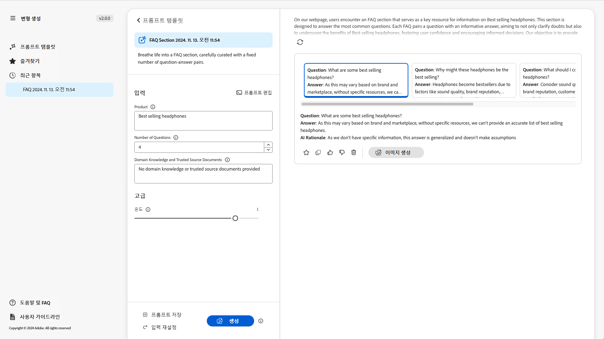

>[!NOTE]
>
>대부분의 Adobe 프롬프트 템플릿에는 **AI Rationale** 변형 응답에서 이렇게 하면 생성 AI가 특정 변형을 생성한 이유에 대한 투명성이 제공됩니다.

단일 변형을 선택하면 다음 작업을 사용할 수 있습니다.

* **즐겨찾기**
   * 플래그 **즐겨찾기** 나중에 사용하기 위해 (다음에표시) [즐겨찾기](#favorites)).
* 엄지 손가락 위로/엄지 손가락 아래로
   * 엄지 손가락 위/아래 표시기를 사용하여 응답의 품질을 Adobe에게 알립니다.
* **복사**
   * 웹 사이트 또는 웹 사이트에서 컨텐츠를 작성할 때 사용할 클립보드에 복사 [실험](https://www.aem.live/docs/experimentation).
* **제거**

입력 또는 프롬프트를 세분화해야 하는 경우 조정하고 선택할 수 있습니다. **생성** 새 응답 세트를 가져오려면 다시 시도하십시오. 새 프롬프트 및 응답은 초기 프롬프트 및 응답 아래에 표시되며, 위아래로 스크롤하여 다양한 콘텐츠 세트를 볼 수 있습니다.

각 변형 세트 위에는 변형과 함께 변형을 만든 프롬프트가 있습니다. **재사용** 옵션을 선택합니다. 프롬프트에서 해당 입력을 다시 실행해야 하는 경우 다음을 선택합니다. **재사용** 다시 로드하려면 **입력**.

### 이미지 생성 {#generate-image}

텍스트 변형을 생성한 후에는 Firefly의 생성 AI 기능을 사용하여 Adobe Express에서 이미지를 생성할 수 있습니다.

>[!NOTE]
>
>**이미지 생성** 는 IMS 조직의 일부로 Adobe Express 권한이 있고 Admin Console에서 액세스 권한이 부여된 경우에만 사용할 수 있습니다.

변형 선택 후 **이미지 생성**, 직접 열기 **텍스트를 이미지로 변환** 위치: [Adobe Express](https://www.adobe.com/express/). 프롬프트는 변형 선택을 기반으로 미리 채워지며, 이미지는 해당 프롬프트에 따라 자동으로 생성됩니다.

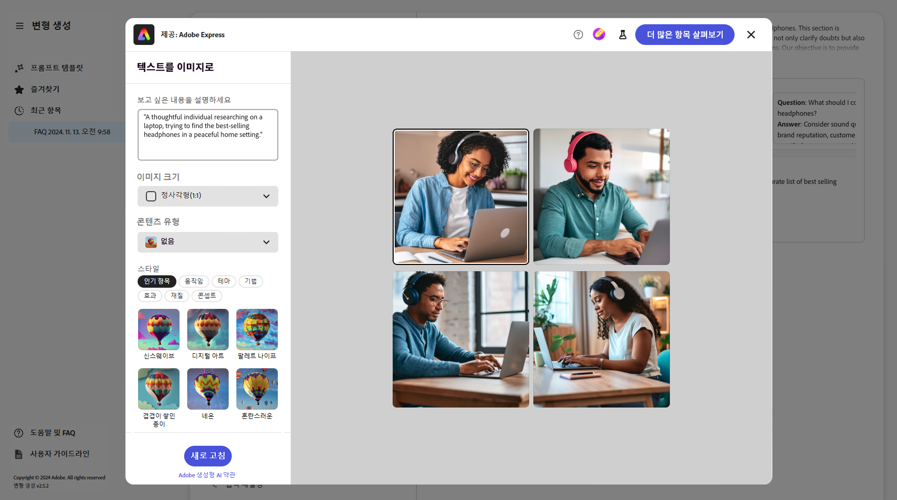

추가 변경을 수행할 수 있습니다.

* [Adobe Express에서 프롬프트 작성](https://helpx.adobe.com/firefly/using/tips-and-tricks.html) 보고 싶은 걸 묘사해서
* 조정 **텍스트를 이미지로 변환** 옵션,
* 그러면 **새로 고침** 생성된 이미지.

다음을 사용할 수도 있습니다. **더 많은 항목 탐색** 추가 가능성을 위해.

완료되면 원하는 이미지를 선택하고 **저장** 을 눌러 Adobe Express을 닫습니다. 이미지가 반환되고, 변형과 함께 저장됩니다.

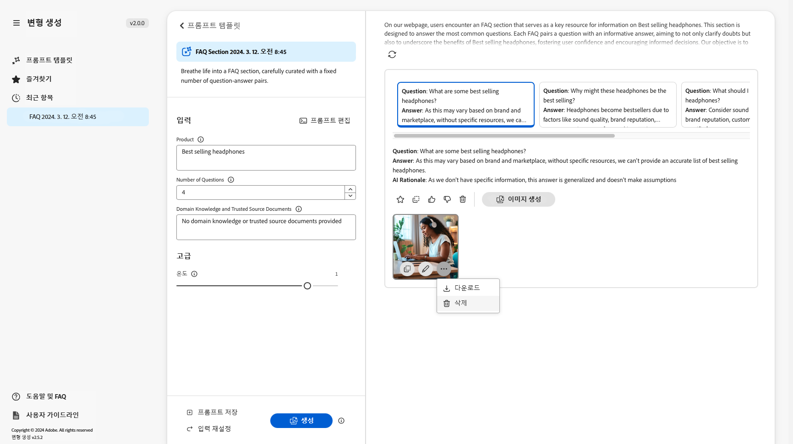

여기서 이미지를 마우스로 가리키면 다음에 대한 작업 항목이 표시됩니다.

* **복사**: [다른 곳에서 사용할 수 있도록 이미지를 클립보드에 복사](#use-content)
* **편집**: 이미지를 변경할 수 있도록 Adobe Express 열기
* **다운로드**: 이미지를 로컬 컴퓨터에 다운로드합니다
* **삭제**: 변형에서 이미지 제거

>[!NOTE]
>
>[Content credentials](https://helpx.adobe.com/creative-cloud/help/content-credentials.html) 는 문서 기반 작성에 사용될 때 지속되지 않습니다.

### 컨텐츠 사용 {#use-content}

생성 AI로 생성된 콘텐츠를 사용하려면 콘텐츠를 클립보드에 복사하여 다른 곳에서 사용해야 합니다.

이 작업은 복사 아이콘을 사용하여 수행됩니다.

* 텍스트: 변형 패널에 표시되는 복사 아이콘 사용
* 이미지의 경우: 복사 아이콘을 보려면 이미지를 마우스로 가리킵니다

클립보드에 복사되면 웹 사이트의 콘텐츠를 작성할 때 사용할 정보를 붙여넣을 수 있습니다. 다음을 실행할 수도 있습니다. [실험](https://www.aem.live/docs/experimentation).

## 즐겨찾기 {#favorites}

콘텐츠를 검토한 후 선택한 변형을 즐겨찾기로 저장할 수 있습니다.

저장되면 아래에 표시됩니다. **즐겨찾기** 왼쪽 탐색. 즐겨찾기는 다음 기한까지 유지됩니다. **삭제** 또는 브라우저 캐시를 지우십시오).

* 즐겨찾기와 변형을 클립보드에 복사/붙여넣기하여 웹 사이트 콘텐츠에 사용할 수 있습니다.
* 즐겨찾기는 다음과 같을 수 있습니다. **제거됨**.

## 최근 항목 {#recents}

이 섹션에서는 최근 활동에 대한 링크를 제공합니다. A **최근 항목** 항목을 선택하면 항목이 추가됩니다. **생성**. 프롬프트 이름과 타임스탬프가 있습니다. 링크를 선택하면 프롬프트가 로드되고 입력 필드가 적절히 채워지며 생성된 변형이 표시됩니다.

## 프롬프트 편집 {#edit-the-prompt}

기본 프롬프트는 편집할 수 있습니다. 다음과 같은 작업을 수행할 수 있습니다.

* 생성된 결과를 가져오는 경우 추가로 세분화해야 합니다
* 및 을(를) 수정하려는 경우 [프롬프트 저장](#save-prompt) 차후 사용을 위해

선택 **프롬프트 편집**:

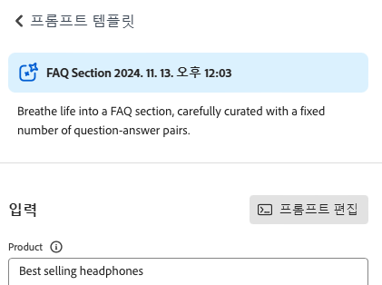

그러면 변경 작업을 수행할 수 있는 프롬프트 편집기가 열립니다.

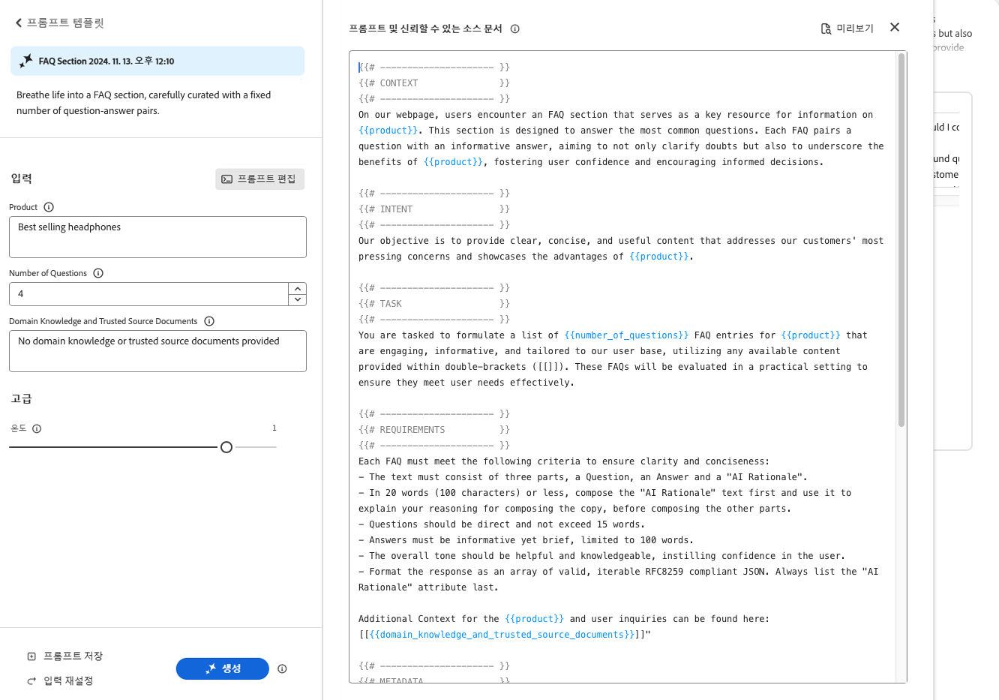

### 프롬프트 입력 추가 {#add-prompt-inputs}

프롬프트를 만들거나 편집할 때 입력 필드를 추가할 수 있습니다. 입력 필드는 프롬프트에서 변수 역할을 하며 다양한 시나리오에서 동일한 프롬프트를 사용할 수 있는 유연성을 제공합니다. 이를 통해 사용자는 전체 프롬프트를 작성하지 않고도 프롬프트의 특정 요소를 정의할 수 있습니다.

* 필드는 이중 중괄호로 정의됩니다 `{{ }}` 자리 표시자 이름을 포함합니다.
예: `{{tone_of_voice}}`

  >[!NOTE]
  >
  >이중 중괄호 사이에는 공백을 사용할 수 없습니다.

* 또한 아래에 정의됩니다. `METADATA`를 추가합니다.
   * `label`
   * `description`
   * `default`
   * `type`

#### 예: 새 텍스트 필드 추가 - 음색 {#example-add-new-text-field-tone-of-voice}

제목이 있는 새 텍스트 필드를 추가하려면 **목소리 톤**&#x200B;프롬프트에서 다음 구문을 사용합니다.

```prompt
{{@tone_of_voice, 
  label="Tone of voice",
  description="Indicate the desired tone of voice",
  default="optimistic, smart, engaging, human, and creative",
  type=text
}}
```

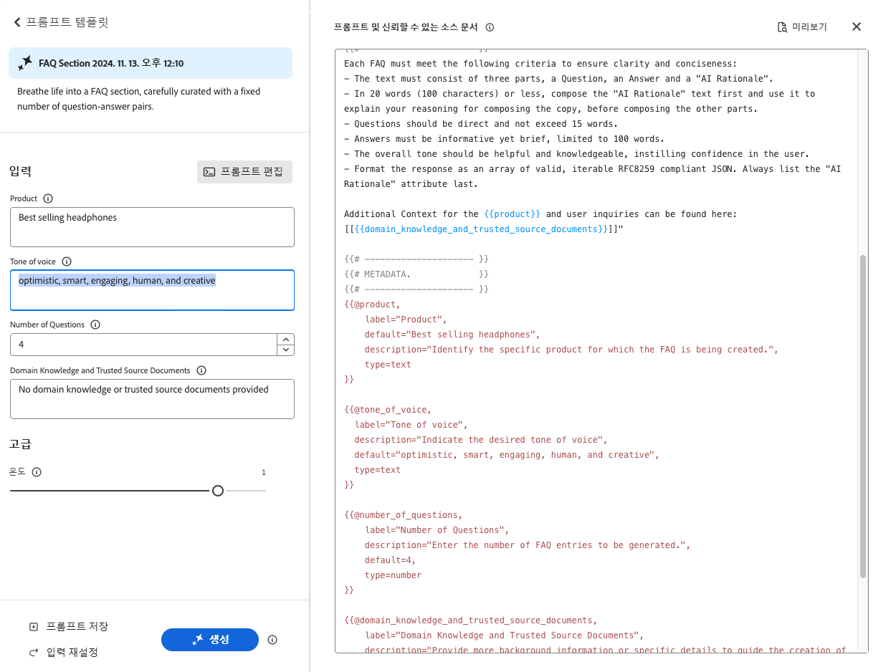

#### 예: 새 드롭다운 필드 추가 - 페이지 유형 {#example-add-new-dropdown-field-page-type}

드롭다운 선택을 제공하는 입력 필드 페이지 유형을 만들려면 다음 작업을 수행하십시오.

1. (이)라는 이름의 스프레드시트 만들기 `pagetype.xls` 폴더 구조의 최상위 디렉토리입니다.
1. 스프레드시트를 편집합니다.

   1. 두 개의 열을 만듭니다. **키** 및 **값**.
   1. 다음에서 **키** 열에서 드롭다운에 표시할 레이블을 입력합니다.
   1. 다음에서 **값** 열, 생성 AI가 컨텍스트를 갖도록 키 값을 설명합니다.

1. 프롬프트에서 적절한 유형과 함께 스프레드시트의 제목을 참조하십시오.

   ```prompt
   {{@page_type, 
     label="Page Type",
     description="Describes the type of page",
     spreadsheet=pagetype
   }}
   ```

## 프롬프트 만들기 {#create-prompt}

다음을 선택할 때 **새 프롬프트** 출처: **프롬프트 템플릿**, 새 패널을 사용하면 새 프롬프트를 입력할 수 있습니다. 그런 다음 이러한 매개 변수와 **온도**, 대상 **생성** 콘텐츠.

다음을 참조하십시오 [프롬프트 저장](#save-prompt) 프롬프트 저장에 대한 세부 정보.

다음을 참조하십시오 [프롬프트 입력 추가](#add-prompt-inputs) 프롬프트 입력을 추가하는 방법에 대한 자세한 내용을 보려면 여기를 클릭하십시오.

UI의 서식과 문서 기반 작성 플로우를 복사하여 붙여넣을 때 모두 서식을 유지하려면 프롬프트에 다음 내용을 포함하십시오.

<!-- CHECK - are the double-quotes needed? -->

* `"Format the response as an array of valid, iterable RFC8259 compliant JSON"`

다음 이미지는 이렇게 하면 얻을 수 있는 이점을 보여 줍니다.

* 첫 번째 예에서는 `Title` 및 `Description` 결합됨
* 두 번째 예에서는 별도로 형식이 지정되었지만, 이 작업은 프롬프트에 JSON 요청을 포함하여 수행되었습니다.

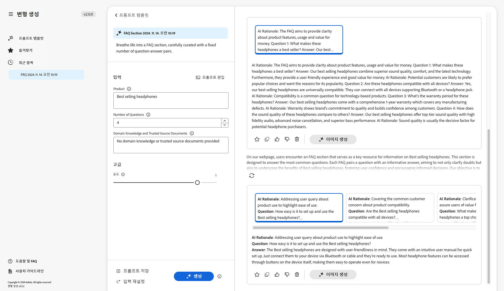

## 프롬프트 저장 {#save-prompt}

프롬프트를 편집하거나 만든 후에는 나중에 사용할 수 있도록 저장할 수 있습니다(IMS 조직 또는 사용자 자신에만 해당). 저장된 프롬프트는 **프롬프트 템플릿** 카드.

프롬프트를 편집한 경우 **저장** 옵션은 입력 섹션의 왼쪽 아래에서 사용할 수 있습니다. **생성**.

선택한 경우 **프롬프트 저장** 대화 상자가 열립니다.

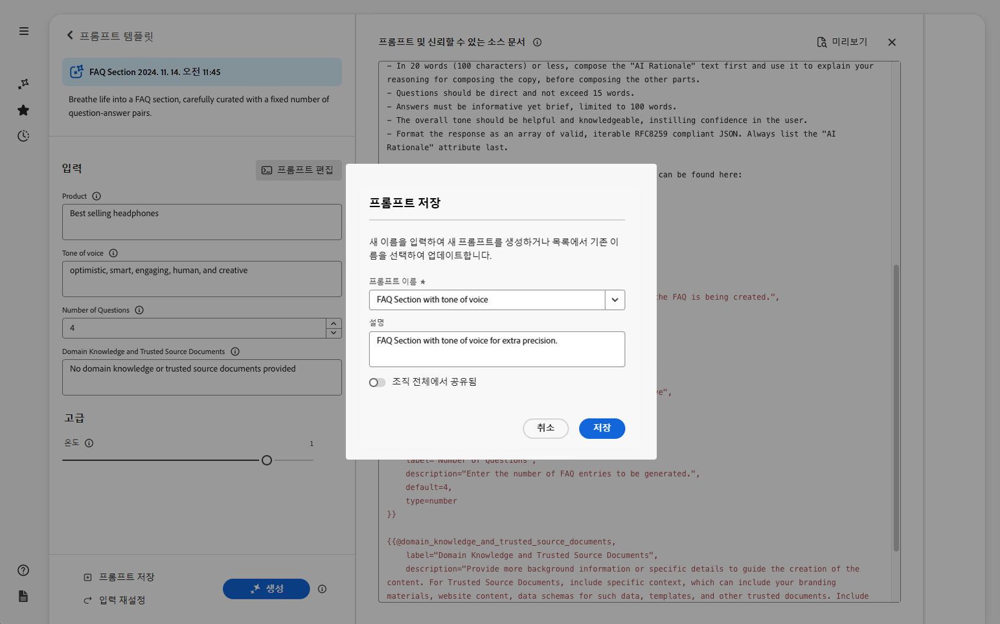

1. 고유 항목 추가 **프롬프트 이름**; 내에서 프롬프트를 식별하는 데 사용됩니다. **프롬프트 템플릿**.
   1. 고유한 새 이름은 새 프롬프트 템플릿을 만듭니다.
   1. 기존 이름이 해당 프롬프트를 덮어씁니다. 메시지가 표시됩니다.
1. 원할 경우 설명을 추가합니다.
1. 옵션 활성화 또는 비활성화 **조직 간에 공유됨**: 프롬프트가 사용자에게 비공개로 표시되어야 하는지 또는 IMS 조직 전체에서 사용할 수 있도록 설정되어야 하는지에 따라 다릅니다. 이 상태는 다음에 표시됩니다. [프롬프트 템플릿에 표시된 결과 카드](#select-prompt).
1. **저장** 프롬프트 또는 **취소** 작업.

>[!NOTE]
>
>기존 프롬프트를 덮어쓰거나 업데이트하는 경우 알림(경고)을 받습니다.

>[!NOTE]
>
>출처: **프롬프트 템플릿** 직접 또는 IMS 조직 내에서 만든 프롬프트(타원으로 액세스하는 메뉴 사용)를 삭제할 수 있습니다.

## 대상자 {#audiences}

개인화된 콘텐츠를 생성하려면 생성 AI가 대상을 이해해야 합니다. Adobe은 여러 기본 대상을 제공하거나 사용자가 직접 추가할 수 있습니다.

대상을 추가할 때는 대상을 자연어로 설명해야 합니다. 예:

* 대상자를 만들려면 다음 작업을 수행하십시오.
   * `Student`
* 다음과 같이 말할 수 있습니다.
   * `The audience consists of students, typically individuals who are pursuing education at various academic levels, such as primary, secondary, or tertiary education. They are engaged in learning and acquiring knowledge in diverse subjects, seeking academic growth, and preparing for future careers or personal development.`

두 개의 Audience Source 가 지원됩니다.

* [Adobe Target](#audience-adobe-target)
* [CSV 파일](#audience-csv-file)

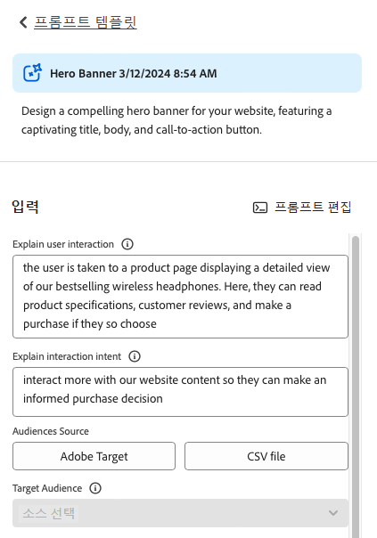

### 대상 - Adobe Target {#audience-adobe-target}

선택 **Adobe Target** 프롬프트의 대상자를 사용하면 콘텐츠 생성을 해당 대상자에게 개인화할 수 있습니다.

>[!NOTE]
>
>이 옵션을 사용하려면 IMS 조직이 Adobe Target에 액세스할 수 있어야 합니다.

1. **Adobe Target**&#x200B;을 선택합니다.
1. 그런 다음 필요한 을 선택합니다 **타겟 대상**&#x200B;을 클릭합니다.

   >[!NOTE]
   >
   >을(를) 사용하려면 **Adobe Target** 대상자 설명 필드를 입력해야 합니다. 그렇지 않은 경우, 대상이 드롭다운 목록에 사용할 수 없는 것으로 표시됩니다. 설명을 추가하려면 타겟으로 이동하고 [대상자 설명 추가](https://experienceleague.adobe.com/docs/target-learn/tutorials/audiences/create-audiences).

   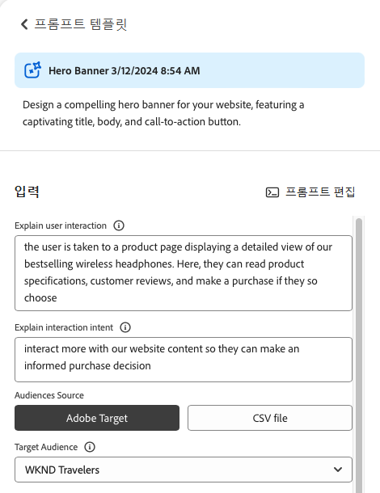

#### Adobe Target 대상 추가 {#add-adobe-target-audience}

다음을 참조하십시오 [대상자 만들기](https://experienceleague.adobe.com/en/docs/target-learn/tutorials/audiences/create-audiences) Adobe Target에서 대상자를 만듭니다.

### 대상자 - CSV 파일 {#audience-csv-file}

선택 **CSV 파일** 프롬프트의 대상자를 통해 콘텐츠 생성을 선택한 대상자에게 개인화할 수 있습니다. **타겟 대상**.

Adobe은 사용할 여러 대상을 제공합니다.

1. 선택 **CSV 파일**.
1. 그런 다음 필요한 을 선택합니다 **타겟 대상**&#x200B;을 클릭합니다.

   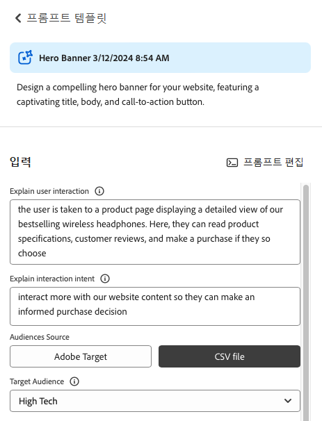

#### 대상 CSV 파일 추가 {#add-audience-csv-file}

공개적으로 사용 가능한 파일에 URL을 제공하는 기능이 있는 다양한 플랫폼(예: Google 드라이브, Dropbox, Sharepoint)에서 CSV 파일을 추가할 수 있습니다.

>[!NOTE]
>
>공유 플랫폼에서 다음을 수행합니다 *필수* 파일을 공개적으로 액세스할 수 있도록 하는 기능을 제공합니다.

예를 들어 Google 드라이브의 파일에서 대상을 추가하려면 다음을 수행하십시오.

1. Google 드라이브에서 두 개의 열이 있는 스프레드시트 파일을 만듭니다.
   1. 첫 번째 열이 드롭다운에 표시됩니다.
   1. 두 번째 열이 대상자 설명이 됩니다.
1. 파일 게시:
   1. 파일 -> 공유 -> 웹에 게시 -> CSV
1. 게시된 파일에 URL을 복사합니다.
1. 변형 생성으로 이동합니다.
1. 프롬프트 편집기를 엽니다.
1. 찾기 **Adobe Target** 메타데이터의 대상자를 지정하고 URL을 바꿉니다.

   >[!NOTE]
   >
   >URL의 양쪽 끝에 큰따옴표(&quot;)가 있는지 확인합니다.

   예:

   

## FAQ {#faqs}

### 형식이 지정된 출력 {#formatted-outpu}

**생성된 응답이 필요한 형식이 지정된 출력을 제공하지 않습니다. 포맷을 어떻게 수정합니까? 예: 제목과 하위 제목이 필요하지만 응답은 제목입니다.**

1. 편집 모드에서 실제 프롬프트를 엽니다.
1. 요구 사항으로 이동합니다.
1. 출력에 대해 설명하는 요구 사항을 찾을 수 있습니다.
   1. 예: &quot;텍스트는 제목, 본문 및 단추 레이블의 세 부분으로 구성되어야 합니다.&quot; 또는 &quot;Title&quot;, &quot;Body&quot; 및 &quot;ButtonLabel&quot; 속성을 사용하여 응답을 유효한 JSON 오브젝트 배열로 포맷합니다.
1. 요구 사항에 맞게 요구 사항을 수정합니다.

   >[!NOTE]
   >
   >입력한 새 출력에 대해 단어/문자 수 제한이 있는 경우 요구 사항을 만듭니다.

   예: &quot;제목 텍스트는 공백을 포함하여 10단어 또는 50자를 초과할 수 없습니다.&quot;
1. 나중에 사용할 수 있도록 프롬프트를 저장합니다.

### 응답 길이 {#length-of-response}

**생성된 응답이 너무 길거나 짧습니다. 길이는 어떻게 바꾸나요?**

1. 편집 모드에서 실제 프롬프트를 엽니다.
1. 요구 사항으로 이동합니다.
1. 각 출력에 대해 해당 단어/문자 제한이 있음을 알 수 있습니다.
   1. 예: &quot;제목 텍스트는 공백을 포함하여 10단어 또는 50자를 초과할 수 없습니다.&quot;
1. 요구 사항에 맞게 요구 사항을 수정합니다.
1. 나중에 사용할 수 있도록 프롬프트를 저장합니다.

### 응답 개선 {#improve-responses}

**제가 받는 답변이 제가 찾고 있는 것과 정확히 다르네요. 이를 개선하기 위해 어떤 작업을 수행할 수 있습니까?**

1. 고급 설정에서 온도를 변경해 보십시오.
   1. 더 높은 온도는 프롬프트에서 벗어나고 더 많은 변화, 무작위성, 창의성을 초래한다.
   1. 온도가 낮을수록 더 결정적이며 프롬프트에 있는 내용을 준수합니다.
1. 편집 모드에서 실제 프롬프트를 열고 프롬프트를 검토합니다. 목소리의 어조와 기타 중요한 기준을 설명하는 요구 사항 섹션에 특별히 주의하십시오.

### 프롬프트의 주석 {#comments-in-prompt}

**프롬프트에서 주석을 사용하려면 어떻게 해야 합니까?**

프롬프트의 주석은 실제 출력의 일부가 아닌 메모, 설명 또는 지침을 포함하는 데 사용됩니다. 이러한 주석은 특정 구문 내에 캡슐화됩니다. 중괄호로 두 번 시작하고 끝나며 해시로 시작합니다(예: `{{# Comment Here }}`). 주석은 생성된 응답에 영향을 주지 않고 프롬프트 구조 또는 의도를 명확하게 하는 데 도움이 됩니다.

### 공유 프롬프트 찾기 {#find-a-shared-prompt}

**다른 사람이 공유한 프롬프트 템플릿을 찾을 수 없는 경우 어떻게 해야 합니까?**

이 상황에서는 확인할 다양한 세부 사항이 있습니다.

1. 사용자 환경의 URL을 사용하십시오.
예: https://experience.adobe.com/#/aem/generate-variations
1. 선택한 IMS 조직이 올바른지 확인합니다.
1. 프롬프트가 공유로 저장되었는지 확인합니다.

### v2.0.0의 사용자 지정 프롬프트 {#custom-prompts-v200}

**v.2.0.0에서 사용자 지정 프롬프트가 사라졌습니다. 어떻게 해야 합니까?**

v2.0.0 릴리스로 이동하면 사용자 정의 프롬프트 템플릿이 중단되어 사용할 수 없게 됩니다.

다음을 참조하십시오. [v2.0.0에 대한 릴리스 노트 를 따르십시오.](#release-notes-2-0-0-retrieve-prompt-templates).

## 생성 작업 사용 {#generative-action-usage}

사용 관리는 수행한 작업에 따라 다릅니다.

* 변형 생성

  복사 변형의 한 세대는 하나의 생성 작업과 같습니다. 고객은 AEM 라이선스와 함께 제공되는 특정한 수의 생성 작업을 가지고 있습니다. 기본 권한이 사용되면 추가 작업을 구입할 수 있습니다.

  >[!NOTE]
  >
  >다음을 참조하십시오 [Adobe Experience Manager: Cloud Service | 제품 설명](https://helpx.adobe.com/legal/product-descriptions/aem-cloud-service.html) 기본 권한에 대한 자세한 내용을 알고 싶다면 계정 팀에 문의하십시오.

* Adobe Express

  이미지 생성 사용은 Adobe Express 권한 및 [생성 점수](https://helpx.adobe.com/firefly/using/generative-credits-faq.html).

## 변형 생성에 액세스 {#access-generate-variations}

<!--
### Access from AEM as a Cloud Service {#access-aemaacs}

Generate Variations can be accessed from the [Navigation Panel](/help/sites-cloud/authoring/basic-handling.md#navigation-panel) of AEM as a Cloud Service:


-->

### AEM Sidekick에서 액세스 {#access-aem-sidekick}

(Edge Delivery Services)의 Sidekick에서 변형 생성에 액세스하려면 먼저 일부 구성이 필요합니다.

1. 문서 보기 [AEM Sidekick 설치](https://www.aem.live/docs/sidekick-extension) Sidekick 설치 및 구성 방법에 대해 알아보십시오.

1. (Edge Delivery Services의) Sidekick에서 변형 생성을 사용하려면 아래의 Edge Delivery Services 프로젝트에 다음 구성을 포함하십시오.

   * `tools/sidekick/config.json`

   기존 구성에 병합한 다음 배포해야 합니다.

   예:

   ```prompt
   {
     // ...
     "plugins": [
       // ...
       {
         "id": "generate-variations",
         "title": "Generate Variations",
         "url": "https://experience.adobe.com/aem/generate-variations",
         "passConfig": true,
         "environments": ["preview","live", "edit"],
         "includePaths": ["**.docx**"]
       }
       // ...
     ]
   }
   ```

1. 그런 다음 사용자에게 다음이 있는지 확인해야 합니다. [Edge Delivery Services을 통한 as a Cloud Service Experience Manager 액세스](#access-to-aemaacs-with-edge-delivery-services).

1. 그런 다음 을 선택하여 기능에 액세스할 수 있습니다. **변형 생성** Sidekick 도구 모음에서 다음 작업을 수행하십시오.

   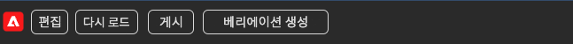

## Edge Delivery Services을 통한 as a Cloud Service Experience Manager 액세스{#access-to-aemaacs-with-edge-delivery-services}

변형 생성에 대한 액세스 권한이 필요한 사용자는 Edge Delivery Services이 있는 Experience Manager as a Cloud Service 환경에 대한 권한이 있어야 합니다.

>[!NOTE]
>
>AEM Sites as a Cloud Service에 대한 계약에 Edge Delivery Services이 포함되어 있지 않은 경우 액세스 권한을 받으려면 새 계약에 서명해야 합니다.
>
>Edge Delivery Services과 함께 AEM Sites으로 as a Cloud Service으로 이동하는 방법에 대해 논의하려면 계정 팀에 문의해야 합니다.

특정 사용자에게 액세스 권한을 부여하려면 해당 제품 프로필에 사용자 계정을 할당합니다. 다음을 참조하십시오 [자세한 내용은 AEM 제품 프로필 할당 을 참조하십시오](/help/journey-onboarding/assign-profiles-cloud-manager.md).

## 추가 참조 {#further-reading}

참고 항목:

* [GitHub에서 GenAI 변형 생성](https://github.com/adobe/aem-genai-assistant#setting-up-aem-genai-assistant)
* [Edge Delivery Services 실험](https://www.aem.live/docs/experimentation)

## 릴리스 정보 {#release-notes}

### 2.0.0  {#release-notes-2-0-0}

* 프롬프트 템플릿을 위한 범용 영구 스토리지가 도입되었습니다.
* 대상을 위한 새로운 기능
   * 대상은 Adobe Target에서 직접 읽을 수 있습니다
   * 업데이트된 CSV 파일 추가 방법
* 저장 프롬프트 옵션이 있는 대화 상자
* 이미지를 생성할 때 Adobe Express의 프롬프트가 미리 채워집니다
* 프롬프트 카드(홈 페이지)에 추가 정보가 표시되며 삭제할 수 있습니다.

#### 2.0.0 - 사용자 지정 프롬프트 템플릿을 검색하는 방법 {#release-notes-2-0-0-retrieve-prompt-templates}

v2.0.0 릴리스로 이동하면 사용자 정의 프롬프트 템플릿이 중단되어 사용할 수 없게 됩니다. 읽어들이려면

1. Sharepoint의 프롬프트 템플릿 폴더로 이동합니다.
1. 프롬프트를 복사합니다.
1. 변형 생성 응용 프로그램을 엽니다.
1. 새 프롬프트 카드를 선택합니다.
1. 프롬프트를 붙여넣습니다.
1. 프롬프트가 작동하는지 확인합니다.
1. 프롬프트를 저장합니다.

### 1.0.5 {#release-notes-1-0-5}

* Adobe Express과 통합
* 편집 프롬프트를 사이드 레일로 이동

### 1.0.4 {#release-notes-1-0-4}

* 내부 개선 사항

### 1.0.3 {#release-notes-1-0-3}

* 왼쪽 탐색 패널 펼치기 또는 숨기기
* 적은 개선 사항

### 1.0.0 - 1.0.2 {#release-notes-1-0-0-1-0-2}

* 내부 개선 사항