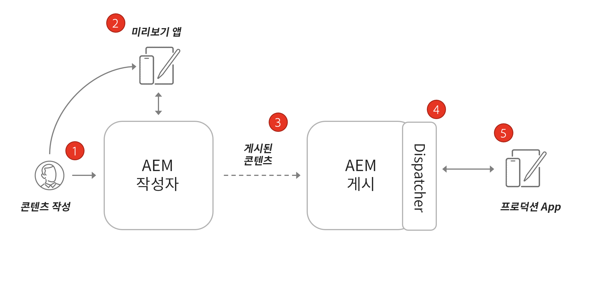
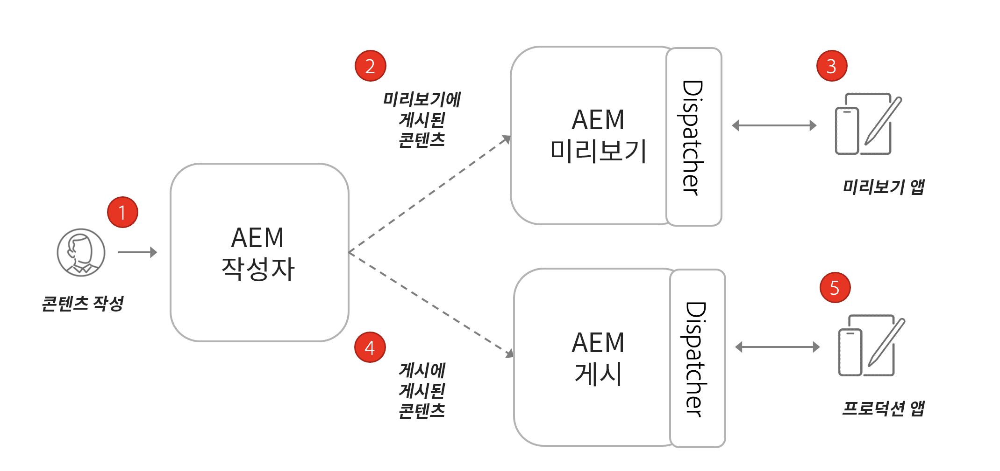

# AEM Headless의 아키텍처

일반적인 AEM 환경은 Author 서비스, Publish 서비스 및 선택적 미리보기 서비스로 구성됩니다.

* **Author 서비스**&#x200B;는 내부 사용자가 콘텐츠를 만들고 관리하고 미리 보는 곳입니다.

* **Publish 서비스** 는 “라이브” 환경으로 간주되며 일반적으로 최종 사용자는 이 서비스를 통해 상호 작용합니다. Author 서비스에서 편집 및 승인된 콘텐츠는 Publish 서비스로 배포됩니다. AEM Headless 애플리케이션의 가장 일반적인 배포 패턴은 애플리케이션의 프로덕션 버전을 AEM Publish 서비스에 연결하는 것입니다.

* **미리보기 서비스**&#x200B;는 기능적으로 **Publish 서비스**&#x200B;와 동일합니다. 단, 내부 사용자만 사용할 수 있습니다. 따라서 승인자가 최종 사용자에게 라이브로 적용되기 전에 예정된 콘텐츠 변경 사항을 검토하는 것이 이상적인 시스템입니다.

* **Dispatcher**&#x200B;는 AEM Dispatcher 모듈로 보강된 정적 웹 서버입니다. 캐싱 기능과 보안의 또 다른 계층을 제공합니다. **Dispatcher**&#x200B;는 **Publish** 및 **미리보기** 서비스 앞에 위치합니다.

AEM as a Cloud Service Program 내에서 Dev, Stage, Prod 등의 여러 환경을 가질 수 있습니다. 각 환경에는 고유한 **Author**, **Publish**, **미리보기** 서비스가 있습니다. [여기](/help/implementing/cloud-manager/manage-environments.md)에서 환경 관리에 대해 자세히 알아볼 수 있습니다.

## Author Publish 모델

AEM Headless 애플리케이션의 가장 일반적인 배포 패턴은 애플리케이션의 프로덕션 버전을 AEM Publish 서비스에 연결하는 것입니다.

위의 다이어그램은 이러한 일반적인 배포 패턴을 보여 줍니다.

1. **콘텐츠 작성자**&#x200B;는 AEM Author 서비스를 사용하여 콘텐츠를 만들고 편집하고 관리합니다.
1. **콘텐츠 작성자**&#x200B;와 기타 내부 사용자는 Author 서비스에서 직접 콘텐츠를 미리 볼 수 있습니다. Author 서비스에 연결하는 애플리케이션의 미리보기 버전을 설정할 수 있습니다.
1. 콘텐츠가 승인되면 AEM Publish 서비스에 게시할 수 있습니다.
1. **Dispatcher** 는 특정 요청을 캐시할 수 있고 보안 계층을 제공하는 **Publish** 서비스 앞에 있는 계층입니다.
1. 최종 사용자는 애플리케이션의 프로덕션 버전과 상호 작용합니다. 프로덕션 애플리케이션은 Dispatcher를 통해 Publish 서비스에 연결하고 GraphQL API를 사용하여 콘텐츠를 요청하고 소비합니다.

## Author 미리보기 Publish 배포

Headless 배포를 위한 또 다른 옵션은 **AEM 미리보기** 서비스를 통합하는 것입니다. 이 접근 방식을 사용하면 콘텐츠를 먼저 **미리보기** 서비스에 게시할 수 있으며 Headless 애플리케이션의 미리보기 버전을 여기에 연결할 수 있습니다. 이 접근 방식의 장점은 **미리보기** 서비스를 **Publish** 서비스와 동일한 인증 요구 사항 및 권한으로 설정할 수 있어 프로덕션 경험을 더 쉽게 시뮬레이션할 수 있다는 것입니다.

1. **콘텐츠 작성자**&#x200B;는 AEM Author 서비스를 사용하여 콘텐츠를 만들고 편집하고 관리합니다.
1. 콘텐츠는 먼저 AEM 미리보기 서비스에 게시됩니다.
1. Author 서비스에 연결하는 애플리케이션의 Author 버전을 설정할 수 있습니다.
1. 콘텐츠를 검토 및 승인되면 AEM Publish 서비스에 게시할 수 있습니다.
1. 최종 사용자는 애플리케이션의 프로덕션 버전과 상호 작용합니다. 프로덕션 애플리케이션은 Dispatcher를 통해 Publish 서비스에 연결하고 GraphQL API를 사용하여 콘텐츠를 요청하고 소비합니다.
