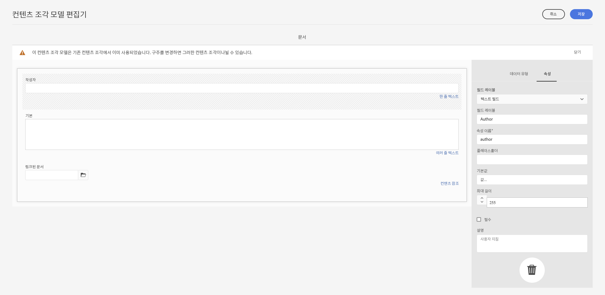
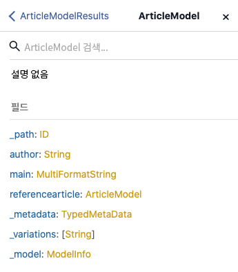
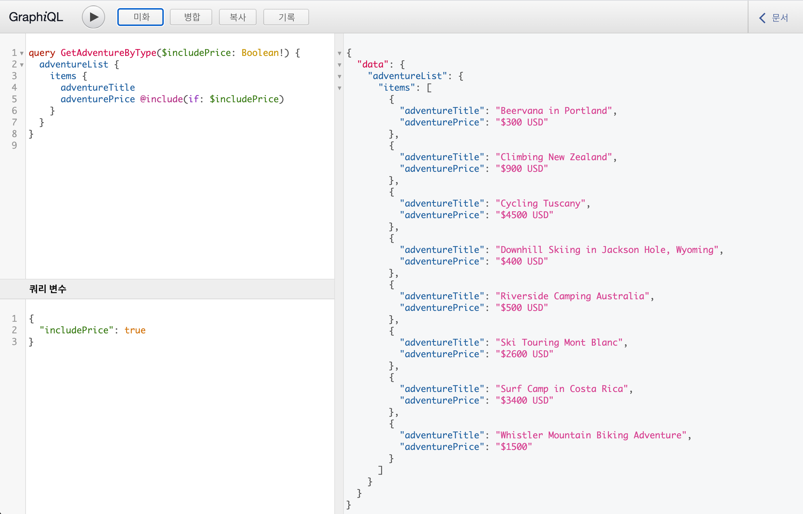

# 콘텐츠 조각과 함께 사용하기 위한 AEM GraphQL API {#graphql-api-for-use-with-content-fragments}

Headless 콘텐츠 전달용 AEM GraphQL API와 함께 Adobe Experience Manager(AEM) as a Cloud Service에서 콘텐츠 조각을 사용하는 방법을 알아봅니다.

Content Fragments와 함께 사용되는 AEM as a Cloud Service GraphQL API는 표준 오픈 소스 GraphQL API를 기반으로 합니다.

AEM에서 GraphQL API를 사용하면 Headless CMS 구현에서 JavaScript 클라이언트에 콘텐츠 조각을 효율적으로 전달할 수 있습니다.

* REST에서처럼 반복적인 API 요청 방지,
* 전달이 특정 요구 사항으로 제한되는지 확인,
* 단일 API 쿼리에 대한 응답으로 렌더링에 필요한 것을 정확히 대량으로 전달할 수 있도록 허용.

>[!NOTE]
>
>GraphQL은 현재 Adobe Experience Manager(AEM) as a Cloud Service의 두 가지 (별도) 시나리오에서 사용됩니다.
>
>* [AEM Commerce는 GraphQL을 통해 상거래 플랫폼의 데이터를 사용합니다](/help/commerce-cloud/integrating/magento.md).
>* AEM 콘텐츠 조각은 AEM GraphQL API(표준 GraphQL 기반의 맞춤화된 구현)와 함께 작동하여 애플리케이션에서 사용할 구조화된 콘텐츠를 제공합니다.


## GraphQL API {#graphql-api}

GraphQL은

* “*...API용 쿼리 언어 및 기존 데이터로 이러한 쿼리를 수행하기 위한 런타임입니다. GraphQL은 API의 데이터에 대한 완전하고 이해하기 쉬운 설명을 제공하고, 클라이언트가 필요로 하는 것을 정확히 요청할 수 있는 권한을 주고, 시간이 지남에 따라 API를 더 쉽게 발전시킬 수 있으며, 강력한 개발자 도구를 지원합니다.*”.

   [GraphQL.org](https://graphql.org)를 참조하십시오.

* “*...유연한 API 계층을 위한 오픈 사양입니다. 기존 백엔드에 GraphQL을 추가하여 그 어느 때보다 빠르게 제품을 빌드할 수 있습니다.*”

   [GraphQL 살펴보기](https://www.graphql.com)를 참조하십시오.

* *“...2015년에 오픈 소스로 공개되기 전에 2012년 Facebook에서 내부적으로 개발한 데이터 쿼리 언어 및 사양입니다. 개발자 생산성을 높이고 전송되는 데이터 양을 최소화할 목적으로 REST 기반 아키텍처에 대한 대안을 제공합니다. GraphQL은 규모에 관계없이 수백 개의 조직에서 프로덕션에 사용됩니다.”*

   [GraphQL Foundation](https://foundation.graphql.org/)을 참조하십시오.

<!--
"*Explore GraphQL is maintained by the Apollo team. Our goal is to give developers and technical leaders around the world all of the tools they need to understand and adopt GraphQL.*". 
-->

GraphQL API에 대한 추가 정보는 기타 여러 리소스 중에서도 특히 다음 섹션을 참조하십시오.

* [graphql.org](https://graphql.org):

   * [GraphQL 소개](https://graphql.org/learn)

   * [GraphQL 사양](https://spec.graphql.org/)

* [graphql.com](https://graphql.com):

   * [안내서](https://www.graphql.com/guides/)

   * [튜토리얼](https://www.graphql.com/tutorials/)

   * [사례 연구](https://www.graphql.com/case-studies/)

AEM용 GraphQL 구현은 표준 GraphQL Java 라이브러리를 기반으로 합니다. 다음을 참조하십시오.

* [graphQL.org - Java](https://graphql.org/code/#java)

* [GitHub의 GraphQL Java](https://github.com/graphql-java)

### GraphQL 용어 {#graphql-terminology}

GraphQL은 다음 용어를 사용합니다.

* **[쿼리](https://graphql.org/learn/queries/)**

* **[스키마 및 유형](https://graphql.org/learn/schema/)**:

   * 스키마는 콘텐츠 조각 모델을 기반으로 AEM에서 생성됩니다.
   * 스키마를 사용하여 GraphQL은 AEM용 GraphQL 구현에 허용되는 유형 및 작업을 제공합니다.

* **[필드](https://graphql.org/learn/queries/#fields)**

* **[GraphQL 끝점](graphql-endpoint.md)**
   * GraphQL 쿼리에 응답하고 GraphQL 스키마에 대한 액세스를 제공하는 AEM의 경로입니다.

   * 자세한 내용은 [GraphQL 끝점 활성화](graphql-endpoint.md)를 참조하십시오.

[모범 사례](https://graphql.org/learn/best-practices/)를 포함한 포괄적인 세부 정보는 [(GraphQL.org) GraphQL 소개](https://graphql.org/learn/)를 참조하십시오.

### GraphQL 쿼리 유형 {#graphql-query-types}

GraphQL을 사용하여 다음 중 하나를 반환하는 쿼리를 수행할 수 있습니다.

* **단일 항목**

* **[항목 목록](https://graphql.org/learn/schema/#lists-and-non-null)**

다음 작업도 수행할 수 있습니다.

* [캐시된 지속 쿼리](/help/headless/graphql-api/persisted-queries.md)

### GraphQL 쿼리 모범 사례(Dispatcher) {#graphql-query-best-practices}

다음과 같은 이유로 [지속 쿼리](/help/headless/graphql-api/persisted-queries.md)를 사용하는 것이 좋습니다.

* 캐시됩니다.
* AEM as a Cloud Service을 통해 중앙 집중식으로 관리됩니다.

직접 및/또는 POST 쿼리는 캐시되지 않으므로 권장되지 않습니다. 따라서 기본 인스턴스에서는 Dispatcher가 이러한 쿼리를 차단하도록 구성됩니다.

>[!NOTE]
>
>Dispatcher에서 직접 및/또는 POST 쿼리를 허용하려면 시스템 관리자에게 다음 작업을 요청할 수 있습니다.
>
>* `ENABLE_GRAPHQL_ENDPOINT`라는 Cloud Manager 환경 변수 생성
>* (`true` 값 포함)


>[!NOTE]
>
>직접 쿼리를 수행하는 기능은 향후의 어느 시점에서 더 이상 사용되지 않을 수 있습니다.

### GraphiQL IDE {#graphiql-ide}

[GraphiQL IDE](/help/headless/graphql-api/graphiql-ide.md)를 사용하여 GraphQL 쿼리를 테스트하고 디버그할 수 있습니다.

## Author 및 Publish 환경의 사용 사례 {#use-cases-author-publish-environments}

사용 사례는 AEM as a Cloud Service 환경 유형에 따라 달라질 수 있습니다.

* Publish 환경, 다음과 같은 작업을 수행하는 데 사용됨:
   * JS 애플리케이션용 쿼리 데이터(표준 사용 사례)

* Author 환경, 다음과 같은 작업을 수행하는 데 사용됨:
   * “콘텐츠 관리 목적”용 쿼리 데이터:
      * AEM as a Cloud Service의 GraphQL은 현재 읽기 전용 API입니다.
      * REST API는 CR(u)D 작업에 사용할 수 있습니다.

## 권한 {#permission}

권한은 Assets에 액세스하는 데 필요한 권한입니다.

## 스키마 생성 {#schema-generation}

GraphQL은 강력한 형식의 API입니다. 즉, 데이터는 유형별로 명확하게 구조화되고 구성되어야 합니다.

GraphQL 사양은 특정 인스턴스에서 데이터의 정보를 얻기 위해 강력한 API를 만드는 방법에 대한 일련의 지침을 제공합니다. 이렇게 하려면 클라이언트가 쿼리에 필요한 모든 유형을 포함하는 [스키마](#schema-generation)를 가져와야 합니다.

콘텐츠 조각의 경우 GraphQL 스키마(구조 및 유형)는 **활성화됨** 상태인 [콘텐츠 조각 모델](/help/sites-cloud/administering/content-fragments/content-fragments-models.md) 및 해당 데이터 형식을 기반으로 합니다.

>[!CAUTION]
>
>모든 GraphQL 스키마(**활성화됨**&#x200B;상태인 콘텐츠 조각 모델에서 파생)는 GraphQL 끝점을 통해 읽을 수 있습니다.
>
>즉, 이런 식으로 유출될 수 있기 때문에 민감한 데이터가 없는지 확인해야 합니다. 예를 들어 모델 정의에서 필드 이름으로 나타날 수 있는 정보가 여기에 포함됩니다.

예를 들어 사용자가 `Article`이라는 콘텐츠 조각 모델을 만든 경우 AEM은 `ArticleModel` 유형의 개체인 `article`을 생성합니다. 이 유형 내의 필드는 모델에서 정의된 필드 및 데이터 형식에 해당합니다.

1. 콘텐츠 조각 모델:

   

1. 해당 GraphQL 스키마(GraphiQL 자동 문서에서 출력):
   

   이는 생성된 유형 `ArticleModel`에 여러 [필드](#fields)가 포함되어 있음을 보여 줍니다.

   * 그 중 `author`, `main`, `referencearticle` 세 가지 필드는 사용자가 제어했습니다.

   * 다른 필드는 AEM에 의해 자동으로 추가되었으며 특정 콘텐츠 조각에 대한 정보를 제공하는 유용한 방법을 표시합니다. 이 예에서는 `_path`, `_metadata`, `_variations`입니다. 이 [도우미 필드](#helper-fields)는 사용자가 정의한 것과 자동 생성된 것을 구별하기 위해 앞에 `_` 로 표시됩니다.

1. 사용자가 Article 모델을 기반으로 콘텐츠 조각을 만든 경우 GraphQL을 통해 정보를 얻을 수 있습니다. 예를 들어 [샘플 쿼리](/help/headless/graphql-api/sample-queries.md#graphql-sample-queries)([GraphQL과 함께 사용하기 위한 샘플 콘텐츠 조각 구조](/help/headless/graphql-api/sample-queries.md#content-fragment-structure-graphql) 기반)를 참조하십시오.

AEM용 GraphQL에서 스키마는 유연합니다. 즉, 콘텐츠 조각 모델이 만들어지거나 업데이트되거나 삭제될 때마다 자동 생성됩니다. 콘텐츠 조각 모델을 업데이트할 때도 데이터 스키마 캐시가 새로 고쳐집니다.

Sites GraphQL 서비스는 콘텐츠 조각 모델에 대한 수정 사항을 백그라운드에서 수신 대기합니다. 업데이트가 감지되면 스키마의 해당 부분만 다시 생성됩니다. 이 최적화는 시간을 절약하고 안정성을 제공합니다.

예를 들어:

1. `Content-Fragment-Model-1` 및 `Content-Fragment-Model-2`가 포함된 패키지를 설치하는 경우:

   1. `Model-1` 및 `Model-2` 에 대한 GraphQL 유형이 생성됩니다.

1. 그리고 `Content-Fragment-Model-2`를 수정하는 경우:

   1. `Model-2` GraphQL 유형만 업데이트됩니다.

   1. `Model-1`은 그대로 유지됩니다.

>[!NOTE]
>
>REST API 또는 다른 방법을 통해 콘텐츠 조각 모델에 대한 대량 업데이트를 수행하려는 경우에 주의해야 합니다.

스키마는 GraphQL 쿼리와 동일한 끝점을 통해 제공되며 스키마가 확장자 `GQLschema`로 호출되는 것을 처리하는 클라이언트가 있습니다. 예를 들어 `/content/cq:graphql/global/endpoint.GQLschema`에 대해 간단한 `GET` 요청을 수행하면 콘텐츠 유형이 있는 스키마의 출력이 됩니다. `text/x-graphql-schema;charset=iso-8859-1`.

### 스키마 생성 - 게시되지 않은 모델 {#schema-generation-unpublished-models}

콘텐츠 조각이 중첩되면 상위 콘텐츠 조각 모델은 게시되지만 참조된 모델은 게시되지 않을 수 있습니다.

>[!NOTE]
>
>AEM UI는 이러한 일이 발생하지 않도록 방지하지만 게시가 프로그래밍 방식으로 또는 콘텐츠 패키지를 사용하여 수행되는 경우 발생할 수 있습니다.

이런 일이 발생하면 AEM은 상위 콘텐츠 조각 모델에 대해 *불완전* 스키마를 생성합니다. 즉, 게시되지 않은 모델에 종속된 조각 참조가 스키마에서 제거됩니다.

## 필드 {#fields}

스키마 내에는 다음과 같은 두 가지 기본 범주의 개별 필드가 있습니다.

* 귀하가 생성하는 필드입니다.

   선택한[필드 유형](#field-types)은 콘텐츠 조각 모델을 구성하는 방법을 기반으로 필드를 만드는 데 사용됩니다. 필드 이름은 **데이터 형식**&#x200B;의 **속성 이름** 필드에서 가져옵니다.

   * 사용자가 특정 데이터 형식을 구성할 수 있기 때문에(예를 들어 한 줄 텍스트 또는 다중 필드로) **Render As** 속성도 고려해야 합니다.

* AEM용 GraphQL은 또한 여러 [도우미 필드](#helper-fields)를 생성합니다.

   도우미 필드는 콘텐츠 조각을 식별하거나 콘텐츠 조각에 대한 자세한 정보를 얻는 데 사용됩니다.

### 필드 유형 {#field-types}

AEM용 GraphQL은 유형 목록을 지원합니다. 지원되는 모든 콘텐츠 조각 모델 데이터 형식 및 해당 GraphQL 유형이 표시됩니다.

| 콘텐츠 조각 모델 - 데이터 형식 | GraphQL 유형 | 설명 |
|--- |--- |--- |
| 한 줄 텍스트 | 문자열, [문자열] |  작성자 이름, 위치 이름 등과 같은 간단한 문자열에 사용됨 |
| 여러 줄 텍스트 | 문자열 |  기사의 본문과 같은 텍스트 출력에 사용됨 |
| 숫자 |  부동, [Float] | 부동 소수점 숫자 및 일반 숫자를 표시하는 데 사용됨 |
| 부울 |  부울 |  확인란을 표시하는 데 사용됨 → 간단한 참/거짓 진술 |
| 날짜 및 시간 | 달력 |  ISO 8086 형식으로 날짜와 시간을 표시하는 데 사용됨. 선택한 유형에 따라 AEM GraphQL에서 세 가지 버전(`onlyDate`, `onlyTime`, `dateTime`)을 사용할 수 있습니다. |
| 열거 |  문자열 |  모델 생성 시 정의된 옵션 목록에서 옵션을 표시하는 데 사용됨 |
|  태그 |  [문자열] |  AEM에서 사용되는 태그를 나타내는 문자열 목록을 표시하는 데 사용됨 |
| 콘텐츠 참조 |  문자열 |  AEM에서 다른 에셋에 대한 경로를 표시하는 데 사용됨 |
| 조각 참조 |  *모델 유형* |  모델이 생성될 때 정의된 특정 모델 유형의 다른 콘텐츠 조각을 참조하는 데 사용됨 |

### 도우미 필드 {#helper-fields}

사용자 생성 필드의 데이터 형식 외에도 AEM용 GraphQL은 콘텐츠 조각 식별을 돕거나 콘텐츠 조각에 대한 추가 정보를 제공하기 위해 많은 *도우미* 필드도 생성합니다.

#### 경로 {#path}

경로 필드는 GraphQL에서 식별자로 사용됩니다. AEM 저장소 내 콘텐츠 조각 에셋의 경로를 나타냅니다. 다음과 같은 이유로 콘텐츠 조각의 식별자로 선택되었습니다.

* AEM 내에서 고유합니다.
* 쉽게 가져올 수 있습니다.

다음 코드는 콘텐츠 조각 모델 `Person`을 기반으로 생성된 모든 콘텐츠 조각의 경로를 표시합니다.

```xml
{
  personList {
    items {
      _path
    }
  }
}
```

특정 유형의 단일 콘텐츠 조각을 검색하려면 먼저 해당 경로도 결정해야 합니다. 예:

```xml
{
  personByPath(_path: "/content/dam/path/to/fragment/john-doe") {
    item {
      _path
      firstName
      name
    }
  }
}
```

[샘플 쿼리 - 단일 특정 도시 조각](/help/headless/graphql-api/sample-queries.md#sample-single-specific-city-fragment)을 참조하십시오.

#### 메타데이터 {#metadata}

AEM은 또한 GraphQL을 통해 콘텐츠 조각의 메타데이터를 노출합니다. 메타데이터는 콘텐츠 조각을 설명하는 정보이며, 예를 들어 콘텐츠 조각의 제목, 썸네일 경로, 콘텐츠 조각에 대한 설명, 생성 날짜 등이 있습니다.

메타데이터는 스키마 편집기를 통해 생성되기 때문에 특정한 구조를 가지고 있지 않으므로 콘텐츠 조각의 메타데이터를 노출하기 위해 `TypedMetaData` GraphQL 유형이 구현되었습니다. `TypedMetaData`은 다음 스칼라 유형으로 그룹화된 정보를 노출합니다.

| 필드 |
|--- |
| `stringMetadata:[StringMetadata]!` |
| `stringArrayMetadata:[StringArrayMetadata]!` |
| `intMetadata:[IntMetadata]!` |
| `intArrayMetadata:[IntArrayMetadata]!` |
| `floatMetadata:[FloatMetadata]!` |
| `floatArrayMetadata:[FloatArrayMetadata]!` |
| `booleanMetadata:[BooleanMetadata]!` |
| `booleanArrayMetadata:[booleanArrayMetadata]!`  |
| `calendarMetadata:[CalendarMetadata]!` |
| `calendarArrayMetadata:[CalendarArrayMetadata]!` |

각 스칼라 유형은 단일 이름-값 쌍 또는 이름-값 쌍의 배열을 표시하며, 여기서 해당 쌍의 값은 그룹화된 유형입니다.

예를 들어 콘텐츠 조각의 제목을 검색하려는 경우 이 속성이 문자열 속성이라는 것을 알고 있으므로 모든 문자열 메타데이터를 쿼리합니다.

메타데이터를 쿼리하려면:

```xml
{
  personByPath(_path: "/content/dam/path/to/fragment/john-doe") {
    item {
      _path
      _metadata {
        stringMetadata {
          name
          value
        }
      }
    }
  }
}
```

생성된 GraphQL 스키마를 보면 모든 메타데이터 GraphQL 유형을 볼 수 있습니다. 모든 모델 유형에는 동일한 `TypedMetaData`가 있습니다.

>[!NOTE]
>
>**일반 메타데이터와 배열 메타데이터의 차이점**
>`StringMetadata` 및 `StringArrayMetadata`는 둘 다 검색 방법을 참조하는 것이 아니라 저장소에 저장된 내용을 참조합니다.
>
>따라서 예를 들어 `stringMetadata` 필드를 호출하면 저장소에 `String`으로 저장된 모든 메타데이터의 배열을 수신하고 `stringArrayMetadata`를 호출하면 저장소에 `String[]`으로 저장된 모든 메타데이터의 배열을 수신하게 됩니다.

[메타데이터에 대한 샘플 쿼리 - GB라는 제목의 상에 대한 메타데이터 나열](/help/headless/graphql-api/sample-queries.md#sample-metadata-awards-gb)을 참조하십시오.

#### 변형 {#variations}

`_variations` 필드는 콘텐츠 조각에 있는 변형 쿼리를 단순화하기 위해 구현되었습니다. 예:

```xml
{
  personByPath(_path: "/content/dam/path/to/fragment/john-doe") {
    item {
      _variations
    }
  }
}
```

[샘플 쿼리 - 이름이 붙은 변형이 있는 모든 도시](/help/headless/graphql-api/sample-queries.md#sample-cities-named-variation)를 참조하십시오.

>[!NOTE]
>
>지정된 변형이 콘텐츠 조각에 존재하지 않는 경우 마스터 변형은 (대체) 기본값으로 반환됩니다.

<!--
## Security Considerations {#security-considerations}
-->

## GraphQL 변수 {#graphql-variables}

GraphQL을 사용하면 쿼리에 변수를 배치할 수 있습니다. 보다 자세한 정보는 [변수에 대한 GraphQL 설명서](https://graphql.org/learn/queries/#variables)를 참조하십시오.

예를 들어 특정 변형이 있는 `Article` 유형의 모든 콘텐츠 조각을 가져오려면 GraphiQL에서 `variation` 변수를 지정할 수 있습니다.


```xml
### query
query GetArticlesByVariation($variation: String!) {
    articleList(variation: $variation) {
        items {
            _path
            author
        }
    }
}
 
### in query variables
{
    "variation": "Introduction"
}
```

## GraphQL 지시문 {#graphql-directives}

GraphQL에서는 GraphQL 지시문이라고 하는 변수를 기반으로 쿼리를 변경할 수 있습니다.

예를 들어 `includePrice` 변수를 기반으로 모든 `AdventureModels`에 대한 쿼리에 `adventurePrice` 필드를 포함할 수 있습니다.



```xml
### query
query GetAdventureByType($includePrice: Boolean!) {
  adventureList {
    items {
      adventureTitle
      adventurePrice @include(if: $includePrice)
    }
  }
}
 
### in query variables
{
    "includePrice": true
}
```

## 필터링 {#filtering}

GraphQL 쿼리에서 필터링을 사용하여 특정 데이터를 반환할 수도 있습니다.

필터링은 논리 연산자 및 표현식을 기반으로 하는 구문을 사용합니다.

예를 들어 다음(기본) 쿼리는 이름이 `Jobs` 또는 `Smith`인 모든 사람을 필터링합니다.

```xml
query {
  personList(filter: {
    name: {
      _logOp: OR
      _expressions: [
        {
          value: "Jobs"
        },
        {
          value: "Smith"
        }
      ]
    }
  }) {
    items {
      name
      firstName
    }
  }
}
```

더 많은 예는 다음을 참조하십시오.

* [AEM용 GraphQL 확장](#graphql-extensions)의 세부사항

* [이 샘플 콘텐츠 및 구조를 사용하는 샘플 쿼리](/help/headless/graphql-api/sample-queries.md#graphql-sample-queries-sample-content-fragment-structure)

   * 그리고 샘플 쿼리에 사용하기 위해 준비된 [샘플 콘텐츠 및 구조](/help/headless/graphql-api/sample-queries.md#content-fragment-structure-graphql)

* [WKND 프로젝트 기반 샘플 쿼리](/help/headless/graphql-api/sample-queries.md#sample-queries-using-wknd-project)

<!-- CQDOC-19418 -->

<!--
## Sorting {#sorting}

This feature allows you to sort the query results according to a specified field.

For example:

```graphql
query {
  articleList(sort:"author, _uuid DESC") {
    items {
      author
      _path
    }
  }
}
```

## Paging {#paging}

This feature allows you to perform paging on query types that returns a list. Two methods are provided:

* `offset` and `limit` in a `List` query
* `first` and `after` in a `Paginated` query

### List query - offset and limit {#list-offset-limit}

In a `...List`query you can use `offset` and `limit` to return a specific subset of results:

* `offset`: Specifies the first data set to return
* `limit`: Specifies the maximum number of data sets to be returned

For example, to output the page of results containing up to five articles, starting from the fifth article from the *complete* results list:

```graphql
query {
   articleList(offset: 5, limit:5) {
    items {
      author
      _path
    }
  }
}
```

>[!NOTE]
>
>* Paging is impacted by the order to the jcr query result set. By default it uses `jcr:path` to make sure the order is always the same. If a different sort order is used, and if that sorting cannot be done at jcr query level, then there will be a negative performance impact as the paging cannot be done in memory.
>
>* The higher the offset, the more time it will take to skip the items from the complete jcr query result set. An alternative solution for large result sets is to use the Paginated query with `first` and `after` method.

### Paginated query - first and after {#paginated-first-after}

The `...Paginated` query type reuses most of the `...List` query type features (filtering, sorting), but instead of using `offset`/`limit` arguments, it uses the standard `first`/`after` arguments defined by [GraphQL](https://graphql.org/learn/pagination/#pagination-and-edges).

* `first`: The `n` first items to return. The default is `50`.
* `after`: The cursor-id as returned in the complete result set - if `cursor` is selected.

For example, output the page of results containing up to five adventures, starting from the given cursor item in the *complete* results list:

```graphql
query {
    adventurePaginated(first: 5, after: "ODg1MmMyMmEtZTAzMy00MTNjLThiMzMtZGQyMzY5ZTNjN2M1") {
        edges {
          cursor
          node {
            adventureTitle
          }
        }
        pageInfo {
          endCursor
          hasNextPage
        }
    }
}
```

>[!NOTE]
>
>* Paging defaults use `_uuid` for ordering to ensure the order of results is always the same. When `sort` is used, `_uuid` is added as a last order-by field.
>
>* Performance is expected to be degraded if sort/filter parameters cannot be executed at jcr query level, as the query first has to gather the results in memory then sort them, then finally apply paging. Therefore it is recommended to use filter/sort fields stored at root level.
-->

## AEM용 GraphQL - 확장 요약 {#graphql-extensions}

AEM용 GraphQL을 사용한 쿼리의 기본 작업은 표준 GraphQL 사양을 따릅니다. AEM의 GraphQL 쿼리에 몇 가지 확장이 있습니다.

<!-- CQDOC-19418 -->

<!--
* If you expect a list of results:
  * add `List` to the model name; for example,  `cityList`
  * See [Sample Query - All Information about All Cities](/help/headless/graphql-api/sample-queries.md#sample-all-information-all-cities)
  
  You can then:
  
  * [Sort the results](#sorting)

  * Return a page of results using either:

    * [A List query with offset and limit](#list-offset-limit)
    * [A Paginated query with first and after](#paginated-first-after)
  * See [Sample Query - All Information about All Cities](/help/headless/graphql-api/sample-queries.md#sample-all-information-all-cities)
-->

* 하나의 결과가 필요한 경우:
   * 모델 이름을 사용하십시오. 예: 도시

* 결과 목록을 기대하는 경우:
   * 모델 이름에 `List`를 추가하십시오. 예: `cityList`
   * [샘플 쿼리 - 모든 도시에 대한 모든 정보](/help/headless/graphql-api/sample-queries.md#sample-all-information-all-cities)를 참조하십시오

* 논리적 OR을 사용하려는 경우:
   * ` _logOp: OR` 사용
   * [샘플 쿼리 - 이름이 “Jobs” 또는 “Smith”인 모든 사람](/help/headless/graphql-api/sample-queries.md#sample-all-persons-jobs-smith)을 참조하십시오

* 논리적 AND도 존재하지만 (흔히) 암시적

* 콘텐츠 조각 모델 내의 필드에 해당하는 필드 이름을 쿼리할 수 있습니다.
   * [샘플 쿼리 - 회사 CEO 및 직원의 전체 세부 정보](/help/headless/graphql-api/sample-queries.md#sample-full-details-company-ceos-employees)를 참조하십시오

* 모델의 필드 외에도 일부 시스템 생성 필드(앞에 밑줄 표시)가 있습니다.

   * 콘텐츠의 경우:

      * `_locale`: 언어 표시, 언어 관리자 기반
         * [주어진 로케일의 복수 콘텐츠 조각에 대한 샘플 쿼리](/help/headless/graphql-api/sample-queries.md#sample-wknd-multiple-fragments-given-locale)를 참조하십시오
      * `_metadata`: 조각에 대한 메타데이터 표시
         * [메타데이터에 대한 샘플 쿼리 - GB라는 제목의 상에 대한 메타데이터 나열](/help/headless/graphql-api/sample-queries.md#sample-metadata-awards-gb)을 참조하십시오
      * `_model`: 콘텐츠 조각 모델에 대한 쿼리 허용(경로 및 제목)
         * [모델의 콘텐츠 조각 모델에 대한 샘플 쿼리](/help/headless/graphql-api/sample-queries.md#sample-wknd-content-fragment-model-from-model)를 참조하십시오
      * `_path`: 저장소 내의 콘텐츠 조각에 대한 경로
         * [샘플 쿼리 - 단일 특정 도시 조각](/help/headless/graphql-api/sample-queries.md#sample-single-specific-city-fragment)을 참조하십시오
      * `_reference`: 참조 표시, 서식 있는 텍스트 편집기에 인라인 참조 포함
         * [프리페치된 참조가 포함된 복수 콘텐츠 조각에 대한 샘플 쿼리](/help/headless/graphql-api/sample-queries.md#sample-wknd-multiple-fragments-prefetched-references)를 참조하십시오
      * `_variation`: 콘텐츠 조각 내 특정 변형 표시

         >[!NOTE]
         >
         >지정된 변형이 콘텐츠 조각에 존재하지 않는 경우 마스터 변형은 (대체) 기본값으로 반환됩니다.

         * [샘플 쿼리 - 이름이 붙은 변형이 있는 모든 도시](#sample-cities-named-variation)를 참조하십시오
   * 작업:

      * `_operator`: 특정 연산자 적용 - `EQUALS`, `EQUALS_NOT`, `GREATER_EQUAL`, `LOWER`, `CONTAINS`, `STARTS_WITH`
         * [샘플 쿼리 - 이름이 “Jobs”가 아닌 모든 사람](/help/headless/graphql-api/sample-queries.md#sample-all-persons-not-jobs)을 참조하십시오
         * [샘플 쿼리 - `_path`가 특정 접두사로 시작하는 모든 모험](/help/headless/graphql-api/sample-queries.md#sample-wknd-all-adventures-cycling-path-filter)을 참조하십시오
      * `_apply`: 특정 조건 적용. 예: `AT_LEAST_ONCE`
         * [샘플 쿼리 - 적어도 한 번은 발생해야 하는 항목이 있는 배열 필터링](/help/headless/graphql-api/sample-queries.md#sample-array-item-occur-at-least-once)을 참조하십시오
      * `_ignoreCase`: 쿼리할 때 대소문자 무시
         * [샘플 쿼리 - 대소문자에 관계없이 이름에 SAN이 있는 모든 도시](/help/headless/graphql-api/sample-queries.md#sample-all-cities-san-ignore-case)를 참조하십시오


* GraphQL 공용 구조체 형식이 지원됩니다.

   * `... on` 사용
      * [콘텐츠 참조가 있는 특정 모델의 콘텐츠 조각에 대한 샘플 쿼리](/help/headless/graphql-api/sample-queries.md#sample-wknd-fragment-specific-model-content-reference)를 참조하십시오

* 중첩된 조각 쿼리 시 대체:

   * 주어진 변형이 중첩된 조각에 존재하지 않으면&#x200B;**마스터** 변형이 반환됩니다.

## 외부 웹 사이트에서 GraphQL 끝점 쿼리 {#query-graphql-endpoint-from-external-website}

외부 웹 사이트에서 GraphQL 끝점에 액세스하려면 다음을 구성해야 합니다.

* [CORS 필터](/help/headless/deployment/cross-origin-resource-sharing.md)
* [레퍼러 필터](/help/headless/deployment/referrer-filter.md)

## 인증 {#authentication}

[콘텐츠 조각의 원격 AEM GraphQL 쿼리 인증](/help/headless/security/authentication.md)을 참조하십시오.

<!-- to be addressed later -->

<!--
## Sorting {#sorting}
-->

<!-- to be addressed later -->

<!--
## Paging {#paging}
-->

## FAQ {#faqs}

제기된 질문:

1. **Q**: “*AEM용 GraphQL API는 쿼리 빌더 API와 어떻게 다릅니까?*”

   * **A**:
“*AEM GraphQL API는 JSON 출력에 대한 전체 제어를 제공하며 콘텐츠 쿼리를 위한 업계 표준입니다.
앞으로 AEM은 AEM GraphQL API에 투자할 계획입니다.*”

## 튜토리얼 - AEM Headless 및 GraphQL 시작하기 {#tutorial}

실습형 튜토리얼을 찾고 계십니까? Headless CMS 시나리오에서, AEM의 GraphQL API를 사용하여 콘텐츠를 구축하고 노출하고 외부 앱에서 사용하는 방법을 보여 주는 [AEM Headless 및 GraphQL 시작하기](https://experienceleague.adobe.com/docs/experience-manager-learn/getting-started-with-aem-headless/graphql/overview.html?lang=ko-KR) 엔드투엔드 튜토리얼을 확인하십시오.
