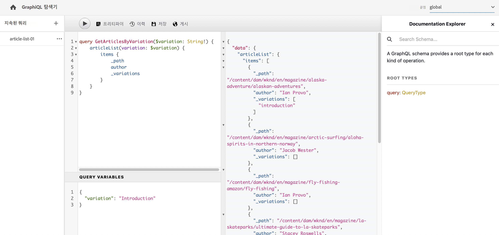
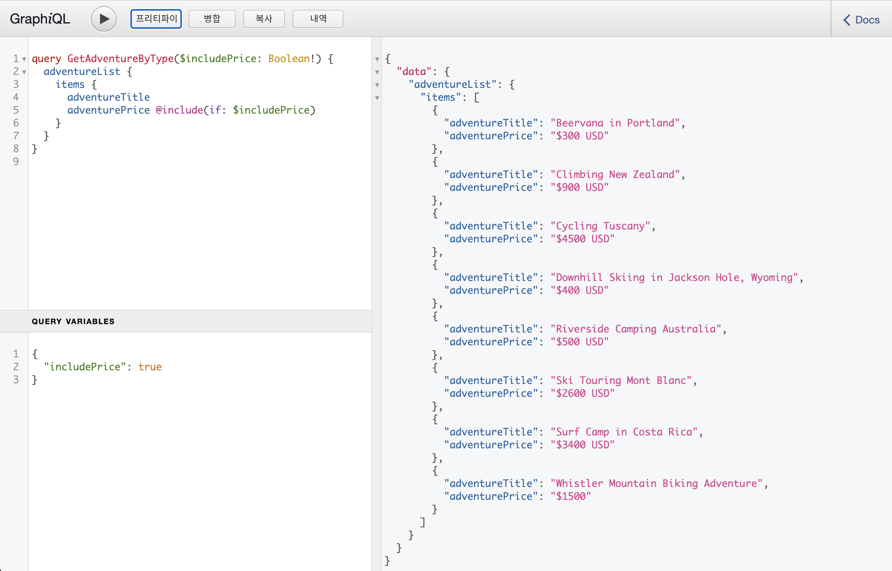

# 컨텐츠 조각에 사용할 AEM GraphQL API {#graphql-api-for-use-with-content-fragments}

헤드리스 컨텐츠 전달을 위해 AEM GraphQL API와 함께 Adobe Experience Manager(AEM)에서 컨텐츠 조각을 사용하는 방법을 알아봅니다.

컨텐츠 조각에 사용되는 AEM as a Cloud Service GraphQL API는 오픈 소스 GraphQL API에 주로 의존합니다.

AEM에서 GraphQL API를 사용하면 헤드리스 CMS 구현에서 컨텐츠 조각을 JavaScript 클라이언트에 효율적으로 전달할 수 있습니다.

* REST와 같이 반복 API 요청 방지,
* 게재가 특정 요구 사항에 한정되어 있는지 확인하고
* 단일 API 쿼리에 대한 응답으로 렌더링하는 데 필요한 내용을 정확히 대량 배달할 수 있도록 허용합니다.

>[!NOTE]
>
>GraphQL은 현재 Adobe Experience Manager(AEM) as a Cloud Service의 두 가지(별도) 시나리오에서 사용됩니다.
>
>* [AEM Commerce에서는 GraphQL을 통해 상거래 플랫폼에서 데이터를 사용합니다](/help/commerce-cloud/integrating/magento.md).
>* AEM 컨텐츠 조각은 AEM GraphQL API(표준 GraphQL을 기반으로 하는 사용자 정의 구현)와 함께 작동하여 애플리케이션에서 사용할 수 있도록 구조화된 컨텐츠를 제공합니다.


## GraphQL API {#graphql-api}

GraphQL은 다음과 같습니다.

* &quot;*...api에 대한 쿼리 언어 및 기존 데이터를 사용하여 이러한 쿼리를 수행하기 위한 런타임. GraphQL은 API에서 데이터에 대한 완전하고 이해할 수 있는 설명을 제공하고, 고객에게 필요한 사항과 더 이상 필요하지 않은 정보를 정확하게 요청하고, 시간에 따라 API를 쉽게 발전시키며, 강력한 개발자 도구를 활성화합니다.*&quot;.

   자세한 내용은 [GraphQL.org](https://graphql.org)

* &quot;*...유연한 API 레이어에 대한 개방형 사양입니다. GraphQL을 기존 백엔드에 배치하여 보다 신속하게 제품을 구축할 수 있습니다..*&quot;.

   자세한 내용은 [GraphQL 탐색](https://www.graphql.com).

* *&quot;...2015년 공개적으로 오픈 소싱되기 전에 Facebook이 2012년 내부적으로 개발한 데이터 쿼리 언어 및 사양입니다. REST 기반 아키텍처에 대한 대안으로서, 개발자 생산성을 높이고 데이터 전송량을 최소화합니다. GraphQL은 모든 규모의 수백 개의 조직에서 프로덕션에 사용됩니다.*

   자세한 내용은 [GraphQL 기초](https://foundation.graphql.org/).

<!--
"*Explore GraphQL is maintained by the Apollo team. Our goal is to give developers and technical leaders around the world all of the tools they need to understand and adopt GraphQL.*". 
-->

GraphQL API에 대한 자세한 내용은 다음 섹션(다른 많은 리소스 중)을 참조하십시오.

* at [graphql.org](https://graphql.org):

   * [GraphQL 소개](https://graphql.org/learn)

   * [GraphQL 사양](https://spec.graphql.org/)

* at [graphql.com](https://graphql.com):

   * [안내서](https://www.graphql.com/guides/)

   * [튜토리얼](https://www.graphql.com/tutorials/)

   * [사례 연구](https://www.graphql.com/case-studies/)

GraphQL for AEM 구현은 표준 GraphQL Java 라이브러리를 기반으로 합니다. 다음을 참조하십시오.

* [graphQL.org - Java](https://graphql.org/code/#java)

* [GitHub의 GraphQL Java](https://github.com/graphql-java)

### GraphQL 용어 {#graphql-terminology}

GraphQL은 다음을 사용합니다.

* **[쿼리](https://graphql.org/learn/queries/)**

* **[스키마 및 유형](https://graphql.org/learn/schema/)**:

   * 스키마가 컨텐츠 조각 모델을 기반으로 AEM에서 생성됩니다.
   * GraphQL은 스키마를 사용하여 GraphQL for AEM 구현에 허용되는 유형 및 작업을 제공합니다.

* **[필드](https://graphql.org/learn/queries/#fields)**

* **[GraphQL 끝점](graphql-endpoint.md)**
   * GraphQL 쿼리에 응답하고 GraphQL 스키마에 대한 액세스를 제공하는 AEM의 경로입니다.

   * 자세한 내용은 [GraphQL 끝점 활성화](graphql-endpoint.md) 자세한 내용

자세한 내용은 [(GraphQL.org) GraphQL 소개](https://graphql.org/learn/) 다음을 포함한 포괄적인 세부 사항 [우수 사례](https://graphql.org/learn/best-practices/).

### GraphQL 쿼리 유형 {#graphql-query-types}

GraphQL을 사용하여 다음 중 하나를 반환하기 위한 쿼리를 수행할 수 있습니다.

* A **단일 항목**

* A **[항목 목록](https://graphql.org/learn/schema/#lists-and-non-null)**

다음을 수행할 수도 있습니다.

* [캐시된 지속적인 쿼리](/help/headless/graphql-api/persisted-queries.md)

### GraphiQL IDE {#graphiql-ide}

GraphQL 쿼리를 [GraphiQL IDE](/help/headless/graphql-api/graphiql-ide.md).

## 작성 및 게시 환경에 대한 사용 사례 {#use-cases-author-publish-environments}

사용 사례는 AEM as a Cloud Service 환경의 유형에 따라 달라질 수 있습니다.

* 게시 환경; 다음 작업에 사용됩니다.
   * JS 애플리케이션에 대한 쿼리 데이터(표준 사용 사례)

* 작성 환경 다음 작업에 사용됩니다.
   * &quot;컨텐츠 관리 목적&quot;을 위한 쿼리 데이터:
      * AEM as a Cloud Service의 GraphQL은 현재 읽기 전용 API입니다.
      * REST API는 CR(u)D 작업에 사용할 수 있습니다.

## 권한 {#permission}

권한은 자산에 액세스하는 데 필요한 권한입니다.

## 스키마 생성 {#schema-generation}

GraphQL은 강력한 형식의 API이며, 이는 데이터를 유형별로 명확하게 구조화하고 구성해야 함을 의미합니다.

GraphQL 사양은 특정 인스턴스에 대한 데이터 조사를 위한 강력한 API를 만드는 방법에 대한 일련의 지침을 제공합니다. 이를 수행하려면 클라이언트가 [스키마](#schema-generation): 쿼리에 필요한 모든 유형을 포함합니다.

컨텐츠 조각의 경우 GraphQL 스키마(구조 및 유형)는 **활성화됨** [컨텐츠 조각 모델](/help/assets/content-fragments/content-fragments-models.md) 및 해당 데이터 유형을 확인합니다.

>[!CAUTION]
>
>모든 GraphQL 스키마(컨텐츠 조각 모델에서 파생됨) **활성화됨**)은 GraphQL 종단점을 통해 읽을 수 있습니다.
>
>이는 민감한 데이터가 이러한 방식으로 유출될 수 있으므로 사용할 수 없도록 해야 함을 의미합니다. 예를 들어 모델 정의에서 필드 이름으로 존재할 수 있는 정보가 포함됩니다.

예를 들어 사용자가 `Article`로 설정되면 AEM에서 개체를 생성합니다 `article` 그것은 타입에 불과하다 `ArticleModel`. 이 유형 내의 필드는 모델에 정의된 필드 및 데이터 유형에 해당합니다.

1. 컨텐츠 조각 모델:

   

1. 해당 GraphQL 스키마(GraphiQL 자동 설명서에서 출력):
   

   생성된 유형이 표시됩니다 `ArticleModel` 여러 개 포함 [필드](#fields).

   * 이 중 3개는 사용자가 제어했습니다. `author`, `main` 및 `referencearticle`.

   * 다른 필드는 AEM에 의해 자동으로 추가되었으며 특정 컨텐츠 조각에 대한 정보를 제공하는 유용한 방법을 나타냅니다. 이 예에서 `_path`, `_metadata`, `_variations`. 다음 [도우미 필드](#helper-fields) 이전 `_` 사용자가 정의한 내용과 자동 생성된 항목을 구분하기 위해.

1. 사용자가 문서 모델을 기반으로 컨텐츠 조각을 만든 후 GraphQL을 통해 질문할 수 있습니다. 예를 보려면 [샘플 쿼리](/help/headless/graphql-api/sample-queries.md#graphql-sample-queries) (기준 [GraphQL에서 사용할 컨텐츠 조각 구조 샘플](/help/headless/graphql-api/sample-queries.md#content-fragment-structure-graphql)).

AEM용 GraphQL에서 스키마가 유연합니다. 즉, 컨텐츠 조각 모델이 생성, 업데이트 또는 삭제될 때마다 자동으로 생성됩니다. 컨텐츠 조각 모델을 업데이트할 때도 데이터 스키마 캐시가 새로 고쳐집니다.

Sites GraphQL 서비스는 컨텐츠 조각 모델에 수행된 수정 사항을 수신합니다(백그라운드에서). 업데이트가 감지되면 해당 스키마 부분만 다시 생성됩니다. 이 최적화는 시간을 절약하고 안정성을 제공합니다.

따라서 다음과 같은 경우:

1. 포함된 패키지 설치 `Content-Fragment-Model-1` 및 `Content-Fragment-Model-2`:

   1. GraphQL 유형 `Model-1` 및 `Model-2` 가 생성됩니다.

1. 그런 다음 수정합니다 `Content-Fragment-Model-2`:

   1. 전용 `Model-2` GraphQL 유형이 업데이트됩니다.

   1. 반면에 `Model-1` 는 동일하게 유지됩니다.

>[!NOTE]
>
>REST api를 통해 컨텐츠 조각 모델에 대해 벌크 업데이트를 수행하거나 수행하려는 경우 메모하는 것이 중요합니다.

스키마는 GraphQL 쿼리와 동일한 종단점을 통해 제공되며 클라이언트는 확장을 사용하여 스키마가 호출된다는 사실을 처리합니다 `GQLschema`. 예를 들어, `GET` 요청 시 `/content/cq:graphql/global/endpoint.GQLschema` 그러면 Content-type으로 스키마 출력이 생성됩니다. `text/x-graphql-schema;charset=iso-8859-1`.

### 스키마 생성 - 게시 취소된 모델 {#schema-generation-unpublished-models}

컨텐츠 조각이 중첩되면 상위 컨텐츠 조각 모델이 게시되지만 참조된 모델은 게시되지 않을 수 있습니다.

>[!NOTE]
>
>AEM UI는 이러한 문제가 발생하지 않도록 하지만 게시가 프로그래밍 방식으로 또는 컨텐츠 패키지로 만들어지는 경우 발생할 수 있습니다.

이런 경우 AEM에서 를 생성합니다 *불완전* 상위 컨텐츠 조각 모델의 스키마입니다. 즉, 게시되지 않은 모델에 종속된 조각 참조가 스키마에서 제거됩니다.

## 필드 {#fields}

스키마 내에는 두 가지 기본 카테고리 중 개별 필드가 있습니다.

* 생성하는 필드입니다.

   선택 항목 [필드 유형](#field-types) 컨텐츠 조각 모델을 구성하는 방법에 따라 필드를 만드는 데 사용됩니다. 필드 이름은 **속성 이름** 필드 **데이터 유형**.

   * 또한 **다음으로 렌더링** 사용자가 특정 데이터 유형을 구성할 수 있으므로 고려해야 할 속성입니다. 예를 들어, 단일 행 텍스트 또는 다중 필드로 사용할 수 있습니다.

* AEM용 GraphQL도 여러 개의 [도우미 필드](#helper-fields).

   컨텐츠 조각을 식별하거나 컨텐츠 조각에 대한 자세한 정보를 가져오는 데 사용됩니다.

### 필드 유형 {#field-types}

AEM용 GraphQL은 유형 목록을 지원합니다. 지원되는 모든 컨텐츠 조각 모델 데이터 유형과 해당 GraphQL 유형이 표시됩니다.

| 컨텐츠 조각 모델 - 데이터 유형 | GraphQL 유형 | 설명 |
|--- |--- |--- |
| 한 줄 텍스트 | 문자열, [문자열] |  작성자 이름, 위치 이름 등과 같은 간단한 문자열에 사용됩니다. |
| 여러 줄 텍스트 | String |  문서 본문 등의 텍스트를 출력하는 데 사용됩니다. |
| 번호 |  이동, [부동] | 부동 소수점 번호와 일반 숫자를 표시하는 데 사용됩니다. |
| 부울 |  부울 |  확인란→ 단순 true/false 문을 표시하는 데 사용됩니다 |
| 날짜 및 시간 | 달력 |  날짜와 시간을 ISO 8086 형식으로 표시하는 데 사용됩니다. 선택한 유형에 따라 AEM GraphQL에서 사용할 수 있는 세 가지 방식이 있습니다. `onlyDate`, `onlyTime`, `dateTime` |
| 열거 |  String |  모델 생성 시 정의된 옵션 목록에서 옵션을 표시하는 데 사용됩니다. |
|  태그 |  [String] |  AEM에 사용된 태그를 나타내는 문자열 목록을 표시하는 데 사용됩니다. |
| 컨텐츠 참조 |  문자열 |  AEM에서 다른 자산을 향해 경로를 표시하는 데 사용됩니다 |
| 조각 참조 |  *모델 유형* |  모델을 만들 때 정의된 특정 모델 유형의 다른 컨텐츠 조각을 참조하는 데 사용됩니다. |

### 도우미 필드 {#helper-fields}

GraphQL for AEM은 사용자 생성 필드에 대한 데이터 유형 외에도 많은 수의 필드를 생성합니다 *도우미* 컨텐츠 조각을 식별하거나 컨텐츠 조각에 대한 추가 정보를 제공하기 위한 필드입니다.

#### 경로 {#path}

경로 필드는 GraphQL에서 식별자로 사용됩니다. AEM 저장소 내의 컨텐츠 조각 자산의 경로를 나타냅니다. 이 변수는 다음과 같은 이유로 컨텐츠 조각의 식별자로 선택했습니다.

* AEM 내에서 고유하며
* 쉽게 가져올 수 있습니다.

다음 코드는 컨텐츠 조각 모델을 기반으로 만들어진 모든 컨텐츠 조각의 경로를 표시합니다 `Person`.

```xml
{
  personList {
    items {
      _path
    }
  }
}
```

특정 유형의 단일 컨텐츠 조각을 검색하려면 먼저 해당 경로를 결정해야 합니다. 예:

```xml
{
  personByPath(_path: "/content/dam/path/to/fragment/john-doe") {
    item {
      _path
      firstName
      name
    }
  }
}
```

자세한 내용은 [샘플 쿼리 - 단일 특정 도시 조각](/help/headless/graphql-api/sample-queries.md#sample-single-specific-city-fragment).

#### 메타데이터 {#metadata}

GraphQL을 통해 AEM은 컨텐츠 조각의 메타데이터도 노출합니다. 메타데이터는 컨텐츠 조각의 제목, 축소판 경로, 컨텐츠 조각의 설명, 컨텐츠 조각의 생성일 등과 같은 컨텐츠 조각을 설명하는 정보입니다.

메타데이터는 스키마 편집기를 통해 생성되며 특정 구조가 없으므로 `TypedMetaData` 컨텐츠 조각의 메타데이터를 노출하도록 GraphQL 유형이 구현되었습니다. `TypedMetaData` 다음 스칼라 유형별로 그룹화된 정보를 표시합니다.

| 필드 |
|--- |
| `stringMetadata:[StringMetadata]!` |
| `stringArrayMetadata:[StringArrayMetadata]!` |
| `intMetadata:[IntMetadata]!` |
| `intArrayMetadata:[IntArrayMetadata]!` |
| `floatMetadata:[FloatMetadata]!` |
| `floatArrayMetadata:[FloatArrayMetadata]!` |
| `booleanMetadata:[BooleanMetadata]!` |
| `booleanArrayMetadata:[booleanArrayMetadata]!`  |
| `calendarMetadata:[CalendarMetadata]!` |
| `calendarArrayMetadata:[CalendarArrayMetadata]!` |

각 스칼라 형식은 단일 이름-값 쌍 또는 이름-값 쌍의 배열을 나타냅니다. 여기서 해당 쌍의 값은 그룹화된 형식의 값입니다.

예를 들어 컨텐츠 조각의 제목을 검색하려는 경우 이 속성이 String 속성임을 알고 있으므로 모든 문자열 메타데이터를 쿼리합니다.

메타데이터에 대해 쿼리하려면:

```xml
{
  personByPath(_path: "/content/dam/path/to/fragment/john-doe") {
    item {
      _path
      _metadata {
        stringMetadata {
          name
          value
        }
      }
    }
  }
}
```

생성된 GraphQL 스키마를 볼 경우 모든 메타데이터 GraphQL 유형을 볼 수 있습니다. 모든 모델 유형은 동일합니다 `TypedMetaData`.

>[!NOTE]
>
>**일반 메타데이터와 배열 메타데이터 간의 차이점**
>주의 사항 `StringMetadata` 및 `StringArrayMetadata` 둘 다 검색 방법이 아니라 저장소에 저장된 항목을 참조합니다.
>
>예를 들어 `stringMetadata` 필드에서는 리포지토리에 저장된 모든 메타데이터의 배열을 `String` , 및 `stringArrayMetadata` 리포지토리에 저장된 모든 메타데이터의 배열을 `String[]`.

자세한 내용은 [메타데이터에 대한 샘플 쿼리 - GB라는 이름의 시상식에 대한 메타데이터 나열](/help/headless/graphql-api/sample-queries.md#sample-metadata-awards-gb).

#### 변형 {#variations}

다음 `_variations` 필드가 구현되어 컨텐츠 조각에 있는 변형을 쿼리합니다. 예:

```xml
{
  personByPath(_path: "/content/dam/path/to/fragment/john-doe") {
    item {
      _variations
    }
  }
}
```

자세한 내용은 [샘플 쿼리 - 명명된 변형을 가진 모든 도시](/help/headless/graphql-api/sample-queries.md#sample-cities-named-variation).

<!--
## Security Considerations {#security-considerations}
-->

## GraphQL 변수 {#graphql-variables}

GraphQL은 변수를 쿼리에 배치할 수 있도록 허용합니다. 자세한 내용은 [변수에 대한 GraphQL 설명서](https://graphql.org/learn/queries/#variables).

예를 들어 모든 컨텐츠 조각 유형 `Article` 특정 변형이 있는 변수에는 `variation` GraphiQL에서 생성합니다.



```xml
### query
query GetArticlesByVariation($variation: String!) {
    articleList(variation: $variation) {
        items {
            _path
            author
        }
    }
}
 
### in query variables
{
    "variation": "uk"
}
```

## GraphQL 지시어 {#graphql-directives}

GraphQL에서는 GraphQL 지시문이라는 변수를 기반으로 쿼리를 변경할 수 있습니다.

예를 들어 다음을 포함할 수 있습니다 `adventurePrice` 모든 `AdventureModels`, 변수 기반 `includePrice`.



```xml
### query
query GetAdventureByType($includePrice: Boolean!) {
  adventureList {
    items {
      adventureTitle
      adventurePrice @include(if: $includePrice)
    }
  }
}
 
### in query variables
{
    "includePrice": true
}
```

## 필터링 {#filtering}

GraphQL 쿼리에서 필터링을 사용하여 특정 데이터를 반환할 수도 있습니다.

필터링은 논리 연산자 및 표현식을 기반으로 하는 구문을 사용합니다.

예를 들어 다음(기본) 쿼리는 이름이 인 모든 사람을 필터링합니다 `Jobs` 또는 `Smith`:

```xml
query {
  personList(filter: {
    name: {
      _logOp: OR
      _expressions: [
        {
          value: "Jobs"
        },
        {
          value: "Smith"
        }
      ]
    }
  }) {
    items {
      name
      firstName
    }
  }
}
```

자세한 예는 다음을 참조하십시오.

* 세부 정보 [AEM 확장을 위한 GraphQL](#graphql-extensions)

* [이 샘플 컨텐츠 및 구조를 사용한 샘플 쿼리](/help/headless/graphql-api/sample-queries.md#graphql-sample-queries-sample-content-fragment-structure)

   * 그리고 [샘플 컨텐츠 및 구조](/help/headless/graphql-api/sample-queries.md#content-fragment-structure-graphql) 샘플 쿼리에 사용 준비

* [WKND 프로젝트를 기반으로 하는 샘플 쿼리](/help/headless/graphql-api/sample-queries.md#sample-queries-using-wknd-project)

## GraphQL for AEM - 확장 요약 {#graphql-extensions}

GraphQL for AEM을 사용하는 쿼리의 기본 작업은 표준 GraphQL 사양을 준수합니다. AEM을 사용하는 GraphQL 쿼리의 경우 몇 가지 확장이 있습니다.

* 단일 결과가 필요한 경우:
   * 모델 이름 사용; g city

* 결과 목록이 예상되면:
   * 추가 `List` 모델 이름을 지정합니다. 예  `cityList`
   * 자세한 내용은 [샘플 쿼리 - 모든 도시에 대한 모든 정보](#sample-all-information-all-cities)

* 논리 OR를 사용하려면
   * use ` _logOp: OR`
   * 자세한 내용은 [샘플 쿼리 - &quot;Job&quot; 또는 &quot;Smith&quot;라는 이름을 가진 모든 개인](#sample-all-persons-jobs-smith)

* 논리 AND도 존재하지만 (종종) 암시적

* 컨텐츠 조각 모델 내의 필드에 해당하는 필드 이름을 쿼리할 수 있습니다
   * 자세한 내용은 [샘플 질의 - 회사 CEO 및 직원의 전체 상세내역](#sample-full-details-company-ceos-employees)

* 모델의 필드 외에도 시스템에서 생성한 필드(앞에 밑줄)가 있습니다.

   * 컨텐츠의 경우:

      * `_locale` : 언어를 공개하다; 언어 관리자 기반
         * 자세한 내용은 [지정된 로케일의 여러 컨텐츠 조각에 대한 샘플 쿼리](#sample-wknd-multiple-fragments-given-locale)
      * `_metadata` : 조각에 대한 메타데이터를 표시하려면 다음을 수행하십시오.
         * 자세한 내용은 [메타데이터에 대한 샘플 쿼리 - GB라는 이름의 시상식에 대한 메타데이터 나열](#sample-metadata-awards-gb)
      * `_model` : 컨텐츠 조각 모델(경로 및 제목)에 대한 쿼리 허용
         * 자세한 내용은 [모델의 컨텐츠 조각 모델에 대한 샘플 쿼리](#sample-wknd-content-fragment-model-from-model)
      * `_path` : 리포지토리 내의 컨텐츠 조각 경로
         * 자세한 내용은 [샘플 쿼리 - 단일 특정 도시 조각](#sample-single-specific-city-fragment)
      * `_reference` : 참조를 표시합니다. 리치 텍스트 편집기에서 인라인 참조 포함
         * 자세한 내용은 [프리페치된 참조가 있는 여러 컨텐츠 조각에 대한 샘플 쿼리](#sample-wknd-multiple-fragments-prefetched-references)
      * `_variation` : 컨텐츠 조각 내의 특정 변형을 노출하려면
         * 자세한 내용은 [샘플 쿼리 - 명명된 변형을 가진 모든 도시](#sample-cities-named-variation)
   * 및 작업:

      * `_operator` : 특정 연산자 적용 `EQUALS`, `EQUALS_NOT`, `GREATER_EQUAL`, `LOWER`, `CONTAINS`, `STARTS_WITH`
         * 자세한 내용은 [샘플 쿼리 - &quot;Job&quot;이라는 이름이 없는 모든 개인](#sample-all-persons-not-jobs)
         * 자세한 내용은 [샘플 쿼리 - `_path` 특정 접두사로 시작](#sample-wknd-all-adventures-cycling-path-filter)
      * `_apply` : 특정 조건을 적용하는 경우 예  `AT_LEAST_ONCE`
         * 자세한 내용은 [샘플 쿼리 - 한 번 이상 발생해야 하는 항목이 있는 배열에 필터링](#sample-array-item-occur-at-least-once)
      * `_ignoreCase` : 쿼리 시 대/소문자를 무시하려면
         * 자세한 내용은 [샘플 쿼리 - 사례에 상관없이 이름에 SAN이 있는 모든 도시](#sample-all-cities-san-ignore-case)


* GraphQL 결합 유형이 지원됩니다.

   * 사용 `... on`
      * 자세한 내용은 [컨텐츠 참조가 있는 특정 모델의 컨텐츠 조각에 대한 샘플 쿼리](#sample-wknd-fragment-specific-model-content-reference)

* 중첩 조각을 쿼리할 때 폴백:

   * 주어진 변형이 중첩된 조각에 없는 경우 **기본** 변형이 반환됩니다.

## 외부 웹 사이트에서 GraphQL 끝점 쿼리 {#query-graphql-endpoint-from-external-website}

외부 웹 사이트에서 GraphQL 종단점에 액세스하려면 다음을 구성해야 합니다.

* [CORS 필터](/help/headless/deployment/cross-origin-resource-sharing.md)
* [레퍼러 필터](/help/headless/deployment/referrer-filter.md)

## 인증 {#authentication}

자세한 내용은 [컨텐츠 조각에 대한 원격 AEM GraphQL 쿼리에 대한 인증](/help/headless/security/authentication.md).

<!-- to be addressed later -->

<!--
## Sorting {#sorting}
-->

<!-- to be addressed later -->

<!--
## Paging {#paging}
-->

## FAQ {#faqs}

발생한 질문:

1. **Q**: &quot;*AEM용 GraphQL API는 Query Builder API와 어떻게 다릅니까?*&quot;

   * **A**: &quot;*AEM GraphQL API는 JSON 출력에 대한 전체 제어 기능을 제공하며 컨텐츠를 쿼리하는 업계 표준입니다.
앞으로 AEM에서는 AEM GraphQL API에 투자할 계획입니다.*&quot;

## 자습서 - AEM 헤드리스 및 GraphQL 시작하기 {#tutorial}

실습 자습서를 찾고 계십니까? 체크 아웃 [AEM 헤드리스 및 GraphQL 시작하기](https://experienceleague.adobe.com/docs/experience-manager-learn/getting-started-with-aem-headless/graphql/overview.html) 헤드리스 CMS 시나리오에서 AEM GraphQL API를 사용하여 컨텐츠를 작성하고 노출하는 방법을 소개하는 종단간 자습서입니다.
