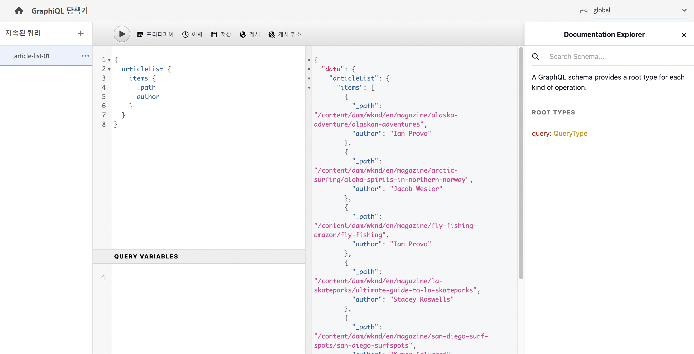
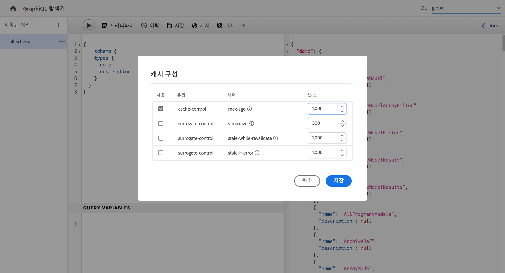
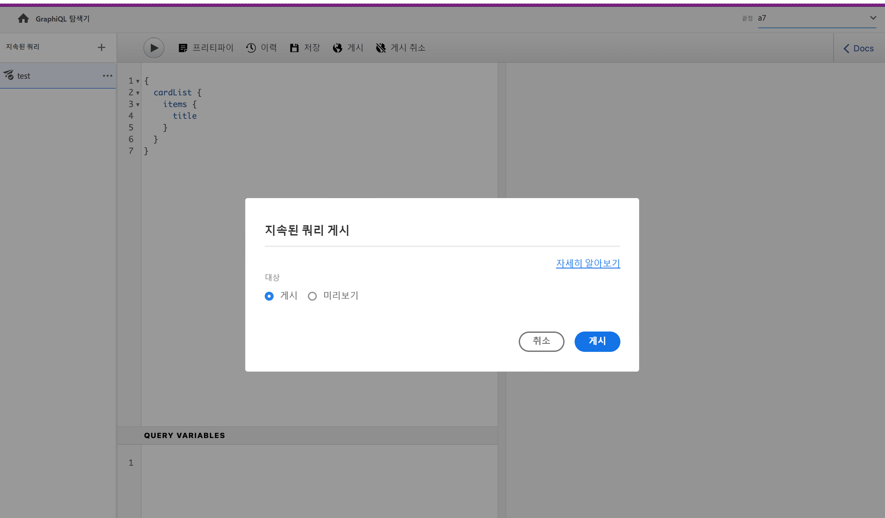

# GraphiQL IDE 사용 {#graphiql-ide}

표준 [GraphiQL](https://graphql.org/learn/serving-over-http/#graphiql) IDE의 구현은 Adobe Experience Manager(AEM) as a Cloud Service의 GraphQL API와 함께 사용할 수 있습니다.

>[!NOTE]
>
>GraphiQL은 AEM의 모든 환경에 포함되어 있지만 엔드포인트를 구성할 때만 액세스/볼 수 있습니다.
>
>이전 릴리스에서는 GraphiQL IDE를 설치하려면 패키지가 필요했습니다. 이를 설치했다면 이제 제거할 수 있습니다.

>[!NOTE]
>GraphiQL IDE를 사용하기 전에 [구성 브라우저](/help/sites-cloud/administering/content-fragments/setup.md#enable-content-fragment-functionality-configuration-browser)에서 [엔드포인트를 구성](/help/headless/graphql-api/graphql-endpoint.md)해야 합니다.

**GraphiQL** 도구를 통해 다음 작업을 수행하여 GraphQL 쿼리를 테스트하고 디버그할 수 있습니다.
* 쿼리에 사용하려는 Sites 구성에 적합한 **엔드포인트**&#x200B;를 선택합니다.
* 새 쿼리 직접 입력
* **[지속 쿼리](/help/headless/graphql-api/persisted-queries.md)** 제작 및 액세스
* 쿼리를 실행하여 결과를 즉시 확인
* **쿼리 변수** 관리
* **지속 쿼리** 저장 및 관리
* **게시** 또는 **미리보기** 서비스에 **지속 쿼리** 게시 또는 게시 취소(예: `dev-publish`에/에서)
* 이전 쿼리의 **내역** 참조
* **설명서 탐색기**&#x200B;를 사용하여 설명서에 액세스합니다. 이를 통해 사용 가능한 방법을 쉽게 배우고 이해할 수 있습니다.

다음 중 하나에서 쿼리 편집기에 액세스할 수 있습니다.

* **도구** > **일반** > **GraphQL 쿼리 편집기**
* 직접 (예: `http://localhost:4502/aem/graphiql.html`)

GET 요청을 사용하고 쿼리를 게시하여 클라이언트 애플리케이션에서 쿼리를 요청할 수 있도록 시스템에서 GraphiQL을 사용할 수 있습니다. 프로덕션을 사용하는 경우 [쿼리를 프로덕션 환경으로 이전](/help/headless/graphql-api/persisted-queries.md#transfer-persisted-query-production)할 수 있습니다. 처음은 쿼리로 새로 작성된 콘텐츠를 확인하기 위해 프로덕션 작성자로 복제되고, 마지막은 라이브 소비를 위해 프로덕션 게시로 복제됩니다.

## 엔드포인트 선택 중 {#selecting-endpoint}

첫 번째 단계로, 쿼리에 사용하려는 Sites 구성에 적합한 **[엔드포인트](/help/headless/graphql-api/graphql-endpoint.md)**&#x200B;를 선택해야 합니다. 엔드포인트는 쿼리에 사용하려는 Sites 구성에 적합합니다.

오른쪽 상단의 드롭다운 목록에서 사용할 수 있습니다.

## 새 쿼리 제작 및 지속 중 {#creating-new-query}

GraphiQL 로고 바로 아래 왼쪽 중간 패널에 있는 편집기에 새 쿼리를 입력할 수 있습니다.

>[!NOTE]
>
>이미 지속 쿼리가 선택되고 편집기 패널에 표시되는 경우 (**지속 쿼리** 옆의) `+`를 선택하여 새 쿼리에 맞는 편집기를 비웁니다.

입력이 시작되기만 하면 편집기는 다음 작업을 수행합니다.

* 마우스 오버를 사용하여 요소에 대한 추가 정보 표시
* 구문 강조, 자동 완성, 자동 제안 등의 기능 제공

>[!NOTE]
>
>GraphQL 쿼리는 일반적으로 `{` 문자로 시작됩니다.
>
>`#`으로 시작되는 라인은 무시됩니다.

**다른 이름으로 저장**&#x200B;을 사용하여 새 쿼리를 지속합니다.

## 지속 쿼리 업데이트 중 {#updating-persisted-query}

**지속 쿼리** 패널(맨 왼쪽)의 목록에서 업데이트하려는 쿼리를 선택합니다.

쿼리가 편집기 패널에 표시됩니다. 필요한 변경 내용을 적용한 다음 **저장**&#x200B;을 사용하여 지속 쿼리에 맞게 업데이트를 커밋합니다.

## 쿼리 실행 중 {#running-queries}

새 쿼리를 바로 실행하거나 지속 쿼리를 로드하고 실행할 수 있습니다. 지속 쿼리를 로드하는 경우, 목록에서 선택하면 쿼리가 편집기 패널에 표시됩니다.

두 경우 모두 편집기 패널에 표시되는 쿼리는 다음 두 가지 작업을 수행하는 경우에 실행되는 쿼리입니다.

* 다음에서 선택 **쿼리 실행** 아이콘
* 키보드 조합 `Control-Enter` 사용

## 쿼리 변수 {#query-variables}

GraphiQL IDE를 사용하여 [쿼리 변수](/help/headless/graphql-api/content-fragments.md#graphql-variables)를 관리할 수 있습니다.

예:

## 지속 쿼리에 대한 캐시 관리 {#managing-cache}

[지속 쿼리](/help/headless/graphql-api/persisted-queries.md)는 Dispatcher 및 CDN 계층에서 캐시될 수 있어 궁극적으로 요청하는 클라이언트 애플리케이션의 성능이 향상되므로 이를 사용하는 것이 좋습니다. 기본적으로 AEM은 기본 TTL(Time to Live)에 따라 CDN(Content Delivery Network) 캐시를 무효화할 수 있습니다.

>[!NOTE]
>
>다음을 참조하십시오 [지속 쿼리 캐싱](/help/headless/graphql-api/persisted-queries.md#caching-persisted-queries).

>[!NOTE]
>
>Dispatcher의 사용자 정의 재작성 규칙은 AEM 게시의 기본값을 재정의할 수 있습니다.
>
>위치 일치 패턴을 기반으로 Dispatcher에서 TTL 기반 캐시 제어 헤더를 보내는 경우 필요한 경우 를 제외할 수 있습니다 `/graphql/execute.json/*` 일치 항목에서 제외합니다.

GraphQL을 사용하여 HTTP 캐시 헤더를 구성하여 개별 지속 쿼리에 대해 이러한 매개변수를 제어할 수 있습니다.

1. 지속 쿼리 이름(맨 왼쪽 패널) 오른쪽에 있는 세 개의 세로 점을 통해 **헤더** 옵션에 액세스할 수 있습니다.

   

1. 이 옵션을 선택하면 **캐시 구성** 대화 상자:

   

1. 적절한 매개변수를 선택한 다음 필요에 따라 값을 조정합니다.

   * **cache-control** - **max-age**
캐시는 지정된 시간(초) 동안 이 콘텐츠를 저장할 수 있습니다. 일반적으로 브라우저 TTL(Time To Live)입니다.
   * **surrogate-control** - **s-maxage**
max-age와 동일하지만 특히 프록시 캐시에 적용됩니다.
   * **surrogate-control** - **stale-while-revalidate**
캐시는 오래된 캐시된 응답을 지정된 시간(초)까지 계속 제공할 수 있습니다.
   * **surrogate-control** - **stale-if-error**
캐시는 원본 오류가 발생한 경우 지정된 시간(초)까지 캐시된 응답을 계속 제공할 수 있습니다.

1. 변경 내용을 유지하려면 **저장**&#x200B;을 선택하십시오.

## 지속 쿼리 게시 및 미리보기 {#publishing-previewing-persisted-queries}

목록(왼쪽 패널)에서 지속 쿼리가 선택되면 **게시** 액션을 사용할 수 있습니다.

이러면 선택한 환경에 맞게 쿼리가 활성화됩니다. 테스트할 때 애플리케이션에서 간편하게 액세스할 수 있도록 **게시** 환경(예: `dev-publish`) 또는 **미리보기** 환경을 선택할 수 있습니다.

>[!NOTE]
>
>지속 쿼리의 캐시 `Time To Live` {&quot;cache-control&quot;:&quot;parameter&quot;:value} 기본값은 2시간(7,200초)입니다.

## 지속 쿼리 게시 취소 {#unpublishing-persisted-queries}

게시할 때처럼 목록(왼쪽 패널)에서 지속 쿼리가 선택되면 **게시 취소** 액션을 사용할 수 있습니다.

이러면 선택한 **게시** 환경 또는 **미리보기** 환경에서 쿼리가 비활성화됩니다.

>[!NOTE]
>
>또한 문제가 발생할 가능성을 피하기 위해 필요에 따라 클라이언트 애플리케이션을 변경했는지 확인해야 합니다.

## URL을 복사하여 쿼리에 직접 액세스합니다. {#copy-url}

**URL 복사** 옵션을 통해 지속 쿼리에 직접 액세스하고 결과를 조회하는 데 사용되는 URL을 복사하여 쿼리를 시뮬레이션할 수 있습니다. 그런 다음 테스트에 사용할 수 있습니다(예: 브라우저에서 액세스).

<!--
  >[!NOTE]
  >
  >The URL needs [encoding before using programmatically](/help/headless/graphql-api/persisted-queries.md#encoding-query-url).
  >
  >The target environment might need adjusting, depending on your requirements.
-->

예:

`http://localhost:4502/graphql/execute.json/global/article-list-01`

브라우저에서 이 URL을 사용하여 다음 결과를 확인할 수 있습니다.

지속 쿼리 이름(맨 왼쪽 패널) 오른쪽에 있는 세 개의 세로 점을 통해 **URL 복사** 옵션에 액세스할 수 있습니다.

## 지속 쿼리 삭제 중 {#deleting-persisted-queries}

지속 쿼리 이름(맨 왼쪽 패널) 오른쪽에 있는 세 개의 세로 점을 통해서도 **삭제** 옵션에 액세스할 수 있습니다.

<!-- what happens if you try to delete something that is still published? -->

## 프로덕션에 지속 쿼리 설치 중 {#installing-persisted-query-production}

GraphiQL로 지속 쿼리를 개발 및 테스트하고 나서 [프로덕션 환경으로 이전](/help/headless/graphql-api/persisted-queries.md#transfer-persisted-query-production)하여 애플리케이션에서 활용하는 것이 이 작업의 최종 목표입니다.

## 키보드 단축키 {#keyboard-shortcuts}

IDE에서 작업 아이콘에 직접 액세스하는 키보드 단축키의 선택 항목은 다음과 같습니다.

* 쿼리 정렬: `Shift-Control-P`
* 쿼리 병합: `Shift-Control-M`
* 쿼리 실행: `Control-Enter`
* 자동 완성: `Control-Space`

>[!NOTE]
>
>키보드에서 `Control` 키가 `Ctrl`로 레이블이 지정됩니다.
