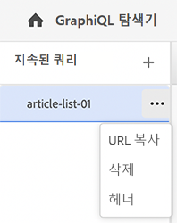

# GraphiQL IDE 사용 {#graphiql-ide}

표준 구현 [GraphiQL](https://graphql.org/learn/serving-over-http/#graphiql) IDE는 AEM(Adobe Experience Manager) as a Cloud Service의 GraphQL API에서 사용할 수 있습니다.

>[!NOTE]
>
>이 기능의 일부 기능은 사전 릴리스 채널에서 사용할 수 있습니다. 특히 지속적인 쿼리와 관련된 기능입니다.
> 
>자세한 내용은 [사전 릴리스 채널 설명서](https://experienceleague.adobe.com/docs/experience-manager-cloud-service/content/release-notes/prerelease.html#enable-prerelease) 을 참조하십시오.

>[!NOTE]
>
>GraphiQL은 AEM에 포함되지만 기본적으로 에서는 `dev-authors` 환경.

>[!NOTE]
>다음을 수행해야 합니다. [엔드포인트를 구성했습니다.](/help/headless/graphql-api/graphql-endpoint.md) 에서 [구성 브라우저](/help/assets/content-fragments/content-fragments-configuration-browser.md) graphiQL IDE를 사용하기 전에


다음 **GraphiQL** 도구를 사용하여 GraphQL 쿼리를 테스트하고 디버깅할 수 있으므로 다음 작업을 수행할 수 있습니다.
* 선택 **끝점** 쿼리에 사용할 사이트 구성에 해당
* 새 쿼리 직접 입력
* 만들기 및 액세스, **[지속되는 쿼리](/help/headless/graphql-api/persisted-queries.md)**
* 쿼리를 실행하여 결과를 즉시 확인
* 관리 **쿼리 변수**
* 저장 및 관리 **지속되는 쿼리**
* 게시 또는 게시 취소, **지속되는 쿼리** (대상/종료) `dev-publish`)
* 참조 **기록** 이전 질의의
* 사용 **설명서 탐색기** 설명서에 액세스하려면 사용 가능한 방법을 배우고 이해하는 데 도움이 됩니다.

예:

* `http://localhost:4502/aem/graphiql.html`


개발 작성자 시스템에서 GraphiQL을 사용하여 클라이언트 애플리케이션에서 GET 요청을 사용하고 쿼리를 게시할 수 있습니다. 프로덕션 사용을 위해 다음을 수행해야 합니다 [쿼리를 프로덕션 환경으로 이동](/help/headless/graphql-api/persisted-queries.md#transfer-persisted-query-production). 쿼리로 새로 작성된 컨텐츠를 확인하고 라이브 소비를 위한 최종 프로덕션 게시를 위해 처음에 프로덕션 작성자에게 보내십시오.

## 끝점 선택 {#selecting-endpoint}

첫 번째 단계로 **[끝점](/help/headless/graphql-api/graphql-endpoint.md)** 쿼리에 사용할 수 있습니다. 엔드포인트는 쿼리에 사용할 사이트 구성에 적합합니다.

오른쪽 상단의 드롭다운 목록에서 사용할 수 있습니다.

## 새 쿼리 만들기 및 유지 {#creating-new-query}

GraphiQL 로고 아래에 있는 왼쪽 가운데 패널에 있는 편집기에 새 쿼리를 입력할 수 있습니다.

>[!NOTE]
>
>지속형 쿼리를 선택하고 편집기 패널에 표시하는 경우 을 선택합니다 `+` (다음) **지속되는 쿼리**)을 클릭하여 새 쿼리를 위한 준비가 된 편집기를 비워둡니다.

입력을 시작하면 편집자도 다음과 같습니다.

* 마우스 오버를 사용하여 요소에 대한 추가 정보를 표시합니다
* 에서는 구문 강조, 자동 완성, 자동 제안 등의 기능을 제공합니다

>[!NOTE]
>
>GraphQL 쿼리는 일반적으로 `{` 문자.
>
>다음으로 시작하는 줄 `#` 은 무시됩니다.

사용 **다른 이름으로 저장** 새 쿼리를 유지하려면

## 지속형 쿼리 업데이트 {#updating-persisted-query}

의 목록에서 업데이트할 쿼리를 선택합니다 **지속되는 쿼리** 패널(맨 왼쪽).

쿼리가 편집기 패널에 표시됩니다. 필요한 사항을 변경한 다음 **저장** 지속형 쿼리에 업데이트를 커밋하려면 다음을 수행하십시오.

## 쿼리 실행 {#running-queries}

새 쿼리를 즉시 실행하거나 지속적인 쿼리를 로드하여 실행할 수 있습니다. 지속된 쿼리를 로드하려면 목록에서 해당 쿼리를 선택합니다. 그러면 쿼리가 편집기 패널에 표시됩니다.

어느 경우든 편집기 패널에 표시되는 쿼리는 다음 중 하나를 수행할 때 실행되는 질의입니다.

* 클릭/탭하기 **쿼리 실행** 아이콘
* 키보드 조합 사용 `Control-Enter`

## 쿼리 변수 {#query-variables}

<!-- more details needed here? -->

GraphiQL IDE를 사용하여 [쿼리 변수](/help/headless/graphql-api/content-fragments.md#graphql-variables).

예:


## 지속되는 쿼리 게시(dev-publish) {#publishing-persisted-queries}

목록(왼쪽 패널)에서 지속된 쿼리를 선택하면 **게시** 및 **게시 취소** 작업. 이렇게 하면 개발 게시 환경(`dev-publish`) 환경 을 테스트하여 애플리케이션에서 쉽게 액세스할 수 있습니다.

>[!NOTE]
>
>지속되는 쿼리의 캐시의 정의입니다 `Time To Live` {&quot;cache-control&quot;:&quot;parameter&quot;:value}의 기본값은 2시간(7200초)입니다.

## 지속되는 쿼리 캐싱 {#caching-persisted-queries}

AEM은 기본 TTL(Time To Live)을 기반으로 CDN(Content Delivery Network) 캐시를 무효화합니다.

이 값은 다음과 같이 설정됩니다.

* 7200초는 Dispatcher 및 CDN의 기본 TTL입니다. 다음과 같이 알려져 있습니다. *공유 캐시*
   * 기본값: s-maxage=7200
* 60은 클라이언트의 기본 TTL(예: 브라우저)입니다.
   * 기본값: maxage=60

GraphiQL UI로 지속된 AEM GraphQL 쿼리는 실행 시 기본 TTL을 사용합니다. GraphLQ 쿼리의 TTL을 변경하려면 API 메서드를 사용하여 쿼리를 유지해야 합니다. 명령줄 인터페이스에서 CURL을 사용하여 쿼리를 AEM에 게시합니다.

예:

```xml
curl -X PUT \
    -H 'authorization: Basic YWRtaW46YWRtaW4=' \
    -H "Content-Type: application/json" \
    "http://localhost:4502/graphql/persist.json/wknd/plain-article-query-max-age" \
    -d \
'{ "query": "{articleList { items { _path author main { json } referencearticle { _path } } } }", "cache-control": { "max-age": 300 }}'
```

다음 `cache-control` 은 생성 시간(PUT) 이상에서 설정할 수 있습니다(예를 들어 인스턴스에 대한 POST 요청을 통해 ). AEM에서 기본값을 제공할 수 있으므로 지속형 쿼리를 만들 때 cache-control은 선택 사항입니다. 자세한 내용은 [GraphQL 쿼리를 유지하는 방법](/help/headless/graphql-api/persisted-queries.md#how-to-persist-query)curl을 사용하여 쿼리를 유지하는 예시입니다.

## URL을 복사하여 쿼리에 직접 액세스 {#copy-url}

다음 **URL 복사** 옵션을 사용하면 지속된 쿼리에 직접 액세스하여 결과를 확인하는 데 사용되는 URL을 복사하여 쿼리를 시뮬레이션할 수 있습니다. 그런 다음 테스트에 사용할 수 있습니다. 예를 들어, 브라우저에서 액세스

<!--
  >[!NOTE]
  >
  >The URL will need [encoding before using programmatically](/help/headless/graphql-api/persisted-queries.md#encoding-query-url).
  >
  >The target environment might need adjusting, depending on your requirements.
-->

예:

`http://localhost:4502/graphql/execute.json/global/article-list-01`

브라우저에서 이 URL을 사용하여 결과를 확인할 수 있습니다.


다음 **URL 복사** 옵션은 지속되는 쿼리 이름(맨 왼쪽 패널)의 오른쪽에 있는 세 개의 세로 점을 통해 액세스할 수 있습니다.



## 지속되는 쿼리 삭제 {#deleting-persisted-queries}

다음 **삭제** 옵션은 지속되는 쿼리 이름(맨 왼쪽 패널)의 오른쪽에 있는 세 개의 세로 점을 통해 액세스할 수도 있습니다.

<!-- what happens if you try to delete something that is still published? -->


## 프로덕션에 지속적인 쿼리 설치 {#installing-persisted-query-production}

GraphiQL을 사용하여 지속된 쿼리를 개발 및 테스트한 후 최종 목표는 다음과 같습니다 [프로덕션 환경으로 전송](/help/headless/graphql-api/persisted-queries.md#transfer-persisted-query-production) 을 사용하도록 선택할 수 있습니다.

## 키보드 단축키 {#keyboard-shortcuts}

IDE에서 작업 아이콘에 직접 액세스할 수 있는 다양한 키보드 단축키가 있습니다.

* 쿼리 설명:  `Shift-Control-P`
* 병합 쿼리:  `Shift-Control-M`
* 쿼리 실행:  `Control-Enter`
* 자동 완료:  `Control-Space`

>[!NOTE]
>
>일부 키보드에서 `Control` 키에는 `Ctrl`.
