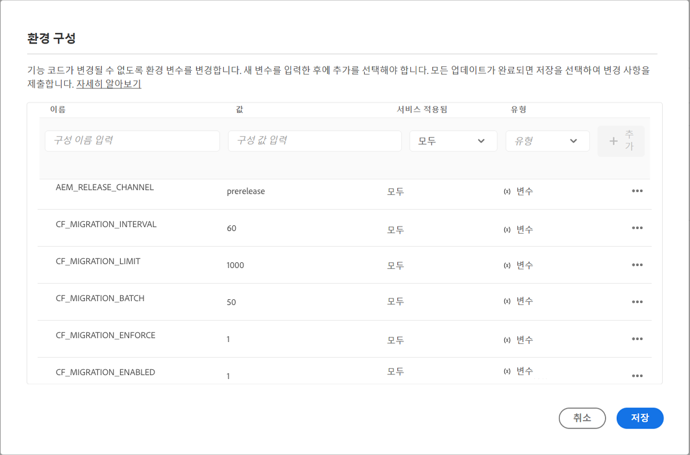

# 최적화된 GraphQL 필터링을 위해 콘텐츠 조각 업데이트 {#updating-content-fragments-for-optimized-graphql-filtering}

GraphQL 필터의 성능을 최적화하려면 콘텐츠 조각을 업데이트하는 절차를 실행해야 합니다.

>[!NOTE]
>
>콘텐츠 조각을 업데이트한 후에는 [GraphQL 쿼리 최적화](/help/headless/graphql-api/graphql-optimization.md) 권장 사항을 따를 수 있습니다.


## 사전 요구 사항 {#prerequisites}

이 작업에 대한 사전 요구 사항은 다음과 같습니다.

1. AEM as a Cloud Service의 2023.1.0 이상 릴리스가 있는지 확인하십시오.

1. 작업을 수행하는 사용자에게 필요한 권한이 있는지 확인하십시오.

   * 최소한 Cloud Manager의 `Deployment Manager` 역할이 필요합니다.

## 콘텐츠 조각 업데이트 {#updating-content-fragments}

절차를 실행하려면 다음 단계를 사용하십시오.

1. Cloud Manager UI를 사용해 인스턴스에 대해 다음 변수를 설정하여 업데이트를 활성화합니다.

   

   사용 가능한 변수는 다음과 같습니다.

   <table style="table-layout:auto">
    <tbody>
     <tr>
      <th> </th>
      <th>이름</th>
      <th>값</th>
      <th>기본 값</th>
      <th>서비스</th>
      <th>적용 여부</th>
      <th>유형</th>
      <th>메모</th>
     </tr>

   <tr>
      <td>1</td>
      <td>`CF_MIGRATION_ENABLED` </td>
      <td>`1` </td>
      <td>`0` </td>
      <td>모두 </td>
      <td> </td>
      <td>변수 </td>
      <td>콘텐츠 조각 마이그레이션 작업의 트리거를 활성화(!=0) 또는 비활성화(0)합니다. </td>
     </tr>
     <tr>
      <td>2</td>
      <td>`CF_MIGRATION_ENFORCE` </td>
      <td>`1` </td>
      <td>`0` </td>
      <td>모두 </td>
      <td> </td>
      <td>변수 </td>
      <td>콘텐츠 조각의 리마이그레이션을 시행(!=0)합니다.<br>이 플래그를 0으로 설정하면 CF의 증분 마이그레이션이 수행됩니다. 즉, 어떤 이유로든 작업이 종료되면 다음에 작업을 실행했을 때 종료된 위치에서 마이그레이션이 시작됩니다. 최초의 마이그레이션은 시행(값=1)하는 것이 좋습니다. </td>
     </tr>
     <tr>
      <td>3</td>
      <td>`CF_MIGRATION_BATCH` </td>
      <td>`50` </td>
      <td>`50` </td>
      <td>모두 </td>
      <td> </td>
      <td>변수 </td>
      <td>마이그레이션 후 콘텐츠 조각 수를 저장하기 위한 일괄 처리 크기입니다.<br>얼마나 많은 CF가 한 일괄 처리에서 저장소에 저장되는지와 관련이 있으며, 저장소에 대한 쓰기 수를 최적화하는 데 사용할 수 있습니다. </td>
     </tr>
     <tr>
      <td>4</td>
      <td>`CF_MIGRATION_LIMIT` </td>
      <td>`1000` </td>
      <td>`1000` </td>
      <td>모두 </td>
      <td> </td>
      <td>변수 </td>
      <td>한 번에 처리할 콘텐츠 조각의 최대 수입니다.<br>`CF_MIGRATION_INTERVAL`에 대한 메모도 참조하십시오. </td>
     </tr>
     <tr>
      <td>5</td>
      <td>`CF_MIGRATION_INTERVAL` </td>
      <td>`60` </td>
      <td>`600` </td>
      <td>모두 </td>
      <td> </td>
      <td>변수 </td>
      <td>다음 제한까지 남은 콘텐츠 조각을 처리하는 간격(초)<br>이 간격은 또한 작업을 시작하기 전까지의 대기 시간, 그리고 각 후속 CF_MIGRATION_LIMIT CF 개수의 처리 간 지연 시간으로 간주됩니다.<br>(*)</td>
     </tr>
    </tbody>
   </table>

   >[!NOTE]
   >
   >(*)
   >
   >`CF_MIGRATION_INTERVAL`의 값은 또한 마이그레이션 작업의 총 실행 시간을 추정하는 데 도움이 될 수 있습니다.
   >
   >예:
   >
   >* 콘텐츠 조각의 총 수 = 20,000
   >* CF_MIGRATION_LIMIT = 1000
   >* CF_MIGRATION_INTERNAL = 60(초)
   >* 마이그레이션 완료에 필요한 대략적인 시간 = 60 + (20,000/1000 * 60) = 1260초 = 21분
      >  시작 시 추가된 “60”초는 작업 시작 시 초기 지연으로 인한 것입니다.

   >
   >이는 작업을 완료하는 데 필요한 *최소한의* 시간이며 I/O 시간은 포함하지 않습니다. 소요되는 실제 시간은 이 추정치보다 훨씬 더 클 수 있습니다.

1. 진행 상황과 업데이트 완료를 모니터링하십시오.

   이를 위해서는 다음의 작성자 및 골든 게시에 대한 로그를 모니터링하십시오.

   * `com.adobe.cq.dam.cfm.impl.upgrade.UpgradeJob`

      * 작성자 로그, 예:

         ```shell
         23.01.2023 13:13:45.926 *INFO* [sling-threadpool-09cbdb47-4d99-4c4c-b6d5-781b635ee21b-(apache-sling-job-thread-pool)-1-Content Fragment Upgrade Job Queue Config(cfm/upgrader)] com.adobe.cq.dam.cfm.impl.upgrade.UpgradeJob This instance<dd9ffdc1-0c28-4d04-9a96-5d4d223e457e> is the leader, will schedule the upgrade schedule job.
         ...
         23.01.2023 13:13:45.941 *INFO* [sling-threadpool-09cbdb47-4d99-4c4c-b6d5-781b635ee21b-(apache-sling-job-thread-pool)-1-Content Fragment Upgrade Job Queue Config(cfm/upgrader)] com.adobe.cq.dam.cfm.impl.upgrade.UpgradeJob Scheduling content fragments upgrade from version 0 to 1, slingJobId: 2023/1/23/13/13/50e1a575-4cd7-497b-adf0-62cb5768eedb_0, enforce: true, limit: 1000, batch: 50, interval: 60s
         
         23.01.2023 13:20:40.960 *INFO* [sling-threadpool-09cbdb47-4d99-4c4c-b6d5-781b635ee21b-(apache-sling-job-thread-pool)-1-Content Fragment Upgrade Job Queue Config(cfm/upgrader)] com.adobe.cq.dam.cfm.impl.upgrade.UpgradeJob Finished content fragments upgrade in 6m, slingJobId: 2023/1/23/13/13/50e1a575-4cd7-497b-adf0-62cb5768eedb_0, status: MaintenanceJobStatus{jobState=SUCCEEDED, statusMessage='Upgrade to version '1' succeeded.', errors=[], successCount=3781, failedCount=0, skippedCount=0}
         ```

      * 골든 게시 로그, 예:

         ```shell
         23.01.2023 12:35:05.150 *INFO* [sling-threadpool-8abcc1bb-cdcb-46d4-8565-942ad8a73209-(apache-sling-job-thread-pool)-1-Content Fragment Upgrade Job Queue Config(cfm/upgrader)] com.adobe.cq.dam.cfm.impl.upgrade.UpgradeJob This instance<ad1b399e-77be-408e-bc3f-57097498fddb> is the leader, will schedule the upgrade schedule job.
         
         23.01.2023 12:35:05.161 *INFO* [sling-threadpool-8abcc1bb-cdcb-46d4-8565-942ad8a73209-(apache-sling-job-thread-pool)-1-Content Fragment Upgrade Job Queue Config(cfm/upgrader)] com.adobe.cq.dam.cfm.impl.upgrade.UpgradeJob Scheduling content fragments upgrade from version 0 to 1, slingJobId: 2023/1/23/12/34/ad1b399e-77be-408e-bc3f-57097498fddb_0, enforce: true, limit: 1000, batch: 50, interval: 60s
         ...
         23.01.2023 12:40:45.180 *INFO* [sling-threadpool-8abcc1bb-cdcb-46d4-8565-942ad8a73209-(apache-sling-job-thread-pool)-1-Content Fragment Upgrade Job Queue Config(cfm/upgrader)] com.adobe.cq.dam.cfm.impl.upgrade.UpgradeJob Finished content fragments upgrade in 5m, slingJobId: 2023/1/23/12/34/ad1b399e-77be-408e-bc3f-57097498fddb_0, status: MaintenanceJobStatus{jobState=SUCCEEDED, statusMessage='Upgrade to version '1' succeeded.', errors=[], successCount=3781, failedCount=0, skippedCount=0}
         ```
   Splunk를 사용하여 환경 로그에 대한 액세스를 활성화한 고객은 아래 예제 쿼리를 사용하여 업그레이드 프로세스를 모니터링할 수 있습니다. Splunk 로깅 활성화에 대한 자세한 내용은 [프로덕션 및 스테이지 디버깅](/help/implementing/developing/introduction/logging.md#debugging-production-and-stage) 페이지를 참조하십시오.

   ```splunk
   index=<indexName> sourcetype=aemerror aem_envId=<environmentId> msg="*com.adobe.cq.dam.cfm.impl.upgrade.UpgradeJob Finished*" 
   (aem_tier=golden-publish OR aem_tier=author) | table _time aem_tier pod_name msg | sort -_time desc
   ```

   위치:

   * `environmentId` - 고객 환경 식별자 (예: `e1234`)
   * `indexName` - 고객 색인 이름, `aemerror` 이벤트 수집

   출력 예:

   <table style="table-layout:auto">
     <thead>
       <tr>
       <th>_time</th>
       <th>aem_tier</th>
       <th>pod_name</th>
       <th>msg</th>
       </tr>
     </thead> 
     <tbody>
       <tr>
         <td>2023-04-21 06:00:35.723</td>
         <td>작성자</td>
         <td>cm-p1234-e1234-aem-author-76d6dc4b79-8lsb5</td>
         <td>[sling-threadpool-bb5da4dd-6b05-4230-93ea-1d5cd242e24f-(apache-sling-job-thread-pool)-1-Content Fragment Upgrade Job Queue Config(cfm/upgrader)] com.adobe.cq.dam.cfm.impl.upgrade.UpgradeJob Finished content fragments upgrade in 391m, slingJobId: 2023/4/20/23/16/db7963df-e267-489b-b69a-5930b0dadb37_0, status: MaintenanceJobStatus{jobState=SUCCEEDED, statusMessage='Upgrade to version '1' succeeded.', errors=[], successCount=36756, failedCount=0, skippedCount=0}</td>
       </tr>
       <tr>
         <td>2023-04-21 06:05:48.207</td>
         <td>골든 게시</td>
         <td>cm-p1234-e1234-aem-golden-publish-644487c9c5-lvkv2</td>
         <td>[sling-threadpool-284b9a9a-8454-461e-9bdb-44866c6ddfb1-(apache-sling-job-thread-pool)-1-Content Fragment Upgrade Job Queue Config(cfm/upgrader)] com.adobe.cq.dam.cfm.impl.upgrade.UpgradeJob Finished content fragments upgrade in 211m, slingJobId: 2023/4/20/23/15/66c1690a-cdb7-4e66-bc52-90f33394ddfc_0, status: MaintenanceJobStatus{jobState=SUCCEEDED, statusMessage='Upgrade to version '1' succeeded.', errors=[], successCount=19557, failedCount=0, skippedCount=0}</td>
       </tr>
     </tbody>
   <table>

1. 업데이트 절차를 비활성화합니다.

   >[!IMPORTANT]
   >
   >이 단계는 업그레이드를 완료하는 데 필요합니다.

   업데이트 절차가 실행된 후 클라우드 환경 변수`CF_MIGRATION_ENABLED`를 ‘0’으로 재설정하여 모든 포드의 재활용을 트리거합니다.

   <table style="table-layout:auto">
    <tbody>
     <tr>
      <th> </th>
      <th>이름</th>
      <th>값</th>
      <th>기본 값</th>
      <th>서비스</th>
      <th>적용 여부</th>
      <th>유형</th>
      <th>메모</th>
     </tr>
     <tr>
      <td></td>
      <td>`CF_MIGRATION_ENABLED` </td>
      <td>`0` </td>
      <td>`0` </td>
      <td>모두 </td>
      <td> </td>
      <td>변수 </td>
      <td>콘텐츠 조각 마이그레이션 작업의 트리거를 비활성화(0)(또는 활성화(!=0))합니다. </td>
     </tr>
    </tbody>
   </table>

   >[!NOTE]
   >
   >이는 게시 계층에 특히 중요한데, 콘텐츠 업데이트가 골든 게시에서만 수행되며, 포드를 재활용할 때 모든 일반 게시 포드가 골든 게시를 기반으로 하기 때문입니다.

1. 업데이트 절차가 완료되었는지 확인합니다.

   Cloud Manager 개발자 콘솔의 저장소 브라우저를 사용해 콘텐츠 조각 데이터를 확인하여 업데이트가 성공적으로 완료되었는지 확인할 수 있습니다.

   * 첫 번째 전체 마이그레이션 전까지는 `cfGlobalVersion` 속성이 존재하지 않습니다.
따라서 JCR 노드 `/content/dam`에 이 속성이 있고 값이 `1`이면 마이그레이션이 완료된 것입니다.

   * 개별 콘텐츠 조각에서 다음 속성을 확인할 수도 있습니다.

      * `_strucVersion`의 값이 `1`이어야 함
      * `indexedData` 구조가 존재해야 함

      >[!NOTE]
      >
      >이 절차는 작성자 및 게시 인스턴스에서 콘텐츠 조각을 업데이트합니다.
      >
      >따라서 저장소 브라우저를 통해 *최소* 한 명의 작성자 *및* 하나의 게시 인스턴스에 대해 검증을 수행하는 것이 좋습니다.


## 제한 사항 {#limitations}

다음 제한 사항을 알아 두십시오.

* GraphQL 필터의 성능 최적화는 모든 콘텐츠 조각을 완전히 업데이트한 후에만 가능합니다(JCR 노드 `/content/dam`에 `cfGlobalVersion` 속성이 있으면 업데이트가 완료된 것).

* 업데이트 절차를 실행한 후 콘텐츠 패키지에서 콘텐츠 조각을 가져온 경우(`crx/de` 사용) 해당 콘텐츠 조각은 업데이트 절차가 다시 실행될 때까지 GraphQL 쿼리 결과에서 고려되지 않습니다.
