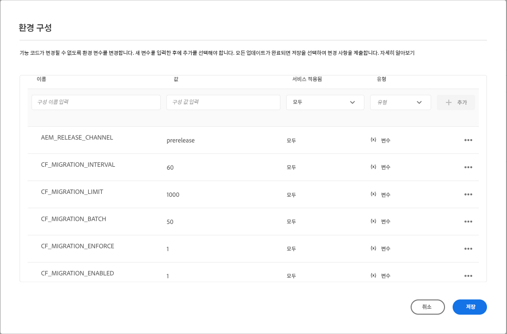

# GraphQL 필터링에서 페이징 및 정렬을 위한 컨텐츠 조각 업데이트 {#updating-content-fragments-for-paging-and-sorting-graphql-filtering}

GraphQL 필터의 성능을 최적화하려면 컨텐츠 조각을 업데이트하는 절차를 실행해야 합니다.

>[!NOTE]
>
>컨텐츠 조각을 업데이트한 후 권장 사항을 따를 수 있습니다 [GraphQL 쿼리 최적화](/help/headless/graphql-api/graphql-optimization.md).


## 사전 요구 사항 {#prerequisites}

AEM as a Cloud Service 2023.1.0 릴리스의 최소 릴리스가 있는지 확인합니다.

## 컨텐츠 조각 업데이트 {#updating-content-fragments}

절차를 실행하려면 다음 단계를 사용합니다.

1. Cloud Manager UI를 사용하여 인스턴스에 대해 다음 변수를 설정하여 업데이트를 활성화합니다.

   

   사용 가능한 변수는 다음과 같습니다.

   <table>
    <tbody>
     <tr>
      <th> </th>
      <th>이름</th>
      <th>값</th>
      <th>기본 값</th>
      <th>서비스</th>
      <th>적용됨</th>
      <th>유형</th>
      <th>메모</th>
     </tr>
     <tr>
      <td>1</td>
      <td>'AEM_RELEASE_CHANNEL' </td>
      <td>'prerelease' </td>
      <td> </td>
      <td>모두 </td>
      <td> </td>
      <td>변수 </td>
      <td>기능을 활성화하는 데 필요합니다. </td>
     </tr>
     <tr>
      <td>2</td>
      <td>'CF_MIGRATION_ENABLED' </td>
      <td>`1` </td>
      <td>`0` </td>
      <td>모두 </td>
      <td> </td>
      <td>변수 </td>
      <td>사용(!)컨텐츠 조각 마이그레이션 작업의 트리거를 비활성화(0)합니다. </td>
     </tr>
     <tr>
      <td>3</td>
      <td>'CF_MIGRATION_ENFORCE' </td>
      <td>`1` </td>
      <td>`0` </td>
      <td>모두 </td>
      <td> </td>
      <td>변수 </td>
      <td>적용(!= 0) 컨텐츠 조각의 재마이그레이션.<br>이 플래그를 0으로 설정하면 CF가 증분 마이그레이션됩니다. 즉, 어떤 이유로든 작업이 종료되면 다음 작업 실행에서 작업이 종료되는 지점에서 마이그레이션을 시작합니다. 첫 번째 마이그레이션이 강제 적용되는 것이 좋습니다(값=1). </td>
     </tr>
     <tr>
      <td>4</td>
      <td>'CF_MIGRATION_BATCH' </td>
      <td>`50` </td>
      <td>`50` </td>
      <td>모두 </td>
      <td> </td>
      <td>변수 </td>
      <td>마이그레이션 후 컨텐츠 조각 수를 저장하는 일괄 처리의 크기입니다.<br>이는 한 번에 리포지토리에 저장되는 CF의 수와 관련이 있으며, 리포지토리에 대한 쓰기 수를 최적화하는 데 사용할 수 있습니다. </td>
     </tr>
     <tr>
      <td>5</td>
      <td>'CF_MIGRATION_LIMIT' </td>
      <td>`1000` </td>
      <td>`1000` </td>
      <td>모두 </td>
      <td> </td>
      <td>변수 </td>
      <td>한 번에 처리할 최대 컨텐츠 조각 수입니다.<br>'CF_MIGRATION_INTERVAL'에 대한 참고 사항을 참조하십시오. </td>
     </tr>
     <tr>
      <td>6</td>
      <td>'CF_MIGRATION_INTERVAL' </td>
      <td>`60` </td>
      <td>`600` </td>
      <td>모두 </td>
      <td> </td>
      <td>변수 </td>
      <td>나머지 컨텐츠 조각을 다음 제한까지 처리하는 간격(초)<br>이 간격은 작업을 시작하기 전 대기 시간뿐만 아니라 후속 CF_MIGRATION_LIMIT NUMBER의 각 처리 사이의 지연으로 간주됩니다.<br>(*)</td>
     </tr>
    </tbody>
   </table>

   >[!NOTE]
   >
   >(*)
   >
   >다음 값 `CF_MIGRATION_INTERVAL` 마이그레이션 작업의 총 실행 시간을 어림잡는 데 도움이 될 수도 있습니다.
   >
   >예:
   >
   >* 총 컨텐츠 조각 수 = 20,000
   >* CF_MIGRATION_LIMIT = 1000
   >* CF_MIGRATION_INTERNAL = 60(초)
   >* 마이그레이션을 완료하는 데 필요한 대략적인 시간 = 60 + (20,000/1000 * 60) = 1260초 = 21분
      >  시작 시 추가된 &quot;60&quot; 초는 작업을 시작할 때의 초기 지연 때문입니다.

   >
   >또한 이 ID가 *최소* 작업을 완료하는 데 필요한 시간이며 I/O 시간은 포함되지 않습니다. 실제 소요 시간은 이 추정보다 상당히 더 많을 수 있습니다.

1. 업데이트 진행 및 완료를 모니터링합니다.

   이렇게 하려면 다음 위치에서 작성자 및 골든 게시 시 로그를 모니터링합니다.

   * `com.adobe.cq.dam.cfm.impl.upgrade.UpgradeJob`

      * 작성자 로그 예:

         ```shell
         23.01.2023 13:13:45.926 *INFO* [sling-threadpool-09cbdb47-4d99-4c4c-b6d5-781b635ee21b-(apache-sling-job-thread-pool)-1-Content Fragment Upgrade Job Queue Config(cfm/upgrader)] com.adobe.cq.dam.cfm.impl.upgrade.UpgradeJob This instance<dd9ffdc1-0c28-4d04-9a96-5d4d223e457e> is the leader, will schedule the upgrade schedule job.
         ...
         23.01.2023 13:13:45.941 *INFO* [sling-threadpool-09cbdb47-4d99-4c4c-b6d5-781b635ee21b-(apache-sling-job-thread-pool)-1-Content Fragment Upgrade Job Queue Config(cfm/upgrader)] com.adobe.cq.dam.cfm.impl.upgrade.UpgradeJob Scheduling content fragments upgrade from version 0 to 1, slingJobId: 2023/1/23/13/13/50e1a575-4cd7-497b-adf0-62cb5768eedb_0, enforce: true, limit: 1000, batch: 50, interval: 60s
         
         23.01.2023 13:20:40.960 *INFO* [sling-threadpool-09cbdb47-4d99-4c4c-b6d5-781b635ee21b-(apache-sling-job-thread-pool)-1-Content Fragment Upgrade Job Queue Config(cfm/upgrader)] com.adobe.cq.dam.cfm.impl.upgrade.UpgradeJob Finished content fragments upgrade in 6m, slingJobId: 2023/1/23/13/13/50e1a575-4cd7-497b-adf0-62cb5768eedb_0, status: MaintenanceJobStatus{jobState=SUCCEEDED, statusMessage='Upgrade to version '1' succeeded.', errors=[], successCount=3781, failedCount=0, skippedCount=0}
         ```
   * 골든 게시 로그; 예:

      ```shell
      23.01.2023 12:35:05.150 *INFO* [sling-threadpool-8abcc1bb-cdcb-46d4-8565-942ad8a73209-(apache-sling-job-thread-pool)-1-Content Fragment Upgrade Job Queue Config(cfm/upgrader)] com.adobe.cq.dam.cfm.impl.upgrade.UpgradeJob This instance<ad1b399e-77be-408e-bc3f-57097498fddb> is the leader, will schedule the upgrade schedule job.
      
      23.01.2023 12:35:05.161 *INFO* [sling-threadpool-8abcc1bb-cdcb-46d4-8565-942ad8a73209-(apache-sling-job-thread-pool)-1-Content Fragment Upgrade Job Queue Config(cfm/upgrader)] com.adobe.cq.dam.cfm.impl.upgrade.UpgradeJob Scheduling content fragments upgrade from version 0 to 1, slingJobId: 2023/1/23/12/34/ad1b399e-77be-408e-bc3f-57097498fddb_0, enforce: true, limit: 1000, batch: 50, interval: 60s
      ...
      23.01.2023 12:40:45.180 *INFO* [sling-threadpool-8abcc1bb-cdcb-46d4-8565-942ad8a73209-(apache-sling-job-thread-pool)-1-Content Fragment Upgrade Job Queue Config(cfm/upgrader)] com.adobe.cq.dam.cfm.impl.upgrade.UpgradeJob Finished content fragments upgrade in 5m, slingJobId: 2023/1/23/12/34/ad1b399e-77be-408e-bc3f-57097498fddb_0, status: MaintenanceJobStatus{jobState=SUCCEEDED, statusMessage='Upgrade to version '1' succeeded.', errors=[], successCount=3781, failedCount=0, skippedCount=0}
      ```


1. 업데이트 절차를 비활성화합니다.

   >[!IMPORTANT]
   >
   >업그레이드를 완료하려면 이 단계가 필요합니다.

   업데이트 절차가 실행된 후 클라우드 환경 변수를 재설정합니다 `CF_MIGRATION_ENABLED` &#39;0&#39;으로 변경하여 모든 pod의 재활용을 트리거합니다.

   <table>
    <tbody>
     <tr>
      <th> </th>
      <th>이름</th>
      <th>값</th>
      <th>기본 값</th>
      <th>서비스</th>
      <th>적용됨</th>
      <th>유형</th>
      <th>메모</th>
     </tr>
     <tr>
      <td></td>
      <td>'CF_MIGRATION_ENABLED' </td>
      <td>`0` </td>
      <td>`0` </td>
      <td>모두 </td>
      <td> </td>
      <td>변수 </td>
      <td>비활성화(0)(또는 Enable(!)= 0) 컨텐츠 조각 마이그레이션 작업을 트리거합니다. </td>
     </tr>
    </tbody>
   </table>

   >[!NOTE]
   >
   >컨텐츠 업데이트는 골든 게시에서만 수행되며 pod를 재활용할 때 모든 일반 게시 포드는 골든 게시를 기반으로 하므로 게시 계층에는 특히 중요합니다.

1. 업데이트 절차의 완료를 확인합니다.

   Cloud Manager 개발자 콘솔의 저장소 브라우저를 사용하여 업데이트가 성공적으로 완료되었는지 확인하여 컨텐츠 조각 데이터를 확인할 수 있습니다.

   * 첫 번째 전체 마이그레이션 전에 `cfGlobalVersion` 속성이 없습니다.
따라서 JCR 노드에 이 속성이 있는지 확인합니다 `/content/dam` 값 `1`를 사용하여 마이그레이션이 완료되었는지 확인합니다.

   * 개별 컨텐츠 조각에서 다음 속성을 확인할 수도 있습니다.

      * `_strucVersion` 값은 다음과 같습니다. `1`
      * `indexedData` 구조가 존재해야 함

      >[!NOTE]
      >
      >이 절차는 작성자 및 게시 인스턴스의 컨텐츠 조각을 업데이트합니다.
      >
      >따라서 저장소 브라우저를 통해 확인을 수행하는 것이 좋습니다 *적어도* 작성자 *및* 하나의 게시 인스턴스.


## 제한 사항 {#limitations}

다음 제한 사항을 알아 두십시오.

* GraphQL 필터의 성능 최적화는 모든 컨텐츠 조각을 완전히 업데이트한 후(페이지의 표시로 표시됨) `cfGlobalVersion` JCR 노드에 대한 속성 `/content/dam`)

* 컨텐츠 조각을 컨텐츠 패키지에서 가져오는 경우( `crx/de`) 업데이트 절차를 실행한 후 업데이트 절차가 다시 실행될 때까지 해당 컨텐츠 조각은 GraphQL 쿼리 결과에서 고려되지 않습니다.