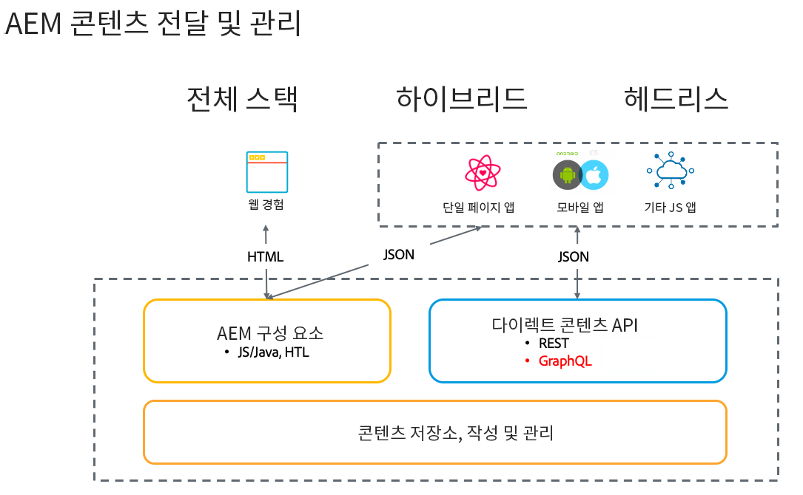

# Adobe Experience Manager as a Headless CMS 소개 {#introduction-aem-headless}

AEM(Adobe Experience Manager)을 컨텐츠 조각 모델, 컨텐츠 조각 및 헤드리스 경험을 규모에 맞게 결합하는 GraphQL API와 같은 기능과 함께 헤드리스 CMS(컨텐츠 관리 시스템)로 사용하는 방법을 알아봅니다.

관련된 다양한 기능에 대한 자세한 설명서를 읽어보고 [첫 번째 단계에 대한 개요를 살펴보기 위한 Headless 여정](#first-steps)을 따를 수 있습니다.

>[!NOTE]
>
>또한 Headless 개념 및 용어 소개가 포함되어 있는 [Headless 소개](/help/headless/what-is-headless.md)를 참조하십시오.

## 개요 {#overview}

AEM Headless는 GraphQL을 사용한 HTTP를 통해 AEM의 구조화된 콘텐츠(콘텐츠 조각)를 모든 앱에서 사용할 수 있도록 하는 Experience Manager의 CMS 솔루션입니다. Headless 구현을 통해 플랫폼과 채널 전반에 걸쳐 대규모로 경험을 전달할 수 있습니다.

전체 스택 및 하이브리드 솔루션에서와 마찬가지로 페이지 및 구성 요소 관리를 위한 헤드리스 구현입니다. 대신 채널 중립적이고 재사용 가능한 컨텐츠 조각 만들기 및 채널 간 게재에 중점을 둡니다. 웹 경험을 구현하기 위한 현대적이고 동적인 개발 패턴입니다.

## 기능 {#aem-headless-features}

AEM as a Cloud Service는 다음과 같은 세 가지 강력한 기능을 제공하는 Headless 구현 모델을 위한 유연한 도구입니다.

1. **콘텐츠 조각 모델**
   * 컨텐츠 조각 모델은 컨텐츠의 구조화된 표현입니다.
   * 컨텐츠 조각 모델은 AEM 컨텐츠 조각 모델 편집기에서 정보 설계자에 의해 정의됩니다.
   * 컨텐츠 조각 모델은 컨텐츠 조각의 토대 역할을 합니다.
1. **콘텐츠 조각**
   * 컨텐츠 조각은 컨텐츠 조각 모델을 기반으로 만들어집니다.
   * 컨텐츠 조각은 AEM 컨텐츠 조각 편집기를 사용하여 컨텐츠 작성자가 작성합니다.
   * 컨텐츠 조각은 AEM Assets으로 저장되지만 자산 콘솔 또는 [컨텐츠 조각 콘솔](/help/sites-cloud/administering/content-fragments/content-fragments-console.md).
1. **게재를 위한 콘텐츠 API**
   * AEM GraphQL API는 콘텐츠 조각 게재를 지원합니다.
   * AEM Assets REST API는 콘텐츠 조각 CRUD 작업을 지원합니다.
   * [콘텐츠 조각 핵심 구성 요소의 JSON 내보내기](https://experienceleague.adobe.com/docs/experience-manager-core-components/using/components/content-fragment-component.html?lang=ko-KR)를 통해 직접 콘텐츠 게재도 가능합니다.

## 첫 단계 {#first-steps}

AEM의 Headless 기능을 시작하는 데 사용할 수 있는 몇 가지 리소스가 있습니다. 각 안내서는 다양한 사용 사례와 대상자에 맞게 구성되어 있습니다.

| 리소스 | 설명 | 유형 | 대상자 | 예상 시간 |
|---|---|---|---|---|
| [Headless 개발자 여정](/help/journey-headless/developer/overview.md) | **AEM 및 Headless 기술을 처음 경험하는 개발자의 경우** Headless 이론에서 첫 번째 Headless 프로젝트 실행에 이르기까지 AEM 및 Headless 기능을 여기에서 포괄적으로 접해 보십시오. | 안내서 | **AEM 및 Headless를 처음 경험하는** 개발자 | 1시간 |
| [Headless 설정](/help/headless/setup/introduction.md) | 주요 AEM Headless 기능에 대한 간략한 요약이 필요한 **경험 있는 AEM 사용자의 경우** 이 빠른 시작 개요를 확인하십시오. | 참조 설정 | **AEM 사용 경험이 있는** 개발자, 관리자 | 20분 |
| [Headless 실습 튜토리얼](https://experienceleague.adobe.com/docs/experience-manager-learn/getting-started-with-aem-headless/graphql/multi-step/overview.html?lang=ko-KR) | **실습 접근 방식을 선호하고 AEM에 익숙한 경우** 이 튜토리얼에서는 간단한 Headless 앱 구현으로 바로 뛰어듭니다. | 튜토리얼 | 개발자 | 2시간 |
| [Headless 설계자 여정](/help/journey-headless/architect/overview.md) | **AEM 및 Headless 기술을 처음 경험하는 설계자의 경우** 여기에서 Adobe Experience Manager as a Cloud Service의 강력하고 유연한 Headless 기능을 접해 보고 프로젝트 콘텐츠를 모델링하는 방법을 알아보십시오. | 안내서 | 설계자 | 1시간 |
| [Headless 작성 여정](/help/journey-headless/author/overview.md) | **AEM 및 Headless 기술을 처음 경험하는 비즈니스 사용자의 경우** 여기에서 Adobe Experience Manager as a Cloud Service의 강력하고 유연한 Headless 기능을 접해 보고 프로젝트 콘텐츠를 모델링하는 방법을 알아보십시오. | 안내서 | 콘텐츠 크리에이터 | 1시간 |
| [Headless 번역 여정](/help/journey-headless/translation/overview.md) | **Headless에 대한 AEM의 번역 접근 방식에 관심이 있는** 사람들을 위한 것입니다. Headless 기술, 그리고 AEM에서 번역 프로젝트를 만들고 업데이트하는 방법을 A부터 Z까지 알아보십시오. | 안내서 | 번역 전문가 | 1시간 |

## Headful과 Headless 비교 {#headful-headless}

이 안내서는 AEM의 전체 Headless 구현 모델에 중점을 두고 있습니다. 그러나 Headful과 Headless가 AEM에서 양자택일이 될 필요는 없습니다. Headless 기능을 사용하여 콘텐츠를 관리하고 여러 접점에 전달할 수 있으며 콘텐츠 작성자가 단일 페이지 애플리케이션을 편집할 수도 있습니다. 모두 AEM에 있습니다.

>[!TIP]
>
>자세한 내용은 [AEM의 Headful과 Headless](/help/implementing/developing/headful-headless.md)설명서를 참조하십시오.