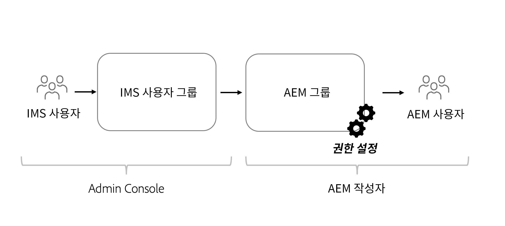

# Headless 콘텐츠에 대한 권한 고려 사항

Headless 구현으로 여러 보안 및 권한 영역을 다뤄야 합니다. AEM 환경 **Author** 또는 **Publish**&#x200B;에 따라 권한 및 가상 사용자를 광범위하게 고려할 수 있습니다. 각 환경에는 다양한 가상 사용자가 포함되어 있으며 다양한 요구 사항을 가지고 있습니다.

## Author 서비스 고려 사항

Author 서비스는 내부 사용자가 콘텐츠를 만들고 관리하고 게시하는 곳입니다. 권한은 콘텐츠를 관리하는 다양한 가상 사용자를 중심으로 다룹니다.

### 그룹 수준에서 권한 관리

가장 좋은 방법은 AEM의 그룹에 권한을 설정하는 것입니다. 로컬 그룹이라고도 하는 이러한 그룹은 AEM Author 환경 내에서 관리할 수 있습니다.

그룹 멤버십을 관리하는 가장 쉬운 방법은 Adobe IMS(Identity Management System) 그룹을 사용하고 [IMS 그룹을 로컬 AEM 그룹에 할당](https://experienceleague.adobe.com/docs/experience-manager-cloud-service/content/security/ims-support.html#managing-permissions-in-aem)하는 것입니다.

높은 수준에서 프로세스는

1. [Admin Console](https://adminconsole.adobe.com/)을 사용하여 IMS 사용자를 신규 또는 기존 IMS 사용자 그룹에 추가합니다.
1. IMS 그룹은 사용자가 로그인할 때 AEM과 동기화됩니다.
1. IMS 그룹을 AEM 그룹에 할당합니다.
1. AEM 그룹에 대한 권한을 설정합니다.
1. 사용자가 AEM에 로그인하고 IMS를 통해 인증되면 AEM 그룹의 권한을 상속합니다.

>[!TIP]
>
> IMS 및 AEM 사용자 및 그룹 관리에 대한 자세한 비디오 설명은 [여기](https://experienceleague.adobe.com/docs/experience-manager-learn/cloud-service/accessing/overview.html)에서 확인할 수 있습니다.

AEM에서 **그룹**&#x200B;을 관리하려면 **도구** > **보안** > **그룹**&#x200B;으로 이동합니다.

AEM에서 그룹의 권한을 관리하려면 **도구** > **보안** > **권한**&#x200B;으로 이동합니다.

### DAM 사용자

여기에서 “DAM”은 디지털 자산 관리를 의미합니다. **DAM 사용자**&#x200B;는 디지털 자산 및 콘텐츠 조각을 관리하는 “일상적인” 사용자에게 사용할 수 있는 AEM의 기본 제공 그룹입니다. 이 그룹은 AEM Assets의 콘텐츠 조각 및 기타 모든 파일을 **보기**, **추가**, **업데이트**, **삭제**, **게시**&#x200B;할 수 있는 권한을 제공합니다.

그룹 멤버십에 IMS를 사용하는 경우 적절한 IMS 그룹을 **DAM 사용자** 그룹의 멤버로 추가합니다. IMS 그룹의 멤버는 AEM 환경에 로그인할 때 DAM 사용자 그룹의 권한을 상속합니다.

#### DAM 사용자 그룹 맞춤화

기본 제공 그룹의 권한을 직접 수정하지 않는 것이 가장 좋습니다. 대신 **DAM 사용자** 그룹 권한을 모델로 하여 고유한 그룹을 만들 수도 있고 AEM Assets 내의 다른 **폴더**&#x200B;에 대한 액세스를 추가로 제한할 수도 있습니다.

보다 세분화된 권한을 얻으려면 AEM의 **권한** 콘솔을 사용하고 `/content/dam` 경로를 보다 구체적인 경로(예: `/content/dam/mycontentfragments`)로 경로를 업데이트합니다.

콘텐츠 조각을 만들고 편집할 수 있는 권한을 이 사용자 그룹에 부여하고 삭제하지 않는 것이 좋습니다. 편집 권한을 검토하고 할당하지만 삭제는 허용하지 않으려면[콘텐츠 조각 - 삭제 고려 사항](/help/sites-cloud/administering/content-fragments/delete-considerations.md)을 참조하십시오.

### 모델 편집기

**콘텐츠 조각 모델**&#x200B;을 수정하는 기능은 관리자 또는 높은 권한을 가진 **소규모 사용자 그룹**&#x200B;에게 맡겨야 합니다. 콘텐츠 조각 모델을 수정하면 많은 다운스트림 효과가 발생합니다.

>[!CAUTION]
>
>콘텐츠 조각 모델을 수정하면 Headless 애플리케이션이 의존하는 기본 GraphQL API가 변경됩니다.

콘텐츠 조각 모델을 관리하지만 전체 관리자 액세스 권한은 없는 그룹을 만들려면 다음 액세스 제어 항목을 사용하여 그룹을 만들 수 있습니다.

| 경로 | 권한 | 권한 |
|-----| -------------| ---------|
| `/conf` | **허용** | `jcr:read` |
| `/conf/<config-name>/settings/dam/cfm` | **허용** | `rep:write`, `crx:replicate` |

## Publish 서비스 권한

Publish 서비스는 “라이브” 환경으로 간주되며 일반적으로 GraphQL API 소비자는 이 서비스를 통해 상호 작용합니다. Author 서비스에서 편집 및 승인된 콘텐츠는 Publish 서비스로 게시됩니다. 그러면 Headless 애플리케이션은 GraphQL API를 통해 Publish 서비스에서 승인된 콘텐츠를 소비합니다.

기본적으로 AEM Publish 서비스의 GraphQL 엔드포인트를 통해 노출된 콘텐츠는 인증되지 않은 사용자를 포함하여 모든 사용자가 액세스할 수 있습니다.

### 콘텐츠 권한

AEM의 GraphQL API를 통해 노출된 콘텐츠는 자산 폴더에 설정된 [CUG(폐쇄형 사용자 그룹)](https://experienceleague.adobe.com/docs/experience-manager-learn/assets/advanced/closed-user-groups.html)를 사용하여 제한할 수 있으며, 이는 자산 폴더의 콘텐츠에 액세스할 수 있는 AEM 사용자 그룹(및 해당 멤버)을 지정합니다.

자산 CUG의 작동 방식:

* 먼저 폴더 및 하위 폴더에 대한 모든 액세스를 거부합니다.
* 그런 다음 CUG 목록에 나열된 모든 AEM 사용자 그룹의 폴더 및 하위 폴더에 대한 읽기 액세스를 허용합니다.

CUG는 GraphQL API를 통해 노출된 콘텐츠가 포함된 자산 폴더에 설정할 수 있습니다. AEM Publish의 자산 폴더에 대한 액세스는 사용자가 직접 제어하는 것이 아니라 사용자 그룹을 통해 제어해야 합니다. GraphQL API에 의해 노출된 콘텐츠가 포함된 자산 폴더에 대한 액세스 권한을 부여하는 AEM 사용자 그룹을 생성(또는 재사용)합니다.

#### 인증 체계 선택{#publish-permissions-users}

[AEM Headless SDK](https://github.com/adobe/aem-headless-client-js#create-aemheadless-client)는 두 가지 유형의 인증을 지원합니다.

* 단일 기술 계정에 바인딩된 서비스 자격 증명을 사용하는 [토큰 기반 인증](/help/implementing/developing/introduction/generating-access-tokens-for-server-side-apis.md).
* AEM 사용자를 사용하는 기본 인증.

### GraphQL API에 액세스

AEM Publish 서비스의 GraphQL API 엔드포인트에 [적절한 인증 자격 증명](https://github.com/adobe/aem-headless-client-js#create-aemheadless-client)을 제공하는 HTTP 요청에는 자격 증명이 읽을 수 있는 콘텐츠와 익명으로 액세스할 수 있는 콘텐츠가 포함됩니다. GraphQL API의 다른 소비자는 CUG로 보호된 폴더의 콘텐츠를 읽을 수 없습니다.
