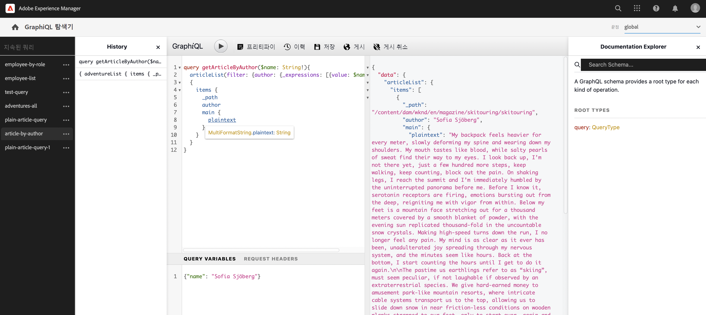
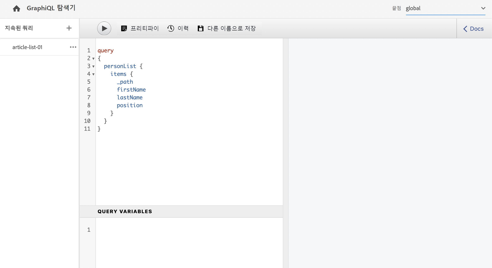

# API 요청 만들기 - Headless 설정 {#accessing-delivering-content-fragments}

콘텐츠 조각 콘텐츠의 Headless 게재를 위해 GraphQL API를 사용하는 방법과 콘텐츠 조각을 관리하기 위해 AEM의 자산 REST API를 사용하는 방법을 알아봅니다.

## GraphQL 및 Assets REST API란 무엇입니까? {#what-are-the-apis}

[일부 콘텐츠 조각을 만들었으므로](create-content-fragment.md) 이제 AEM의 API를 사용하여 Headless 방식으로 전달할 수 있습니다.

* [GraphQL API](/help/headless/graphql-api/content-fragments.md)를 사용하여 콘텐츠 조각에 액세스하고 전달하기 위한 요청을 생성할 수 있습니다. 이 API는 콘텐츠 조각 콘텐츠를 쿼리하고 소비하기 위한 가장 강력한 기능 집합을 제공합니다.
   * API를 사용하려면 [AEM에서 엔드포인트를 정의 및 활성화하고](/help/headless/graphql-api/graphql-endpoint.md), 필요한 경우 [GraphiQL 인터페이스를 설치](/help/headless/graphql-api/graphiql-ide.md)합니다
* [Assets REST API](/help/assets/content-fragments/assets-api-content-fragments.md)를 사용하면 콘텐츠 조각(및 기타 자산)을 만들고 수정할 수 있습니다.

이 안내서의 나머지 부분에서는 GraphQL 액세스 및 콘텐츠 조각 게재에 중점을 둡니다.

## GraphQL 엔드포인트 활성화 {#enable-graphql-endpoint}

GraphQL API를 사용하려면 먼저 GraphQL 엔드포인트를 만들어야 합니다.

1. **도구**, **일반**&#x200B;으로 이동한 다음 **GraphQL**&#x200B;을 선택합니다.
1. **만들기**&#x200B;를 선택합니다.
1. **새 GraphQL 엔드포인트 만들기** 대화 상자가 열립니다. 여기에서 다음을 지정할 수 있습니다.
   * **이름**: 엔드포인트의 이름입니다. 어떤 텍스트든 입력할 수 있습니다.
   * **다음에서 제공한 GraphQL 스키마 사용:**: 드롭다운 목록을 사용하여 필요한 구성을 선택합니다.
1. **만들기**&#x200B;를 사용하여 확인합니다.
1. 이제 콘솔에서 이전에 만든 구성을 기반으로 **경로**&#x200B;가 표시됩니다. 이 경로는 GraphQL 쿼리를 실행하는 데 사용됩니다.

   ```
   /content/cq:graphql/<configuration-name>/endpoint
   ```

GraphQL 엔드포인트 활성화에 대한 자세한 내용은 [여기](/help/headless/graphql-api/graphql-endpoint.md)에서 확인할 수 있습니다.

## GraphiQL로 GraphQL을 사용하여 콘텐츠 쿼리

정보 아키텍트는 콘텐츠를 전달하기 위해 채널 엔드포인트에 대한 쿼리를 설계합니다. 이러한 쿼리는 모델당 엔드포인트당 한 번만 고려하십시오. 이 시작 안내서에서는 하나만 만들어야 합니다.

GraphiQL은 AEM 환경에 포함된 IDE입니다. [엔드포인트를 구성](#enable-graphql-endpoint)한 다음 액세스/볼 수 있습니다.

1. AEM as a Cloud Service에 로그인한 다음 GraphiQL 인터페이스에 액세스합니다.

   다음 중 하나에서 쿼리 편집기에 액세스할 수 있습니다.

   * **도구** -> **일반** -> **GraphQL 쿼리 편집기**
   * 직접(예: `http://localhost:4502/aem/graphiql.html`)

1. GraphiQL IDE는 GraphQL을 위한 브라우저 내 쿼리 편집기입니다. 이를 사용하여 콘텐츠 조각을 검색하는 쿼리를 작성하여 JSON으로 Headless 방식으로 전달할 수 있습니다.
   * 드롭다운 오른쪽 위를 클릭하면 엔드포인트를 선택할 수 있습니다.
   * 맨 왼쪽 패널에 지속 쿼리가 나열됩니다(가능한 경우).
   * 왼쪽 중간 패널에서 쿼리를 작성할 수 있습니다.
   * 왼쪽 중간 패널에 결과가 표시됩니다.
   * 쿼리 편집기는 쿼리를 쉽게 실행할 수 있는 코드 완성 기능과 단축키를 제공합니다.

   

1. 만든 모델이 `firstName`, `lastName`, `position` 필드가 있는 `person`이라고 가정하면 콘텐츠 조각의 콘텐츠를 검색하는 간단한 쿼리를 작성할 수 있습니다.

   ```text
   query 
   {
     personList {
       items {
         _path
         firstName
         lastName
         position
       }
     }
   }
   ```

1. 쿼리를 왼쪽 패널에 입력합니다.
   

1. **쿼리 실행** 버튼을 클릭하거나 `Ctrl-Enter` 단축키를 사용하면 결과가 오른쪽 패널에 JSON으로 표시됩니다.
   

1. 페이지 오른쪽 상단의 **설명서** 링크를 클릭하면 상황에 맞는 설명서가 표시되어 자신의 모델에 맞는 쿼리를 작성할 수 있습니다.
   

GraphQL은 특정 데이터 세트 또는 개별 데이터 오브젝트를 대상으로 할 수 있을 뿐만 아니라 오브젝트의 특정 요소 및 중첩된 결과를 전달할 수 있는 구조화된 쿼리를 가능하게 하고, 쿼리 변수 등에 대한 지원을 제공합니다.

GraphQL은 반복적인 API 요청 및 초과 전달을 방지할 수 있으며 대신 단일 API 쿼리에 대한 응답으로 렌더링에 필요한 것을 정확히 대량으로 전달할 수 있도록 허용합니다. 결과 JSON은 데이터를 다른 사이트나 앱으로 전달하는 데 사용할 수 있습니다.

## 다음 단계 {#next-steps}

이번 단계가 끝났습니다! 이제 AEM의 Headless 콘텐츠 관리에 대한 기본 사항을 이해했습니다. 사용 가능한 기능을 포괄적으로 이해하기 위해 더 자세히 알아볼 수 있는 더 많은 리소스가 있습니다.

* **[콘텐츠 조각](/help/sites-cloud/administering/content-fragments/managing.md)** - 콘텐츠 조각 생성 및 관리에 대한 자세한 내용
* **[AEM Assets HTTP API의 콘텐츠 조각 지원](/help/assets/content-fragments/assets-api-content-fragments.md)** - CRUD(만들기, 읽기, 업데이트, 삭제) 작업을 통해 HTTP API로 직접 AEM 콘텐츠에 액세스하는 방법에 대한 자세한 내용
* **[GraphQL API](/help/headless/graphql-api/content-fragments.md)** - 콘텐츠 조각을 Headless 방식으로 전달하는 방법에 대한 자세한 내용
