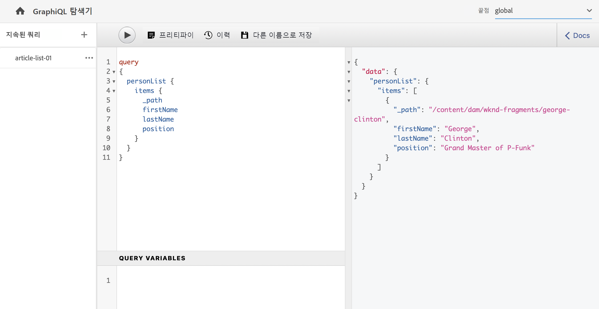
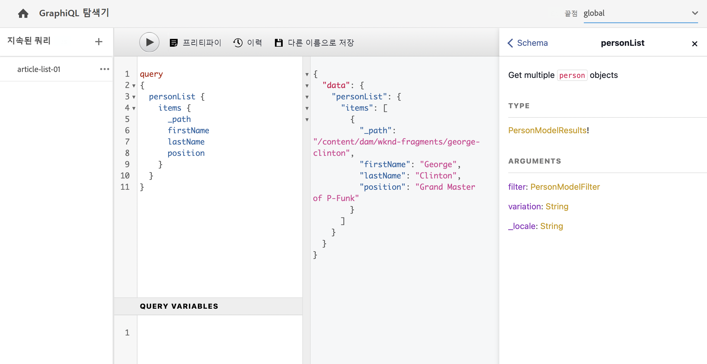

# API 요청 만들기 - 헤드리스 설정 {#accessing-delivering-content-fragments}

컨텐츠 조각 컨텐츠 및 AEM Assets REST API를 헤드리스 게재로 사용하여 컨텐츠 조각을 관리하는 방법을 알아봅니다.

## GraphQL 및 Assets REST API란 무엇입니까? {#what-are-the-apis}

[이제 일부 컨텐츠 조각을 생성했으므로,](create-content-fragment.md) AEM API를 사용하여 헤더없이 제공할 수 있습니다.

* [GraphQL API](/help/headless/graphql-api/content-fragments.md) 컨텐츠 조각에 액세스하고 전달할 요청을 만들 수 있습니다. 이 API는 컨텐츠 조각 컨텐츠를 쿼리 및 소비하기 위한 가장 강력한 기능 세트를 제공합니다.
   * 이걸 사용하려면 [엔드포인트는 AEM에서 정의하고 활성화해야 합니다](/help/headless/graphql-api/graphql-endpoint.md), 및 필요한 경우 [GraphiQL 인터페이스 설치](/help/headless/graphql-api/graphiql-ide.md).
* [자산 REST API](/help/assets/content-fragments/assets-api-content-fragments.md) 컨텐츠 조각(및 기타 자산)을 만들고 수정할 수 있습니다.

이 안내서의 나머지 부분은 GraphQL 액세스 및 컨텐츠 조각 전달에 중점을 둡니다.

## GraphQL 끝점 사용

GraphQL API를 사용하려면 GraphQL 엔드포인트를 만들어야 합니다.

1. 다음으로 이동 **도구**, **자산**&#x200B;를 선택하고 을 선택합니다. **GraphQL**.
1. **만들기**&#x200B;를 선택합니다.
1. 다음 **새 GraphQL 끝점 만들기** 대화 상자가 열립니다. 여기에서 다음을 지정할 수 있습니다.
   * **이름**: 끝점의 이름; 텍스트를 입력할 수 있습니다.
   * **GraphQL 스키마에서 제공되는 스키마 사용**: 드롭다운을 사용하여 필요한 구성을 선택합니다.
1. 다음으로 확인 **만들기**.
1. 콘솔에서 **경로** 이제 은 이전에 만든 구성에 따라 표시됩니다. GraphQL 쿼리를 실행하는 데 사용되는 경로입니다.

   ```
   /content/cq:graphql/<configuration-name>/endpoint
   ```

활성화에 대한 자세한 내용 [GraphQL 엔드포인트는 여기에서 찾을 수 있습니다](/help/headless/graphql-api/graphql-endpoint.md).

## GraphQL과 GraphQL을 사용하여 컨텐츠를 쿼리합니다

정보 설계자는 컨텐츠를 게재하기 위해 채널 종단점에 대한 쿼리를 설계해야 합니다. 이러한 쿼리는 일반적으로 모델당 종단점당 한 번만 고려되어야 합니다. 이 시작 안내서를 위해 작성만 하면 됩니다.

GraphiQL은 AEM 환경에 설치할 수 있는 IDE입니다. 다음 단계를 수행합니다 [GraphiQL IDE 사용](/help/headless/graphql-api/graphiql-ide.md) 를 입력하여 AEM 환경에 설치합니다.

1. AEM as a Cloud Service에 로그인하고 GraphiQL 인터페이스에 액세스합니다.
   * 예: `https://<host>:<port>/content/graphiql.html`.

1. GraphiQL IDE는 GraphQL에 대한 브라우저 내 쿼리 편집기입니다. 이 쿼리를 사용하여 콘텐츠 조각을 검색하여 JSON으로 헤더하여 제공할 수 있습니다.
   * 왼쪽 패널에서 쿼리를 작성할 수 있습니다.
   * 오른쪽 패널에 결과가 표시됩니다.
   * 쿼리 편집기는 쿼리를 쉽게 실행할 수 있는 코드 완료와 핫키를 제공합니다.
      

1. 우리가 만든 모델이 호출되었다고 가정합니다 `person` 필드 사용 `firstName`, `lastName`, 및 `position`에서는 간단한 쿼리를 작성하여 컨텐츠 조각의 컨텐츠를 검색할 수 있습니다.

   ```text
   query 
   {
     personList {
       items {
         _path
         firstName
         lastName
         position
       }
     }
   }
   ```

1. 왼쪽 패널에 쿼리를 입력합니다.
   

1. 을(를) 클릭합니다. **쿼리 실행** 단추를 클릭하거나 `Ctrl-Enter` 핫키 및 결과가 오른쪽 패널에 JSON으로 표시됩니다.
   

1. 을(를) 클릭합니다. **문서** 페이지 오른쪽 상단에 링크를 클릭하여 컨텍스트 내 설명서를 표시하여 자신의 모델에 맞는 쿼리를 작성할 수 있습니다.
   

GraphQL은 특정 데이터 세트 또는 개별 데이터 객체뿐만 아니라 개체의 특정 요소, 중첩된 결과, 쿼리 변수에 대한 지원 등을 제공할 수 있는 구조화된 쿼리를 활성화합니다.

GraphQL은 반복 API 요청과 초과 전달을 방지할 수 있으며 대신 단일 API 쿼리에 대한 응답으로 렌더링하는 데 필요한 정확한 내용을 대량 게재할 수 있습니다. 결과 JSON을 사용하여 다른 사이트 또는 앱에 데이터를 제공할 수 있습니다.

## 다음 단계 {#next-steps}

맞습니다. 이제 AEM에서 헤드리스 컨텐츠 관리에 대한 기본 사항을 알 수 있습니다. 물론 사용 가능한 기능에 대한 포괄적인 이해를 위해 더 깊이 이해할 수 있는 리소스는 많습니다.

* **[컨텐츠 조각](/help/assets/content-fragments/content-fragments.md)** - 컨텐츠 조각 만들기 및 관리에 대한 자세한 내용
* **[AEM Assets HTTP API의 컨텐츠 조각 지원](/help/assets/content-fragments/assets-api-content-fragments.md)** - CRUD 작업(만들기, 읽기, 업데이트, 삭제)을 통해 HTTP API를 통해 직접 AEM 컨텐츠에 액세스하는 방법에 대한 자세한 내용
* **[GraphQL API](/help/headless/graphql-api/content-fragments.md)** - 컨텐츠 조각을 헤드리도록 제공하는 방법에 대한 자세한 내용
