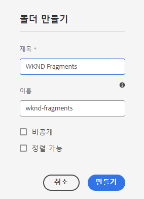

# 자산 폴더 만들기 - 헤드리스 설정 {#creating-an-assets-folder}

AEM 컨텐츠 조각 모델을 사용하여 헤드리스 컨텐츠의 기반인 컨텐츠 조각의 구조를 정의합니다. 그런 다음 컨텐츠 조각이 자산 폴더에 저장됩니다.

##  자산 폴더란? {#what-is-an-assets-folder}

[이제 컨텐츠 조각 모델을 생성했습니다](create-content-model.md) 향후 컨텐츠 조각에 사용할 구조를 정의하는 경우 일부 조각을 생성해도 매우 흥분될 수 있습니다.

하지만 먼저 저장할 자산 폴더를 만들어야 합니다.

자산 폴더는 [기존 컨텐츠 자산 구성](/help/assets/manage-digital-assets.md) 이미지 및 비디오와 컨텐츠 조각과 같습니다.

## 자산 폴더를 만드는 방법 {#how-to-create-an-assets-folder}

관리자는 컨텐츠 작성과 동시에 컨텐츠를 구성하기 위해 가끔 폴더를 만들어야 합니다. 이 시작 안내서를 사용하려면 하나의 폴더만 만들면 됩니다.

1. AEM as a Cloud Service에 로그인하고 기본 메뉴에서 를 선택합니다. **탐색 -> 자산 -> 파일**.
1. 탭 또는 클릭 **만들기 -> 폴더**.
1. 다음을 제공합니다. **제목** 그리고 **이름** 참조하십시오.
   * 다음 **제목** 설명적이어야 합니다.
   * 다음 **이름** 은 저장소의 노드 이름이 됩니다.
      * 제목에 따라 자동으로 생성되고 [AEM 이름 지정 규칙.](/help/implementing/developing/introduction/naming-conventions.md)
      * 필요하면 조정할 수 있다.

   
1. 마우스로 가리키고 확인 표시를 탭하여 방금 만든 폴더를 선택합니다. 그런 다음 을(를) 선택합니다 **속성** 도구 모음에서(또는 `p` [키보드 단축키.](/help/sites-cloud/authoring/getting-started/keyboard-shortcuts.md))
1. 에서 **속성** 창에서 **Cloud Services** 탭.
1. 대상 **클라우드 구성** 을(를) 선택합니다 [이전에 만든 구성입니다.](create-configuration.md)

   
1. 탭 또는 클릭 **저장 및 닫기**.
1. 탭 또는 클릭 **확인** 확인 창에서 클릭합니다.

   

방금 만든 폴더 내에서 추가 하위 폴더를 만들 수 있습니다. 하위 폴더는 **클라우드 구성** 상위 폴더에 배치합니다. 다른 구성에서 모델을 사용하려는 경우에는 이 값을 대체할 수 있습니다.

현지화된 사이트 구조를 사용하는 경우 다음을 수행할 수 있습니다 [언어 루트 만들기](/help/assets/translate-assets.md) 새 폴더 아래에 표시됩니다.

## 다음 단계 {#next-steps}

컨텐츠 조각용 폴더를 만들었으므로 이제 시작 안내서의 네 번째 부분으로 이동할 수 있습니다. [컨텐츠 조각을 만듭니다.](create-content-fragment.md)

>[!TIP]
>
>컨텐츠 조각 관리에 대한 자세한 내용은 [컨텐츠 조각 설명서](/help/assets/content-fragments/content-fragments.md)
