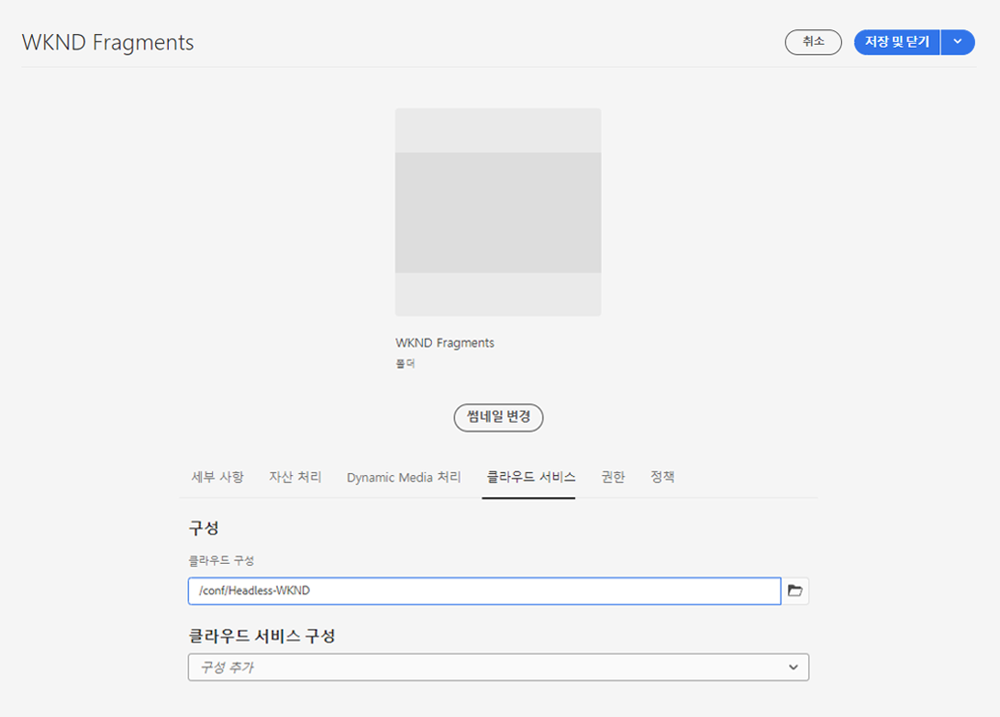

# 자산 폴더 만들기 - Headless 설정 {#creating-an-assets-folder}

AEM 콘텐츠 조각 모델을 사용하여 Headless 콘텐츠의 기반이 되는 콘텐츠 조각의 구조를 정의합니다. 그런 다음 콘텐츠 조각은 자산 폴더에 저장됩니다.

## 자산 폴더란 무엇입니까? {#what-is-an-assets-folder}

미래의 콘텐츠 조각을 위해 원하는 구조를 정의하는 [콘텐츠 조각 모델을 만들었으므로](create-content-model.md) 이제 일부 조각을 만들고 싶을 것입니다.

그러나 먼저 자산을 저장할 자산 폴더를 만들어야 합니다.

자산 폴더는 콘텐츠 조각 외에도 이미지 및 비디오와 같은 [기존 콘텐츠 자산](/help/assets/manage-digital-assets.md)을 구성하는 데 사용됩니다.

## 자산 폴더를 만드는 방법 {#how-to-create-an-assets-folder}

관리자는 콘텐츠가 만들어질 때 콘텐츠를 구성하기 위해 가끔씩만 폴더를 만들면 됩니다. 이 시작 안내서에서는 폴더를 하나만 만들면 됩니다.

1. AEM as a Cloud Service에 로그인하고 메인 메뉴에서 를 선택합니다. **탐색 > 에셋 > 파일**.
1. 선택 **만들기 > 폴더**.
1. 폴더의 **제목** 및 **이름**&#x200B;을 입력합니다.
   * **제목**&#x200B;은 설명적이어야 합니다.
   * **이름**&#x200B;은 저장소의 노드 이름이 됩니다.
      * 제목을 기반으로 자동 생성되고 [AEM 명명 규칙](/help/implementing/developing/introduction/naming-conventions.md)에 따라 조정됩니다.
      * 필요한 경우 조정할 수 있습니다.

   
1. 마우스를 가져간 후 확인 표시를 눌러 만든 폴더를 선택합니다. 그런 다음 도구 모음에서&#x200B;**속성**&#x200B;을 선택합니다(또는 `p` [키보드 단축키](/help/sites-cloud/authoring/sites-console/keyboard-shortcuts.md)사용).
1. **속성** 창에서 **Cloud Services** 탭을 선택합니다.
1. **클라우드 구성**&#x200B;의 경우 [이전에 생성한 구성](create-configuration.md)을 선택합니다.
   
1. **저장 후 닫기**&#x200B;를 선택합니다.
1. 선택 **확인** 확인 창에서 확인할 수 있습니다.

   

만든 폴더 내에 추가 하위 폴더를 만들 수 있습니다. 하위 폴더는 상위 폴더의 **클라우드 구성**&#x200B;을 상속합니다. 그러나 다른 구성의 모델을 사용하려는 경우 재정의할 수 있습니다.

현지화된 사이트 구조를 사용하는 경우 새 폴더 아래에 [언어 루트를 만들 수 있습니다](/help/assets/translate-assets.md).

## 다음 단계 {#next-steps}

콘텐츠 조각에 대한 폴더를 만들었으므로 이제 시작 안내서의 네 번째 부분으로 이동하여 [콘텐츠 조각을 만들 수 있습니다](create-content-fragment.md).

>[!TIP]
>
>콘텐츠 조각 관리에 대한 자세한 내용은 [콘텐츠 조각 설명서](/help/sites-cloud/administering/content-fragments/overview.md)를 참조하십시오.
