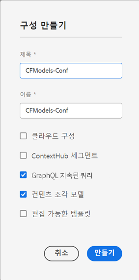

# 구성 만들기 - Headless 설정 {#creating-configuration}

AEM as a Cloud Service에서 Headless를 시작하는 첫 번째 단계로 구성을 만들어야 합니다.

## 구성이란? {#what-is-a-configuration}

구성 브라우저는 AEM의 구성에 대한 일반 구성 API, 콘텐츠 구조, 해결 메커니즘을 제공합니다.

AEM에서 Headless 콘텐츠 관리의 맥락에서 구성을 미래 콘텐츠 및 콘텐츠 조각의 구조를 정의하는 콘텐츠 모델을 만들 수 있는 AEM 내 작업 영역으로 생각하십시오. 이러한 모델들을 분리하기 위해 구성을 여러 개 가질 수 있습니다.

[전체 스택 AEM 구현의 페이지 템플릿](/help/sites-cloud/authoring/sites-console/templates.md)에 익숙하다면 콘텐츠 모델 관리를 위한 구성 사용법도 유사합니다.

## 구성을 만드는 방법 {#how-to-create-a-configuration}

관리자는 구성을 한 번만 만들면 되며, 매우 드물게 콘텐츠 모델을 구성하기 위해 새 작업 영역이 필요한 경우에 만들어야 합니다. 이 시작 안내서에서는 구성을 하나만 만들면 됩니다.

1. AEM as a Cloud Service에 로그인하고 메인 메뉴에서 를 선택합니다. **도구 > 일반 > 구성 브라우저**.
1. 구성의 **제목** 및 **이름**&#x200B;을 입력합니다.
   * **제목**&#x200B;은 설명적이어야 합니다.
   * **이름**&#x200B;은 저장소의 노드 이름이 됩니다.
      * 제목을 기반으로 자동 생성되고 [AEM 명명 규칙](/help/implementing/developing/introduction/naming-conventions.md)에 따라 조정됩니다.
      * 필요한 경우 조정할 수 있습니다.
1. 다음 옵션을 확인하십시오.
   * **콘텐츠 조각 모델**
   * **GraphQL 지속 쿼리**

   

1. 선택 **만들기**

필요한 경우 여러 구성을 만들 수 있습니다. 구성은 중첩될 수도 있습니다.

>[!NOTE]
>
>구현 요구 사항에 따라 **콘텐츠 조각 모델** 및 **GraphQL 지속 쿼리** 외에 구성 옵션이 필요할 수 있습니다.

## 다음 단계 {#next-steps}

이제 시작 안내서의 두 번째 부분으로 이동하여 이 구성을 사용해서 [콘텐츠 조각 모델을 만들 수 있습니다.](create-content-model.md)

>[!TIP]
>
>구성 브라우저에 대한 자세한 내용은 [구성 브라우저 설명서를 참조하십시오](/help/implementing/developing/introduction/configurations.md).
