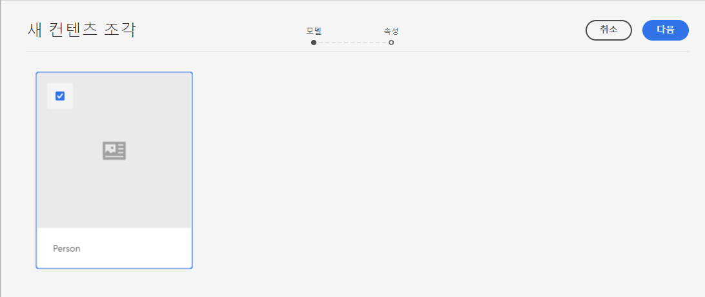
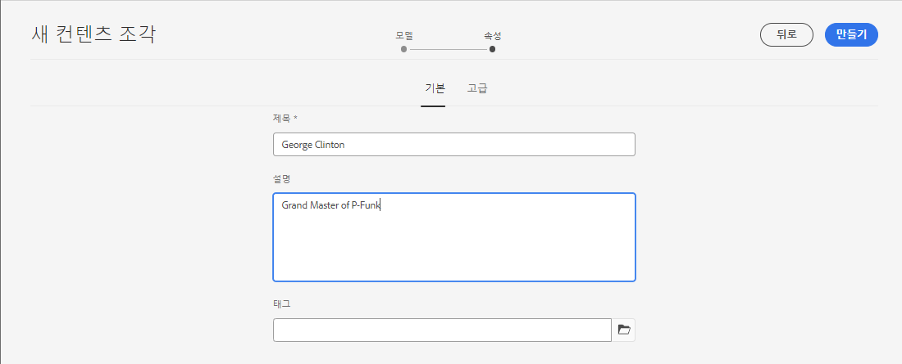
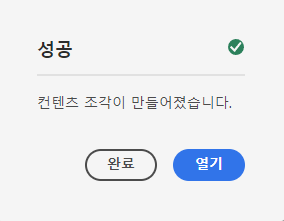
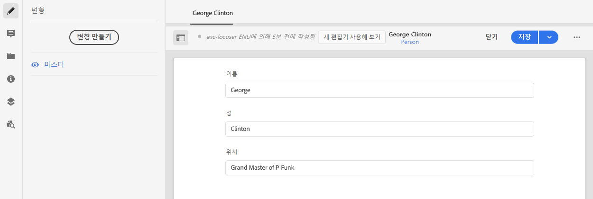

# 컨텐츠 조각 만들기 - 헤드리스 설정 {#creating-content-fragments}

AEM 컨텐츠 조각을 사용하여 헤드리스 전달을 위해 페이지에 구애받지 않고 컨텐츠를 디자인, 작성, 조정 및 사용하는 방법을 알아봅니다.

## 컨텐츠 조각이란? {#what-are-content-fragments}

[이제 자산 폴더를 생성했으므로](create-assets-folder.md) 컨텐츠 조각을 저장할 수 있는 위치에서 이제 조각을 만들 수 있습니다.

컨텐츠 조각을 사용하면 페이지에 구애받지 않고 컨텐츠를 디자인, 작성, 조정 및 게시할 수 있습니다. 이를 통해 여러 위치 및 여러 채널에서 사용할 수 있는 컨텐츠를 준비할 수 있습니다.

컨텐츠 조각은 구조화된 컨텐츠를 포함하며 JSON 형식으로 게재할 수 있습니다.

## 컨텐츠 조각을 만드는 방법 {#how-to-create-a-content-fragment}

컨텐츠 작성자는 작성하는 컨텐츠를 나타내는 컨텐츠 조각을 임의의 수만큼 만듭니다. 이것은 AEM에서 그들의 주요 임무가 될 것입니다. 이 시작 안내서를 위해 작성만 하면 됩니다.

1. AEM as a Cloud Service에 로그인하고 기본 메뉴에서 를 선택합니다. **탐색 -> 자산**.
1. 을(를) 탭하거나 클릭합니다 [이전에 만든 폴더입니다.](create-assets-folder.md)
1. 탭 또는 클릭 **만들기 -> 컨텐츠 조각**.
1. 컨텐츠 조각 만들기는 두 단계로 마법사로 표시됩니다. 먼저 컨텐츠 조각을 만드는 데 사용할 모델을 선택하고 을(를) 탭하거나 클릭합니다 **다음**.
   * 사용 가능한 모델은 [**클라우드 구성** 자산 폴더에 대해 정의한 경우](create-assets-folder.md) 컨텐츠 조각을 생성하는 위치.
   * 메시지를 받으면 `We could not find any models`, 자산 폴더의 구성을 확인합니다.

   
1. 다음을 제공합니다. **제목**, **설명**, 및 **태그** 필요한 경우 탭하거나 클릭합니다. **만들기**.

   
1. 탭 또는 클릭 **열기** 확인 창에서 클릭합니다.

   
1. 컨텐츠 조각 편집기에서 컨텐츠 조각의 세부 사항을 제공합니다.

   
1. 탭 또는 클릭 **저장** 또는  **저장 및 닫기**.

컨텐츠 조각은 다른 컨텐츠 조각을 참조할 수 있으므로 필요한 경우 중첩된 컨텐츠 구조를 사용할 수 있습니다.

컨텐츠 조각은 AEM에서 다른 자산을 참조할 수도 있습니다. [이러한 자산은 AEM에 저장해야 합니다](/help/assets/manage-digital-assets.md) 참조하는 컨텐츠 조각을 생성하기 전에

## 다음 단계 {#next-steps}

컨텐츠 조각을 만들었으므로 이제 시작 안내서의 최종 부분으로 이동할 수 있습니다. [컨텐츠 조각에 액세스하고 전달할 API 요청을 만듭니다.](create-api-request.md)

>[!TIP]
>
>컨텐츠 조각 관리에 대한 자세한 내용은 [컨텐츠 조각 설명서](/help/assets/content-fragments/content-fragments.md)
