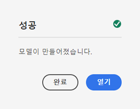
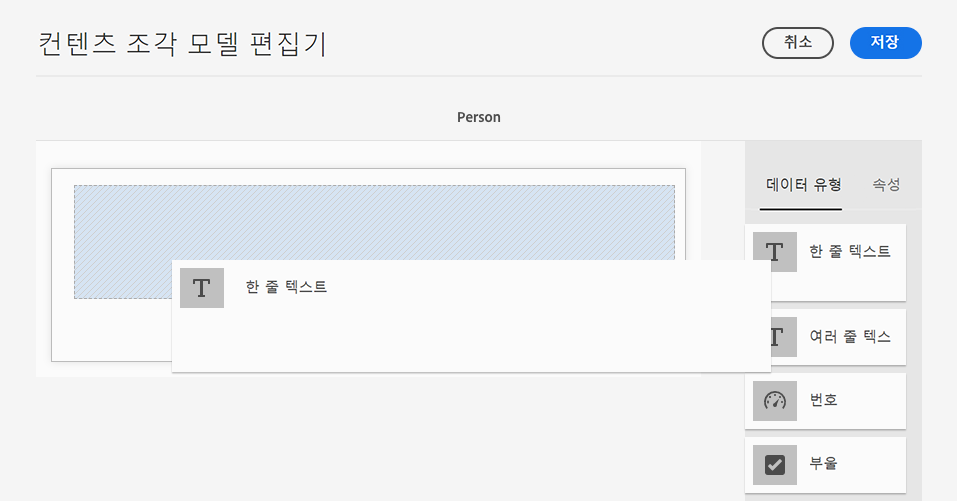
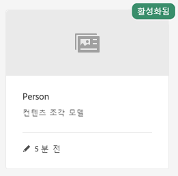

# 컨텐츠 조각 모델 만들기 - 헤드리스 설정 {#creating-content-fragment-models}

컨텐츠 조각 모델을 사용하여 만들고 AEM 헤드리스 기능을 사용하여 제공할 컨텐츠의 구조를 정의합니다.

## 컨텐츠 조각 모델이란 무엇입니까? {#what-are-content-fragment-models}

[이제 구성을 생성했으므로,](create-configuration.md) 이 조각을 사용하여 컨텐츠 조각 모델을 만들 수 있습니다.

컨텐츠 조각 모델은 AEM에서 만들고 관리할 데이터 및 컨텐츠의 구조를 정의합니다. 컨텐츠를 위한 일종의 스캐폴딩 역할을 합니다. 컨텐츠를 작성하도록 선택할 때 작성자가 정의한 컨텐츠 조각 모델에서 컨텐츠 생성을 안내하는 컨텐츠 조각 모델을 선택합니다.

## 컨텐츠 조각 모델을 만드는 방법 {#how-to-create-a-content-fragment-model}

정보 설계자는 새로운 모델이 필요하므로 이러한 작업을 산발적으로 수행합니다. 이 시작 안내서를 위해 모델을 하나만 만들어야 합니다.

1. AEM as a Cloud Service에 로그인하고 기본 메뉴에서 를 선택합니다. **도구 -> 자산 -> 컨텐츠 조각 모델**.
1. 구성을 만들어 만든 폴더를 탭하거나 클릭합니다.

   
1. **만들기**&#x200B;를 탭하거나 클릭합니다.
1. 다음을 제공합니다. **모델 제목**, **태그** 및 **설명**. 선택/선택 취소할 수도 있습니다 **모델 활성화** 생성 시 모델을 즉시 활성화할지 여부를 제어합니다.

   
1. 확인 창에서 을(를) 탭하거나 클릭합니다 **열기** 를 클릭하여 모델을 구성합니다.

   
1. 사용 **컨텐츠 조각 모델 편집기**&#x200B;에서 필드를 드래그하여 놓아 컨텐츠 조각 모델을 작성합니다 **데이터 유형** 열.

   

1. 필드를 배치하면 해당 속성을 구성해야 합니다. 편집기가 자동으로 **속성** 필수 필드를 제공할 수 있는 추가된 필드의 탭입니다.

   

1. 모델 빌드를 마치면 를 탭하거나 클릭합니다 **저장**.

1. 새로 만든 모델의 모드는 선택 여부에 따라 달라집니다 **모델 활성화** 모델을 생성할 때:
   * 선택됨 - 새 모델이 이미 **활성화됨**
   * 선택되지 않음 - 새 모델이 **초안** 모드

1. 아직 활성화되지 않은 경우 모델이 **활성화됨** 사용하기 위해서
   1. 방금 만든 모델을 선택한 다음 탭하거나 클릭합니다 **활성화**.

      
   1. 탭하거나 클릭하여 모델 활성화를 확인합니다 **활성화** 확인 대화 상자에서 확인할 수 있습니다.

      
1. 이제 모델이 활성화되고 사용할 준비가 되었습니다.

   

다음 **컨텐츠 조각 모델 편집기** 에서는 단순 텍스트 필드, 자산 참조, 다른 모델에 대한 참조 및 JSON 데이터 등 다양한 데이터 유형을 지원합니다.

여러 모델을 만들 수 있습니다. 모델은 다른 컨텐츠 조각을 참조할 수 있습니다. 사용 [구성](create-configuration.md) 모델을 정리하기 위해

## 다음 단계 {#next-steps}

이제 모델을 만들어 컨텐츠 조각의 구조를 정의했으므로 시작 안내서의 세 번째 부분으로 이동할 수 있습니다. [조각을 저장할 폴더를 만듭니다.](create-assets-folder.md)

>[!TIP]
>
>컨텐츠 조각 모델에 대한 전체 세부 사항은 다음을 참조하십시오. [컨텐츠 조각 모델 설명서](/help/assets/content-fragments/content-fragments-models.md)
