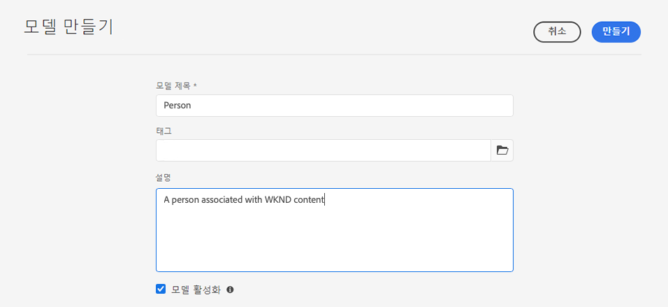
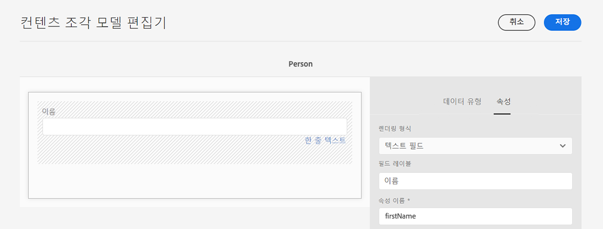
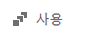
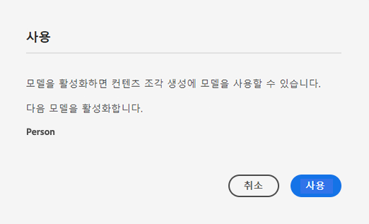

# 콘텐츠 조각 모델 만들기 - Headless 설정 {#creating-content-fragment-models}

콘텐츠 조각 모델을 사용하여 AEM의 Headless 기능으로 만들고 제공할 콘텐츠의 구조를 정의합니다.

## 콘텐츠 조각 모델이란 무엇입니까? {#what-are-content-fragment-models}

[구성을 만들었으므로](create-configuration.md) 이제 이를 사용하여 콘텐츠 조각 모델을 만들 수 있습니다.

콘텐츠 조각 모델은 AEM에서 만들고 관리할 데이터 및 콘텐츠의 구조를 정의합니다. 콘텐츠를 위한 일종의 스캐폴딩 역할을 합니다. 콘텐츠를 만들려는 작성자는 정의된 콘텐츠 조각 모델 중에서 콘텐츠를 만드는 데 도움이 되는 모델을 선택합니다.

## 콘텐츠 조각 모델을 만드는 방법 {#how-to-create-a-content-fragment-model}

정보 설계자는 새 모델이 필요할 때 가끔씩만 콘텐츠 조각 모델을 만듭니다. 이 시작 안내서에서는 모델을 하나만 만들면 됩니다.

1. AEM as a Cloud Service에 로그인하고 메인 메뉴에서 **도구**, **일반**, **콘텐츠 조각 모델**&#x200B;을 선택합니다.
1. 구성을 생성하여 만들어진 폴더를 탭하거나 클릭합니다.

   
1. **만들기**&#x200B;를 탭하거나 클릭합니다.
1. **모델 제목**, **태그** 및 **설명**&#x200B;을 입력합니다. 또한&#x200B;**모델 활성화**&#x200B;를 선택/선택 해제하여 모델을 만들 때 즉시 활성화할지 여부를 제어할 수 있습니다.

   
1. 확인 창에서 **열기**&#x200B;를 탭하거나 클릭하여 모델을 구성합니다.

   
1. **콘텐츠 조각 모델 편집기**&#x200B;를 사용하여 **데이터 형식** 열에서 필드를 끌어다 놓아 콘텐츠 조각 모델을 구축합니다.

   

1. 필드를 배치한 후에는 해당 속성을 구성해야 합니다. 필수 필드를 입력할 수 있는 추가된 필드의 **속성** 탭으로 편집기가 자동 전환됩니다.

   

1. 모델 구축이 끝나면 **저장**&#x200B;을 탭하거나 클릭합니다.

1. 새로 만든 모델의 모드는 모델을 만들 때 **모델 활성화**&#x200B;를 선택했는지 여부에 따라 달라집니다.
   * 선택됨 - 새 모델이 이미 **활성화됨** 상태입니다.
   * 선택되지 않음 - 새 모델이 **초안** 모드에서 만들어집니다.

1. 아직 활성화되지 않은 경우 모델을 사용하려면 **활성화됨** 상태여야 합니다.
   1. 방금 만든 모델을 선택한 다음 **활성화**&#x200B;를 탭하거나 클릭합니다.

      
   1. 확인 대화 상자에서 **활성화**&#x200B;를 탭하거나 클릭하여 모델 활성화를 확인합니다.

      
1. 모델이 이제 활성화되었으며 사용할 준비가 되었습니다.

   

**콘텐츠 조각 모델 편집기**&#x200B;는 간단한 텍스트 필드, 자산 참조, 다른 모델에 대한 참조 및 JSON 데이터와 같은 다양한 데이터 형식을 지원합니다.

여러 모델을 만들 수 있습니다. 모델은 다른 콘텐츠 조각을 참조할 수 있습니다. [구성](create-configuration.md)을 사용하여 모델을 구성합니다.

## 다음 단계 {#next-steps}

모델을 생성하여 콘텐츠 조각의 구조를 정의했으므로 이제 시작 안내서의 세 번째 부분으로 이동하여 [콘텐츠 조각 자체를 저장할 폴더를 만들 수 있습니다.](create-assets-folder.md)

>[!TIP]
>
>콘텐츠 조각 모델에 대한 자세한 내용은 [콘텐츠 조각 모델 설명서](/help/sites-cloud/administering/content-fragments/content-fragments-models.md)를 참조하십시오.
