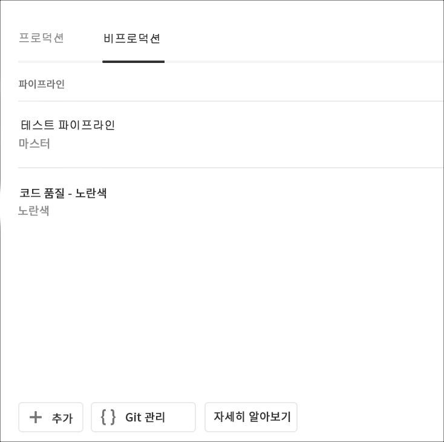
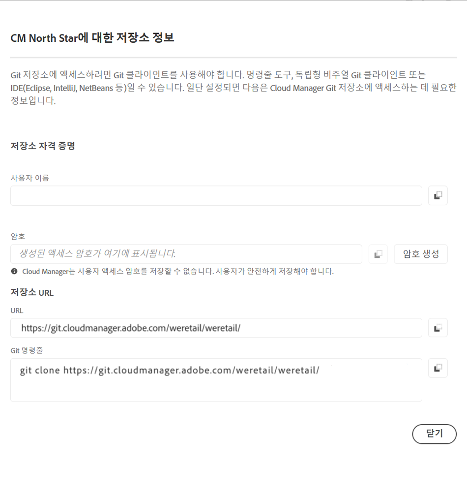

# Git 액세스 {#accessing-git}

Cloud Manager UI에서 셀프 서비스 Git 계정 관리를 사용하여 Git 리포지토리에 액세스하고 관리할 수 있습니다.

## 셀프서비스 Git 계정 관리 사용 {#self-service-git}

Cloud Manager UI에서 사용할 수 있는 **Git** 관리 단추를 사용하십시오. 이러한 단추는 파이프라인 카드에서 가장 중요합니다.

1. *프로그램의 개요* 페이지 및 파이프라인 카드로 이동합니다.

1. **Git** 관리 옵션을 보고 Git 리포지토리에 액세스하고 관리합니다.

   

   또한 **비프로덕션** 파이프라인 탭을 선택하는 경우 **Git** 관리 옵션도 표시됩니다.

   

>[!NOTE]
>**Git 관리** 옵션은 개발자 또는 배포 관리자 역할의 사용자에게 표시됩니다. 이 단추를 클릭하면 사용자 이름 및 암호와 함께 Cloud Manager Git 리포지토리에 대한 URL을 찾을 수 있는 대화 상자가 열립니다.

Cloud Manager에서 Git을 관리하는 중요한 고려 사항은 다음과 같습니다.

* **URL**:저장소 URL
* **사용자 이름**:사용자 이름
* **암호**:암호 생성 단추를  **클릭할** 때 표시되는 값입니다.

>[!NOTE]
>
>사용자는 코드 사본을 체크 아웃하고 로컬 코드 리포지토리에서 변경 작업을 수행할 수 있습니다. 준비가 완료된 사용자는 코드 변경 사항을 Cloud Manager의 원격 코드 리포지토리에 다시 커밋할 수 있습니다.
