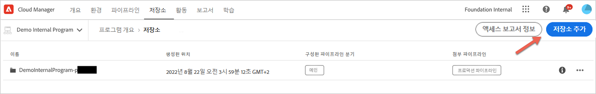
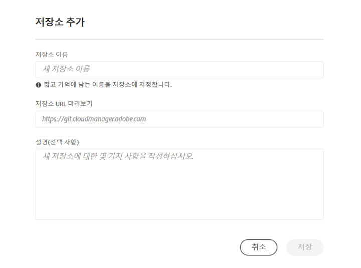
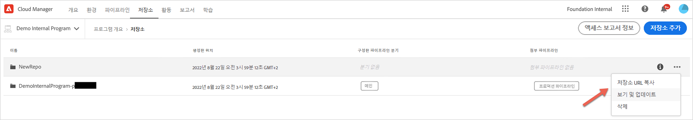

# Cloud Manager 저장소 {#cloud-manager-repos}

Cloud Manager에서 생성 및 사용 가능한 리포지토리는 저장소 페이지를 통해 보고 관리할 수 있습니다.

>[!NOTE]
>지정된 회사 또는 [Adobe의 Identity Management 시스템](https://experienceleague.adobe.com/docs/experience-manager-cloud-service/onboarding/onboarding-concepts/ims.html)에 있는 모든 프로그램에 대해 300개의 저장소가 제한됩니다.

## 저장소 추가 및 관리 {#add-manage-repos}

Cloud Manager에서 저장소를 보고 관리하려면 아래 단계를 따르십시오.

1. **프로그램 개요** 페이지에서 **저장소** 탭을 클릭하고 **저장소** 페이지로 이동합니다.

1. **저장소 추가**&#x200B;를 클릭하여 마법사를 시작합니다.

   >[!NOTE]
   >저장소를 추가하려면 배포 관리자 또는 비즈니스 소유자 역할의 사용자가 로그인해야 합니다.

   


1. 원하는 이름과 설명을 입력하고 **저장**&#x200B;을 클릭합니다.

   

1. **저장**&#x200B;을 선택합니다. 새로 만든 보고서가 아래와 같이 표에 표시됩니다. Cloud Manager에서 만든 리포지토리는 추가 또는 편집 단계 중에 선택할 수도 있습니다. 자세한 내용은 [CI-CD 파이프라인 구성](https://experienceleague.adobe.com/docs/experience-manager-cloud-service/implementing/using-cloud-manager/configure-pipeline.html?lang=en) 을 참조하십시오.

   >[!NOTE]
   >지정된 파이프라인에 대한 단일 *기본* 저장소 또는 분기가 있습니다. [Git 하위 모듈 지원](#git-submodule-support)을 사용하면 많은 보조 분기를 빌드 시간에 포함할 수 있습니다.

   

1. 아래 그림과 같이 리포지토리를 선택하고 테이블의 맨 오른쪽에 있는 메뉴 옵션을 클릭하여 **저장소 URL 복사**, **보기 및 업데이트** 또는 **저장소 삭제**&#x200B;를 클릭할 수 있습니다.

   


## Git 하위 모듈 지원 {#git-submodule-support}

Git 하위 모듈을 사용하여 빌드 시 Git 리포지토리에서 여러 분기의 콘텐츠를 병합할 수 있습니다. Cloud Manager의 빌드 프로세스가 실행되면 파이프라인에 대해 구성된 리포지토리를 복제하고 구성된 분기를 체크 아웃한 후 분기에 루트 디렉토리에 `.gitmodules` 파일이 있는 경우 명령이 실행됩니다.

```
$ git submodule update --init
```

이렇게 하면 각 하위 모듈이 해당 디렉토리에 체크 아웃됩니다. 이 기법은 Git 하위 모듈 사용에 익숙하고 외부 병합 프로세스를 관리하지 않으려는 조직의 경우 https://experienceleague.adobe.com/docs/experience-manager-cloud-service/implementing/managing-code/working-with-multiple-source-git-repositories.html에 대한 잠재적 대안입니다.

예를 들어, 각각 main 이라는 단일 분기를 포함하는 세 개의 리포지토리가 있다고 가정합니다. &quot;기본&quot; 저장소, 즉 파이프라인에 구성된 저장소에는 다른 두 저장소에 포함된 프로젝트를 선언하는 pom.xml 파일이 있습니다.

```xml
<?xml version="1.0" encoding="UTF-8"?>
<project xmlns="http://maven.apache.org/POM/4.0.0" xmlns:xsi="http://www.w3.org/2001/XMLSchema-instance"
    xsi:schemaLocation="http://maven.apache.org/POM/4.0.0 http://maven.apache.org/maven-v4_0_0.xsd">
    <modelVersion>4.0.0</modelVersion>
   
    <groupId>customer.group.id</groupId>
    <artifactId>customer-reactor</artifactId>
    <version>0.0.1-SNAPSHOT</version>
    <packaging>pom</packaging>
   
    <modules>
        <module>project-a</module>
        <module>project-b</module>
    </modules>
   
</project>
```

그런 다음 다른 두 저장소에 대한 하위 모듈을 추가합니다.

```
$ git submodule add -b main https://git.cloudmanager.adobe.com/ProgramName/projectA/ project-a
$ git submodule add -b main https://git.cloudmanager.adobe.com/ProgramName/projectB/ project-b
```

이렇게 하면 다음과 같은 `.gitmodules` 파일이 생성됩니다.

```
[submodule "project-a"]
    path = project-a
    url = https://git.cloudmanager.adobe.com/ProgramName/projectA/
    branch = main
[submodule "project-b"]
    path = project-b
    url = https://git.cloudmanager.adobe.com/ProgramName/projectB/
    branch = main
```

Git 하위 모듈에 대한 자세한 내용은 [Git 참조 설명서](https://git-scm.com/book/en/v2/Git-Tools-Submodules)에서 확인할 수 있습니다.

Git 하위 모듈을 사용할 때는 다음 사항에 유의하십시오.

* Git URL은 위에서 설명한 구문에서 정확히 일치해야 합니다. 보안상의 이유로 이러한 URL에 자격 증명을 포함하지 마십시오.
* 분기의 루트에 있는 하위 모듈만 지원됩니다.
* Git 하위 모듈 참조는 특정 Git 커밋에 저장됩니다. 따라서 하위 모듈 리포지토리를 변경할 때 예를 들어 `git submodule update --remote` 을 사용하여 커밋 참조 를 업데이트해야 합니다.

