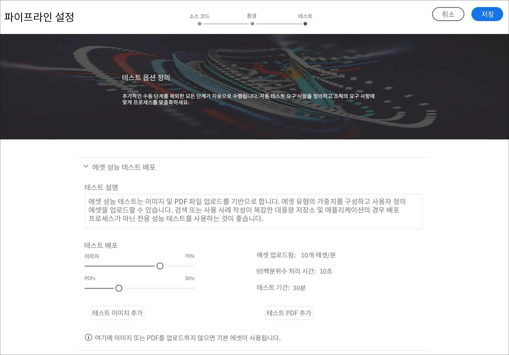
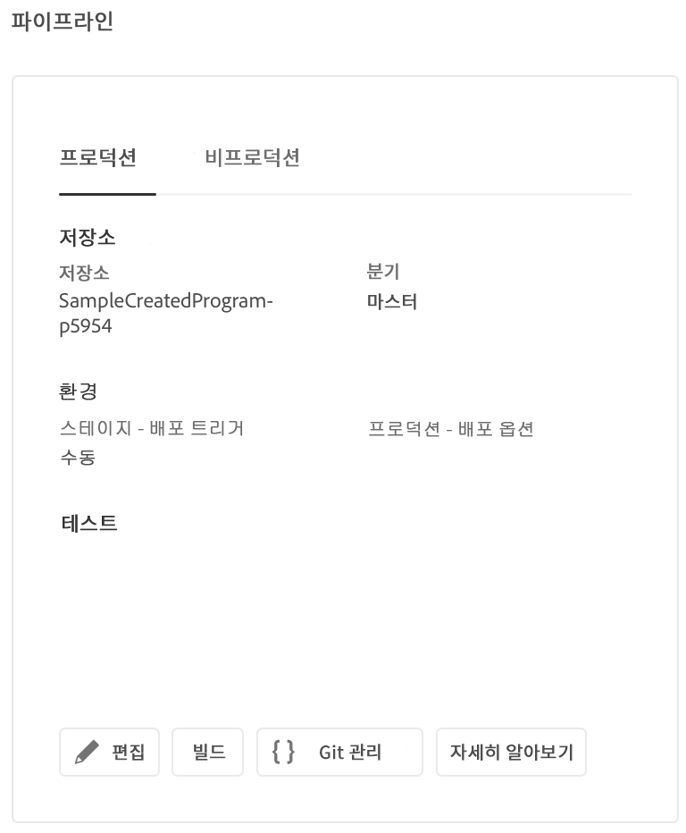

# CI-CD 파이프라인 구성 {#configure-ci-cd-pipeline}

## 흐름 이해 {#understanding-the-flow}

Cloud Manager UI의 **파이프라인 설정** 타일에서 파이프라인을 구성할 [!UICONTROL 수] 있습니다.

배포 관리자는 파이프라인을 설정할 책임이 있습니다. 그런 다음 먼저 **Git 리포지토리에서 분기를 선택합니다**.

파이프라인을 구성하려면 사용자가 다음을 수행해야 합니다.

* 파이프라인을 시작할 트리거를 정의합니다.
* 프로덕션 배포를 제어하는 매개 변수를 정의합니다.
* 성능 테스트 매개 변수를 구성합니다.

## 파이프라인 설정 {#setting-up-the-pipeline}

>[!CAUTION]
>
>하나의 프로그램 생성이 완료되고 Git 리포지토리에 최소 하나의 분기가 있을 때까지 파이프라인을 설정할 수 없습니다.

코드를 배포하기 전에 [!UICONTROL 클라우드 관리자에서 파이프라인 설정을 구성해야 합니다].

>[!NOTE]
>
>초기 설정 후 파이프라인 설정을 변경할 수 있습니다.

## 클라우드 관리자에서 파이프라인 설정 [!UICONTROL 구성] {#configuring-the-pipeline-settings-from-cloud-manager}

프로그램을 설정하고 [!UICONTROL Cloud Manager] UI를 사용하는 환경이 하나 이상 있으면 배포 파이프라인을 설정할 준비가 됩니다.

다음 단계에 따라 파이프라인에 대한 동작 및 환경 설정을 구성합니다.

1. 파이프라인 **설정(Setup Pipeline** )을 클릭하여 파이프라인을 설정하고 구성합니다.

   

1. 파이프라인 **설정** 화면이 표시됩니다. Select the branch and click **Next**.

   

1. 배포 옵션을 구성합니다.

   

   트리거를 정의하여 파이프라인을 시작할 수 있습니다.

   * **수동** - UI를 사용하여 파이프라인을 수동으로 시작합니다.
   * **Git 변경** 시 - 구성된 git 분기에 커밋이 추가될 때마다 CI/CD 파이프라인을 시작합니다. 이 옵션을 선택하더라도 항상 수동으로 파이프라인을 시작할 수 있습니다.

   파이프라인 설정 또는 편집 중에, 품질 게이트에서 중요한 오류가 발생하는 경우 배포 관리자에서 파이프라인 동작을 정의할 수 있습니다.

   이 기능은 보다 자동화된 프로세스를 원하는 고객에게 유용합니다. 사용 가능한 옵션은 다음과 같습니다.

   * **항상** 묻기 - 기본 설정이며 중요한 오류에 대해 수동으로 개입해야 합니다.
   * **즉시** 실패 - 이 옵션을 선택하면 중요 오류가 발생할 때마다 파이프라인이 취소됩니다. 이는 기본적으로 사용자가 각 실패를 수동으로 거부하는 것으로 요약됩니다.
   * **즉시** 계속 - 이 옵션을 선택하면 중요 오류가 발생할 때마다 파이프라인이 자동으로 진행됩니다. 이는 기본적으로 사용자가 각 실패를 수동으로 승인하는 것입니다.

1. 프로덕션 파이프라인 설정에는 컨텐츠 감사로 레이블이 지정된 세 번째 탭이 **포함됩니다**.

   이 옵션은 컨텐츠 감사에 항상 포함되어야 하는 URL 경로에 대한 표를 제공합니다. 사용자는 포함할 URL 경로를 수동으로 입력할 수 있습니다. 최대 25개의 행을 포함할 수 있습니다. 이 섹션에 사용자가 제출한 페이지가 없는 경우 사이트의 홈 페이지가 기본적으로 컨텐츠 감사에 포함됩니다.

   >[!NOTE]
   > 구성된 페이지는 서비스에 전송되어 성능, 접근성, SEO(검색 엔진 최적화), 우수 사례 및 PWA(점진적 웹 앱) 테스트에 따라 평가됩니다.

   자세한 내용은 [컨텐츠 감사 결과](/help/implementing/developing/introduction/understand-test-results.md#content-audit-testing) 이해를 참조하십시오.

   

1. **저장**&#x200B;을 클릭합니다. 이제 *개요* 페이지에 프로그램 **배포** 카드가 표시됩니다. 프로그램 **을** 배포하려면 [배포] 단추를 클릭합니다.

   

## 비프로덕션 및 코드 품질 전용 파이프라인

스테이지와 프로덕션에 배포되는 기본 파이프라인 외에도, 고객은 비프로덕션 파이프라인이라고 하는 추가 파이프라인 **을 설정할 수 있습니다**. 이러한 파이프라인은 항상 빌드 및 코드 품질 단계를 실행합니다. 선택적으로 Adobe Managed Services 환경에 배포할 수도 있습니다.

홈 화면에서 이러한 파이프라인이 새 카드에 나열됩니다.

1. Cloud **Manager 홈 화면에서 비프로덕션 파이프라인** 타일에 액세스합니다.

   

1. [ **추가** ] 단추를 클릭하여 파이프라인 이름, 파이프라인 유형 및 Git 분기를 지정합니다.

   또한 파이프라인 옵션에서 배포 트리거 및 중요 실패 동작을 설정할 수도 있습니다.

   

1. 저장을 **클릭하면** 파이프라인이 홈 화면의 카드에 다음과 같이 세 가지 작업이 표시됩니다.

   

   * **편집** - 파이프라인 설정을 편집할 수 있습니다.
   * **빌드** - 파이프라인을 실행할 수 있는 실행 페이지로 이동합니다.
   * **Git** 관리 - 사용자는 Cloud Manager Git 리포지토리에 액세스하는 데 필요한 정보를 얻을 수 있습니다.

## 다음 단계 {#the-next-steps}

파이프라인을 구성한 후에는 코드를 배포해야 합니다.

자세한 내용은 [코드](deploy-code.md) 배포를 참조하십시오.
