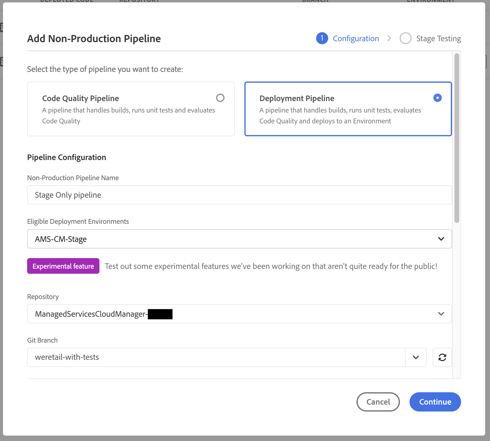

# 스테이징 전용 및 프로덕션 전용 파이프라인 {#stage-prod-only}

전용 파이프라인을 사용하여 스테이징 및 프로덕션 배포를 분할하는 방법에 대해 알아보십시오.

>[!NOTE]
>
>이 기능은 [얼리 어답터 프로그램](/help/implementing/cloud-manager/release-notes/current.md#early-adoption)에만 사용할 수 있습니다.

## 개요 {#overview}

스테이징 환경과 프로덕션 환경은 긴밀하게 결합되어 있습니다. 기본적으로 이에 대한 배포는 단일 파이프라인에 연결됩니다. 이는 해당 프로그램의 스테이징 환경과 프로덕션 환경 모두에 배포되는 배포 파이프라인입니다. 이 결합은 일반적으로 적합하지만 단점이 있는 특정 사용 사례가 있습니다.

* 스테이징 전용에 배포하려면 파이프라인에서 **프로덕션으로 승격** 단계를 거부해야만 이 작업을 수행할 수 있습니다. 그러나 실행은 취소된 것으로 표시됩니다.
* 스테이징 환경에서 최신 코드를 프로덕션에 배포하려면 코드가 변경되지 않았더라도 스테이징 배포를 포함한 전체 파이프라인을 다시 배포해야 합니다.
* 배포 중에는 환경을 업데이트할 수 없으므로 프로덕션으로 승격하기 전에 스테이징 환경에서 며칠 동안 일시 중지하고 테스트하려는 경우 프로덕션 환경을 업데이트할 수 없습니다. 이로 인해 [환경 변수](/help/implementing/cloud-manager/getting-access-to-aem-in-cloud/build-environment-details.md#environment-variables) 업데이트와 같은 비의존적인 작업이 불가능합니다.

스테이징 전용 및 프로덕션 전용 파이프라인은 전용 배포 옵션을 제공하여 이러한 사용 사례에 대한 솔루션을 제공합니다.

* **스테이징 전용 파이프라인**&#x200B;은 배포 및 테스트가 완료되면 실행이 완료된 스테이징 환경에만 배포됩니다.
   * 스테이징 전용 파이프라인은 표준 결합 풀 스택 프로덕션 파이프라인과 동일하게 작동하지만 프로덕션 배포 단계(승인, 예약, 배포)는 수행하지 않습니다.
* **프로덕션 전용 배포 파이프라인**&#x200B;은 프로덕션 환경에만 배포되며, 이 옵션을 사용하여 스테이징에서 성공적으로 완료되고 검증된 실행을 선택하고 해당 아티팩트를 프로덕션에 배포합니다.
   * 프로덕션 전용 파이프라인은 구축 단계를 건너뛰고 스테이징 배포의 아티팩트를 재사용합니다.

전체 스택 프로덕션 파이프라인이 실행되는 동안에는 스테이징 전용 파이프라인이나 프로덕션 전용 파이프라인이 실행되지 않으며 그 반대의 경우도 마찬가지입니다. 단계 전용 및 전체 스택 프로덕션 파이프라인 모두 **Git 변경 시** 트리거가 구성되며 동일한 분기 및 저장소를 가리키는 경우 단계 전용 파이프라인만 자동으로 시작됩니다. 프로덕션 전용 파이프라인은 저장소에 직접 연결되지 않으므로 **Git 변경 시** 시작되지 않습니다.

이러한 전용 파이프라인은 보다 유연한 기능을 제공하지만, 작동 및 권장 사항에 대한 다음 세부 정보를 참고하십시오.

## 제한 사항 {#limitations}

프로덕션 전용 파이프라인은 그 동안 표준 결합 프로덕션 파이프라인을 통해 스테이징에 배포된 항목에 관계없이 항상 스테이징 전용 파이프라인의 아티팩트를 사용합니다.

* 이로 인해 원치 않는 코드 롤백이 발생할 수 있습니다.
* Adobe에서는 프로덕션 전용 파이프라인과 스테이징 전용 파이프라인을 사용하기 시작한 후에는 표준 결합 프로덕션 파이프라인 사용을 중지할 것을 권장합니다.
* 여전히 표준 결합 파이프라인과 스테이징/프로덕션 전용 파이프라인을 모두 실행하려는 경우 코드 롤백을 방지하기 위해 아티팩트를 재사용하는 것을 염두에 두어야 합니다.

## 알려진 문제 {#known-issues}

이 기능의 테스트를 시작하기 전에 다음 알려진 문제점도 알아 두십시오.

* 프로덕션 전용 파이프라인을 사용하면 최신 AEM 업데이트를 활용할 수 없습니다
   * 경우에 따라 AEM 업데이트 프로세스는 코드를 전체 스택 파이프라인을 통해 마지막으로 배포된 코드로 되돌릴 수 있습니다.
* 프로덕션 전용 또는 스테이징 전용 파이프라인을 사용하는 경우 [환경 복원](/help/operations/restore.md#offsite-backup)을 요청할 수 없습니다.

## 파이프라인 만들기 {#pipeline-creation}

프로덕션 전용 및 스테이징 전용 파이프라인은 표준 결합 [프로덕션 파이프라인](/help/implementing/cloud-manager/configuring-pipelines/configuring-production-pipelines.md) 및 [비프로덕션 파이프라인](/help/implementing/cloud-manager/configuring-pipelines/configuring-non-production-pipelines.md)과 유사한 방식으로 생성됩니다. 자세한 내용은 해당 문서를 참조하십시오.

1. **파이프라인** 창에서 **파이프라인 추가**&#x200B;를 클릭합니다.

   * 스테이징 전용 파이프라인을 만들려면 **비프로덕션 파이프라인 추가**&#x200B;를 선택합니다.
   * 프로덕션 전용 파이프라인을 만들려면 **프로덕션 전용 파이프라인 추가**&#x200B;를 선택합니다.

   

>[!NOTE]
>
>해당 파이프라인이 이미 있다면 특정 옵션이 회색으로 표시될 수 있습니다.
>
>* 스테이징 전용 파이프라인이 아직 없으면 **프로덕션 전용 파이프라인 추가**&#x200B;를 사용할 수 없습니다.
>* 표준 결합 파이프라인이 이미 있으면 **프로덕션 파이프라인 추가**&#x200B;를 사용할 수 없습니다.
>* 프로그램당 하나의 프로덕션 전용 파이프라인과 하나의 스테이징 전용 파이프라인만 허용됩니다.

### 스테이징 전용 파이프라인 {#stage-only}

1. **비프로덕션 파이프라인 추가** 옵션을 선택하면 **비프로덕션 파이프라인 추가** 대화상자가 열립니다.
1. 스테이징 전용 파이프라인을 만들려면 파이프라인의 **적합한 배포 환경** 필드에서 스테이징 환경을 선택합니다. 나머지 필드를 완료하고 **계속**&#x200B;을 클릭합니다.

   

1. **스테이징 테스트** 탭에서 스테이징 환경에서 수행해야 하는 테스트를 정의할 수 있습니다. **저장**&#x200B;을 탭하거나 클릭하여 새 파이프라인을 저장합니다.

### 프로덕션 전용 파이프라인 {#prod-only}

1. **프로덕션 전용 파이프라인 추가** 옵션을 선택하면 **프로덕션 전용 파이프라인 추가** 대화 상자가 열립니다.
1. **파이프라인 이름**&#x200B;을 입력합니다. 대화 상자의 나머지 옵션과 기능은 표준 결합 파이프라인 생성 대화 상자와 동일하게 작동합니다. **저장**&#x200B;을 클릭하여 파이프라인을 저장합니다.

## 프로덕션 전용 및 스테이징 전용 파이프라인 실행 {#running}

프로덕션 전용 파이프라인과 스테이징 전용 파이프라인은 [다른 모든 파이프라인이 실행되는 것](/help/implementing/cloud-manager/configuring-pipelines/managing-pipelines.md#running-pipelines)과 동일한 방식으로 실행됩니다. 자세한 내용은 이 문서를 참조하십시오.

또한 프로덕션 전용 파이프라인 실행은 스테이징 전용 파이프라인의 실행 세부 정보에서 직접 트리거될 수 있습니다.

### 스테이징 전용 파이프라인 {#stage-only-run}

스테이징 전용 파이프라인은 표준 결합 파이프라인과 거의 동일한 방식으로 실행됩니다. 그러나 실행 마지막의 테스트 단계가 끝나면 **빌드 프로모션** 버튼을 사용하여 이 실행으로 스테이징에 배포된 아티팩트를 사용하여 프로덕션에 배포하는 프로덕션 전용 파이프라인 실행을 시작할 수 있습니다.

**빌드 프로모션** 버튼은 최근에 성공한 스테이징 전용 파이프라인이 실행 중인 경우에만 나타납니다. 클릭하면 프로덕션 전용 파이프라인의 실행을 확인하거나 파이프라인이 없는 경우 프로덕션 전용 파이프라인을 생성하라는 메시지가 표시됩니다.

### 프로덕션 전용 파이프라인 {#prod-only-run}

프로덕션 전용 파이프라인의 경우 프로덕션에 배포할 소스 아티팩트를 식별하는 것이 중요합니다. 이러한 세부 정보는 **아티팩트 준비** 단계에서 확인할 수 있습니다. 해당 실행으로 이동하여 자세한 내용과 로그를 확인할 수 있습니다.

