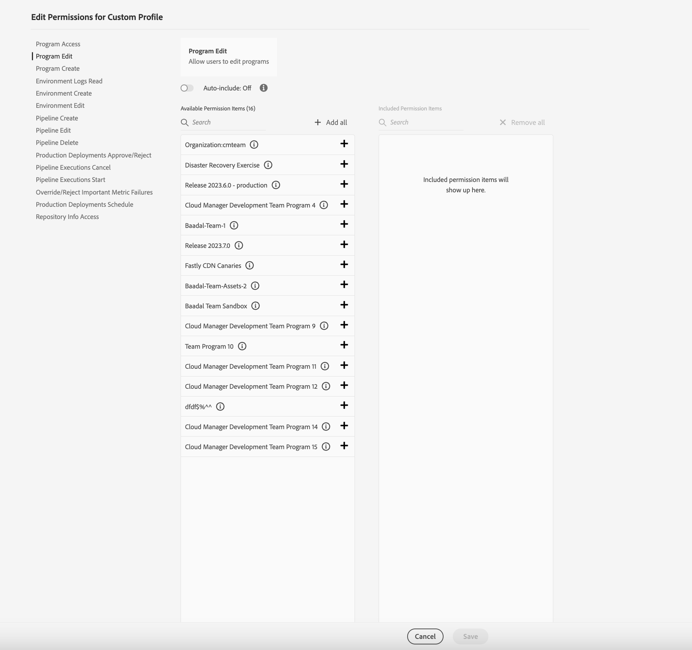

# 사용자 정의 권한 {#custom-permissions}

사용자 정의 권한을 사용하여 Cloud Manager 사용자의 프로그램, 파이프라인 및 환경에 대한 액세스를 제한하는 구성 가능한 권한으로 새 사용자 정의 권한 프로필을 만드는 방법에 대해 알아봅니다.

>[!NOTE]
>
>이 기능은 [얼리 어답터 프로그램](/help/implementing/cloud-manager/release-notes/current.md#early-adoption)에만 사용할 수 있습니다.

## 소개 {#introduction}

Cloud Manager에는 클라우드 관리자의 다양한 기능에 대한 액세스를 제어하는 미리 정의된 역할 세트가 있습니다.

* 비즈니스 소유자
* 프로그램 관리자
* 배포 관리자
* 개발자

사용자는 사용자 정의 권한을 사용하여 Cloud Manager 사용자가 프로그램, 파이프라인 및 환경에 대한 액세스를 제한하는 구성 가능한 권한으로 새 사용자 정의 권한 프로필을 만들 수 있습니다.

>[!TIP]
>
>사전 정의된 역할에 대한 자세한 내용은 문서를 참조하십시오 [AEM as a Cloud Service 팀 및 제품 프로필.](/help/onboarding/aem-cs-team-product-profiles.md)

## 사용자 정의 권한 사용 {#using}

자체 사용자 정의 권한을 만들고 사용하려면 다음 세 단계가 필요합니다.

1. [새 제품 프로필을 만듭니다.](#create)
1. [새 제품 프로필에 사용자 정의 권한을 할당합니다.](#assign-permissions)
1. [새 제품 프로필에 사용자를 할당합니다.](#assign-users)

이 섹션에서는 이러한 단계를 자세히 설명합니다. 자체 사용자 정의 권한을 만들 때 [용어](#terms) 및 [구성 가능한 권한](#configurable-permissions) 섹션을 참조하면 유용할 것입니다.

>[!NOTE]
>
>새 프로필을 만들고 Cloud Manager의 권한을 관리하려면 Adobe Experience Manager as a Cloud Service Admin Console에 제품 관리자 권한이 있어야 합니다.

### 새 제품 프로필 만들기 {#create}

먼저 사용자 정의 권한을 할당할 수 있는 새 제품 프로필을 만들어야 합니다.

1. [my.cloudmanager.adobe.com](https://my.cloudmanager.adobe.com/)에서 Cloud Manager에 로그인합니다.

1. Cloud Manager 랜딩 페이지에서 다음을 탭하거나 클릭합니다. **액세스 관리** 단추

1. 클라우드 관리자의 권한과 사용자를 관리할 수 있는 Admin Console의 **제품** 탭으로 리디렉션됩니다. Admin Console에서 **새 프로필** 버튼을 탭하거나 클릭합니다.

1. 프로필에 대한 일반적인 세부 정보를 제공합니다.

   * **제품 프로필 이름** - 프로필의 설명적인 이름
   * **표시 이름** - UI에 표시되는 축약된 이름(옵션)
   * **설명** - 목적을 설명하는 프로필에 대한 유용한 설명(옵션)
   * **이메일로 사용자에게 알림** - 선택하면 사용자가 이 프로필에 추가되거나 제거될 때 이메일로 알림을 받게 됩니다.

1. 완료되면 **저장**&#x200B;을 탭하거나 클릭합니다.

새 제품 프로필이 저장되고 Admin Console의 제품 프로필 목록에 표시됩니다.

### 프로필에 사용자 정의 권한 할당 {#assign-permissions}

새 제품 프로필이 있으므로 해당 프로필에 사용자 정의 권한을 할당할 수 있습니다.

1. Admin Console에서 [방금 만든 새 제품 프로필](#create)의 이름을 탭하거나 클릭합니다.

1. 창이 열리면 **권한** 탭을 선택하여 편집 가능한 권한 목록을 봅니다.

   

1. 을(를) 탭하거나 클릭합니다 **편집** 편집할 수 있는 권한의 링크입니다.

1. **권한 편집** 창이 열립니다.
   * 이전 단계에서 선택한 권한이 왼쪽 열에서 선택됩니다.
   * 권한 할당에 사용할 수 있는 권한 항목은 **사용 가능한 권한** 항목이라고 지정된 중간 열에 있습니다.
   * 할당된 권한 항목은 **포함된 권한 항목**&#x200B;이라고 지정된 오른쪽 열에 있습니다.

   

1. 권한 항목 옆의 더하기(`+`) 아이콘을 탭하거나 클릭하여 **포함된 권한 항목** 열에 추가합니다.

   * 자세히 알아보려면 권한 항목 옆의 `i` 아이콘을 탭하거나 클릭합니다.

1. 모든 권한을 추가하려면 **사용 가능한 권한** 열의 상단에 있는 **모두 추가** 버튼을 탭하거나 클릭합니다.

1. 프로필에 항상 모든 권한 항목이 있어야 하는 경우 **자동 포함** 옵션을 선택합니다.

   * **날짜** - 모든 현재 권한 항목 및 향후 권한 항목이 포함된 권한 항목으로 이동되고 저장 시 그에 따라 적용할 수 있습니다.
   * **끔** - 모든 권한 항목이 사용 가능한 권한 항목으로 다시 이동되고 저장 시 그에 따라 적용할 수 있습니다.

1. 새 제품 프로필에 대한 권한 항목 정의가 완료되면 **저장**&#x200B;을 탭하거나 클릭합니다.

이제 새 제품 프로필이 사용자 정의 권한과 함께 저장되었습니다.

### 사용자 정의 권한에 사용자 할당 {#assign-users}

이제 사용자 정의 권한으로 만든 새 제품 프로필에 사용자를 할당할 수 있습니다.

1. Admin Console에서 [방금 사용자 정의 권한을 할당한 새 제품 프로필](#assign-permissions)의 이름을 탭하거나 클릭합니다.

1. 창이 열리면 **사용자** 탭을 선택합니다.

1. **사용자 추가** 버튼을 탭하거나 클릭하고 사용자 정의 권한이 있는 새 제품 프로필에 사용자를 할당합니다.

Admin Console을 사용하는 방법에 대한 자세한 내용은 [기업 사용자의 제품 프로필 관리](https://helpx.adobe.com/kr/enterprise/using/manage-product-profiles.html) 문서의 **제품 프로필에 사용자 및 사용자 그룹 추가** 섹션을 참조하십시오.

## 구성 가능한 권한 {#configurable-permissions}

사용자 정의 프로필을 만들기 위해 다음 권한을 사용할 수 있습니다.

| 권한 | 설명 |
|---|---|
| 프로그램 제작 | 사용자가 새 프로그램을 만들 수 있도록 허용 |
| 프로그램 액세스 | 사용자가 프로그램에 액세스하도록 허용 |
| 프로그램 편집 | 사용자가 프로그램을 편집하도록 허용 |
| 환경 만들기 | 사용자가 새 환경을 만들 수 있도록 허용 |
| 환경 편집 | 사용자가 환경을 업데이트하고 편집할 수 있도록 허용 |
| 환경 로그 읽기 | 사용자가 환경 로그를 읽을 수 있도록 허용 |
| 파이프라인 만들기 | 사용자가 새 파이프라인을 만들도록 허용 |
| 파이프라인 삭제 | 사용자가 파이프라인을 삭제하도록 허용 |
| 파이프라인 편집 | 사용자가 파이프라인을 편집하도록 허용 |
| 프로덕션 배포 승인/거부 | 사용자가 프로덕션 배포 단계를 승인하거나 거부하도록 허용 |
| 파이프라인 실행 취소 | 사용자가 파이프라인 실행을 취소하도록 허용 |
| 파이프라인 실행 시작 | 사용자가 새 파이프라인 실행을 시작하도록 허용 |
| 중요한 지표 오류 재정의/거부 | 사용자가 중요한 지표 오류를 재정의/거부하도록 허용 |
| 프로덕션 배포 예약 | 사용자가 프로덕션 배포 단계를 예약하도록 허용 |
| 저장소 정보 액세스 | 사용자가 저장소 정보에 액세스하고 액세스 암호를 생성하도록 허용 |

### 조직 수준의 권한 {#organization-level}

조직 수준의 권한은 조직의 모든 프로그램에 항상 부여되는 권한을 의미합니다.

다음 권한은 조직 수준의 권한입니다.

* **프로그램 제작** - 이 권한을 사용하면 사용자가 조직에서 새 프로그램을 만들 수 있습니다.
* **저장소 정보 액세스** 사용자는 이 테넌트/조직 수준의 권한을 통해 고객 프로젝트에 액세스하고 기여하기 위한 사용자 이름, 암호 및 저장소 URL을 생성할 수 있습니다.
   * 저장소 액세스를 위한 사용자 이름과 암호는 조직의 모든 저장소에서 공통이지만, 저장소 URL은 프로그램마다 고유합니다.
   * 문서를 참조하십시오. [저장소 액세스](/help/implementing/cloud-manager/managing-code/accessing-repos.md) 추가 정보.

## 용어 {#terms}

다음 용어는 사용자 정의 권한과 미리 정의된 역할을 생성하고 관리하는 데 사용됩니다.

| 용어 | 설명 |
|---|---|
| 미리 정의된 권한 | **비즈니스 소유자**, **배포 관리자** 등의 미리 정의된 역할 Cloud Manager의 다양한 기능을 관리합니다. 사전 정의된 역할에 대한 자세한 내용은 문서를 참조하십시오 [AEM as a Cloud Service 팀 및 제품 프로필.](/help/onboarding/aem-cs-team-product-profiles.md) |
| 사용자 정의 권한 | 사용자가 권한 프로필을 만들어서 지원되는 Cloud Manager 기능을 관리하는 역할을 정의할 수 있는 Cloud Manager 기능 |
| 제품 프로필 | 권한 프로필의 일부인 사용자에게 적용할 수 있는 구성 가능한 권한을 관리하기 위해 Admin Console에 만듭니다. |
| 구성 가능한 권한 | 권한 프로필에서 구성할 수 있는 클라우드 관리자 권한 |
| 권한 항목 | 권한을 적용할 수 있는 프로그램, 환경 또는 파이프라인 리소스 |

권한 항목은 권한이 적용되는 범위를 나타냅니다. 일반적으로 다음 중 하나입니다.

| 권한 항목 유형 | 예 | 설명 |
|---|---|---|
| 조직 | 조직: 회사 A | 조직에 적용 가능한 모든 리소스입니다. 리소스는 프로그램, 환경 또는 파이프라인이 될 수 있습니다. 사용자가 권한을 위해 조직을 추가하면 해당 조직의 모든 새 리소스에도 해당 권한이 부여됩니다. |
| 프로그램 | 프로그램 A | 프로그램의 적용 가능한 모든 리소스 |
| 환경 | 프로그램 A: 환경 | 특정 환경에 적용 가능 |
| 파이프라인 | 프로그램 A: 파이프라인 | 특정 파이프라인에 적용 가능 |

## 제한 사항 {#limitations}

사용자 지정 권한을 사용할 때는 다음 제한 사항을 염두에 두십시오.

* 사용자 지정 권한 프로필에는 권한을 구성하는 동안 AMS 프로그램, 환경 및 파이프라인도 나열됩니다.
* 프로그램, 환경, 파이프라인 등과 같은 리소스 Cloud Manager에서 만든 항목은 권한 구성을 위해 Admin Console에 표시되는 데 2분 정도 걸릴 수 있습니다.
* 사용자 정의 권한 서비스가 응답하지 않는 드문 시나리오에서 미리 정의된 프로필을 계속 사용할 수 있으며 미리 정의된 프로필의 사용자는 여전히 적절한 액세스 권한을 갖습니다.

## 자주 묻는 질문 {#faq}

### 미리 정의된 권한 프로필은 어떤 권한 프로필입니까?

* 비즈니스 소유자
* 프로그램 관리자
* 배포 관리자
* 개발자

사전 정의된 역할에 대한 자세한 내용은 문서를 참조하십시오 [AEM as a Cloud Service 팀 및 제품 프로필.](/help/onboarding/aem-cs-team-product-profiles.md)

### 사용자 정의 프로필이 도입되면 미리 정의된 권한 프로필은 어떻게 됩니까?

기본 제품 프로필과 클라우드 관리자 역할은 이전과 동일하게 계속 작동합니다.

### 미리 정의된 권한 프로필을 편집할 수 있습니까?

아니요, 기본 프로필은 편집할 수 없습니다. 기본 권한 프로필에는 권한을 추가하거나 제거할 수 없습니다. 미리 정의된 프로필에서만 사용자를 추가하거나 제거할 수 있습니다.

### 이제 사용자 정의 프로필을 사용할 수 있으므로 미리 정의된 권한 프로필을 삭제해야 합니까?

미리 정의된 권한 프로필은 Admin Console에서 삭제하면 안 됩니다.

### 여러 권한 프로필에 사용자를 추가할 수 있습니까?

예, 사용자는 미리 정의된 권한 프로필과 사용자 정의 권한 프로필을 포함한 여러 프로필의 일부가 될 수 있습니다. 사용자가 여러 프로필에 할당되면 할당된 모든 권한 프로필의 결합된 권한이 해당 사용자에게 제공됩니다.

### 사용자에게 환경/파이프라인을 편집할 수 있는 권한이 있지만 해당 환경/파이프라인이 포함된 프로그램에 대한 액세스 권한이 없으면 어떻게 됩니까?

이 경우 환경 또는 파이프라인을 포함하는 **프로그램 액세스** 권한이 없으면 사용자는 환경 또는 파이프라인에 액세스할 수 없습니다.
