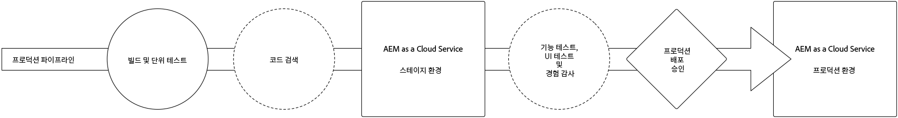
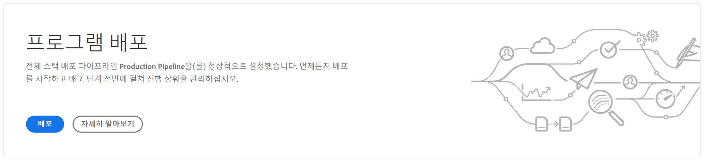
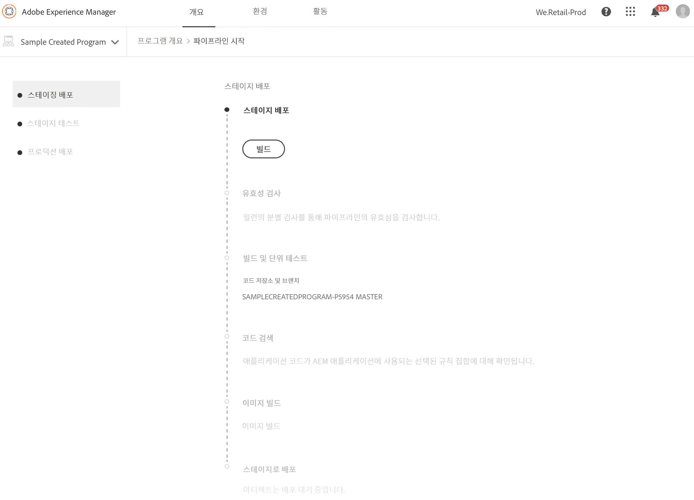
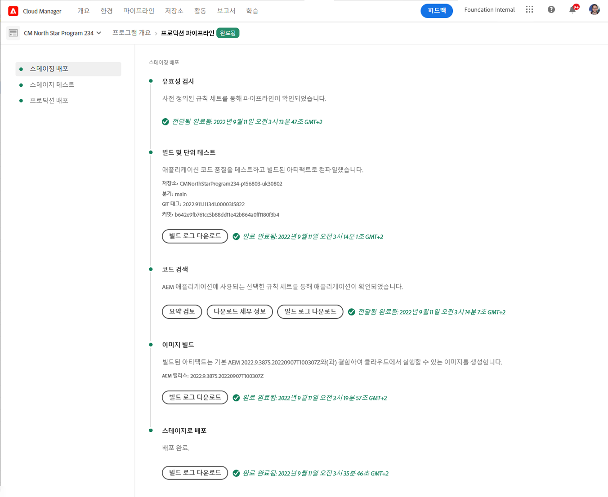
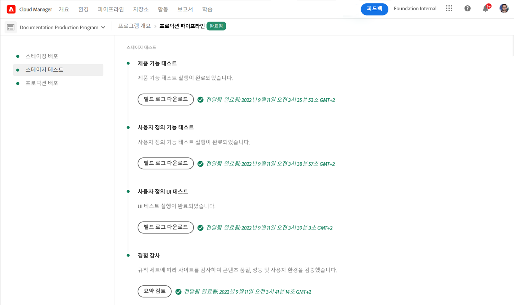
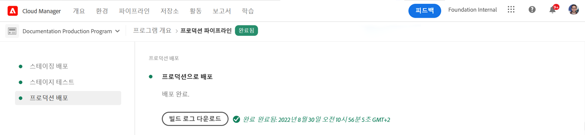
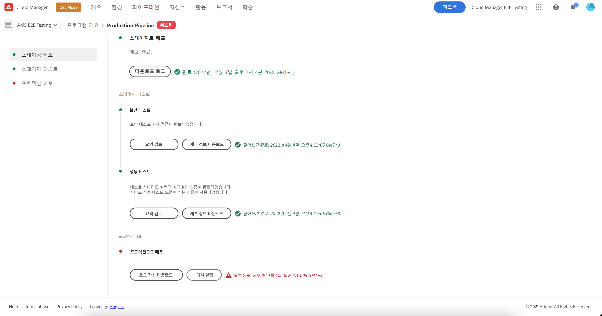

# 코드 배포 {#deploy-your-code}

AEM as a Cloud Service에서 Cloud Manager 파이프라인을 사용하여 프로덕션에 코드를 배포하는 방법에 대해 알아봅니다.



코드를 스테이지에 원활하게 배포한 다음 프로덕션 파이프라인을 통해 프로덕션까지 배포합니다. 프로덕션 파이프라인 실행은 두 가지 논리적 단계로 나뉩니다.

1. 스테이징 환경에 배포
   * 코드는 자동화된 기능 테스트, UI 테스트, 경험 감사 및 UAT(사용자 승인 테스트)를 위해 스테이징 환경에 구축 및 배포됩니다.
1. 프로덕션 환경에 배포
   * 빌드가 스테이지에서 검증되고 프로덕션으로의 승격이 승인되면 동일한 빌드 아티팩트가 프로덕션 환경에 배포됩니다.

_전체 스택 코드 파이프라인 유형만 코드 스캔, 기능 테스트, UI 테스트 및 경험 감사를 지원합니다._

## AEM as a Cloud Service에서 Cloud Manager를 사용하여 코드 배포 {#deploying-code-with-cloud-manager}

저장소, 환경 및 테스트 환경을 포함하여 [프로덕션 파이프라인을 구성](/help/implementing/cloud-manager/configuring-pipelines/configuring-production-pipelines.md)했으면 코드를 배포할 준비가 된 것입니다.

1. [my.cloudmanager.adobe.com](https://my.cloudmanager.adobe.com/)에서 Cloud Manager에 로그인한 다음 적절한 조직을 선택합니다.

1. 다음에서 **[내 프로그램](/help/implementing/cloud-manager/getting-access-to-aem-in-cloud/editing-programs.md#my-programs)** 코드를 배포할 프로그램을 화면, 탭 또는 클릭합니다.

1. **개요** 화면의 콜 투 액션에서 **배포**&#x200B;를 클릭하여 배포 프로세스를 시작합니다.

   

1. **파이프라인 실행** 화면이 표시됩니다. **빌드**&#x200B;를 클릭하여 프로세스를 시작합니다.

   

빌드 프로세스는 세 단계를 통해 코드를 배포합니다.

1. [스테이지 배포](#stage-deployment)
1. [스테이지 테스트](#stage-testing)
1. [프로덕션 배포](#production-deployment)

>[!TIP]
>
>테스트 기준에 대한 로그를 보거나 결과를 검토하여 다양한 배포 프로세스의 단계를 검토할 수 있습니다.

## 스테이지 배포 단계 {#stage-deployment}

**스테이지 배포** 단계는 다음과 같이 진행됩니다.

* **유효성 검사** - 이 단계에서는 파이프라인이 현재 사용 가능한 리소스를 사용하도록 구성되었는지 확인합니다. 예를 들어 구성된 분기가 존재하고 환경이 사용 가능한지를 테스트합니다.
* **빌드 및 단위 테스트** - 이 단계는 컨테이너화된 빌드 프로세스를 실행합니다.
   * 빌드 환경에 대한 자세한 내용은 [빌드 환경 세부 정보](/help/implementing/cloud-manager/getting-access-to-aem-in-cloud/build-environment-details.md)를 참조하십시오.
* **코드 스캔** - 이 단계에서는 애플리케이션 코드의 품질을 평가합니다.
   * 테스트 프로세스에 대한 자세한 내용은 [코드 품질 테스트](/help/implementing/cloud-manager/code-quality-testing.md)를 참조하십시오.
* **이미지 빌드** - 이 프로세스는 빌드 단계에서 생성된 콘텐츠 및 Dispatcher 패키지를 도커 이미지 및 Kubernetes 구성으로 변환하는 역할을 합니다.
* **스테이지에 배포** - [스테이지 테스트 단계](#stage-testing)를 준비하기 위해 이미지가 스테이징 환경에 배포됩니다.



## 스테이지 테스트 단계 {#stage-testing}

**스테이지 테스트** 단계는 다음과 같이 진행됩니다.

* **제품 기능 테스트** - Cloud Manager 파이프라인이 스테이징 환경에 대해 실행되는 테스트를 실행합니다.
   * 자세한 내용은 [제품 기능 테스트](/help/implementing/cloud-manager/functional-testing.md#product-functional-testing)를 참조하십시오.

* **사용자 정의 기능 테스트** - 파이프라인의 이 단계는 항상 실행되며 건너뛸 수 없습니다. 빌드에서 테스트 JAR이 생성되지 않으면 기본적으로 테스트가 통과합니다.
   * 자세한 내용은 [사용자 정의 기능 테스트](/help/implementing/cloud-manager/functional-testing.md#custom-functional-testing)를 참조하십시오.

* **사용자 정의 UI 테스트** - 이 단계는 사용자 정의 애플리케이션에 대해 만들어진 UI 테스트를 자동으로 실행하는 선택적 기능입니다.
   * UI 테스트는 언어 및 프레임워크(예: Java 및 Maven, Node 및 WebDriver.io 또는 Selenium을 기반으로 구축된 기타 프레임워크 및 기술)에서 다양한 선택을 허용하도록 도커 이미지에 패키징된 Selenium 기반 테스트입니다.
   * 자세한 내용을 보려면 [사용자 정의 UI 테스트](/help/implementing/cloud-manager/functional-testing.md#custom-ui-testing)를 참조하십시오.

* **경험 감사** - 파이프라인의 이 단계는 항상 실행되며 건너뛸 수 없습니다. 프로덕션 파이프라인이 실행되면 검사를 실행할 사용자 정의 기능 테스트 후에 경험 감사 단계가 포함됩니다.
   * 구성된 페이지는 서비스에 제출되고 평가됩니다.
   * 결과는 정보 제공용이며 점수, 현재 점수와 이전 점수 간의 변화를 보여 줍니다.
   * 이 인사이트는 현재 배포에 도입될 회귀가 있는지 확인하는 데 유용합니다.
   * 자세한 내용은 [경험 감사 결과 이해](/help/implementing/cloud-manager/experience-audit-testing.md)를 참조하십시오.



## 프로덕션 배포 단계 {#deployment-production}

프로덕션 토폴로지에 배포하는 프로세스는 방문자가 AEM 사이트에 미치는 영향을 최소화하기 위해 약간 달라집니다.

프로덕션 배포는 일반적으로 이전에 설명한 것과 동일한 단계를 따르지만 롤링 방식으로 수행됩니다.

1. AEM 패키지를 작성자에게 배포합니다.
1. 로드 밸런서에서 dispatcher1을 분리합니다.
1. AEM 패키지를 publish1에 배포하고 Dispatcher 패키지를 dispatcher1에 배포하고 Dispatcher 캐시를 플러시합니다.
1. dispatcher1을 로드 밸런서에 다시 넣습니다.
1. dispatcher1이 다시 작동하면 로드 밸런서에서 dispatcher2를 분리합니다.
1. AEM 패키지를 publish2에 배포하고 Dispatcher 패키지를 dispatcher2에 배포하고 Dispatcher 캐시를 플러시합니다.
1. dispatcher2를 로드 밸런서에 다시 넣습니다.

이 프로세스는 배포가 토폴로지의 모든 게시자 및 dispatcher에 도달할 때까지 계속됩니다.



## 시간 초과 {#timeouts}

다음 단계는 사용자 피드백을 기다리는 동안 시간이 초과됩니다.

| 단계 | 시간 초과 |
|--- |--- |
| 코드 품질 테스트 | 14일 |
| 보안 테스트 | 14일 |
| 성능 테스트 | 14일 |
| 승인 신청 | 14일 |
| 프로덕션 배포 예약 | 14일 |
| CSE 지원 | 14일 |

## 배포 프로세스 {#deployment-process}

모든 Cloud Service 배포는 롤링 프로세스를 통해 가동 중지 없이 구현됩니다. 자세한 내용은 [롤링 배포 작동 방식](/help/implementing/deploying/overview.md#how-rolling-deployments-work)을 참조하십시오.

>[!NOTE]
>
>Dispatcher 캐시는 배포할 때마다 지워집니다. 새 게시 노드가 트래픽을 허용하기 전에 캐시를 지우고 나서 준비합니다.

## 프로덕션 배포 재실행 {#reexecute-deployment}

드문 경우지만 일시적인 이유로 프로덕션 배포 단계에 실패할 수 있습니다. 이러한 경우 완료 유형(예: 취소 또는 실패)에 관계없이 프로덕션 배포 단계가 완료된 한 프로덕션 배포 단계의 재실행이 지원됩니다. 재실행은 세 단계로 구성된 동일한 파이프라인을 사용하여 새 실행을 만듭니다.

1. 유효성 검사 단계 - 기본적으로 일반 파이프라인 실행 중에 발생하는 유효성 검사와 동일합니다.
1. 빌드 단계 - 재실행의 맥락에서 빌드 단계는 실제로 새 빌드 프로세스를 실행하는 것이 아니라 아티팩트를 복사하는 것입니다.
1. 프로덕션 배포 단계 - 일반 파이프라인 실행에서 프로덕션 배포 단계와 동일한 구성 및 옵션을 사용합니다.

재실행이 가능한 상황에서 프로덕션 파이프라인 상태 페이지는 일반적인 **빌드 로그 다운로드** 옵션 옆에 **재실행** 옵션을 제공합니다.



>[!NOTE]
>
>재실행에서 빌드 단계는 재빌드가 아니라 아티팩트를 복사하는 것임을 나타내기 위해 UI에 레이블이 지정됩니다.

### 제한 사항 {#limitations}

* 프로덕션 배포 단계를 다시 실행하는 것은 마지막 실행에 대해서만 가능합니다.
* 푸시 업데이트 실행은 재실행이 불가능합니다.
   * 마지막 실행이 푸시 업데이트 실행인 경우 재실행이 불가능합니다.
* 프로덕션 배포 단계 이전의 어느 시점에서 마지막 실행이 실패한 경우 재실행이 불가능합니다.

### 재실행 API {#reexecute-API}

UI에서 사용할 수 있을 뿐만 아니라 [cloud Manager API](https://developer.adobe.com/experience-cloud/cloud-manager/reference/api/#tag/Pipeline-Execution) 재실행을 트리거하고 재실행으로 트리거된 실행을 식별합니다.

#### 재실행 트리거 {#reexecute-deployment-api}

재실행을 트리거하려면 프로덕션 배포 단계 상태에서 HAL 링크(`https://ns.adobe.com/adobecloud/rel/pipeline/reExecute`)에 대해 PUT 요청을 수행해야 합니다.

* 이 링크가 있으면 해당 단계에서 재실행할 수 있습니다.
* 이 링크가 없으면 해당 단계에서 재실행할 수 없습니다.

이 링크는 프로덕션 배포 단계에서만 사용할 수 있습니다.

```JavaScript
 {
  "_links": {
    "https://ns.adobe.com/adobecloud/rel/pipeline/logs": {
      "href": "/api/program/4/pipeline/1/execution/953671/phase/1575676/step/2983530/logs",
      "templated": false
    },
    "https://ns.adobe.com/adobecloud/rel/pipeline/reExecute": {
      "href": "/api/program/4/pipeline/1/execution?stepId=2983530",
      "templated": false
    },
    "https://ns.adobe.com/adobecloud/rel/pipeline/metrics": {
      "href": "/api/program/4/pipeline/1/execution/953671/phase/1575676/step/2983530/metrics",
      "templated": false
    },
    "self": {
      "href": "/api/program/4/pipeline/1/execution/953671/phase/1575676/step/2983530",
      "templated": false
    }
  },
  "id": "6187842",
  "stepId": "2983530",
  "phaseId": "1575676",
  "action": "deploy",
  "environment": "weretail-global-b75-prod",
  "environmentType": "prod",
  "environmentId": "59254",
  "startedAt": "2022-01-20T14:47:41.247+0000",
  "finishedAt": "2022-01-20T15:06:19.885+0000",
  "updatedAt": "2022-01-20T15:06:20.803+0000",
  "details": {
  },
  "status": "FINISHED"
```

HAL 링크의 href 값 구문은 예시일 뿐입니다. 실제 값은 항상 HAL 링크에서 읽어야 하며 생성되지 않아야 합니다.

이 엔드포인트에 PUT 요청을 제출하면 성공 시 201 응답이 발생하고 응답 본문은 새 실행을 나타냅니다. 이는 API를 통해 일반 실행을 시작하는 것과 유사합니다.

#### 재실행 식별 {#identify-reexecution}

재실행된 실행은 `trigger` 필드의 `RE_EXECUTE` 값으로 식별할 수 있습니다.
