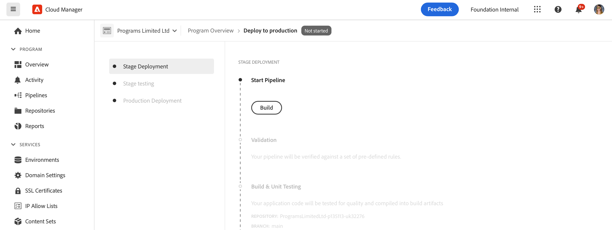

# 코드 배포 {#deploy-your-code}

## Cloud Manager를 사용하여 코드 배포 {#deploying-code-with-cloud-manager}

프로덕션 파이프라인(저장소, 환경 및 테스트 환경)을 구성하면 코드를 배포할 준비가 됩니다.

1. 클라우드 **관리자에서 배포를** 클릭하여 배포 프로세스를 시작합니다.

   

1. 파이프라인 **실행** 화면이 표시됩니다.

   작성 **을** 클릭하여 프로세스를 시작합니다.

   

1. 전체 빌드 프로세스는 코드를 배포합니다.

   다음 단계는 빌드 프로세스에 관련되어 있습니다.

   1. 스테이지 배포
   1. 스테이지 테스트
   1. 프로덕션 배포

   >[!NOTE]
   >
   >또한 로그를 보거나 결과를 검토하여 테스트 기준에 대한 다양한 배포 프로세스의 단계를 검토할 수 있습니다.

   단계 **배포에는**&#x200B;다음 단계가 포함됩니다.

   * 유효성 검사:이 단계에서는 파이프라인이 현재 사용 가능한 리소스를 사용하도록 구성되어 있는지 확인합니다. 예를 들어 구성된 분기가 있고 환경을 사용할 수 있습니다.
   * 빌드 및 단위 테스트:이 단계에서는 포함된 빌드 프로세스가 실행됩니다. 빌드 [환경에 대한 자세한 내용은](/help/onboarding/getting-access-to-aem-in-cloud/creating-aem-application-project.md#build-environment-details) 빌드 환경 세부 정보를 참조하십시오.
   * 코드 스캔:이 단계에서는 애플리케이션 코드의 품질을 평가합니다. 테스트 프로세스에 대한 자세한 내용은 [코드](/help/implementing/cloud-manager/code-quality-testing.md) 품질 테스트를 참조하십시오.
   * 이미지 빌드:이 단계에는 이미지를 만드는 데 사용되는 프로세스의 로그 파일이 있습니다. 이 프로세스는 빌드 단계에서 생성된 컨텐츠 및 디스패처 패키지를 Docker 이미지 및 Kubernetes 구성으로 변환해야 합니다.
   * 스테이지에 배포

      
   단계 **테스트에는**&#x200B;다음 단계가 포함됩니다.

   * 제품 기능 테스트:Cloud Manager 파이프라인 실행은 스테이지 환경에 대해 실행되는 테스트 실행을 지원합니다.
자세한 내용은 [제품 기능 테스트를](/help/implementing/cloud-manager/functional-testing.md#product-functional-testing) 참조하십시오.

   * 사용자 지정 기능 테스트:파이프라인의 이 단계는 항상 존재하며 건너뛸 수 없습니다. 그러나 빌드로 생성된 테스트 JAR가 없으면 기본적으로 테스트가 전달됩니다.\
      자세한 내용은 [맞춤형 기능 테스트를](/help/implementing/cloud-manager/functional-testing.md#custom-functional-testing) 참조하십시오.

   * 컨텐츠 감사:파이프라인의 이 단계는 항상 존재하며 건너뛸 수 없습니다. 프로덕션 파이프라인이 실행되면 검사를 실행하는 사용자 정의 기능 테스트 후에 컨텐츠 감사 단계가 포함됩니다. 구성된 페이지는 서비스로 전송되어 평가됩니다. 이 결과는 정보 제공용이며 사용자가 현재 점수와 이전 점수 사이의 점수 및 변경 사항을 볼 수 있도록 합니다. 이러한 통찰력은 현재 배포에서 발생하는 회귀 여부를 확인하는 데 유용합니다.
자세한 내용은 [컨텐츠 감사 결과](/help/implementing/cloud-manager/content-audit-testing.md) 이해를 참조하십시오.

      

## 배포 프로세스 {#deployment-process}

다음 섹션에서는 AEM 및 발송자 패키지가 단계 및 제작 단계에서 배포되는 방법에 대해 설명합니다.

Cloud Manager는 빌드 프로세스에서 생성된 모든 대상/*.zip 파일을 스토리지 위치에 업로드합니다.  이러한 가공물은 파이프라인의 배포 단계 동안 이 위치에서 검색됩니다.

Cloud Manager가 비프로덕션 토폴로지에 배포되는 경우, 가능한 한 빨리 배포를 완료하여 다음과 같이 모든 노드에 객체를 동시에 배포합니다.

1. Cloud Manager는 각 아티팩트가 AEM 또는 디스패처 패키지인지 여부를 결정합니다.
1. Cloud Manager는 배포 중 환경을 격리하기 위해 로드 밸런서에서 모든 디스패처를 제거합니다.

   별도로 구성되어 있지 않는 한, 개발 및 스테이지 배포에서 로드 밸런서 변경 사항을 건너뛸 수 있습니다. 즉, 비프로덕션 파이프라인, 개발 환경 및 프로덕션 파이프라인의 단계들을 분리하고 스테이지환경에 적용할 수 있습니다.

   >[!NOTE]
   >
   >이 기능은 1-1-1 고객이 주로 사용하는 것으로 예상됩니다.

1. 각 AEM 아티팩트는 패키지 관리자 API를 통해 각 AEM 인스턴스에 배포되며, 패키지 종속성이 배포 순서를 결정합니다.

   패키지를 사용하여 새 기능을 설치하고, 인스턴스 간에 컨텐츠를 전송하고, 저장소 컨텐츠를 백업하는 방법에 대한 자세한 내용은 패키지를 사용한 작업 방법을 참조하십시오.

   >[!NOTE]
   >
   >모든 AEM 아티팩트는 작성자와 발행자 모두에 배포됩니다. 런타임 모드는 노드별 구성이 필요할 때 활용되어야 합니다. 런타임 모드를 사용하여 특정 목적을 위해 AEM 인스턴스를 조정하는 방법에 대한 자세한 내용은 실행 모드를 참조하십시오.

1. 발송자 아티팩트는 다음과 같이 각 디스패처에 배포됩니다.

   1. 현재 구성이 백업되어 임시 위치에 복사됩니다.
   1. 변경할 수 없는 파일을 제외하고 모든 구성이 삭제됩니다. 자세한 내용은 발송자 구성 관리를 참조하십시오. 이렇게 하면 고아 파일이 남아 있지 않도록 디렉토리를 지웁니다.
   1. 아티팩트가 `httpd` 디렉토리에 추출됩니다.  변경 불가능한 파일은 덮어쓰지 않습니다. 배포 시 git 저장소에서 변경할 수 없는 파일을 변경하면 변경 사항이 무시됩니다.  이러한 파일은 AMS 디스패처 프레임워크의 핵심이므로 변경할 수 없습니다.
   1. Apache가 구성 테스트를 수행합니다. 오류가 없으면 서비스가 다시 로드됩니다. 오류가 발생하면 구성이 백업에서 복원되고 서비스가 다시 로드되며 오류가 다시 Cloud Manager에 보고됩니다.
   1. 파이프라인 구성에 지정된 각 경로는 디스패처 캐시에서 무효화되거나 플러시됩니다.

   >[!NOTE]
   >
   >Cloud Manager에서는 디스패처 아티팩트에 전체 파일 세트가 들어 있어야 합니다.  모든 발송자 구성 파일이 git 리포지토리에 있어야 합니다. 파일 또는 폴더가 누락되면 배포에 실패합니다.

1. 모든 AEM 및 발송자 패키지를 모든 노드에 성공적으로 배포하면 디스패처가 로드 밸런서에 다시 추가되고 배포가 완료됩니다.

   >[!NOTE]
   >
   >개발 및 스테이지 배포에서는 로드 밸런서 변경 사항을 건너뛸 수 있습니다. 즉, 비프로덕션 파이프라인, 개발자 환경, 프로덕션 파이프라인 등의 단계들을 분리하거나 연결할 수 있습니다.

### 제작 단계 배포 {#deployment-production-phase}

AEM 사이트 방문자에 대한 영향을 최소화하기 위해 프로덕션 토폴로지에 배포하는 프로세스는 약간 다릅니다.

프로덕션 배포는 일반적으로 위와 동일한 단계를 따르지만 롤링 방식으로 수행됩니다.

1. 제작자에게 AEM 패키지 배포
1. 부하 균형 조정기에서 dispatcher1을 분리합니다.
1. AEM 패키지를 배포하여 publish1 및 디스패처 패키지를 dispatcher1, flush 디스패처 캐시를 배포합니다.
1. dispatcher1을 로드 밸런서에 다시 넣습니다.
1. dispatcher1이 다시 서비스를 받으면 로드 밸런서에서 dispatcher2를 분리합니다.
1. AEM 패키지를 배포하여 publish2와 디스패처 패키지를 dispatcher2에 배포하고, 디스패처 캐시를 플러시합니다.
1. 디스패처2를 로드 밸런서에 다시 넣습니다.
이 프로세스는 배포가 토폴로지의 모든 게시자 및 디스패처에 도달할 때까지 계속됩니다.

