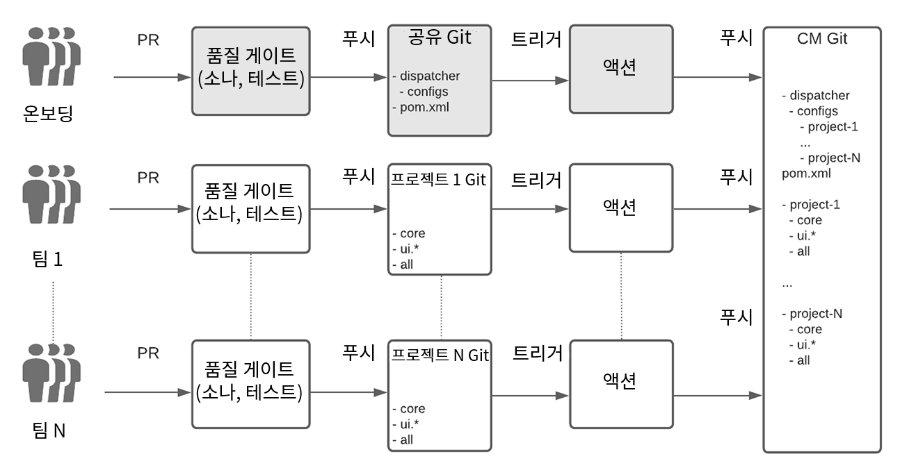
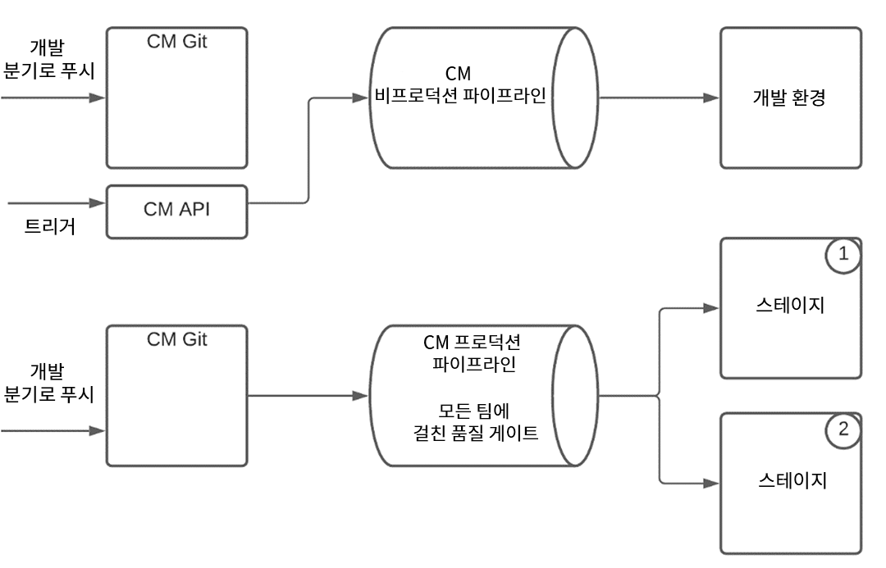
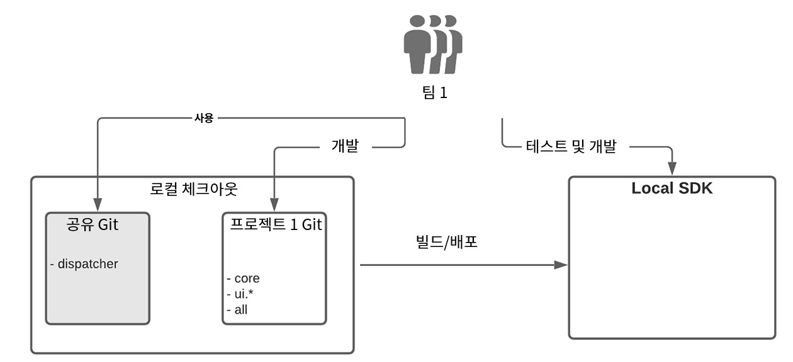

# AEM용 엔터프라이즈 팀 개발 설정(Cloud Service {#enterprise-setup})

## 소개 {#introduction}

AEM as Cloud Service은 서비스로 AEM을 전달하는 클라우드 기반의 솔루션으로, 특정 요구 사항을 지닌 엔터프라이즈 소프트웨어를 엔터프라이즈 팀에 10년 이상 제공한다는 이점을 얻을 수 있도록 설계되었습니다. AEM은 항상 켜져 있고 항상 최신 상태로 항상 안전하게 유지되며 항상 규모에 상관없이 새로운 가치를 제공하는 클라우드 기본 환경으로를 투영하지만 AEM은 고객에게 맞춤형 플랫폼으로 제공한다는 중요한 가치 제안을 보유하고 있으므로 엔터프라이즈급 팀이 개발 및 전달 절차를 통합할 수 있습니다.

AEM은 기업 개발 설정을 통해 고객을 지원하기 위해 Cloud Service으로 Cloud Manager와 통합되어 있고, 엔터프라이즈급 개발 및 배포 시 여러 해 경험의 모범 사례와 학습 효과를 제공하는 전용 CI/CD 파이프라인을 통해 통합되어 있으므로 철저한 테스트와 최고 코드 품질로 탁월한 경험을 전달할 수 있습니다.

## 엔터프라이즈 팀 개발 설정에서 클라우드 관리자의 지원 {#cloud-manager}

Cloud Manager는 고객을 위한 즉각적인 입사 절차를 위해 클라우드 관리자를 통해 구축, 확인 및 배포한 사용자 정의 사항을 저장하기 위한 git 리포지토리를 비롯하여 경험 개발을 시작하는 데 필요한 모든 것을 제공합니다.
개발 팀은 Cloud Manager를 사용하여 Adobe 직원에게 의존하지 않고 자주 변경 사항을 커밋하는 작업을 수행할 수 있습니다.

Cloud Manager에서는 다음 3가지 환경 유형을 사용할 수 있습니다.

* 개발
* 단계
* 프로덕션

비프로덕션 파이프라인을 사용하여 코드를 개발 환경에 배포할 수 있습니다. 프로덕션 배포 전에 항상 함께 진행되어 유효성 확인을 보장하는 스테이지 및 프로덕션 과정에서 프로덕션 파이프라인은 품질 게이트를 사용하여 애플리케이션 코드와 구성 변경 사항을 확인합니다.

프로덕션 파이프라인은 먼저 코드 및 구성을 스테이징 환경에 배포하고 애플리케이션을 테스트한 다음 최종적으로 프로덕션에 배포합니다.
항상 최신 Cloud Service 개선 사항으로 업데이트되는 Cloud Service SDK를 사용하면 개발자의 로컬 하드웨어를 통해 직접 로컬 개발을 진행할 수 있습니다. 이것은 매우 짧은 시간 내에 신속한 개발을 가능하게 한다. 따라서 개발자는 익숙한 로컬 환경에서 작업하고 다양한 개발 툴 중에서 선택하여 원하는 개발 환경이나 제작 환경에 적용할 수 있습니다.

Cloud Manager는 기업의 요구 사항에 맞게 조정할 수 있는 유연한 다중 팀 설정을 지원합니다. 이것은 AMS 뿐만 아니라 Cloud Service에도 적용됩니다. 여러 팀과의 안정적인 배포를 보장할 수 있고 모든 팀의 프로덕션에 영향을 미치는 한 팀을 피하기 위해 Cloud Manager는 모든 팀의 코드를 항상 검토하고 테스트합니다.

## 실제 예제 {#real-world-example}

각 기업은 서로 다른 팀 설정, 프로세스 및 개발 워크플로우를 포함하여 서로 다른 요구 사항을 가지고 있습니다. 아래 설명된 설정은 Adobe에서 AEM 위에 Cloud Service으로 경험을 제공하는 여러 프로젝트에 사용합니다.

예를 들어 Adobe Photoshop 또는 Adobe Illustrator과 같은 Adobe Creative Cloud 애플리케이션에는 최종 사용자가 사용할 수 있는 자습서, 샘플 및 안내서와 같은 컨텐츠 리소스가 포함되어 있습니다. 이 컨텐츠는 클라이언트 애플리케이션에서 AEM을 *헤드리스* 방식의 Cloud Service으로 사용하고, AEM Cloud 게시 계층에 API를 호출하여 구조화된 컨텐츠를 JSON 스트림으로 검색하고, AEM Cloud Service CDN을 활용하여 최적의 성능을 갖춘 구조화된 컨텐츠와 구조화되지 않은 컨텐츠를 모두 제공합니다.

이 프로젝트에 참여하는 팀은 이후 설명된 프로세스를 따릅니다.

>[!NOTE]
>설정에 대한 자세한 내용은 [여러 소스 Git 리포지토리를 사용한 작업](https://experienceleague.adobe.com/docs/experience-manager-cloud-manager/using/managing-code/working-with-multiple-source-git-repos.html#managing-code)을 참조하십시오.

각 팀은 자체 개발 워크플로우를 사용하고 있으며 별도의 git 리포지토리를 가지고 있습니다. 추가 공유 git 리포지토리는 프로젝트 온보딩에 사용됩니다. 이 git 리포지토리는 공유 디스패처 구성을 포함하여 Cloud Manager의 git 리포지토리의 루트 구조를 포함합니다. 새 프로젝트를 온보딩하려면 공유 git 저장소의 루트에 있는 Maven 프로젝트 파일에 나열해야 합니다. 발송자 구성의 경우 발송자 프로젝트 내에 새 구성 파일이 만들어집니다. 그런 다음 이 파일은 주 디스패처 구성에 의해 포함됩니다. 각 팀은 자체 디스패처 구성 파일을 책임집니다. 공유 git 리포지토리에 대한 변경 사항은 드물며 일반적으로 새 프로젝트를 온보딩할 때만 필요합니다. 기본 작업은 고유한 git 리포지토리 내에서 각 프로젝트 팀이 수행합니다.

각 팀의 git 리포지토리는 AEM Maven 원형을 사용하여 설정되었으므로 AEM 프로젝트를 설정하는 모범 사례를 따릅니다. 유일한 예외는 위에서 설명한 바와 같이 공유 git 리포지토리에서 수행되는 발송자 구성을 처리하는 것입니다.
각 팀은 Git 흐름 모델에 따라 2개의 + N 분기가 있는 간소화된 git 워크플로우를 사용합니다.

* 안정적인 릴리스 분기에는 프로덕션 코드가 포함되어 있습니다.

* 개발 지점에 최신 개발이 포함되어 있습니다.

* 각 기능에 대해 새 분기가 생성됩니다.

피쳐 분기에서 개발이 수행되면 해당 기능이 개발 분기에 병합됩니다. 완료되고 확인된 기능은 개발 분기에서 선택되고 안정된 분기로 병합됩니다. 모든 변경 사항은 PR(Pull Request)을 통해 수행됩니다. 각 PR은 품질 게이트로 자동으로 확인됩니다. Sonar는 코드 품질 확인에 사용되며 테스트 세트 세트는 새 코드가 회귀를 표시하지 않도록 하기 위해 실행됩니다.

Cloud Manager의 git 리포지토리에 있는 설정에는 다음 두 개의 분기가 있습니다.

* 모든 팀의 프로덕션 코드를 포함하는 *안정된 릴리스 분기*
* 모든 팀의 개발 코드를 포함하는 *개발 분기*

개발 또는 안정적인 분기에서 팀의 git 리포지토리에 푸시할 때마다 [github 작업](https://experienceleague.adobe.com/docs/experience-manager-cloud-manager/using/managing-code/working-with-multiple-source-git-repos.html?lang=en#managing-code)이 트리거됩니다. 모든 프로젝트는 안정적인 분기에 대해 동일한 설정을 따릅니다. 프로젝트의 안정적인 분기에 대한 푸시가 Cloud Managers git 리포지토리의 안정된 브랜치로 자동 푸시됩니다. Cloud Manager의 프로덕션 파이프라인은 안정적인 분기로의 푸시에 의해 트리거되도록 구성됩니다. 따라서 프로덕션 파이프라인은 모든 팀의 각 푸시에 의해 안정적인 분기에 의해 실행되며 모든 품질 게이트가 전달되면 프로덕션 배포가 업데이트됩니다.

개발 지점으로 푸시하는 작업은 다르게 처리됩니다. 팀의 git 리포지토리에서 개발자 브랜치에 대한 푸시가 github 액션을 트리거하며 코드가 Cloud Manager의 git 리포지토리의 개발 브랜치로 자동 푸시되는 동안 비프로덕션 파이프라인은 코드 푸시에 의해 자동으로 트리거되지 않습니다. Cloud Manager의 api에 대한 호출로 트리거됩니다.
프로덕션 파이프라인을 실행하면 제공된 품질 게이트를 통해 모든 팀의 코드를 확인하는 작업이 포함됩니다. 코드가 스테이지에 배포되면 테스트 및 감사가 실행되어 모든 것이 예상대로 작동됩니다. 모든 게이트가 통과되면 중단이나 작업 중단 시간 없이 변경 사항을 프로덕션 환경에 적용할 수 있습니다.
로컬 개발의 경우 Cloud Service용 SDK가 사용됩니다. SDK에서는 로컬 작성자, 게시 및 디스패처를 설정할 수 있습니다. 이를 통해 오프라인 개발과 신속한 작업 시간을 단축할 수 있습니다. 개발에는 작성자만 사용되지만, 신속하게 디스패처 설정 및 게시를 사용하면 git 리포지토리로 푸시하기 전에 모든 것을 로컬로 테스트할 수 있습니다. 각 팀의 구성원은 일반적으로 고유한 프로젝트 코드뿐만 아니라 공유 git에서 코드를 체크아웃합니다. 프로젝트가 독립적이므로 다른 프로젝트를 체크 아웃할 필요가 없습니다.

이러한 실제 설정은 청사진으로 사용한 다음 기업의 요구 사항에 맞게 변경할 수 있습니다. git의 유연한 분기 지정 및 병합 개념을 통해 위의 워크플로우를 다양하게 변형하여 모든 팀의 요구 사항에 맞게 변경할 수 있습니다. AEM은 Cloud Service의 핵심 가치를 유지하면서 이러한 모든 변형을 지원합니다.

### 여러 팀 설정 {#considerations}에 대한 고려 사항

위에 설명한 여러 팀 설정에 대한 블루프린트를 통해 더 많은 팀 간에 조정이 가능합니다. Cloud Manager의 git 리포지토리 및 프로덕션 파이프라인을 통해 전체 프로덕션 코드는 항상 모든 품질 게이트를 통해 실행되므로 하나의 배포 단위로 처리합니다. 이러한 방식으로 운영 시스템은 중단 또는 중단 시간 없이 *항상*에 유지됩니다.
반면, 각 팀이 별도로 배포할 수 있기 때문에 시스템을 배치하지 않으면 단일 팀의 업데이트를 통해 프로덕션 안정성 문제가 발생할 수 있습니다. 또한 업데이트를 제공하기 위해 조정과 계획된 다운타임 또한 필요합니다. 팀의 수가 늘어남에 따라 조정 노력은 훨씬 더 복잡하고 빨리 관리가 불가능해질 것이다.
품질 게이트에서 문제가 발견되면 프로덕션은 영향을 받지 않으며 Adobe 직원이 개입하지 않아도 문제를 감지하여 수정할 수 있습니다. Cloud Service을 사용하지 않고 전체 배포를 항상 테스트하지 않으면 부분 배포로 인해 운영 중단이 발생할 수 있으며 롤백 요청이나 심지어 백업으로부터 전체 복구를 수행할 필요가 없습니다. 부분 테스트를 수행하면 Adobe 직원의 조정 및 지원이 다시 필요한 이후 수정해야 하는 다른 문제가 발생할 수 있습니다.

여러 팀 설정의 경우 관리 모델과 모든 팀이 따라야 하는 표준 세트를 정의하는 것이 중요합니다. 청사진을 시작점으로 사용할 수 있습니다.