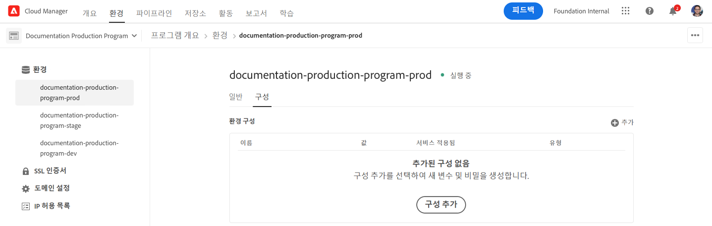
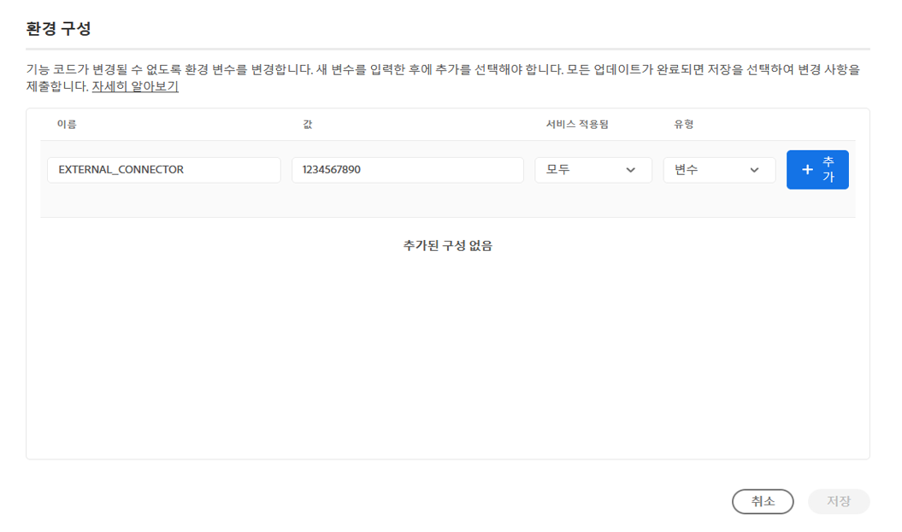
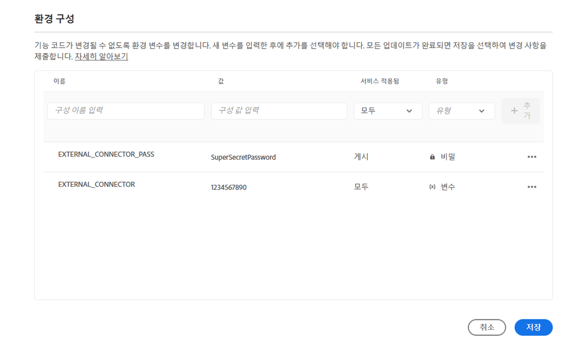
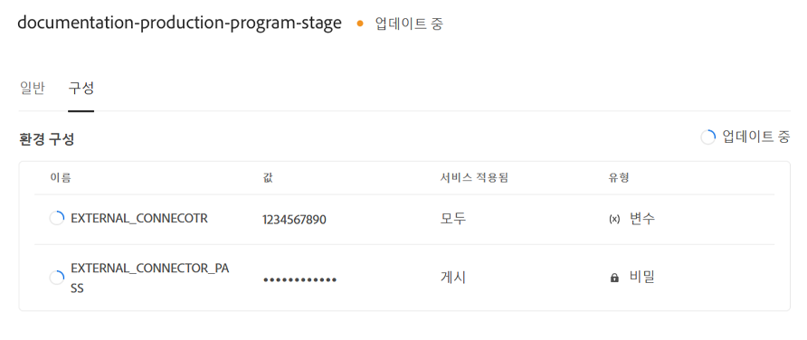
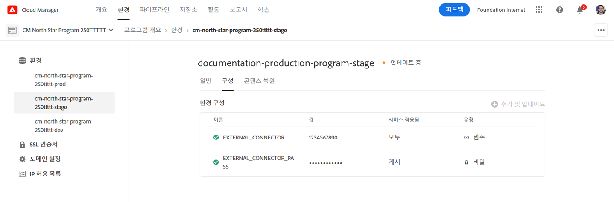
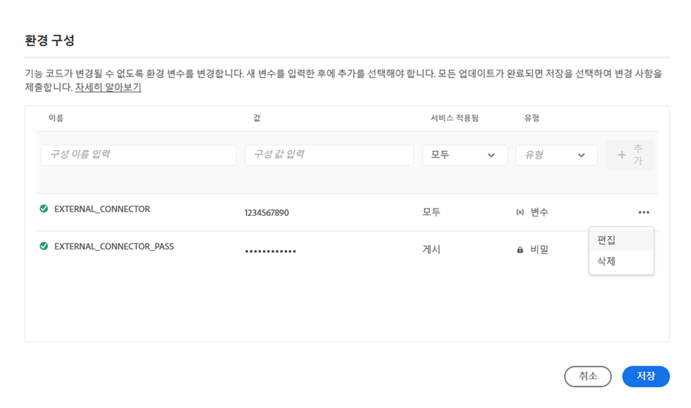
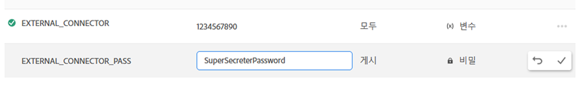

# Cloud Manager 환경 변수 {#environment-variables}

표준 환경 변수는 Cloud Manager를 통해 구성 및 관리할 수 있습니다. 런타임 환경에 제공되며 OSGi 구성에서 사용할 수 있습니다. 환경 변수는 변경되는 내용에 따라 환경별 값 또는 환경 비밀일 수 있습니다.

## 개요 {#overview}

환경 변수는 AEM as a Cloud Service 사용자에게 다음과 같은 이점을 제공합니다.

* 이를 통해 코드와 애플리케이션의 비헤이비어가 컨텍스트와 환경에 따라 달라질 수 있습니다. 예를 들어 비용이 많이 드는 실수를 피하기 위해 프로덕션 또는 스테이징 환경과 비교하여 개발 환경에서 다양한 구성을 활성화하는 데 사용할 수 있습니다.
* 한 번만 구성 및 설정하면 되며 필요할 때 업데이트 및 삭제할 수 있습니다.
* 해당 값은 언제든지 업데이트할 수 있으며 코드를 변경하거나 배포할 필요 없이 즉시 적용됩니다.
* 구성에서 코드를 분리하여 버전 제어에 민감한 정보를 포함할 필요가 없습니다.
* 코드 외부에 있기 때문에 AEM as a Cloud Service 애플리케이션의 보안을 향상시킵니다.

환경 변수를 사용하는 일반적인 사용 사례는 다음과 같습니다.

* AEM 애플리케이션을 다양한 외부 엔드포인트와 연결
* 코드베이스에 직접 저장하는 대신 암호 저장 시 참조 사용
* 프로그램에 여러 개발 환경이 존재하고 일부 구성이 환경마다 다른 경우

## 환경 변수 추가 {#add-variables}

>[!NOTE]
>
>환경 변수를 추가하거나 수정하려면 [**배포 관리자** 역할](/help/onboarding/cloud-manager-introduction.md#role-based-premissions)의 멤버여야 합니다.

1. [my.cloudmanager.adobe.com](https://my.cloudmanager.adobe.com/)에서 Adobe Cloud Manager에 로그인합니다.
1. Cloud Manager에 사용할 수 있는 다양한 프로그램이 나열됩니다. 관리하고자 하는 프로그램을 선택합니다.
1. 선택한 프로그램의 **환경** 탭을 선택한 다음 왼쪽 탐색 패널에서 환경 변수를 생성할 환경을 선택합니다.
1. 환경 세부 정보 내에서 **구성** 탭을 선택한 다음 **추가**&#x200B;를 선택하여 **환경 구성** 대화 상자를 엽니다.
   * 환경 변수를 처음 추가하는 경우 페이지 중앙에 **구성 추가** 버튼이 표시됩니다. 이 버튼 또는 **추가**&#x200B;를 사용하여 **환경 구성** 대화 상자를 열 수 있습니다.

   

1. 다음과 같은 변수 세부 정보를 입력합니다.
   * **이름**
   * **값**
   * **적용된 서비스** - 변수가 적용되는 서비스(저자/게시/미리보기) 또는 모든 서비스에 적용되는지 여부를 정의합니다.
   * **유형** - 변수가 일반 변수인지 비밀 변수인지 정의합니다.

   

1. 새 변수를 입력한 후에는 새 변수가 포함된 행의 마지막 열에서 **추가**&#x200B;를 선택해야 합니다.
   * 새 줄을 입력하고 **추가**&#x200B;를 선택하여 여러 변수를 한 번에 입력할 수 있습니다.

   

1. 변수를 유지하려면 **저장**&#x200B;을 선택합니다.

업데이트 중 상태의 표시기가 표 상단과 새로 추가된 변수 옆에 표시되어 구성에 맞게 환경이 **업데이트 중**&#x200B;임을 나타냅니다. 완료된 후에 새 환경 변수가 표에 표시됩니다.

>[!TIP]
>
>여러 변수를 추가하려면 첫 번째 변수를 추가한 다음 **환경 구성** 대화 상자에서 **추가** 버튼을 사용하여 변수를 추가하는 것이 좋습니다. 이렇게 하면 한 번의 업데이트로 환경에 여러 변수를 추가할 수 있습니다.

## 환경 변수 업데이트 {#update-variables}

환경 변수를 만든 후에는 **추가/업데이트** 버튼을 통해 **환경 구성** 대화 상자를 시작하여 업데이트할 수 있습니다.

1. [my.cloudmanager.adobe.com](https://my.cloudmanager.adobe.com/)에서 Adobe Cloud Manager에 로그인합니다.
1. Cloud Manager에 사용할 수 있는 다양한 프로그램이 나열됩니다. 관리하고자 하는 프로그램을 선택합니다.
1. 선택한 프로그램의 **환경** 탭을 선택한 다음 왼쪽 탐색 패널에서 환경 변수를 생성할 환경을 선택합니다.
1. 환경 세부 정보 내에서 **구성** 탭을 선택한 다음 오른쪽 상단에서 **추가/업데이트**&#x200B;를 선택하여 **환경 구성** 대화 상자를 엽니다.

   

1. 수정하려는 변수 행의 마지막 열에 있는 줄임표 버튼을 사용하여 **편집** 또는 **삭제**&#x200B;를 선택합니다.

   

1. 필요에 따라 환경 변수를 편집합니다.
   * 편집할 때 줄임표 버튼은 원래 값으로 되돌리거나 변경 사항을 확인하는 옵션으로 변경됩니다.
   * 비밀을 편집할 때 값은 볼 수 없고 업데이트만 가능합니다.

   

1. 필요한 구성을 모두 변경한 후에 **저장**&#x200B;을 선택합니다.

[변수를 추가할 때와 마찬가지로](#add-variables) **업데이트 중** 상태의 표시기가 표 상단과 새로 업데이트된 변수 옆에 표시되어 구성을 통해 환경이 업데이트되고 있음을 나타냅니다. 완료된 후에 업데이트된 환경 변수가 표에 표시됩니다.

>[!TIP]
>
>여러 변수를 업데이트하려면 **저장**&#x200B;을 탭하거나 클릭하기 전에 **환경 구성** 대화 상자를 사용하여 필요한 모든 변수를 한 번에 업데이트하는 것이 좋습니다. 이렇게 하면 한 번의 업데이트로 환경에 여러 변수를 추가할 수 있습니다.

## 환경 변수 사용 {#using}

환경 변수를 사용하면 `pom.xml` 구성을 보다 안전하고 유연하게 만들 수 있습니다. 예를 들어 암호를 하드 코딩할 필요가 없으며 환경 변수의 값을 기반으로 구성을 조정할 수 있습니다.

다음과 같이 XML을 통해 환경 변수와 비밀에 액세스할 수 있습니다.

* `${env.VARIABLE_NAME}`

`pom.xml` 파일에서 두 가지 유형의 변수를 모두 사용하는 방법에 대한 예는 [프로젝트 설정](/help/implementing/cloud-manager/getting-access-to-aem-in-cloud/setting-up-project.md#password-protected-maven-repository-support-password-protected-maven-repositories) 문서를 참조하십시오.

자세한 내용은 [공식 Maven 설명서](https://maven.apache.org/settings.html#quick-overview)를 참조하십시오.

## 환경 변수 가용성 {#availability}

환경 변수는 여러 곳에서 사용할 수 있습니다.

### 작성, 미리보기 및 게시 {#author-preview-publish}

일반 환경 변수와 비밀은 작성, 미리보기 및 게시 환경에서 사용할 수 있습니다.

### Dispatcher {#dispatcher}

[Dispatcher에는 일반 환경 변수만 사용할 수 있습니다.](https://experienceleague.adobe.com/docs/experience-manager-dispatcher/using/dispatcher.html) 보안은 사용할 수 없습니다.

그러나 환경 변수는 `IfDefine` 지침에서 사용할 수 없습니다.

>[!TIP]
>
>배포하기 전에 [로컬에서 Dispatcher](https://experienceleague.adobe.com/docs/experience-manager-learn/cloud-service/local-development-environment-set-up/dispatcher-tools.html)를 사용하여 환경 변수 사용을 확인해야 합니다.

### OSGi 구성 {#osgi}

일반 환경 변수 및 비밀 모두 [OSGi 구성](/help/implementing/deploying/configuring-osgi.md)에서 사용할 수 있습니다.

### 파이프라인 변수 {#pipeline}

환경 변수 외에도 빌드 단계 중에 노출되는 파이프라인 변수도 있습니다. [여기에서 파이프라인 변수에 대해 자세히 알아보십시오](/help/implementing/cloud-manager/getting-access-to-aem-in-cloud/build-environment-details.md#pipeline-variables).
