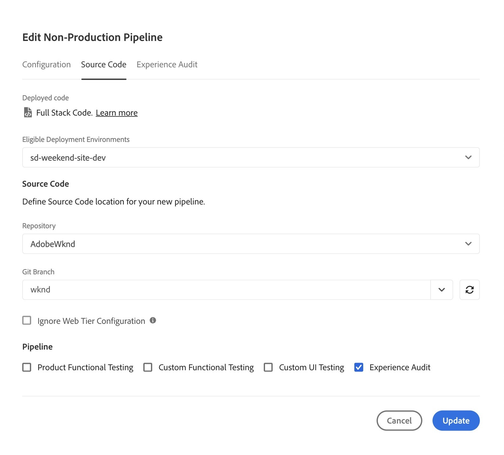
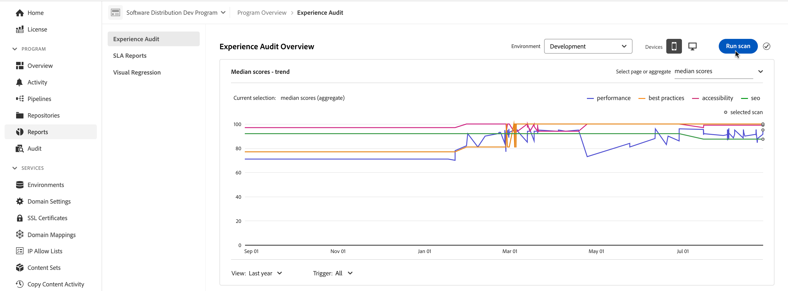
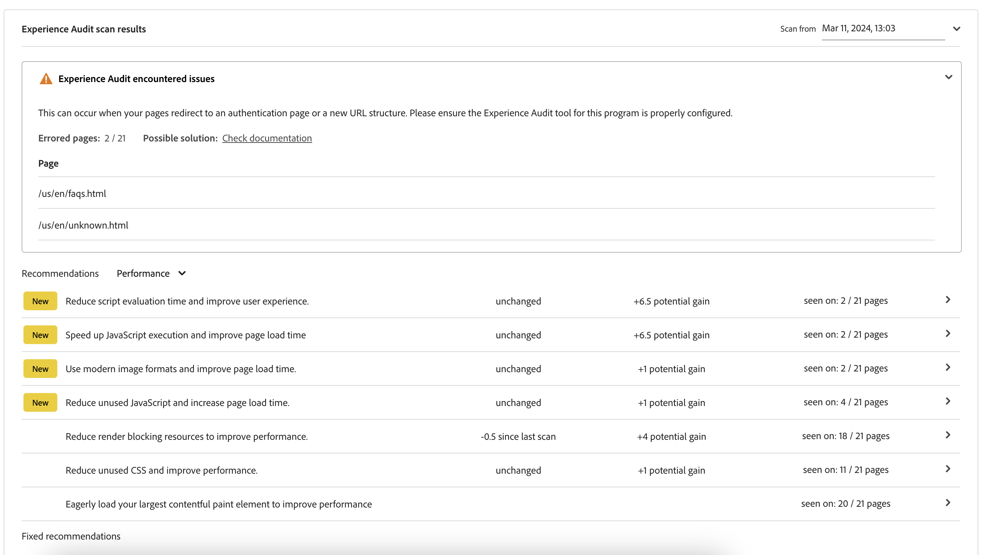

# 경험 감사 대시보드 {#experience-audit-dashboard}

경험 감사에서 배포 프로세스를 검증하여 변경 사항이 성능, 접근성, 모범 사례 및 SEO에 대한 기준 표준을 충족하는지 확인하는 방법을 알아봅니다. 이러한 지표를 추적할 수 있는 명확하고 유용한 대시보드 인터페이스를 제공합니다.

>[!NOTE]
>
>이 기능은 [얼리어답터 프로그램](/help/implementing/cloud-manager/release-notes/current.md#early-adoption)에서만 사용할 수 있습니다.
>
>AEM as a Cloud Service의 기존 경험 감사 기능에 대한 자세한 내용은 [경험 감사 테스트](/help/implementing/cloud-manager/experience-audit-testing.md)를 참조하십시오.

## 개요 {#overview}

경험 감사는 배포 프로세스를 검증하고 변경 사항이 배포되었는지 확인합니다.

1. 성능, 접근성, 모범 사례, SEO(검색 엔진 최적화) 및 PWA(점진적 웹 앱)에 대한 기준 표준을 충족합니다.

1. 회귀를 도입하지 마십시오.

Cloud Manager의 경험 감사를 통해 사이트에서 사용자의 경험을 최고 수준으로 유지할 수 있습니다.

감사 결과는 정보 제공용이며 이를 통해 배포 관리자가 점수, 현재 점수와 이전 점수 간의 변화를 확인할 수 있습니다. 이 인사이트는 현재 배포에 도입된 회귀가 있는지 확인하는 데 유용합니다.

경험 감사는 Google의 오픈 소스 도구인 [Google Lighthouse](https://developer.chrome.com/docs/lighthouse/overview/)에서 제공하며 모든 Cloud Manager 프로덕션 파이프라인에서 활성화됩니다.

## 사용 가능 {#availability}

Cloud Manager에서 경험 감사를 사용할 수 있습니다.

* (기본값) Sites 프로덕션 파이프라인
* (선택 사항) 전체 스택 파이프라인 개발
* (선택 사항) 프론트엔드 파이프라인 개발

선택적 환경에 대한 감사를 구성하는 방법에 대한 자세한 내용은 [구성 섹션](#configuration)을 참조하십시오.

감사는 파이프라인의 일부로 실행됩니다. 파이프라인 외부에서 [요청 시 실행](#on-demand)할 수도 있습니다.

## 구성 {#configuration}

경험 감사는 프로덕션 파이프라인에 기본적으로 사용할 수 있습니다. 전체 스택 및 프론트엔드 파이프라인 개발에 선택적으로 활성화할 수 있습니다. 모든 경우 파이프라인 실행 중에 평가되는 콘텐츠 경로를 정의해야 합니다.

1. 구성하려는 파이프라인 유형에 따라 다음 지침을 따르십시오.

   * 새 [프로덕션 파이프라인](/help/implementing/cloud-manager/configuring-pipelines/configuring-production-pipelines.md)을(를) 추가하여 감사에서 평가할 경로를 정의합니다.
   * 프론트엔드 또는 개발 전체 스택 파이프라인에서 감사를 활성화하려면 새 [비프로덕션 파이프라인 ](/help/implementing/cloud-manager/configuring-pipelines/configuring-non-production-pipelines.md)을(를) 추가하십시오.
   * 또는 [기존 파이프라인을 편집](/help/implementing/cloud-manager/configuring-pipelines/managing-pipelines.md)하고 기존 옵션을 업데이트할 수 있습니다.

1. 비프로덕션 파이프라인을 추가하거나 편집할 때 경험 감사를 사용하려면 **경험 감사** 확인란을 선택하십시오. 이 옵션은 **Source 코드** 탭에서 찾을 수 있습니다.

   

   * 비프로덕션 파이프라인에만 필요합니다.
   * 확인란을 선택하면 **경험 감사** 탭이 나타납니다.

1. 프로덕션 및 비프로덕션 파이프라인 모두에 대해 **경험 감사** 탭에서 경험 감사에 포함해야 하는 경로를 정의합니다.

   * 페이지 경로는 `/`(으)로 시작해야 하며 사이트에 상대적입니다.
   * 예를 들어 사이트가 `wknd.site`이고 경험 감사에 `https://wknd.site/us/en/about-us.html`을(를) 포함하려면 `/us/en/about-us.html` 경로를 입력하십시오.

   

1. **페이지 추가**&#x200B;를 클릭하면 환경 주소를 사용하여 경로가 자동으로 완료되고 경로 테이블에 추가됩니다.

   

1. 필요에 따라 앞의 두 단계를 반복하여 경로를 계속 추가합니다.

   * 최대 25개의 경로를 추가할 수 있습니다.
   * 경로를 정의하지 않으면 기본적으로 사이트의 홈페이지가 경험 감사에 포함됩니다.

1. **저장**&#x200B;을 클릭합니다.

## 경험 감사 결과 {#results}

경험 감사 결과는 [프로덕션 파이프라인 실행 페이지](/help/implementing/cloud-manager/deploy-code.md)를 통해 프로덕션 파이프라인의 **단계 테스트** 단계에 표시됩니다.

경험 감사에서는 [구성된 페이지](#configuration)에 대한 중간 Google 등대 점수와 이전 스캔과의 점수 차이를 제공합니다.

파이프라인의 **스테이지 테스트** 단계에 있는 이 요약 보기에서 다음 두 가지 옵션이 있습니다.

* **[가장 느린 페이지 보기](#view-slowest-pages)**
* **[전체 보고서 보기](#view-full-report)**

Cloud Manager 대시보드에서 **보고서** 탭을 클릭하여 전체 감사 결과에 액세스할 수 있습니다. 파이프라인 실행 세부 정보에 표시된 요약 외에도 [전체 보고서](#view-full-report)를 직접 볼 수 있습니다.

>[!TIP]
>
>다음 섹션에서는 경험 감사의 결과를 보는 방법을 설명합니다.
>
>* 감사 작동 방식에 대한 자세한 내용은 [경험 감사 평가 세부 정보](#details)를 참조하세요.
>* 주문형 경험 감사를 실행하는 방법은 [주문형 감사 보고서](#on-demand)를 참조하십시오.
>* 감사에 문제가 있는 경우 [경험 감사에서 문제가 발생했습니다](#issues)을(를) 참조하십시오.
>* 일반적인 성능 팁은 [일반 성능 팁](#performance-tips)을 참조하십시오.

### 가장 느린 페이지 보기 {#view-slowest-pages}

**가장 느린 페이지 보기**&#x200B;를 클릭하여 **가장 느린 5페이지** 대화 상자를 엽니다. [감사를 위해 구성](#configuration)한 5개의 가장 성과가 낮은 페이지가 표시됩니다.

Cloud Manager은 **성능**, **접근성**, **모범 사례**, **SEO**&#x200B;별로 점수를 분류하여 이전 감사와 각 지표의 편차를 보여 줍니다.

기본적으로 모바일 장치의 점수가 포함된 대화 상자가 열립니다. 대화 상자 상단 근처에 있는 **장치** 전환을 사용하여 데스크톱 점수를 볼 수 있습니다.

이 대화 상자는 간략한 개요를 제공하기 위한 것입니다. 자세한 내용을 보려면 **전체 보고서 보기**&#x200B;를 클릭하십시오.

### 전체 보고서 보기 {#view-full-report}

다음을 수행하여 전체 경험 감사 보고서를 볼 수 있습니다.

* **[가장 느린 5페이지](#view-slowest-pages)** 대화 상자에서 **`View full report`**&#x200B;을(를) 클릭합니다.
* [파이프라인 실행](#results)을 볼 때 **`View full report`**&#x200B;을(를) 클릭합니다.
* Cloud Manager에서 **보고서** 탭을 클릭합니다.

Cloud Manager의 **보고서** 탭이 열려 **경험 감사**&#x200B;를 표시합니다.

보고서는 다음 두 영역으로 분할됩니다.

* **[페이지 점수 — 트렌드](#trend)**
* **[경험 감사 검색 결과](#results)**

#### 페이지 점수 — 트렌드 {#trend}

기본적으로 **페이지 점수 — 트렌드**&#x200B;에 대해 선택한 보기는 **최근 6개월**&#x200B;에 대한 **중간 점수**&#x200B;입니다.

차트 단추 상단과 하단의 **선택** 및 **보기** 드롭다운을 사용하여 각각 페이지별 세부 정보와 다른 시간대를 선택합니다. 선택 사항을 적용하고 차트를 새로 고치려면 차트 맨 위에서 **트렌드 업데이트**&#x200B;를 클릭합니다.

차트 위로 마우스를 가져가면 도구 설명에 특정 시점의 Google Lighthouse 카테고리 값이 표시됩니다.

특정 시점에 차트를 클릭하면 해당 스캔의 세부 정보와 함께 팝오버가 열립니다. **경험 감사 검사 열기**&#x200B;를 클릭하여 해당 검사 결과를 **[경험 감사 검사 결과](#scan-results)** 섹션으로 로드합니다.

#### 경험 감사 스캔 결과 {#scan-results}

**경험 감사 검사 결과** 섹션에서는 점수를 개선하는 방법과 검사한 모든 페이지의 세부 사항에 대한 권장 사항을 제공합니다. 다음 두 섹션으로 나뉩니다.

* **[Recommendations](#recommendations)**
* **[검사한 페이지](#scanned-pages)**

##### 권장 사항 {#recommendations}

**Recommendations** 섹션에는 인사이트의 집계 집합이 표시됩니다. 기본적으로 **성능**&#x200B;에 대한 권장 사항이 표시됩니다. **Recommendations** 제목 옆에 있는 드롭다운을 사용하여 다른 범주로 변경합니다.

권장 사항에 대한 V자형 화살표를 클릭하여 세부 정보를 표시합니다.

사용 가능한 경우 확장된 권장 사항 세부 정보에는 가장 영향을 미치는 변경 사항에 집중할 수 있도록 권장 사항 영향의 백분율도 포함됩니다.

권장 사항이 적용되는 페이지를 보려면 세부 정보 보기에서 **페이지 보기** 링크를 클릭하십시오.

##### 스캔한 페이지 {#scanned-pages}

**검사한 페이지** 섹션은 검사한 모든 페이지의 점수에 대한 세부 정보를 제공합니다. **이전** 및 **다음** 단추를 사용하여 결과를 페이징하고 표시할 페이지의 수를 선택하십시오.

특정 페이지의 링크를 클릭하면 [**페이지 점수 — 트렌드** 섹션](#trend)의 **선택** 필터가 업데이트되고 선택한 페이지에 대한 **점수 및 권장 사항** 탭이 표시됩니다.

**원시 보고서** 탭은 페이지의 모든 감사에 대한 점수를 제공합니다. 원시 데이터의 JSON 파일을 검색하려면 **Lighthouse 보고서** 열의 보고서 날짜를 클릭하십시오.

브라우저에서 새 탭이 열려 `https://googlechrome.github.io/lighthouse/viewer/`(으)로 이동합니다. 선택한 페이지에 대한 Lighthouse 원시 JSON 보고서를 포함하는 서명된 URL을 자동으로 로드하여 자세히 검사할 수 있습니다.

## 온디맨드 스캔 감사 보고서 {#on-demand}

파이프라인 실행 중에 실행되는 것 외에도 경험 감사 보고서를 온디맨드로 생성할 수 있습니다. 이 옵션은 파이프라인을 실행하지 않고도 페이지를 빠르게 스캔하는 좋은 솔루션입니다.

온디맨드 검사를 실행하려면 **보고서** 탭으로 이동하여 전체 감사 보고서를 확인한 다음 **검사 실행** 단추를 클릭하십시오.

요청 시 검사가 이미 실행되고 있는 경우 **검사 실행** 단추를 사용할 수 없게 되고 시계 아이콘으로 배지가 지정됩니다.

온디맨드 검사는 최신 25개의 [구성된 페이지](#configuration)에 대한 경험 감사를 트리거하고 일반적으로 몇 분 안에 끝납니다.

완료되면 점수 차트가 자동으로 업데이트되며 파이프라인 실행 스캔과 정확히 동일한 결과를 검사할 수 있습니다.

**트리거** 선택기를 사용하여 트리거 유형에 따라 점수 차트를 필터링할 수 있습니다.

>[!NOTE]
>
>환경이 삭제되지 않고 동일한 환경에 보류 중인 다른 검사가 없는 경우에만 온디맨드 검사를 시작할 수 있습니다.

## 경험 감사에 문제가 발생했습니다. {#issues}

감사하도록 구성한 [페이지](#configuration)를 사용할 수 없거나 감사에 다른 오류가 있는 경우 경험 감사에서 이 사실을 반영합니다.

파이프라인에 확장 가능한 오류 섹션이 표시되어 액세스할 수 없는 상대 URL 경로를 볼 수 있습니다.

전체 보고서를 볼 경우 세부 정보는 **[경험 감사 검사 결과](#results)** 섹션에 표시되며 확장 가능합니다.

페이지를 사용할 수 없는 몇 가지 이유는 다음과 같습니다.

* 구성은 액세스를 차단합니다.
* 페이지가 존재하지 않습니다.
* 기본 이외의 인증이 필요한 페이지로 리디렉션됩니다.
* 내부 문제가 발생했습니다.
* 등

>[!TIP]
>
>페이지의 [원시 보고서에 액세스](#scanned-pages)하면 페이지를 감사할 수 없는 이유에 대한 세부 정보를 제공할 수 있습니다.

## 일반 성능 팁 {#performance-tips}

수정하기 쉬운 가장 일반적인 영향력 있는 문제 중 두 가지는 누적 레이아웃 이동(CLS) 및 최대 콘텐츠풀 페인트(LCP)와 관련되어 있습니다.

다음을 수행하여 이러한 영역을 개선할 수 있습니다.

* 접힌 부분 위에 이미지 로드(아래로 스크롤할 필요 없이 브라우저에서 볼 수 있는 콘텐츠)를 소홀히 하지 마십시오.
* 리소스가 로드되는 방식의 우선 순위를 적절히 지정합니다(예: 문서가 로드된 후 접힌 부분 아래의 이미지를 비동기적으로 로드).
* 접힌 부분 위로 콘텐츠를 렌더링하는 데 사용되는 JavaScript 및 CSS 파일을 미리 가져옵니다(필요한 경우).
* 느리게 로드되거나 나중에 렌더링되는 컨테이너에 종횡비를 할당하여 세로 공간을 예약합니다.
* 이미지를 WebP 형식으로 변환하여 크기를 줄입니다.
* 다양한 뷰포트 크기에 대해 다양한 이미지 크기를 가진 `<picture>` 및 `srcset` 이미지를 사용합니다(및 크기 조정이 작동하는지 확인).

## 경험 감사 평가 세부 정보 {#details}

다음 세부 정보는 경험 감사가 사이트를 평가하는 방법에 대한 추가 정보를 제공합니다. 이 기능은 기능의 일반적인 사용에 필요하지 않으며, 완결성을 위해 여기에 제공됩니다.

* 감사는 게시자의 [구성된 경험 감사 페이지 경로](#configuration)에서 원본(`.com`) 도메인을 검사하여 실제 사용자 경험을 시뮬레이션함으로써 웹 사이트 관리 및 최적화에 대한 더 나은 결정을 내리는 데 도움이 됩니다.
* 프로덕션 전체 스택 파이프라인에서 스테이징 환경을 스캔합니다. 감사 중에 감사가 관련 세부 정보를 제공하도록 하려면 스테이징 환경의 콘텐츠가 프로덕션 환경에 최대한 가깝어야 합니다.
* [**페이지 점수 — 트렌드** 섹션](#trend)의 **선택** 드롭다운에 표시된 페이지는 모두 경험 감사에서 과거에 검사한 알려진 페이지입니다.
* [권장 사항](#recommendations)은(는) 잠재적 이득과 이전 검사와 차이가 있을 수 있습니다.
* 경험 감사는 각 페이지에 대한 원시 보고서를 처리하여 잠재적 개선 사항을 예측합니다. 낭비된 바이트 또는 밀리초를 통찰력과 상관 관계를 분석하여 성능 점수에 가중된 영향을 할당합니다. 감사는 추구해야 할 권장 사항을 결정하는 데 도움이 되도록 이 정보와 영향을 받는 페이지를 제공합니다.
자세한 내용은 [일반 성능 팁 섹션](#performance-tips)을 참조하세요.
* 프론트엔드 파이프라인은 기존 환경에 배포되고, 여러 프론트엔드 파이프라인은 동일한 환경을 타깃팅할 수 있습니다. 스캔 결과는 환경 수준에서 집계되므로 점수, 트렌드 및 권장 사항이 일관됩니다. 이러한 결과는 검색을 트리거한 파이프라인에 관계없이 선택한 환경에 표시됩니다.
