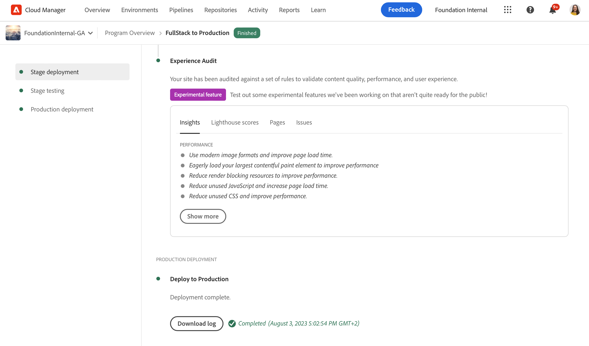
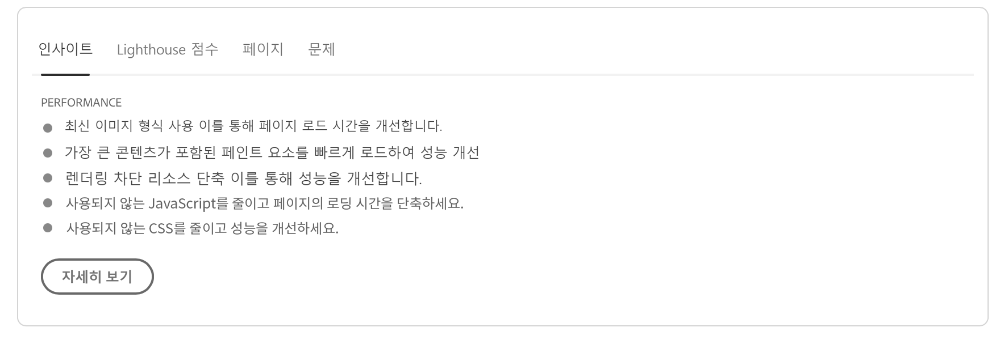
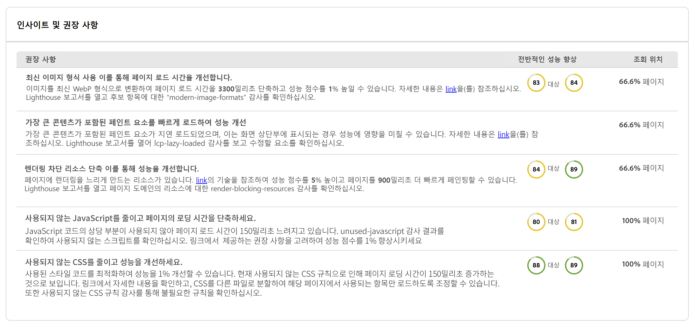
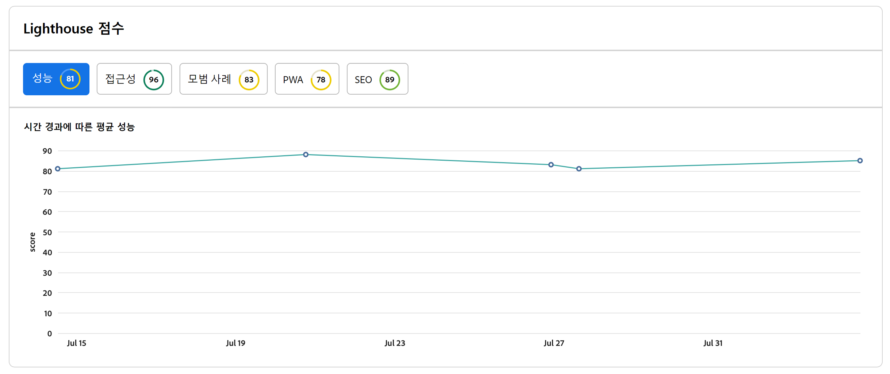
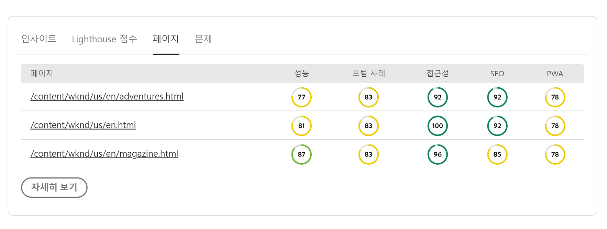
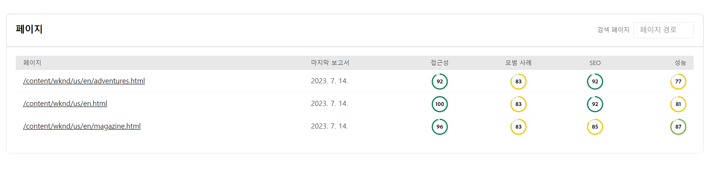
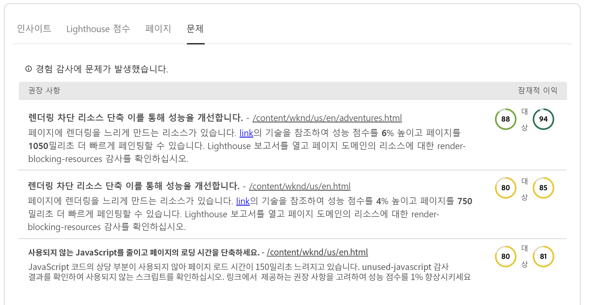
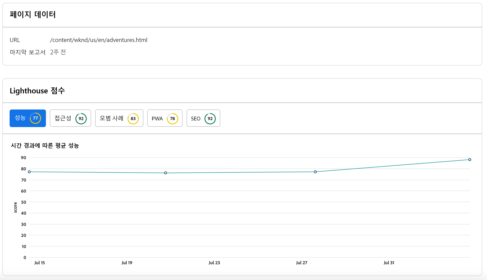

# 경험 감사 대시보드 {#experience-audit-dashboard}

Experience Audit에서 배포 프로세스를 검증하는 방법을 알아보고, 명확하고 유용한 대시보드 인터페이스를 통해 배포된 변경 사항이 성능, 접근성, 모범 사례 및 SEO에 대한 기준 표준을 충족하는지 확인하는 데 도움이 됩니다.

>[!NOTE]
>
>이 기능은 다음 대상에서만 사용할 수 있습니다. [얼리 어답터 프로그램.](/help/implementing/cloud-manager/release-notes/current.md#early-adoption)
>
>AEMas a Cloud Service 용 기존 경험 감사 기능에 대한 자세한 내용은 문서를 참조하십시오. [경험 감사 테스트 를 참조하십시오.](/help/implementing/cloud-manager/experience-audit-testing.md)

## 개요 {#overview}

경험 감사는 Cloud Manager Sites 프로덕션 파이프라인에서 사용할 수 있는 기능으로, 배포 프로세스를 검증하고 변경 사항이 배포되었는지 확인합니다.

1. 성능, 접근성, 모범 사례, SEO(검색 엔진 최적화) 및 PWA(점진적 웹 앱)에 대한 기준 표준을 충족합니다.

1. 회귀를 도입하지 마십시오.

Cloud Manager의 경험 감사를 통해 최종 사용자의 사이트 경험을 최고 수준으로 유지할 수 있습니다.

감사 결과는 정보 제공용이며 이를 통해 배포 관리자가 점수, 현재 점수와 이전 점수 간의 변화를 확인할 수 있습니다. 이 인사이트는 현재 배포에 도입된 회귀가 있는지 확인하는 데 유용합니다.

경험 감사는 다음을 통해 제공됩니다. [Google 등대](https://developer.chrome.com/docs/lighthouse/overview/) Google의 오픈 소스 도구이며 모든 Cloud Manager 프로덕션 파이프라인에서 활성화됩니다.

>[!TIP]
>
>[파이프라인을 설정](/help/implementing/cloud-manager/configuring-pipelines/configuring-production-pipelines.md#full-stack-code)할 때 경험 감사에 포함되는 페이지를 구성합니다.

## 경험 감사 대시보드 {#dashboard}

경험 감사 결과는 다음에 나와 있습니다. **스테이지 테스트** 를 통한 프로덕션 파이프라인 단계 [프로덕션 파이프라인 실행 페이지.](/help/implementing/cloud-manager/deploy-code.md)

경험 감사에서는 네 가지 탭에 요약된 집계되고 상세한 페이지 수준 테스트 결과를 제공합니다.

* **[Insights](#insights)** 사이트의 성능을 개선하기 위해 실행 가능한 권장 사항에 대한 간략한 설명을 제공합니다.
* **[등대 점수](#lighthouse)** 는 이 파이프라인 실행에 배포된 코드에 대한 Lighthouse 점수의 요약입니다.
* **[페이지](#pages)** 는 특별히 분석되도록 구성된 페이지의 성능에 대한 요약입니다.
* **[문제](#issues)** 는 이 파이프라인 실행의 코드에서 감지된 모든 성능 문제를 요약합니다.

### 인사이트 {#insights}

다음 **Insights** 탭에서는 사이트의 성능을 개선하기 위해 실행 가능한 권장 사항에 대한 간단한 설명을 제공합니다.

을(를) 탭하거나 클릭합니다 **더 보기** 단추를 클릭하여 전체 대시보드를 엽니다.

다음에서 **인사이트 및 권장 사항** 섹션에는 실적을 예상할 수 있는 이득과 연결된 명확한 값 표시기와 영향을 받는 페이지 비율이 있는 실행 가능한 권장 사항의 세부 목록이 있습니다. 이를 통해 팀에 이러한 권장 사항의 우선 순위를 쉽게 지정할 수 있습니다.

프로덕션 파이프라인 실행 페이지로 돌아가려면 브라우저에서 뒤로 화살표를 선택하면 됩니다.

### 등대 점수 {#lighthouse}

다음 **등대 점수** 탭은 이 파이프라인 실행에 배포된 코드에 대한 Lighthouse 점수의 요약입니다.

을(를) 탭하거나 클릭합니다 **더 보기** 단추를 클릭하여 전체 대시보드를 엽니다.

다음에서 **등대 점수** 섹션에서 다양한 점수의 트렌드 보기를 찾을 수 있습니다. 선택 **성능**, **접근성**, **PWA**, 또는 **SEO** 을 클릭하여 해당 값에 대한 월별 트렌드 보기를 확인합니다.

그래프의 각 지점은 관심 월의 모든 배포에 대한 평균입니다.

프로덕션 파이프라인 실행 페이지로 돌아가려면 브라우저에서 뒤로 화살표를 선택하면 됩니다.

### 페이지 {#pages}

다음 **페이지** 탭은 분석되도록 특별히 구성된 페이지의 성능에 대한 요약입니다.

을(를) 탭하거나 클릭합니다 **더 보기** 단추를 클릭하여 전체 대시보드를 엽니다.

다음 **페이지** 섹션은 테스트된 페이지 목록과 가장 최신 Lighthouse 성능 점수 및 분류를 제공합니다.

[파이프라인을 설정](/help/implementing/cloud-manager/configuring-pipelines/configuring-production-pipelines.md#full-stack-code)할 때 경험 감사에 포함되는 페이지를 구성합니다.

프로덕션 파이프라인 실행 페이지로 돌아가려면 브라우저에서 뒤로 화살표를 선택하면 됩니다.

### 문제 {#issues}

다음 **문제** 탭은 이 파이프라인 실행의 코드에서 감지된 성능 문제를 요약합니다.

을(를) 탭하거나 클릭합니다 **더 보기** 단추를 클릭하여 전체 대시보드를 엽니다.

다음에서 **인사이트 및 권장 사항** 섹션에는 성능에 영향을 받는 페이지 비율과 함께 예상할 수 있는 이득과 연결된 명확한 값 표시기가 있는 실행 가능한 권장 사항 목록이 더 자세히 표시됩니다. 이를 통해 팀에 이러한 권장 사항의 우선 순위를 쉽게 지정할 수 있습니다.

프로덕션 파이프라인 실행 페이지로 돌아가려면 브라우저에서 뒤로 화살표를 선택하면 됩니다.

### 페이지 세부 사항 {#page-detail}

의 탭에서 페이지 링크를 탭하거나 클릭하는 경우 **경험 감사** 파이프라인 실행 페이지 탭의 섹션 또는 **페이지** 전체 경험 감사 대시보드의 섹션에서 특정 페이지의 세부 정보를 볼 수 있습니다.

이전 테스트 실행에서 변경된 사항과 함께 특정 테스트에 대해 개별 페이지의 점수를 확인할 수 있습니다.

개별 페이지의 세부 정보를 클릭하면 평가된 페이지 요소에 대한 정보와 개선 기회가 감지된 경우 문제를 해결하기 위한 지침이 제공됩니다.

프로덕션 파이프라인 실행 페이지로 돌아가려면 브라우저에서 뒤로 화살표를 선택하면 됩니다.
