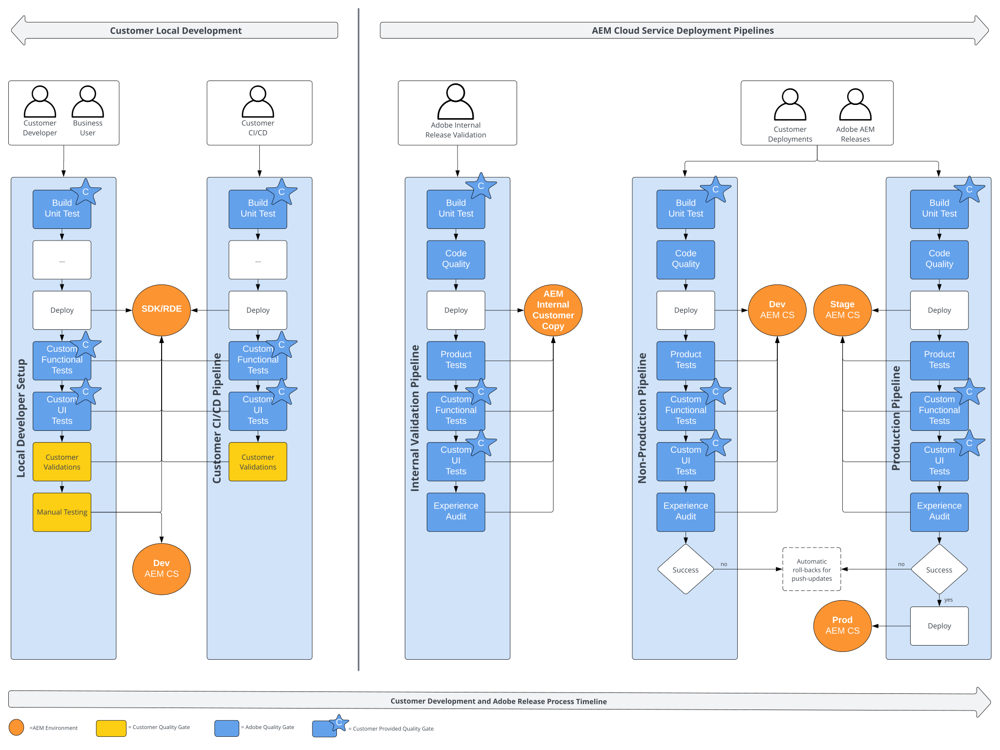

# 소개 {#functional-testing-introduction}

>[!CONTEXTUALHELP]
>id="aemcloud_nonbpa_functionaltesting"
>title="기능 테스트"
>abstract="코드의 품질과 신뢰성을 보장하기 위해 AEM as a Cloud Service 배포 프로세스에 내장된 세 가지 유형의 기능 테스트에 대해 알아봅니다."

에서 사용할 수 있는 품질 게이트에 대해 알아봅니다. [AEM as a Cloud Service 배포 프로세스](/help/implementing/cloud-manager/deploy-code.md), 다양한 유형의 기능 테스트가 내장되어 있으며, 이를 어떻게 제공할 수 있고, 전체 테스트 전략의 맥락에서 이를 최대한 활용할 수 있는지 설명합니다.

## 개요

다음 다이어그램은 전체 테스트 전략 및 의 맥락에서 사용할 수 있는 파이프라인에 대한 높은 수준의 개요를 제공합니다. [AEM as a Cloud Service 배포 프로세스](/help/implementing/cloud-manager/deploy-code.md).

## 용도

AEM Cloud Service 배포 파이프라인의 목적은 개발 및 AEM 제품 릴리스 수명 주기의 다양한 단계에서 강력하고 안전한 배포를 용이하게 하는 것입니다. 이러한 파이프라인은 AEM 애플리케이션 변경 및 AEM 제품 업데이트 모두에 대한 배포의 무결성과 안전성을 보장하기 위해 다양한 수준의 여러 품질 게이트를 통합합니다.

Adobe은 여러 개의 내장된 품질 게이트를 제공하는 반면, 다른 한편에서는 구현 및 구성을 위해 사용자의 개입이 필요합니다. 이러한 품질 게이트는 다용도가 다양하며, 일부는 라이프사이클의 여러 단계에서 적용할 수 있으며 자체 개발 설정 및 CI/CD 프로세스와 통합할 수도 있습니다.

내장된 품질 게이트는 기본적으로 AEM 애플리케이션의 컨텍스트 내에서 AEM 제품의 기능을 검증합니다. 반면 사용자가 설정한 사용자 정의 품질 게이트는 애플리케이션의 중요한 기능과 사용자 상호 작용이 의도한 대로 수행되는지 확인하도록 설계되었습니다. 이러한 두 세트의 품질 게이트는 함께 작동하여 코드 수정 및 AEM 제품 업데이트 모두에 대해 강력하고 안전한 자동 배포를 보장합니다.

이러한 품질 게이트는 전체 테스트 전략에 대한 포괄적인 테스트 프레임워크가 아님을 유의해야 합니다. AEM 제품은 AEM Cloud Service 배포 프로세스에 들어가기 전에 광범위한 테스트를 거칩니다. 마찬가지로 응용 프로그램의 품질이 높아야 배포 단계에 도달할 수 있습니다. 이 방법을 사용하면 품질 게이트가 전체 테스트 요법을 대체하는 것이 아니라 배포 프로세스를 보호하는 주요 목표에 중점을 둘 수 있습니다.

## 품질 게이트

다음 다이어그램은 사용 가능한 품질 게이트와 전체 테스트 전략에서의 해당 사용 및 [AEM as a Cloud Service 배포 프로세스](/help/implementing/cloud-manager/deploy-code.md).

### 요약 고객 제공 품질 게이트

|                               | 단위 테스트 | 사용자 정의  기능 테스트 | 사용자 정의  UI 테스트 | 고객  유효성 검사 | 수동  테스트 |
|:------------------------------|:---------------------:|:-----------------------------------:|:-----------------------------------:|:-------------------------:|:-------------------:|
| **프로덕션 파이프라인** | 예 차단  | 예 차단 6,000만 시간 초과 | 예 차단 6,000만 시간 초과 | 아니요 | 아니요 |
| **비프로덕션 파이프라인** | 예 차단  | 옵트인 차단 6,000만 시간 초과 | 옵트인 차단 6,000만 시간 초과 | 아니요 | 아니요 |
| **Adobe 내부 유효성 검사** | 예 차단  | 예 차단 6,000만 시간 초과 | 예 차단 6,000만 시간 초과 | 아니요 | 아니요 |
| **고객 CI/CD** | 예 | 예 | 예 | 예 | 예 |
| **고객 로컬 개발자** | 예 | 예 | 예 | 예 | 예 |

### 단위 테스트

모든 테스트 전략의 기초가 되는 AEM 애플리케이션에 대한 단위 테스트를 제공하는 것이 좋습니다. 빠르고 자주 실행하고 일찍 빠르게 피드백을 제공하도록 설계되었습니다. 개발자 워크플로우, 고유한 CI/CD 및 AEM Cloud Service 배포 파이프라인에 긴밀하게 통합됩니다.

JUnit을 사용하여 구현되고 Maven로 실행됩니다. 다음을 참조하십시오. [AEM Project Archetype의 핵심 모듈](https://experienceleague.adobe.com/docs/experience-manager-core-components/using/developing/archetype/core.html#unit-tests) AEM 및 시작에 대한 단위 테스트의 예입니다.

### 코드 품질

이 품질 게이트는 즉시 구성되며 AEM 애플리케이션 코드에서 정적 코드 분석을 실행합니다.

다음을 참조하십시오 [코드 품질 테스트](/help/implementing/cloud-manager/code-quality-testing.md) 및 [사용자 지정 코드 품질 규칙](/help/implementing/cloud-manager/custom-code-quality-rules.md) 추가 정보.

### 제품 테스트

제품 기능 테스트는 작성 및 복제 작업과 같은 AEM의 핵심 기능에 대한 안정적인 HTTP 통합 테스트(IT) 세트입니다. Adobe은 즉시 사용할 수 있도록 이러한 기능을 제공하고 유지 관리합니다. 사용자 정의 애플리케이션 코드가 AEM 제품의 핵심 기능을 손상시키는 경우 이러한 코드가 배포되지 않도록 하기 위한 것입니다.

Junit을 사용하여 구현되고 Maven을 사용하여 실행되며 official을 사용합니다 [AEM 테스트 클라이언트](https://github.com/adobe/aem-testing-clients). 제품 테스트 세트는 로 유지됩니다. [오픈 소스 프로젝트](https://github.com/adobe/aem-test-samples/tree/aem-cloud/smoke)는 모범 사례를 따르며 테스트 구현의 좋은 시작점으로 간주될 수 있습니다.

### 사용자 정의 기능 테스트

제품 테스트와 마찬가지로 고객 기능 테스트는 HTTP 통합 테스트(IT)이며 Junit을 사용하여 잘 구현되고 Maven을 사용하여 실행되며 공식 위에 빌드됩니다 [AEM 테스트 클라이언트](https://github.com/adobe/aem-testing-clients).

>[!NOTE]
>
>사용자 정의 기능 테스트는 AEM 애플리케이션에서 사용하는 프로덕션 및 비프로덕션(옵트인) 파이프라인에서 실행되며, 이 파이프라인은 AEM 애플리케이션 배포 및 제품 푸시 업데이트를 변경하므로 애플리케이션이 제대로 작동하도록 하고 릴리스 안전을 높이는 데 도움이 되는 주요 기여입니다. 고객 기능 테스트는 각 고객에 대한 내부 프리릴리스 유효성 검사 파이프라인에서도 실행되므로 초기 피드백을 제공하는 데 도움이 됩니다.

파이프라인 실행을 효율적으로 유지하기 위해서는 주요 기능 및 주요 사용자 상호 작용 흐름에 중점을 두는 것이 좋습니다. 기능 테스트의 실행 시간은 ~15분 이하가 권장됩니다. 이 품질 게이트에 적합하지 않은 모든 기능 테스트 세트는 고객의 개발 흐름 동안 일반적인 고객 유효성 검사 파이프라인의 일부로 실행하는 것이 좋습니다.

다음을 참조하십시오. [오픈 소스 제품 테스트](https://github.com/adobe/aem-test-samples/tree/aem-cloud/smoke) 또는 [AEM Projects Archetype의 it.test 모듈](https://experienceleague.adobe.com/docs/experience-manager-core-components/using/developing/archetype/ittests.html) 예.

자세한 내용은 [Java 기능 테스트](/help/implementing/cloud-manager/java-functional-testing.md)를 참조하십시오.

### 사용자 정의 UI 테스트

고객별 개발에 대한 위험 제어를 극대화하려면 Adobe에서 중요한 UI 테스트를 AEMCS에 캡처하도록 강력히 권장합니다. 이러한 기여는 수가 다소 제한적이지만 고객 경험에 가장 큰 영향을 미치기 위한 것입니다.

테스트는 도커 이미지로 패키지화되어 있으며 가능한 한 휘발되도록 설계되었습니다(Cypress, Selenium, Java, Javascript 등 지원). 이러한 테스트는 사용자 정의 기능 테스트와 동일한 특성과 목적을 따릅니다.

>[!NOTE]
>
>사용자 지정 UI 테스트는 AEM 애플리케이션에서 사용하는 프로덕션 및 비프로덕션(옵트인) 파이프라인에서 실행되며, 이 파이프라인은 AEM 애플리케이션 변경 배포 및 제품 푸시 업데이트를 변경하므로 애플리케이션이 제대로 작동하는지 확인하고 릴리스 안전성을 높이는 데 도움이 되는 주요 기여입니다. 고객 UI 테스트는 각 고객에 대한 내부 프리릴리스 유효성 검사 파이프라인에서도 실행되므로 초기 피드백을 제공하는 데 도움이 됩니다.

파이프라인 실행을 효율적으로 유지하기 위해서는 주요 기능 및 주요 사용자 상호 작용 흐름에 중점을 두는 것이 좋습니다. 이 품질 게이트에 맞지 않는 전체 UI 테스트 세트는 고객의 개발 흐름 동안 일반적인 고객 유효성 검사 파이프라인의 일부로 실행하는 것이 좋습니다.

다음을 참조하십시오. [오픈 소스 예시 테스트](https://github.com/adobe/aem-test-samples/tree/aem-cloud/) 또는 [AEM Projects Archetype의 ui.tests 모듈](https://experienceleague.adobe.com/docs/experience-manager-core-components/using/developing/archetype/uitests.html) 예.

자세한 내용은 [사용자 정의 UI 테스트](/help/implementing/cloud-manager/ui-testing.md#custom-ui-testing)를 참조하십시오.

### 경험 감사

경험 감사 품질 게이트가 수행되고 있습니다. [Google 등대](https://developer.chrome.com/docs/lighthouse/overview/) 고객의 웹 페이지에 대한 감사를 수행합니다.

이 품질 게이트는 AEM에서 기본적으로 제공하지만 배포 파이프라인을 차단하지 않습니다. 기본적으로 루트 페이지에 대한 감사(`/`게시 인스턴스의 가 수행됩니다. 감사에 고려되는 최대 25개의 사용자 지정 경로를 구성하여 기여할 수 있습니다.

다음을 참조하십시오 [경험 감사 테스트](/help/implementing/cloud-manager/experience-audit-testing.md) 추가 정보.

### 고객 유효성 검사

고객 유효성 검사 품질 게이트는 고객의 애플리케이션 변경 사항이 AEM 클라우드 배포 파이프라인에 도달하기 전에 실행되는 고객 자신의 테스트 전략 및 노력에 대한 자리 표시자입니다.

여기서 원하는 도구와 프레임워크를 선택할 수 있습니다. 고객 기능 테스트 및 사용자 정의 UI 테스트와 달리 AEM as a Cloud Service 관련 제한은 없으므로 여기에서 장기 실행 기능 및 UI 테스트를 수행하는 것이 좋습니다.

모든 도구와 프레임워크를 자유롭게 선택할 수 있지만, HTTP 기반 통합 테스트 및 UI 테스트를 사용자 정의 기능 테스트 및 사용자 정의 UI 테스트 품질 게이트에서 사용할 수 있는 도구 및 프레임워크에 맞추는 것이 좋습니다. 다음을 통합하는 것이 좋습니다. [신속한 개발 환경(RDE)](/help/implementing/developing/introduction/rapid-development-environments.md) 로컬 테스트 전략에서 AEM 클라우드 환경에 최대한 가깝게 테스트합니다.

### 수동 테스트

수동 테스트 품질 게이트는 수동 테스트를 수행하는 고객을 위한 자리 표시자입니다. AEM 클라우드 파이프라인은 수동 테스트를 지원하지 않으므로 이는 자체 로컬 테스트 전략의 일부로 수행해야 합니다.

수동 테스트의 경우 를 추가 AEM Cloud Service 개발 환경과 통합하는 것이 유용할 수 있습니다.
