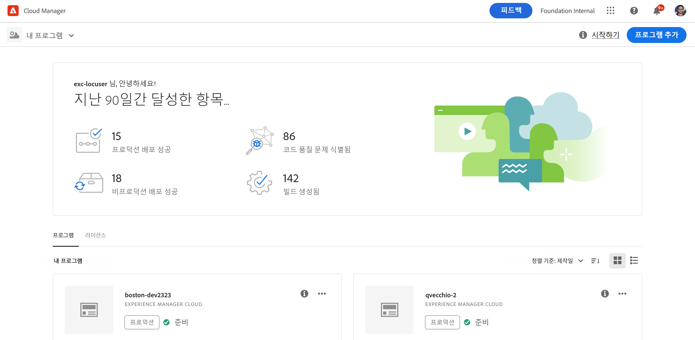
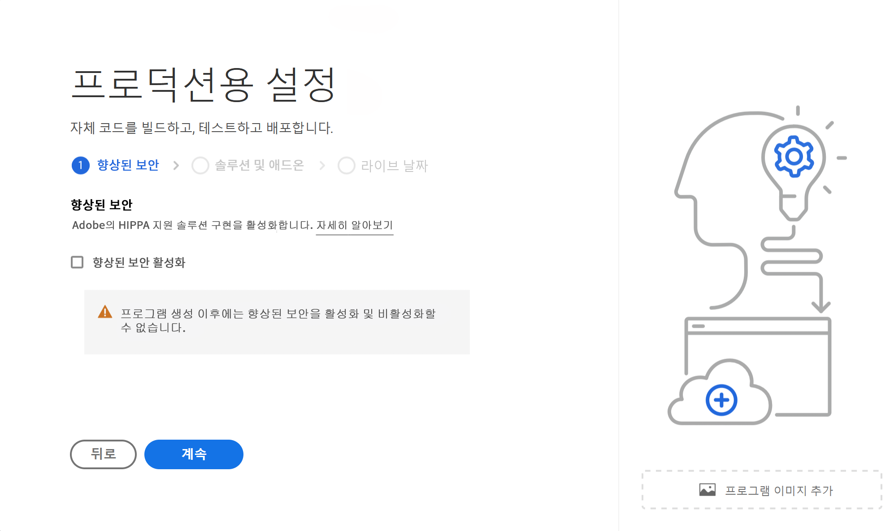
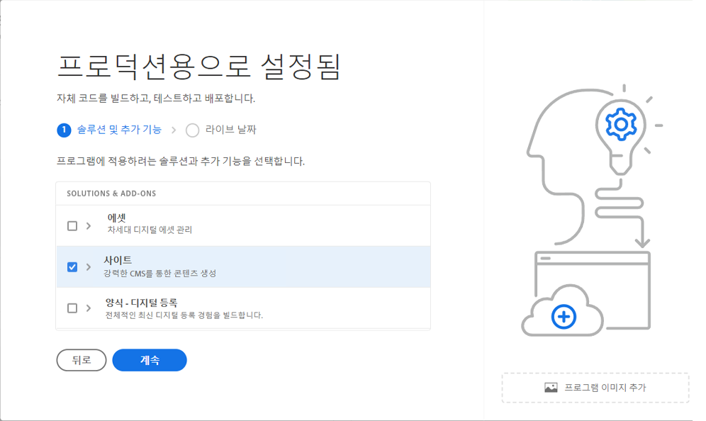
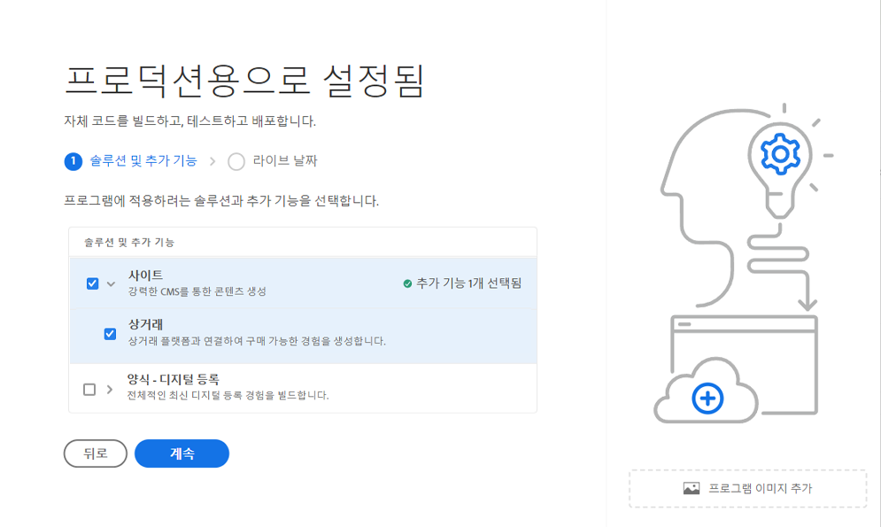
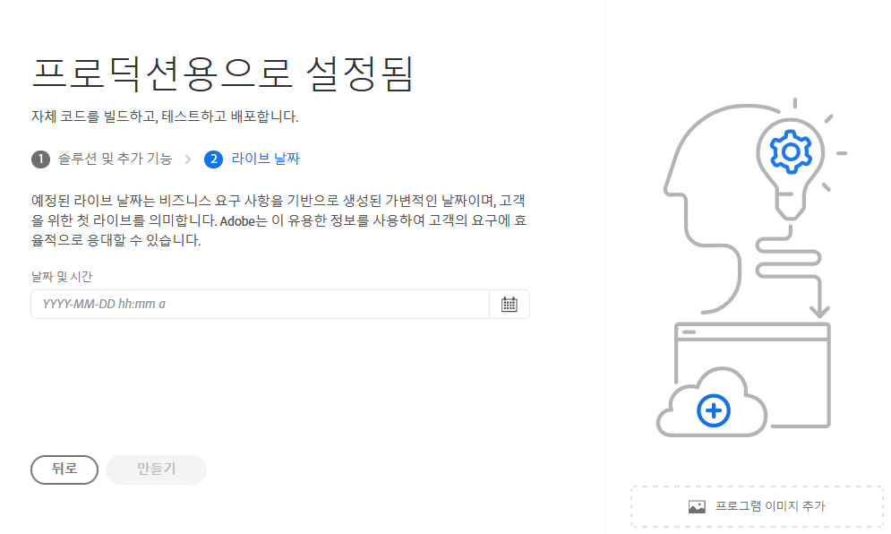
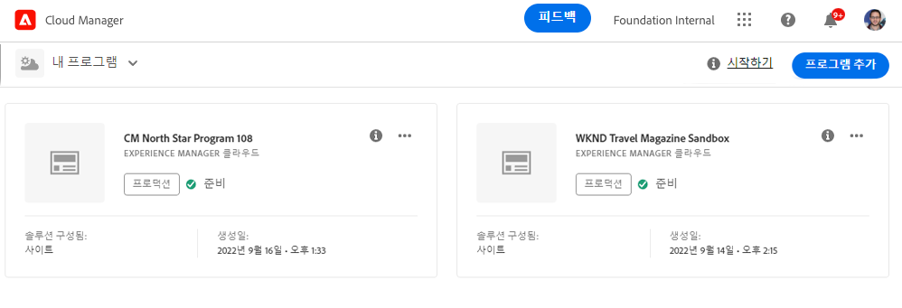
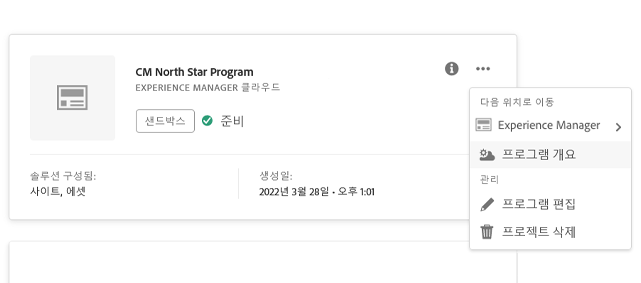
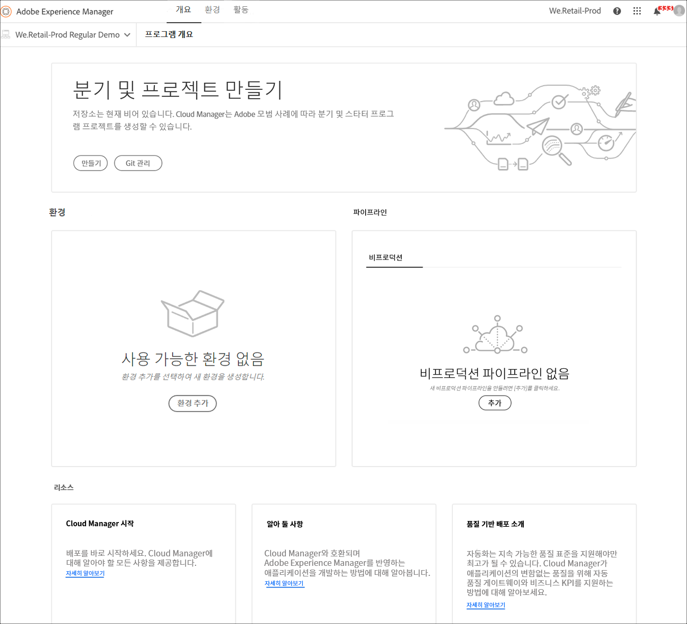

# 프로덕션 프로그램 만들기 {#create-production-program}

프로덕션 프로그램은 AEM 및 Cloud Manager에 익숙하고 라이브 트래픽을 호스팅하기 위해 배포할 목적으로 코드 작성, 빌드 및 테스트를 시작할 준비가 된 사용자를 대상으로 합니다.

프로그램 유형에 대한 자세한 내용은 [프로그램 및 프로그램 유형 이해](program-types.md) 문서를 참조하십시오.

## 비디오 튜토리얼 {#video-tutorials}

이 두 튜토리얼 비디오를 통해 Cloud Manager에서 프로그램을 만드는 방법을 배우거나 [문서화된 지침을 따를 수 있습니다.](#create)

>[!VIDEO](https://video.tv.adobe.com/v/334953)

>[!VIDEO](https://video.tv.adobe.com/v/334954)

## 프로덕션 프로그램 만들기 {#create}

다음 단계에 따라 프로덕션 프로그램을 만듭니다.

1. [my.cloudmanager.adobe.com](https://my.cloudmanager.adobe.com/)에서 Cloud Manager에 로그인한 다음 적절한 조직을 선택합니다.

1. 화면 오른쪽 상단에서 **프로그램 추가**&#x200B;를 클릭합니다.

   

1. 프로그램 만들기 마법사에서 **프로덕션 설정**&#x200B;을 선택하여 프로덕션 프로그램을 만듭니다.

   1. 기본 프로그램 이름을 적용하거나 편집할 수 있습니다.
   1. 선택적으로 축소판 이미지를 드래그하여 놓아 프로그램을 식별할 수 있습니다.
   1. **계속**&#x200B;을 탭하거나 클릭합니다.

   

1. 보안 권한을 강화한 경우에는 **향상된 보안** 탭에는 다음과 같은 옵션이 제공됩니다 **고급 보안 사용** 제작 프로그램의 경우 필요한 경우 옵션을 선택하여 고급 보안을 활성화하고 를 탭하거나 클릭합니다 **계속**.

   * 프로그램을 만든 후에는 향상된 보안을 사용하거나 사용하지 않도록 설정할 수 없습니다.
   * [추가 정보](https://www.adobe.com/go/hipaa-ready) Adobe의 HIPAA 지원 솔루션 구현에 대해 설명합니다.

   

1. **솔루션 및 추가 기능** 탭에서 프로그램에 포함할 솔루션을 선택합니다.

   * 을(를) 선택한 경우 **고급 보안 사용** 이전에는 HIPAA 자격을 사용할 수 있는 솔루션만 선택할 수 있었습니다.

   

1. 솔루션 이름 앞의 V자형 화살표를 클릭하면 **Sites**&#x200B;에서 **Commerce** 추가 기능 옵션을 선택하는 것과 같은 선택적 추가 기능이 표시됩니다.

   

1. 솔루션 및 추가 기능을 선택한 상태에서 **계속**&#x200B;을 클릭합니다.

1. **Go-Live 날짜** 탭에서 프로덕션 프로그램을 실행하기로 계획한 날짜를 입력합니다.

   

   * 이 날짜는 언제든지 편집할 수 있습니다.
   * 이 날짜는 정보용으로만 제공되며 프로그램 개요 페이지에서 Go Live 위젯을 트리거하여 AEM as a Cloud Service 모범 사례 문서에 대한 제품 내 링크를 적시에 제공함으로써 여정에 맞춰 성공적이고 원활한 Go Live 경험을 제공합니다.

1. **만들기**&#x200B;를 클릭합니다.

프로그램은 Cloud Manager에 의해 만들어지며 랜딩 페이지에 표시되고 선택 가능합니다.

## 프로그램 액세스 {#acessing}

1. 랜딩 페이지에 프로그램 카드가 표시되면 줄임표 버튼을 선택하여 사용 가능한 메뉴 옵션을 확인합니다.

   

1. **프로그램 개요**&#x200B;를 선택하여 Cloud Manager의 **개요** 페이지로 이동합니다.

1. 개요 페이지의 기본 콜 투 액션 카드는 환경, 비프로덕션 파이프라인 및 마지막으로 프로덕션 파이프라인을 만드는 과정을 안내합니다.

   

언제든지 다른 프로그램으로 전환하거나 개요 페이지로 돌아가서 다른 프로그램을 만들어야 하는 경우 화면 왼쪽 상단에 있는 프로그램 이름을 클릭하여 **다음으로 이동** 옵션을 표시합니다.

>[!NOTE]
>
>[샌드박스 프로그램](introduction-sandbox-programs.md#auto-creation)과 달리 프로덕션 프로그램에서는 적절한 Cloud Manager 역할의 사용자가 프로젝트를 만들고 셀프서비스 UI를 통해 환경을 추가해야 합니다.
