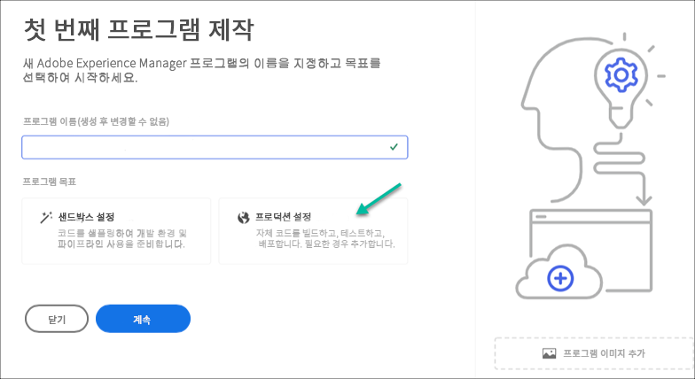

# 제작 프로그램 만들기 {#create-production-program}

프로덕션 프로그램은 AEM 및 Cloud Manager에 익숙하고 라이브 트래픽을 호스팅하기 위해 코드 작성을 시작하기 위한 준비가 된 사용자를 위한 것입니다.

문서의 프로그램 유형에 대해 자세히 알아보기 [프로그램 및 프로그램 유형 이해](program-types.md)

## 비디오 Tutorials {#video-tutorials}

이 두 자습서 비디오를 시청하여 Cloud Manager에서 프로그램을 만드는 방법을 학습하거나 [문서화된 지침을 따르십시오.](#create)

>[!VIDEO](https://video.tv.adobe.com/v/334953)

>[!VIDEO](https://video.tv.adobe.com/v/334954)

## 프로덕션 프로그램 만들기 {#create}

다음 단계에 따라 프로덕션 프로그램을 만듭니다.

1. [my.cloudmanager.adobe.com](https://my.cloudmanager.adobe.com/)에서 Cloud Manager에 로그인한 다음 적절한 조직을 선택합니다.

1. 클릭 **프로그램 추가** 화면 오른쪽 상단 모서리에서 을(를) 클릭합니다.

   

1. 선택 **프로덕션에 대해 설정** 프로그램 만들기 마법사에서 프로덕션 프로그램을 만듭니다. 기본 프로그램 이름을 적용하거나 편집하려면 먼저 **계속**.

   

1. 설정 **솔루션 및 추가 기능** 탭에서 프로그램에 포함할 솔루션을 선택합니다.

   

1. 솔루션 이름 앞에 있는 V자형 화살표를 클릭하여 선택 사항과 같은 선택적 추가 기능을 표시합니다 **상거래** 아래의 추가 옵션 **Sites**.

   

1. 솔루션 및 추가 기능을 선택하고 **계속**.

1. 설정 **Go-Live 날짜** 탭에서 생산 프로그램을 실행할 일자를 입력합니다.

   

   * 이 날짜는 언제든지 편집할 수 있습니다.
   * 이 날짜는 정보 제공용으로만 사용되며 프로그램 개요 페이지에서 Go Live 위젯을 트리거하여 여정을 성공적이고 원활한 Go Live 경험으로 정점에 맞게 AEM as a Cloud Service Best Practice 설명서에 대한 제품 내 링크를 적시에 제공합니다.

1. **만들기**&#x200B;를 클릭합니다.

프로그램은 Cloud Manager에서 만들며 랜딩 페이지에서 표시되고 선택할 수 있습니다.

## 프로그램 액세스 {#acessing}

1. 랜딩 페이지에 프로그램 카드가 표시되면 생략 부호 버튼을 선택하여 사용 가능한 메뉴 옵션을 확인합니다.

   

1. 선택 **프로그램 개요** Cloud Manager의 **개요** 페이지.

1. 개요 페이지의 기본 클릭유도문안 카드는 환경, 비프로덕션 파이프라인 및 최종 프로덕션 파이프라인을 만드는 과정을 안내합니다.

   

언제든지 다른 프로그램으로 전환하거나 개요 페이지로 돌아가 다른 프로그램을 만들어야 하는 경우 화면 왼쪽 상단의 프로그램 이름을 클릭하여 **다음으로 이동** 선택 사항입니다.

>[!NOTE]
>
>와 달리 [샌드박스 프로그램,](introduction-sandbox-programs.md#auto-creation) 프로덕션 프로그램을 사용하려면 적절한 Cloud Manager 역할의 사용자가 셀프 서비스 UI를 통해 프로젝트를 만들고 환경을 추가해야 합니다.
