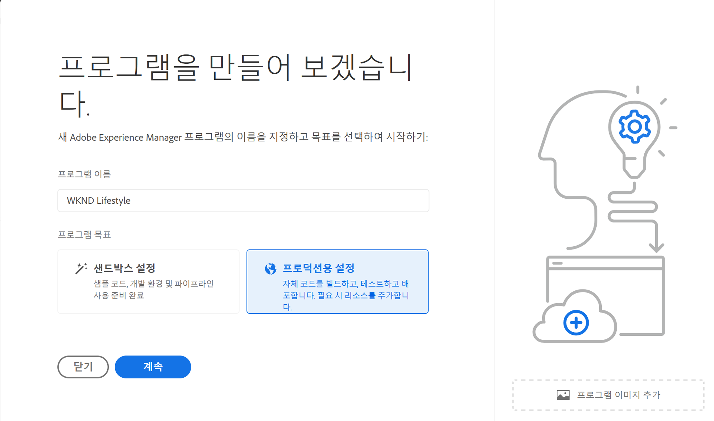

# 프로덕션 프로그램 만들기 {#create-production-program}

프로덕션 프로그램은 AEM 및 Cloud Manager에 익숙하고 라이브 트래픽을 호스팅하기 위해 배포할 목적으로 코드 작성, 빌드 및 테스트를 시작할 준비가 된 사용자를 대상으로 합니다.

프로그램 유형에 대한 자세한 내용은 [프로그램 및 프로그램 유형 이해](program-types.md) 문서를 참조하십시오.

## 프로덕션 프로그램 만들기 {#create}

다음 단계에 따라 프로덕션 프로그램을 만듭니다. 조직의 권한에 따라 다음을 확인할 수 있습니다. [추가 옵션](#options) 프로그램을 추가할 때.

1. [my.cloudmanager.adobe.com](https://my.cloudmanager.adobe.com/)에서 Cloud Manager에 로그인한 다음 적절한 조직을 선택합니다.

1. 다음에서 **[내 프로그램](/help/implementing/cloud-manager/navigation.md#my-programs)** 콘솔, 탭 또는 클릭 **프로그램 추가** 을 클릭합니다.

   

1. 프로그램 만들기 마법사에서 **프로덕션 설정**&#x200B;을 선택하여 프로덕션 프로그램을 만들고 프로그램 이름을 제공합니다.

   

1. 필요한 경우, 파일 브라우저에서 이미지를 선택하려면 이미지 파일을 **프로그램 이미지 추가** 타깃으로 드래그 앤 드롭하거나 클릭하여 이미지를 프로그램에 추가할 수 있습니다. **계속**&#x200B;을 선택합니다.

1. **솔루션 및 추가 기능** 탭에서 프로그램에 포함할 솔루션을 선택합니다.

   * 사용 허가된 여러 솔루션에 대해 하나 이상의 프로그램이 필요한지 확실하지 않은 경우 가장 관심이 있는 프로그램을 선택합니다. 나중에 [프로그램을 편집](/help/implementing/cloud-manager/getting-access-to-aem-in-cloud/editing-programs.md)하여 추가 솔루션을 활성화할 수 있습니다. 프로그램 설정 권장 사항에 대한 자세한 내용은 [프로덕션 프로그램 소개 문서](/help/implementing/cloud-manager/getting-access-to-aem-in-cloud/introduction-production-programs.md)를 참조하십시오.
   * 프로그램 제작에는 하나 이상의 솔루션이 필요합니다.
   * 다음을 선택한 경우 **[향상된 보안 활성화](#security)** 옵션을 선택하면 HIPAA 권한을 사용할 수 있는 만큼의 솔루션만 선택할 수 있습니다.

   

1. 솔루션 이름 앞의 V자형 화살표를 클릭하면 **상거래** 추가 기능 옵션 **사이트**.

   

1. 솔루션 및 추가 기능을 선택한 상태에서 **계속**&#x200B;을 클릭합니다.

1. **Go-Live 날짜** 탭에서 프로덕션 프로그램을 실행하기로 계획한 날짜를 입력합니다.

   

   * 이 날짜는 언제든지 편집할 수 있습니다.
   * 이 날짜는 정보 제공용으로만 사용되며 [**프로그램 개요** 페이지](/help/implementing/cloud-manager/getting-access-to-aem-in-cloud/editing-programs.md#program-overview) 성공적이고 원활한 Go-Live 경험을 통해 여정에 맞춰 적시에 AEM as a Cloud Service 모범 사례 설명서에 대한 제품 내 링크를 제공할 수 있습니다.

1. **만들기**&#x200B;를 클릭합니다.

프로그램은 Cloud Manager에 의해 만들어지며 랜딩 페이지에 표시되고 선택 가능합니다.

## 추가 프로덕션 프로그램 옵션 {#options}

조직에서 사용할 수 있는 권한에 따라 프로덕션 프로그램을 만들 때 사용할 수 있는 추가 옵션이 있을 수 있습니다.

### 보안 {#security}

필요한 권한이 있는 경우 **보안** 탭은 의 첫 번째 탭으로 표시됩니다. **프로덕션용 설정** 대화 상자.

다음 **보안** 탭은 활성화 옵션을 제공합니다. **HIPAA** 및/또는 **WAF-DDOS 보호** 프로덕션 프로그램용입니다.

Adobe HIPAA 준수 및 WAF(Web Application Firewall)는 취약점으로부터 보호하기 위한 다층적 접근 방식의 일부로서 클라우드 기반 보안을 용이하게 합니다.

* **HIPAA** - 이 옵션은 Adobe의 HIPPA 지원 솔루션 구현을 활성화합니다.
   * Adobe의 HIPAA 준비 솔루션 구현에 대해 [자세히 알아보십시오](https://www.adobe.com/go/hipaa-ready_kr).
   * 프로그램 생성 후에는 HIPAA를 활성화하거나 비활성화할 수 없습니다.
* **WAF-DDOS 보호** - 이 옵션을 사용하면 규칙을 통해 웹 응용 프로그램 방화벽을 사용하여 응용 프로그램을 보호할 수 있습니다.
   * 활성화되면 를 설정하여 WAF-DDOS 보호를 구성할 수 있습니다. [비프로덕션 파이프라인.](/help/implementing/cloud-manager/configuring-pipelines/configuring-non-production-pipelines.md)
   * 문서 보기 [WAF 규칙을 포함한 트래픽 필터 규칙](/help/security/traffic-filter-rules-including-waf.md) 저장소 내 트래픽 필터 규칙을 관리하여 올바르게 배포하는 방법에 대해 알아봅니다.

### SLA {#sla}

필요한 권한이 있는 경우 **SLA** 탭은에서 두 번째 또는 세 번째 탭으로 표시됩니다. **프로덕션용 설정** 대화 상자.

AEM Sites은 표준 99.9% SLA(서비스 수준 계약)를 제공합니다. 다음 **99.99% 서비스 수준 계약** 옵션은 프로덕션 환경에 대해 99.99%의 최소 가동 시간 비율을 제공합니다.

99.99%의 SLA는 가용성 향상, 지연 시간 단축 등의 이점을 제공하며 [추가 게시 영역](/help/implementing/cloud-manager/manage-environments.md#multiple-regions) 를 프로그램에서 프로덕션 환경에 적용할 수 있습니다.

한 번 [요구 사항](#sla-requirements) 99.99% SLA를 사용하려면 다음을 실행해야 합니다. [전체 스택 파이프라인](/help/implementing/cloud-manager/configuring-pipelines/configuring-production-pipelines.md) 활성화.

#### 99.99% SLA 요구 사항 {#sla-requirements}

필요한 자격 요건 외에 99.99%의 SLA에 추가 사용 요건이 있습니다.

* 프로그램에 99.99% SLA를 적용할 때 조직에서 99.99% SLA 및 추가 게시 영역 권한을 모두 사용할 수 있어야 합니다.
* 프로그램에 99.99% SLA를 적용하기 위해 Cloud Manager는 가 사용되지 않는지 확인합니다 [추가 게시 영역](/help/implementing/cloud-manager/manage-environments.md#multiple-regions) 자격 부여 또한 사용할 수 있으며 프로그램에 적용할 수 있습니다.
* 프로그램을 편집할 때 하나 이상의 추가 게시 영역이 있는 프로덕션 환경이 이미 포함되어 있는 경우 Cloud Manager는 99.99%의 SLA 자격 부여의 사용 가능성만 확인합니다.
* 99.99% SLA 및 보고가 활성화되려면 다음을 수행합니다. [프로덕션/스테이징 환경](/help/implementing/cloud-manager/manage-environments.md#adding-environments) 은(는) 을(를) 만들어야 하며 하나 이상의 추가 게시 영역이 프로덕션/스테이징 환경에 적용되어야 합니다.
   * 사용 중인 경우 [고급 네트워킹,](/help/security/configuring-advanced-networking.md) 다음을 확인하십시오. [새 환경에 여러 게시 영역 추가](/help/implementing/cloud-manager/manage-environments.md#adding-regions) 지역 장애 발생 시 연결이 유지되도록 권장 사항을 문서화합니다.
* 하나 이상의 추가 게시 영역은 99.99% SLA 프로그램에 유지되어야 합니다. 사용자는 99.99% SLA 프로그램에서 마지막 추가 게시 영역을 삭제할 수 없습니다.
* Sites 솔루션이 활성화된 프로덕션 프로그램에 대해서는 99.99%의 SLA가 지원됩니다.
* 다음을 실행해야 합니다. [전체 스택 파이프라인](/help/implementing/cloud-manager/configuring-pipelines/configuring-production-pipelines.md) 99.99% SLA를 활성화(또는 프로그램 편집 시 비활성화)하려면 다음을 수행합니다.

## 프로그램 액세스 {#accessing}

1. 랜딩 페이지에 프로그램 카드가 표시되면 줄임표 버튼을 선택하여 사용 가능한 메뉴 옵션을 확인합니다.

   

1. **프로그램 개요**&#x200B;를 선택하여 Cloud Manager의 **개요** 페이지로 이동합니다.

1. 개요 페이지의 기본 콜 투 액션 카드는 환경, 비프로덕션 파이프라인 및 마지막으로 프로덕션 파이프라인을 만드는 과정을 안내합니다.

   

>[!TIP]
>
>문서를 참조하십시오. [Cloud Manager UI 탐색](/help/implementing/cloud-manager/navigation.md) cloud Manager 탐색 방법 및 이해 **내 프로그램** 콘솔.

>[!NOTE]
>
>[샌드박스 프로그램](introduction-sandbox-programs.md#auto-creation)과 달리 프로덕션 프로그램에서는 적절한 Cloud Manager 역할의 사용자가 프로젝트를 만들고 셀프서비스 UI를 통해 환경을 추가해야 합니다.
