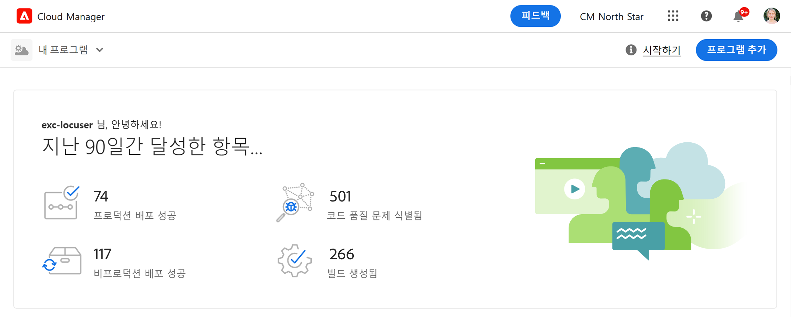
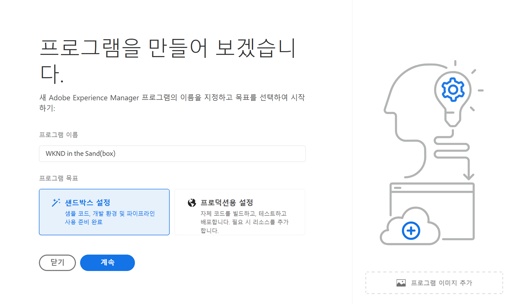
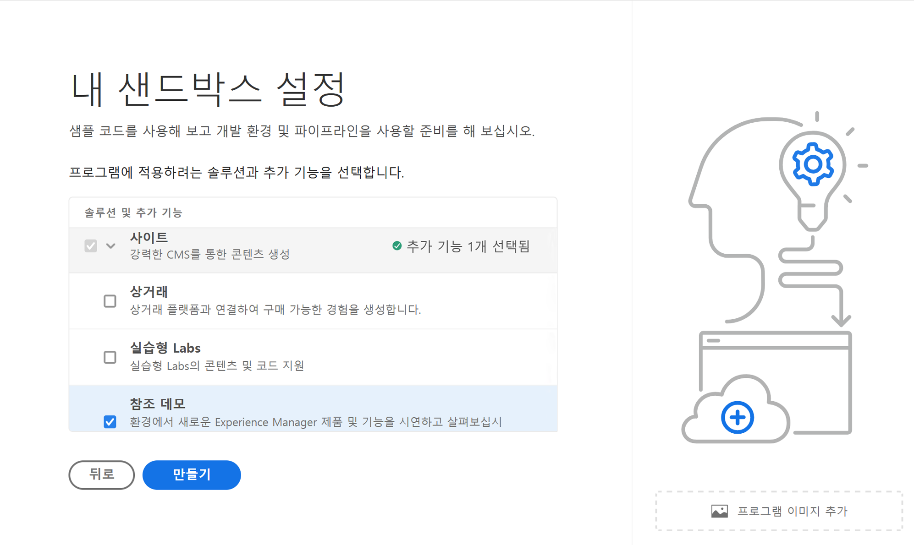
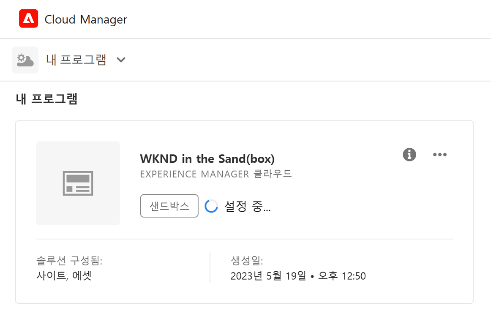
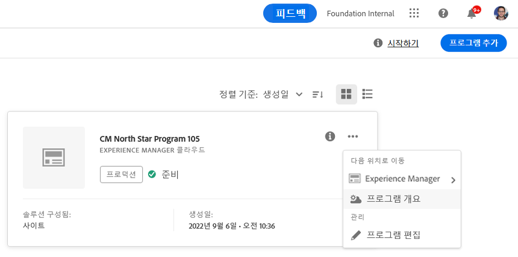
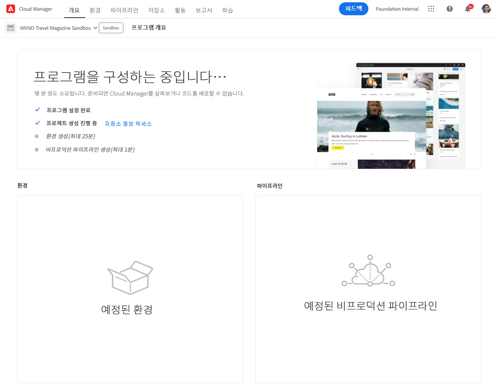
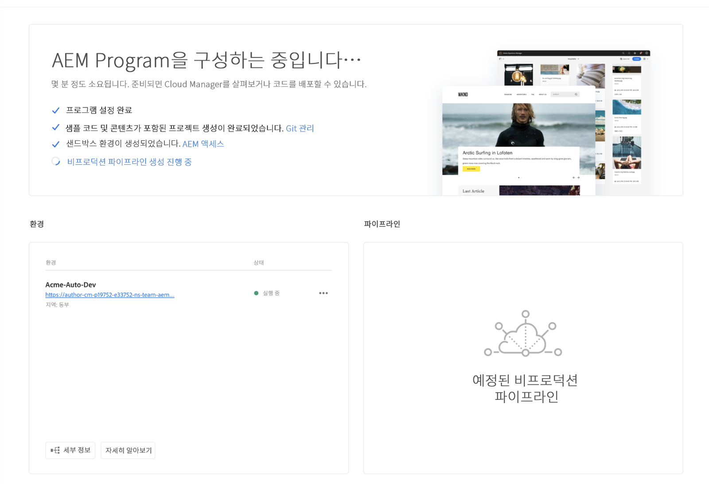
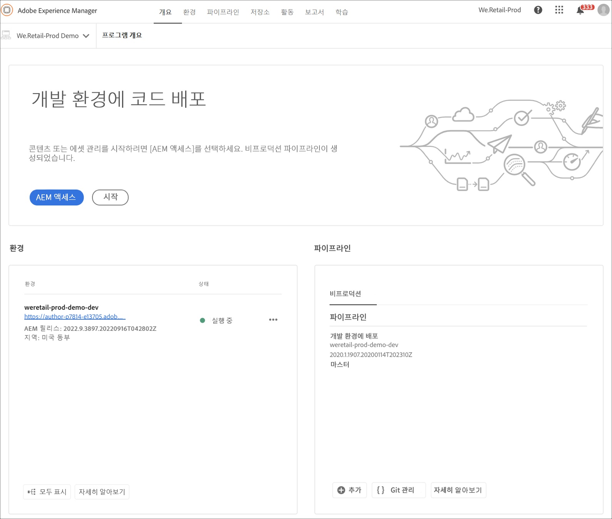
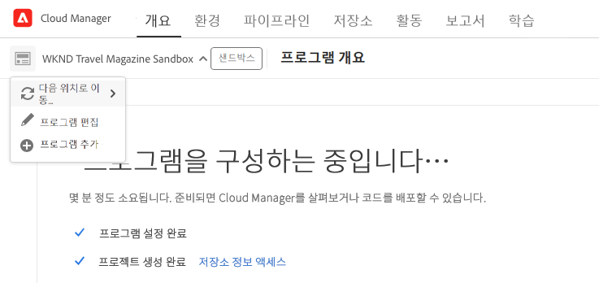

# 샌드박스 프로그램 만들기 {#create-sandbox-program}

샌드박스 프로그램은 일반적으로 교육, 데모 실행, 지원, POC 또는 문서화 목적으로 만들어지며 라이브 트래픽을 전달하기 위한 것이 아닙니다.

프로그램 유형에 대한 자세한 내용은 [프로그램 및 프로그램 유형 이해](program-types.md) 문서를 참조하십시오.

## 샌드박스 프로그램 만들기 {#create}

1. [my.cloudmanager.adobe.com](https://my.cloudmanager.adobe.com/)에서 Cloud Manager에 로그인한 다음 적절한 조직을 선택합니다.

1. Cloud Manager의 랜딩 페이지에서 화면 오른쪽 상단 근처의 **프로그램 추가**&#x200B;를 클릭합니다.

   

1. 프로그램 만들기 마법사에서 **샌드박스 설정**&#x200B;을 선택하고 프로그램 이름을 입력합니다.

   

1. 필요한 경우, 파일 브라우저에서 이미지를 선택하려면 이미지 파일을 **프로그램 이미지 추가** 타깃으로 드래그 앤 드롭하거나 클릭하여 이미지를 프로그램에 추가할 수 있습니다. 선택 **계속**.

   * 이미지는 프로그램 개요 창에서 타일 역할만 하며 프로그램을 식별하는 데 도움이 됩니다.

1. 다음에서 **샌드박스 설정** 대화 상자에서 샌드박스 프로그램에서 활성화할 솔루션을 선택합니다. **솔루션 및 추가 기능** 테이블.

   * 솔루션 이름 옆 갈매기 모양 표시를 사용하여 솔루션에 대한 추가적인 옵션 추가 기능을 표시합니다.

   * **Sites** 및 **Assets** 솔루션은 샌드박스 프로그램에 항상 포함되고 선택을 해제할 수 없습니다.

   

1. 샌드박스 프로그램용 솔루션 및 추가 기능을 선택한 다음에는 **만들기**&#x200B;를 클릭합니다.

설정 프로세스가 진행됨에 따라 상태 표시기가 있는 새로운 샌드박스 프로그램 카드가 랜딩 페이지에 표시됩니다.

## 샌드박스 액세스 {#access}

프로그램 개요 페이지에서 샌드박스 설정의 세부 정보를 보고 환경에 액세스(사용 가능한 경우)할 수 있습니다.

1. Cloud Manager 랜딩 페이지에서 새로 만든 프로그램의 줄임표 버튼을 클릭합니다.

   

1. 프로젝트 만들기 단계가 완료된 후에 **저장소 정보 액세스** 링크에 액세스하여 git 저장소를 사용할 수 있습니다.

   

   >[!TIP]
   >
   >Git 저장소 액세스 및 관리에 대한 자세한 내용은 [Git 액세스](/help/implementing/cloud-manager/managing-code/accessing-repos.md)를 참조하십시오.

1. 개발 환경이 생성되면 **AEM 액세스** 링크를 사용하여 AEM에 로그인할 수 있습니다.

   

1. 개발에 대한 비프로덕션 파이프라인 배포가 완료되면 마법사가 AEM 개발 환경에 액세스하거나 개발 환경에 코드를 배포하도록 안내합니다.

   

다른 프로그램으로 전환하거나 개요 페이지로 돌아가서 다른 프로그램을 만들어야 하는 경우, 화면 왼쪽 상단에 있는 프로그램 이름을 클릭하여 **다음으로 이동** 옵션을 표시합니다.

