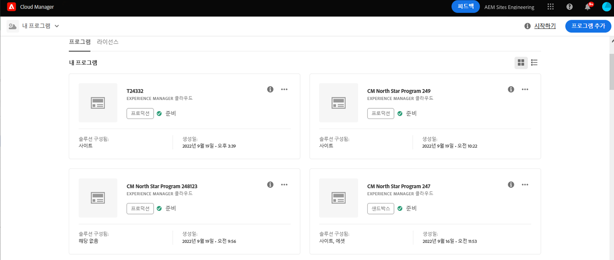
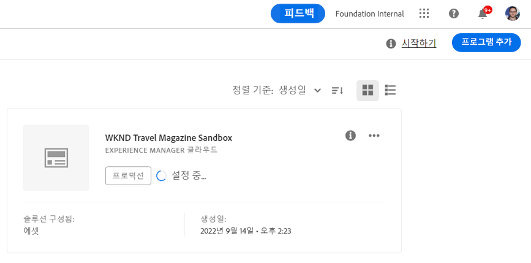

# 샌드박스 프로그램 만들기 {#create-sandbox-program}

샌드박스 프로그램은 일반적으로 교육, 데모 실행, 사용, POC 또는 설명서의 목적을 위해 만들어지며 라이브 트래픽을 전달하지 않습니다.

문서의 프로그램 유형에 대해 자세히 알아보기 [프로그램 및 프로그램 유형 이해](program-types.md)

## 샌드박스 프로그램 만들기 {#create}

다음 단계에 따라 샌드박스 프로그램을 만듭니다.

1. [my.cloudmanager.adobe.com](https://my.cloudmanager.adobe.com/)에서 Cloud Manager에 로그인한 다음 적절한 조직을 선택합니다.

1. Cloud Manager의 랜딩 페이지에서 클릭 **프로그램 추가** 화면 오른쪽 상단 모서리에서 을(를) 클릭합니다.

   

1. 프로그램 만들기 마법사에서 **샌드박스 설정**&#x200B;에서 프로그램 이름을 제공한 다음 **만들기**.

   

설정 프로세스가 진행되면 상태 표시기가 있는 새 샌드박스 프로그램 카드가 랜딩 페이지에 표시됩니다.

## 샌드박스 액세스 {#access}

프로그램 개요 페이지를 보고 샌드박스 설정의 세부 사항을 보고 환경(사용 가능한 한 후)에 액세스할 수 있습니다.

1. Cloud Manager 랜딩 페이지에서 새로 만든 프로그램의 줄임표 단추를 클릭합니다.

   

1. 프로젝트 생성 단계가 완료되면 **보고서 정보에 액세스** 링크를 클릭하여 git 보고서를 사용할 수 있습니다.

   

   >[!TIP]
   >
   >Git 리포지토리 액세스 및 관리에 대한 자세한 내용은 문서를 참조하십시오 [Git 액세스.](/help/implementing/cloud-manager/managing-code/accessing-repos.md)

1. 개발 환경이 만들어지면 **AEM 액세스** AEM에 로그인하기 위한 링크입니다.

   

1. 개발에 비프로덕션 파이프라인을 배포하면 마법사는 AEM 개발 환경에 액세스하거나 코드를 개발 환경에 배포하도록 안내합니다.

   

언제든지 다른 프로그램으로 전환하거나 개요 페이지로 돌아가 다른 프로그램을 만들어야 하는 경우 화면 왼쪽 상단의 프로그램 이름을 클릭하여 **다음으로 이동** 선택 사항입니다.

