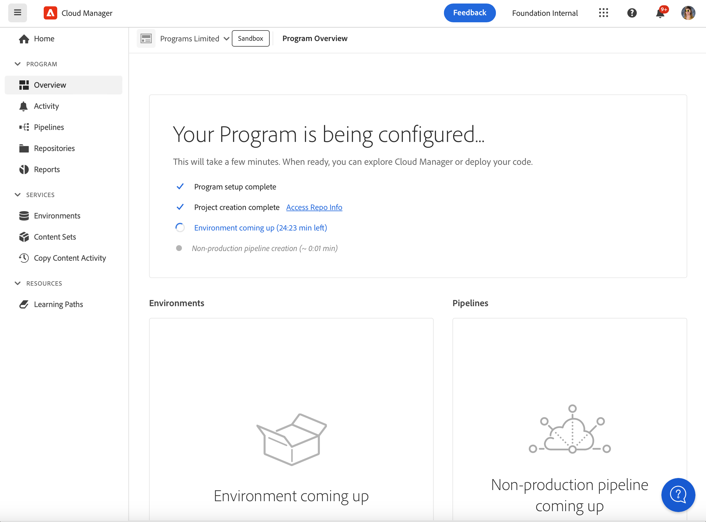

# 샌드박스 프로그램 만들기 {#create-sandbox-program}

샌드박스 프로그램은 일반적으로 교육, 데모 실행, 활성화, POC 또는 문서화 목적으로 만들어지며 라이브 트래픽을 전달하기 위한 것이 아닙니다. [샌드박스 프로그램 소개](/help/implementing/cloud-manager/getting-access-to-aem-in-cloud/introduction-sandbox-programs.md)를 참조하세요.

프로그램 유형에 대한 자세한 내용은 [프로그램 및 프로그램 유형 이해](program-types.md) 문서를 참조하십시오.

## 샌드박스 프로그램 만들기 {#create}

1. [my.cloudmanager.adobe.com](https://my.cloudmanager.adobe.com/)에서 Cloud Manager에 로그인한 다음 적절한 조직을 선택합니다.

1. 오른쪽 상단 근처에 있는 **[내 프로그램](/help/implementing/cloud-manager/navigation.md#my-programs)** 콘솔에서 **프로그램 추가**&#x200B;를 클릭합니다.

   

1. *프로그램 만들기* 마법사의 **프로그램 이름** 텍스트 필드에 프로그램에 사용할 이름을 입력합니다.

1. **프로그램 목표**&#x200B;에서  **샌드박스 설정**&#x200B;을 선택합니다.

   

1. (선택 사항) 마법사 대화 상자의 오른쪽 아래 모서리에서 다음 중 하나를 수행합니다.

   * 이미지 파일을  **프로그램 이미지 추가** 대상으로 끌어다 놓습니다.
   *  **프로그램 이미지 추가**&#x200B;를 클릭한 다음 파일 브라우저에서 이미지를 선택합니다.
   * 추가한 이미지를 제거하려면 을 클릭하세요.

1. **계속**&#x200B;을 클릭합니다.

1. **솔루션 및 추가 기능** 목록 상자에서 프로그램에 포함할 하나 이상의 솔루션을 선택합니다.

   * 솔루션 이름 왼쪽에 있는 V자형 화살표를 클릭하여 선택한 솔루션에 포함할 사용 가능한 선택적 추가 기능을 표시합니다.
   * 샌드박스 프로그램을 만들 때 **Sites**, **Assets** 및 **Edge Deliver Services** 솔루션이 항상 기본적으로 선택됩니다. 이러한 옵션은 선택 취소할 수 없습니다.

   

1. **만들기**&#x200B;를 클릭합니다. Cloud Manager은 샌드박스 프로그램을 만들고 랜딩 페이지에 표시하여 선택합니다.

## 샌드박스 액세스 {#access}

새 샌드박스 프로그램 만들기가 완료되면 프로그램 개요 페이지에서 샌드박스 설정의 세부 정보를 보고 환경에 액세스할 수 있습니다.

1. Cloud Manager 랜딩 페이지의 샌드박스 프로그램에서 만든 샌드박스 프로그램의 을 클릭합니다.

   

1. 프로젝트 만들기 단계가 완료되면 **저장소 정보 액세스** 링크를 클릭하여 git 저장소를 사용할 수 있습니다.

   

   >[!TIP]
   >
   >Git 저장소 액세스 및 관리에 대한 자세한 내용은 [Git 액세스](/help/implementing/cloud-manager/managing-code/accessing-repos.md)를 참조하십시오.

1. 개발 환경이 만들어지면 **AEM 액세스**&#x200B;를 클릭하고 AEM에 로그인할 수 있습니다.

   

1. 개발에 대한 비프로덕션 파이프라인 배포가 완료되면 콜 투 액션 의 마법사가 AEM 개발 환경에 액세스하거나 개발 환경에 코드를 배포하도록 안내합니다.

   

>[!TIP]
>
>Cloud Manager 탐색 방법 및 **내 프로그램** 콘솔 이해에 대한 자세한 내용은 [Cloud Manager UI 탐색](/help/implementing/cloud-manager/navigation.md)을 참조하십시오.
