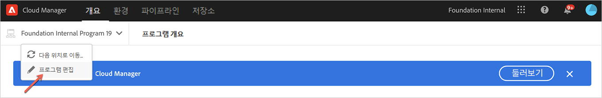
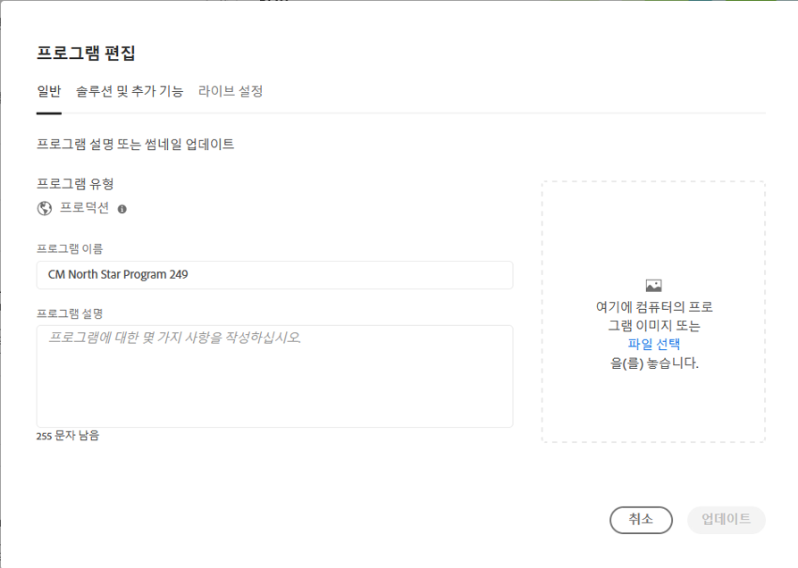
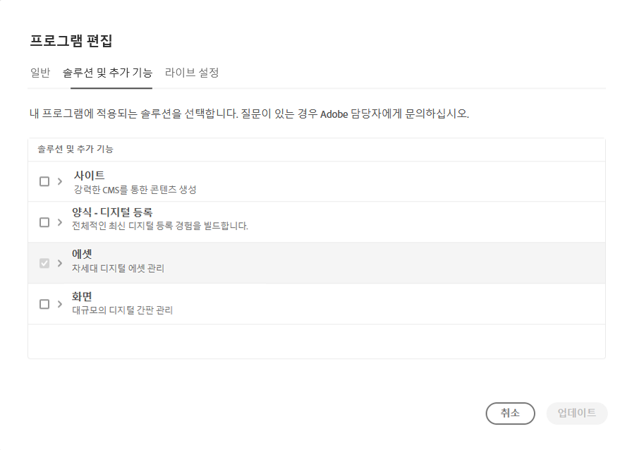
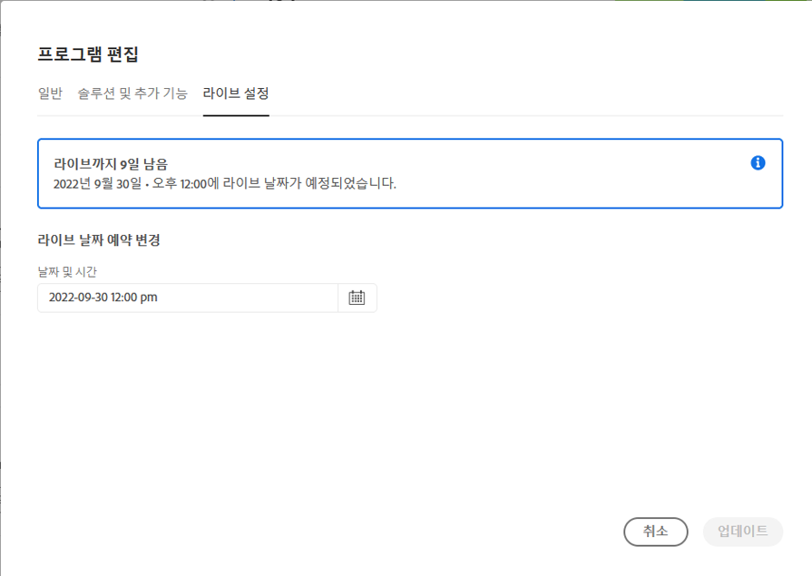
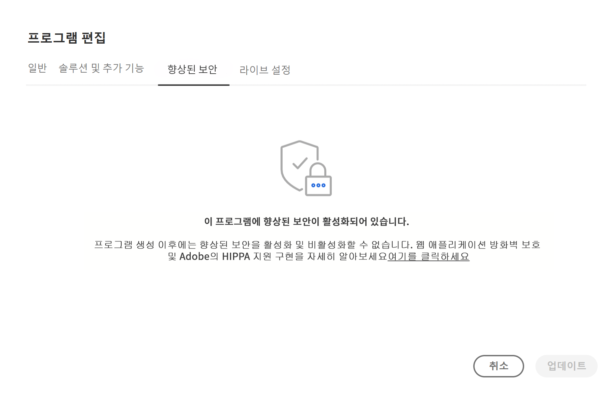
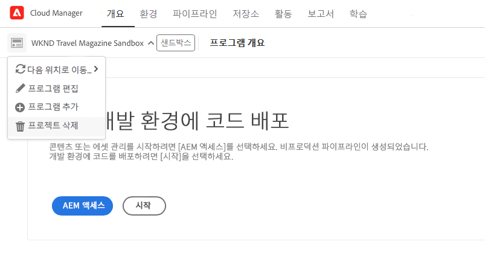
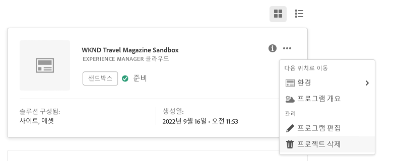

# 프로그램 편집 {#editing-programs}

필요한 권한이 있는 사용자는 [조직에서 만든 프로덕션 프로그램](creating-production-programs.md)과 [조직에서 만든 샌드박스 프로그램](creating-sandbox-programs.md)을 편집할 수 있습니다. 프로그램을 편집하여 다음과 같은 작업을 수행할 수 있습니다.

* Assets가 있는 기존 프로그램에 Sites 솔루션을 추가하거나 그 반대로 할 수 있습니다.
* Sites와 Assets가 모두 있는 기존 프로그램에서 Sites 또는 Assets를 제거할 수 있습니다.
* 두 번째 미사용 솔루션 권한을 기존 프로그램에 추가하거나 새 프로그램으로 추가합니다.
* 샌드박스 프로그램을 삭제합니다.

## 권한 {#permissions}

프로그램을 편집하거나 샌드박스 프로그램을 삭제하려면 **비즈니스 소유자** 역할의 멤버여야 합니다.

## 프로그램 편집 {#editing}

프로그램을 편집하려면 다음 단계를 따르십시오.

1. [my.cloudmanager.adobe.com](https://my.cloudmanager.adobe.com/)에서 Cloud Manager에 로그인한 다음 적절한 조직을 선택합니다.

1. 편집하려는 프로그램을 클릭하면 세부 정보가 표시됩니다.

1. 페이지 왼쪽 상단에서 프로그램 이름을 클릭하고 **프로그램 편집**&#x200B;을 선택합니다.

   

1. **프로그램 편집** 페이지가 열립니다. **일반** 탭에서 프로그램 이름과 설명을 편집합니다.

   * 프로그램에 대해 솔루션을 하나 이상 선택해야 합니다.

   

1. **솔루션 및 추가 기능** 탭에서 프로그램에 대한 솔루션을 수정합니다.

   

1. 솔루션 이름 앞의 V자형 화살표를 클릭하면 **Sites**&#x200B;에서 **Commerce** 추가 기능 옵션을 선택하는 것과 같은 선택적 추가 기능이 표시됩니다.

   

1. **Go-Live 설정** 탭에서 프로그램의 계획된 Go-Live 날짜를 수정합니다.

   

   * 이 날짜는 정보용으로만 제공되며 프로그램 개요 페이지에서 Go Live 위젯을 트리거하여 AEM as a Cloud Service 모범 사례 문서에 대한 제품 내 링크를 적시에 제공함으로써 여정에 맞춰 성공적이고 원활한 Go Live 경험을 제공합니다.
   * 이 탭은 샌드박스 프로그램에 사용할 수 없습니다.

1. **업데이트**&#x200B;를 클릭하여 프로그램에 대한 변경 사항을 저장합니다.

솔루션 또는 추가 기능 추가 또는 제거를 포함하여 프로그램을 편집할 때마다 이러한 변경 사항은 다음 배포 이후에 적용됩니다.

프로덕션 프로그램에 향상된 보안이 활성화된 경우 추가 **향상된 보안** 탭에서 사용할 수 있습니다. **프로그램 편집** 프로그램에 대해 기능이 활성화되어 있는지 확인하는 창입니다.

프로그램 생성 이후에는 이 설정을 수정할 수 없습니다. 향상된 보안 옵션에 대한 자세한 내용은 [프로덕션 프로그램 만들기](creating-production-programs.md) 문서를 참조하십시오.

## 샌드박스 프로그램 삭제 {#delete-sandbox-program}

샌드박스 프로그램을 삭제하면 관련된 모든 환경 및 파이프라인이 제거됩니다.

>[!TIP]
>
>**비즈니스 소유자** 또는 **배포 관리자** 역할이 있는 사용자는 전체 샌드박스 프로그램 대신 프로덕션 및 스테이징 환경을 삭제할 수 있습니다.

다음 단계에 따라 샌드박스 프로그램을 삭제합니다.

1. [my.cloudmanager.adobe.com](https://my.cloudmanager.adobe.com/)에서 Cloud Manager에 로그인한 다음 적절한 조직을 선택합니다.

1. 편집하려는 프로그램을 클릭하면 세부 정보가 표시됩니다.

1. 페이지 왼쪽 상단에서 프로그램 이름을 클릭하고 **프로그램 삭제**&#x200B;를 선택합니다.

   

또는 Cloud Manager 개요 페이지에서 프로그램 카드의 줄임표 버튼을 클릭하고 **프로그램 삭제**&#x200B;를 선택할 수 있습니다.

>[!NOTE]
>
>샌드박스 프로그램만 삭제할 수 있습니다. 프로덕션 프로그램은 삭제할 수 없습니다.
