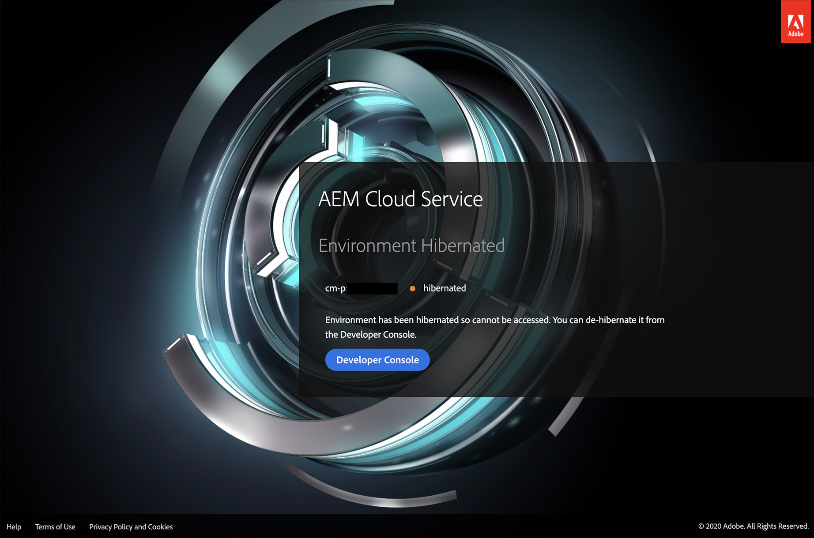

# 샌드박스 환경 최대 절전 모드 설정 및 해제 {#hibernating-introduction}

샌드박스 프로그램 환경에서는 8시간 동안 활동이 감지되지 않는 경우 최대 절전 모드로 전환됩니다. 최대 절전 모드는 샌드박스 프로그램 환경에서만 사용할 수 있습니다. 프로덕션 프로그램 환경에서는 최대 절전 모드로 전환되지 않습니다.

## 최대 절전 모드 {#hibernation-introduction}

최대 절전 모드는 자동 또는 수동으로 발생할 수 있습니다.

* **자동** - 샌드박스 프로그램 환경은 8시간 동안 비활성 상태인 경우 자동으로 최대 절전 모드로 전환됩니다. 비활성은 작성자 서비스나 미리보기 또는 게시 서비스에서 요청을 수신하지 않는 것으로 정의됩니다.
* **수동** - 사용자는 샌드박스 프로그램 환경을 수동으로 최대 절전 모드로 전환할 수 있습니다. 앞서 설명한 대로 최대 절전 모드가 자동으로 실행되므로 이 작업을 수행할 필요가 없습니다.

샌드박스 프로그램 환경이 최대 절전 모드로 전환되는 데는 몇 분 정도 걸릴 수 있습니다. 데이터는 최대 절전 모드 동안 보존됩니다.

### 수동 최대 절전 모드 사용 {#using-manual-hibernation}

Developer Console에서 샌드박스 프로그램을 수동으로 최대 절전 모드로 전환할 수 있습니다. 모든 Cloud Manager 사용자는 샌드박스 프로그램용 Developer Console에 액세스할 수 있습니다.

샌드박스 프로그램 환경을 수동으로 최대 절전 모드로 전환하려면 다음 단계를 따르십시오.

1. [my.cloudmanager.adobe.com](https://my.cloudmanager.adobe.com/)에서 Cloud Manager에 로그인한 다음 적절한 조직을 선택합니다.

1. 최대 절전 모드로 전환하려는 프로그램을 클릭하여 세부 정보를 표시합니다.

1. **환경** 카드에서 줄임표 버튼을 클릭하고 **Developer Console**&#x200B;을 선택합니다.

   * Developer Console에 대한 자세한 내용은 [Developer Console 액세스](/help/implementing/cloud-manager/manage-environments.md#accessing-developer-console) 문서를 참조하십시오.

   

1. Developer Console에서 **최대 절전 모드**&#x200B;를 클릭합니다.

   

1. **최대 절전 모드**&#x200B;를 클릭하여 단계를 확인합니다.

   

최대 절전 모드로 전환되면 **Developer Console** 화면에서 환경에 대한 최대 절전 모드 프로세스 완료 알림이 표시됩니다.

Developer Console에서 **Pod** 드롭다운 위의 경로에서 **환경** 링크를 클릭하여 최대 절전 모드로 전환할 환경 목록을 확인할 수도 있습니다.

## 최대 절전 모드 해제 {#de-hibernation-introduction}

Developer Console에서 샌드박스 프로그램을 수동으로 최대 절전 모드로 전환할 수 있습니다.

>[!IMPORTANT]
>
>**개발자** 역할을 가진 사용자는 샌드박스 프로그램 환경을 최대 절전 모드로 전환할 수 있습니다.

1. [my.cloudmanager.adobe.com](https://my.cloudmanager.adobe.com/)에서 Cloud Manager에 로그인한 다음 적절한 조직을 선택합니다.

1. 최대 절전 모드로 전환하려는 프로그램을 클릭하여 세부 정보를 표시합니다.

1. **환경** 카드에서 줄임표 버튼을 클릭하고 **Developer Console**&#x200B;을 선택합니다.

   * Developer Console에 대한 자세한 내용은 [Developer Console 액세스](/help/implementing/cloud-manager/manage-environments.md#accessing-developer-console) 문서를 참조하십시오.

1. **최대 절전 모드 해제**&#x200B;를 클릭합니다.

   

1. **최대 절전 모드 해제**&#x200B;를 클릭하여 단계를 확인합니다.

   

1. 최대 절전 모드 해제 프로세스가 시작되었고 진행 상황이 업데이트되었다는 알림이 표시됩니다.

   

1. 프로세스가 완료되면 샌드박스 프로그램 환경이 다시 활성화됩니다.

   

Developer Console에서 **Pod** 드롭다운 위의 경로에서 **환경** 링크를 클릭하여 최대 절전 모드를 해제할 환경 목록을 확인할 수도 있습니다.

### 최대 절전 모드 해제 권한 {#permissions-de-hibernate}

AEM as a Cloud Service에 액세스할 수 있는 제품 프로필을 가진 모든 사용자는 **Developer Console**&#x200B;에 액세스하여 환경의 최대 절전 모드를 해제할 수 있어야 합니다.

## 최대 절전 모드 환경 액세스 {#accessing-hibernated-environment}

최대 절전 모드 환경의 작성자, 미리보기 또는 게시 서비스에 대해 브라우저 요청을 하면 서비스가 최대 절전 모드를 해제할 수 있는 Developer Console에 대한 링크와 함께 환경의 최대 절전 모드 상태를 설명하는 랜딩 페이지가 사용자에게 표시됩니다.

## 개발 및 AEM 업데이트 {#deployments-updates}

최대 절전 모드 환경은 여전히 배포 및 수동 AEM 업그레이드를 허용합니다.

* 사용자는 파이프라인을 사용하여 최대 절전 모드 환경에 사용자 정의 코드를 배포할 수 있습니다. 환경은 최대 절전 모드 상태로 유지되며 최대 절전 모드가 해제되면 새 코드가 환경에 나타납니다.

* AEM 업그레이드는 최대 절전 모드 환경에 적용할 수 있으며 Cloud Manager에서 수동으로 트리거할 수 있습니다. 환경은 최대 절전 모드 상태로 유지되며 최대 절전 모드가 해제되면 새 릴리스가 환경에 나타납니다.

## 최대 절전 모드 및 삭제 {#hibernation-deletion}

* 샌드박스 프로그램의 환경은 8시간 동안 비활성 상태인 경우 자동으로 절전 모드로 전환됩니다.
   * 비활성은 작성자 서비스나 미리보기 또는 게시 서비스에서 요청을 수신하지 않는 것으로 정의됩니다.
   * 일단 절전 모드로 전환되면 [수동으로 절전 모드를 해제할 수 있습니다.](#de-hibernation-introduction)
* 샌드박스 프로그램은 연속 최대 절전 모드에서 6개월 후에 삭제되며 그 후 다시 만들 수 있습니다.

>[!NOTE]
>
>샌드박스 환경만 6개월 연속 절전 모드 후에 자동으로 삭제됩니다. 저장소 및 코드가 있는 샌드박스 프로그램은 유지됩니다.
