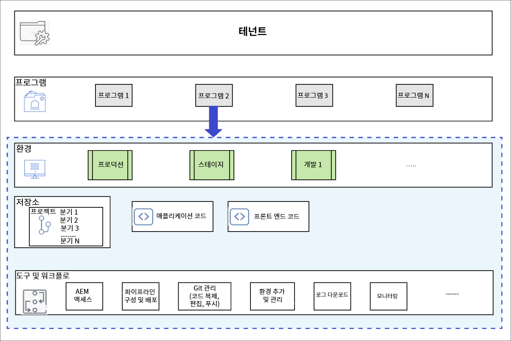

# 프로그램 및 프로그램 유형 {#understanding-programs}

Cloud Manager는 엔티티 계층을 기반으로 구축됩니다. 세부 정보는 Cloud Manager의 일상적인 작업에 중요하지 않지만 개요는 프로그램을 이해하고 자신만의 프로그램을 설정하는 데 도움이 될 수 있습니다.



* **테넌트** - 계층의 최상위입니다. 모든 고객은 테넌트를 사용하여 프로비저닝됩니다.
* **프로그램** - 각 테넌트에는 고객의 라이선스가 부여된 솔루션을 반영하는 하나 이상의 프로그램 [이(가) 있습니다](introduction-production-programs.md).
* **환경** - 각 프로그램에는 라이브 콘텐츠 프로덕션 환경, 스테이징 환경 및 개발 목적의 환경 등 여러 환경이 있습니다.
   * 각 프로그램에는 하나의 프로덕션 환경만 있을 수 있지만 비프로덕션 환경은 여러 개 있을 수 있습니다.
* **저장소** - 프로그램에는 환경을 위해 애플리케이션 및 프론트엔드 코드가 유지되는 Git 저장소가 있습니다.
* **도구 및 워크플로** - 파이프라인은 저장소에서 환경으로의 코드 배포를 관리하는 반면 다른 도구는 로그, 모니터링 및 환경 관리에 대한 액세스를 허용합니다.

이러한 계층 구조를 컨텍스트화하는 데 도움이 되는 예시가 있습니다.

* WKND Travel 및 Adventure Enterprises는 여행 관련 미디어에 중점을 두는 **테넌트**&#x200B;일 수 있습니다.
* WKND Travel 및 Adventure Enterprises 테넌트에는 WKND Magazine용 Sites 프로그램 및 WKND Media용 Assets 프로그램, 이러한 두 개의 **프로그램**&#x200B;이 있을 수 있습니다.
* WKND Magazine 및 WKND Media 프로그램은 모두 개발, 스테이지 및 프로덕션 **환경**&#x200B;을 가질 수 있습니다.

## 소스 코드 저장소 {#source-code-repository}

Cloud Manager 프로그램은 자체 Git 저장소와 함께 자동 프로비저닝됩니다.

사용자는 명령줄 도구와 함께 Git 클라이언트 또는 독립 실행형 시각적 Git 클라이언트를 사용하여 Cloud Manager Git 저장소에 액세스할 수 있습니다. 또는 Eclipse, IntelliJ 또는 NetBeans와 같은 기본 IDE(통합 개발 환경)를 사용할 수 있습니다.

Git 클라이언트가 설정되면 Cloud Manager 사용자 인터페이스에서 Git 저장소를 관리할 수 있습니다. Cloud Manager 사용자 인터페이스를 사용하여 Git을 관리하는 방법에 대한 자세한 내용은 [Git 액세스](/help/implementing/cloud-manager/managing-code/accessing-repos.md)를 참조하십시오.

AEM Cloud 애플리케이션 개발을 시작하려면 Cloud Manager 저장소에서 로컬 컴퓨터로 애플리케이션 코드를 체크 아웃합니다.

```java
$ git clone {URL}
```

워크플로우는 표준 Git 프로세스를 따릅니다.

1. 사용자가 원격 Git 저장소를 로컬로 복제합니다.
1. 사용자가 로컬 저장소에서 변경합니다.
1. 준비가 되면 사용자는 변경 사항을 원격 Git 저장소에 다시 커밋합니다.

유일한 차이점은 원격 Git 저장소가 개발자에게 투명한 Cloud Manager의 일부라는 것입니다.

## 프로그램 유형 {#program-types}

사용자는 **프로덕션** 프로그램 또는 **샌드박스** 프로그램을 만들 수 있습니다.

* **프로덕션 프로그램**&#x200B;은 사이트에 대한 라이브 트래픽을 활성화하기 위해 만들어집니다.
   * 자세한 내용은 [프로덕션 프로그램 소개](/help/implementing/cloud-manager/getting-access-to-aem-in-cloud/introduction-production-programs.md)를 참조하십시오.
* **샌드박스 프로그램**&#x200B;은 일반적으로 교육, 데모 실행, 활성화, POC 또는 문서화 목적으로 만들어집니다.
   * 샌드박스 환경은 라이브 트래픽을 전달하기 위한 것이 아니며 프로덕션 프로그램에는 없는 제한 사항이 있습니다.
   * 여기에는 Sites, Assets 및 Edge Delivery Services이 포함되며 샘플 코드, 개발 환경 및 비프로덕션 파이프라인이 포함된 Git 분기가 미리 채워져 제공됩니다.
   * 자세한 내용은 [샌드박스 프로그램 소개](/help/implementing/cloud-manager/getting-access-to-aem-in-cloud/introduction-sandbox-programs.md)를 참조하십시오.
