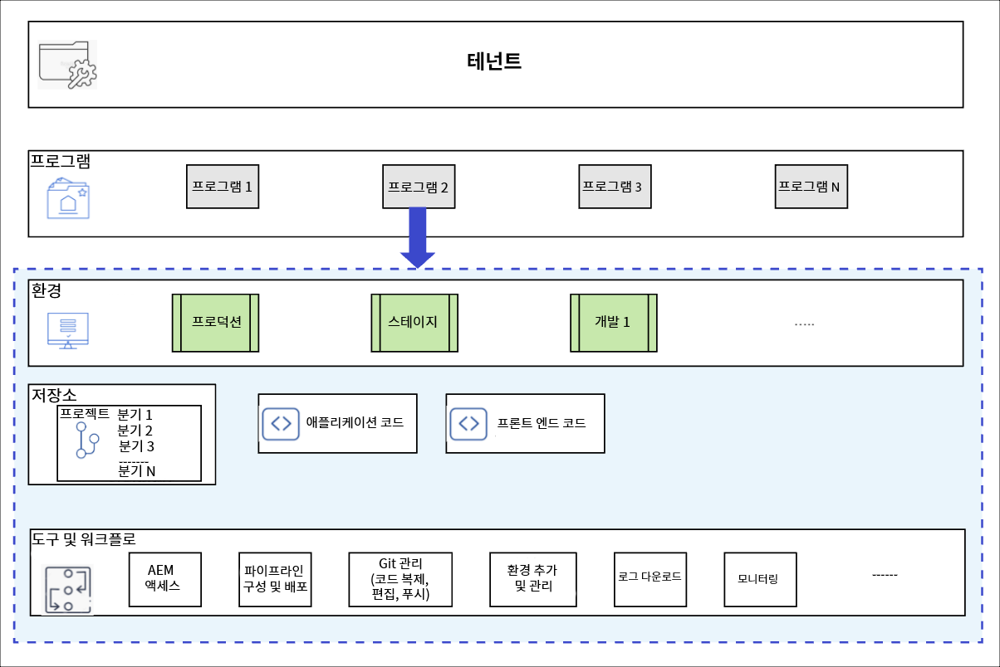

# 프로그램 및 프로그램 유형 이해 {#understanding-programs}

Cloud Manager에서는 임차인 엔티티가 맨 위에 있고 맨 위에는 여러 프로그램이 있을 수 있습니다. 각 프로그램은 둘 이상의 프로덕션 환경과 여러 비프로덕션 환경을 포함할 수 있습니다.

다음 다이어그램은 Cloud Manager의 엔티티 계층을 보여줍니다.



## 소스 코드 저장소 {#source-code-repository}

Cloud Manager 프로그램은 자체 git 리포지토리를 사용하여 자동으로 제공됩니다.

사용자가 Cloud Manager git 리포지토리에 액세스하려면 명령줄 도구, 독립 실행형 시각적 Git 클라이언트 또는 Eclipse, IntelliJ, NetBeans와 같은 사용자의 IDE가 있는 Git 클라이언트를 사용해야 합니다.

Git 클라이언트가 설정되면 Cloud Manager UI에서 Git 리포지토리를 관리할 수 있습니다. Cloud Manager UI를 사용하여 Git을 관리하는 방법에 대한 자세한 내용은 [Git](/help/implementing/cloud-manager/accessing-repos.md)액세스 를 참조하십시오.

AEM Cloud 애플리케이션 개발을 시작하려면 Cloud Manager 리포지토리에서 리포지토리를 생성하려는 로컬 컴퓨터의 위치로 애플리케이션 코드의 로컬 복사본을 체크 아웃해야 합니다.

```java
$ git clone {URL}
```

>[!NOTE]
>사용자는 코드 사본을 체크 아웃하고 로컬 코드 리포지토리에서 변경 작업을 수행할 수 있습니다. 준비가 완료된 사용자는 코드 변경 사항을 Cloud Manager의 원격 코드 리포지토리에 다시 커밋할 수 있습니다.

## 프로그램 유형 {#program-types}

사용자는 **Sandbox** 또는 **Production** 프로그램을 만들 수 있습니다.

* *프로덕션 프로그램*이 생성되어 미래의 적절한 시간에 라이브 트래픽을 사용할 수 있습니다.
자세한 내용은 프로덕션 프로그램 소개 를 참조하십시오.


* *샌드박스 프로그램*은 일반적으로 교육용, 데모, 지원, POC 또는 설명서를 실행하기 위해 만들어집니다. 라이브 트래픽을 전달하기 위한 것이 아니며, 프로덕션 프로그램이 허용하지 않을 수 있는 제한 사항이 있습니다. 여기에는 사이트 및 자산이 포함되며, 샘플 코드, 개발 환경 및 비프로덕션 파이프라인이 포함된 Git 분기로 자동으로 채워집니다.
자세한 내용은 샌드박스 프로그램 소개 를 참조하십시오.
