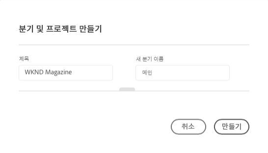
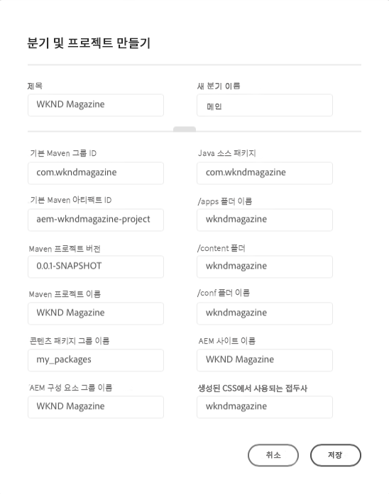
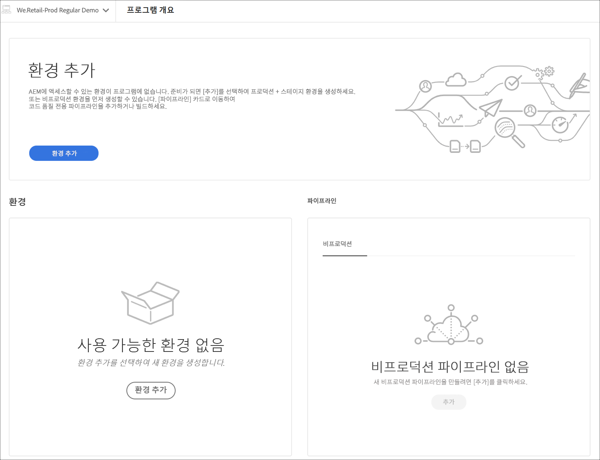

# 프로젝트 제작 마법사 {#project-creation-wizard}

Cloud Manger는 프로덕션 프로그램을 만든 후 [AEM Project Archetype](https://experienceleague.adobe.com/docs/experience-manager-core-components/using/developing/archetype/overview.html)을 기반으로 최소 AEM 프로젝트를 생성하여 빠르게 시작할 수 있는 마법사를 제공합니다.

마법사를 사용하여 Cloud Manager에서 AEM 애플리케이션 프로젝트를 만들려면 다음 단계를 따르십시오.

1. [프로덕션 프로그램 만들기](creating-production-programs.md) 문서의 단계에 따라 프로덕션 프로그램을 만듭니다.

1. 프로그램 설정이 완료되면 프로그램의 **개요** 화면에 액세스하여 상단에 있는 **분기 및 프로젝트 만들기** 콜 투 액션 카드를 확인합니다.

   

1. **만들기**&#x200B;를 클릭하여 마법사를 시작하고 **분기 및 프로젝트 만들기** 창에서 프로젝트의 **제목**&#x200B;과 **새 분기 이름**&#x200B;을 확인합니다.

   

1. 선택적으로 구분선을 클릭하여 프로젝트의 추가 매개변수를 표시합니다. 기본값은 AEM Project Archetype에서 제공하며 일반적으로 변경할 필요가 없습니다.

   

1. 프로젝트 만들기 프로세스를 시작하려면 **만들기**&#x200B;를 클릭합니다.

**프로그램 개요** 화면 상단에 있는 **분기 및 프로젝트 만들기** 콜 투 액션 카드가 **프로젝트 만들기 진행 중** 카드로 바뀝니다.

프로그램 생성이 완료되면 **프로그램 개요** 화면 상단에 있는 **프로젝트 만들기 진행 중** 카드가 **환경 추가** 카드로 바뀝니다.

이제 AEM Archetype을 기반으로 하는 AEM 프로젝트가 git 저장소에 추가되어 자체 프로젝트를 위한 개발 기반으로 사용됩니다. 다음으로 프로젝트 코드를 배포할 수 있는 환경을 만들 수 있습니다.

환경을 추가하거나 관리하는 방법에 대한 내용은 [환경 관리](/help/implementing/cloud-manager/manage-environments.md)를 참조하십시오.

>[!NOTE]
>
>마법사는 프로덕션 프로그램에만 사용할 수 있습니다. [샌드박스 프로그램](introduction-sandbox-programs.md#auto-creation)에는 프로젝트 자동 만들기 기능이 포함되어 있으므로 마법사가 필요하지 않습니다.