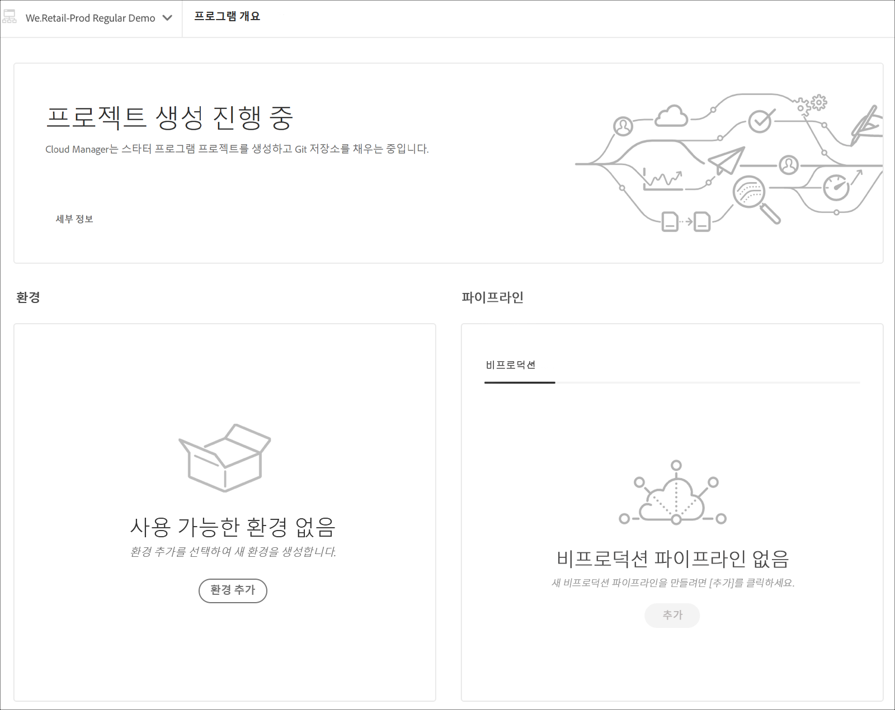

# 프로젝트 제작 마법사 {#project-creation-wizard}

프로덕션 프로그램을 만든 후 Cloud Manager는 마법사를 제공하여 [AEM 프로젝트 원형](https://experienceleague.adobe.com/docs/experience-manager-core-components/using/developing/archetype/overview.html) 를 신속하게 시작할 수 있습니다.

마법사를 사용하여 Cloud Manager에서 AEM 애플리케이션 프로젝트를 생성하려면 다음 단계를 수행합니다.

1. 문서의 단계에 따라 프로덕션 프로그램을 만듭니다 [프로덕션 프로그램 생성](creating-production-programs.md)

1. 프로그램 설정이 완료되면 **개요** 프로그램의 화면 및 **분기 및 프로젝트 만들기** 맨 위에 있는 클릭유도문안 카드

   

1. 클릭 **만들기** 마법사를 시작하고 프로젝트의 을(를) 확인합니다. **제목** 및 **새 분기 이름** 에서 **분기 및 프로젝트 만들기** 창을 엽니다.

   

1. 구분선을 클릭하여 프로젝트의 추가 매개 변수를 표시할 수도 있습니다. 기본값은 AEM Project Archetype에서 제공하며 일반적으로 변경할 필요가 없습니다.

   

1. 클릭 **만들기** 를 눌러 프로젝트 생성 프로세스를 시작합니다.

A **프로젝트 만들기 진행 중** 이제 카드가 를 대체합니다 **분기 및 프로젝트 만들기** 클릭유도문안 카드를 **프로그램 개요** 화면.

프로그램 만들기가 완료되면 **환경 추가** 카드가 카드 대체 **프로젝트 만들기 진행 중** 카드 맨 위에 **프로그램 개요** 화면.

이제 고유한 프로젝트를 위한 개발 기반으로 사용하기 위해 AEM 원형 이 Git 리포지토리에 추가되어 AEM 프로젝트가 있습니다. 그런 다음 프로젝트 코드를 배포할 수 있는 환경을 만들 수 있습니다.

문서를 참조하십시오 [환경 관리](/help/implementing/cloud-manager/manage-environments.md) 환경 추가 또는 관리 방법을 알아봅니다.

>[!NOTE]
>
>마법사는 프로덕션 프로그램에서만 사용할 수 있습니다. 왜냐면 [샌드박스 프로그램](introduction-sandbox-programs.md#auto-creation) 자동 프로젝트 만들기를 포함하므로 마법사가 필요하지 않습니다.