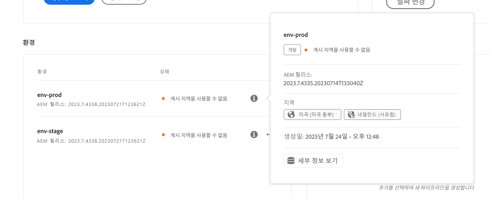
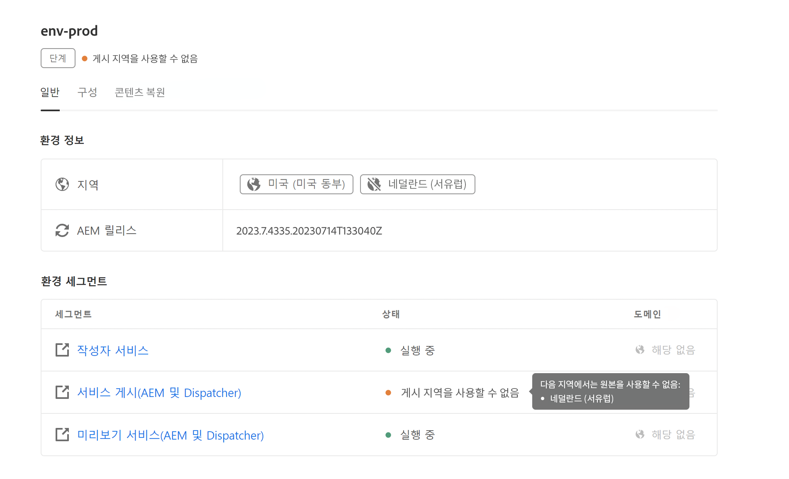

# 환경 관리 {#managing-environments}

만들 수 있는 환경 유형 및 Cloud Manager 프로젝트용으로 환경을 만드는 방법에 대해 알아봅니다.

## 환경 유형 {#environment-types}

필수 권한이 있는 사용자는 특정 테넌트가 사용할 수 있는 범위 내에서 다음과 같은 환경 유형을 만들 수 있습니다.

* **프로덕션 + 스테이징** - 프로덕션 및 스테이징 환경은 쌍으로 구성되며 각각 프로덕션 및 테스트 목적으로 사용됩니다. 스테이지 환경에서 성능 및 보안 테스트를 수행합니다. 이는 프로덕션 크기와 동일합니다.

* **개발** - 개발 환경은 개발 및 테스트 목적으로 만들 수 있으며 비프로덕션 파이프라인에만 연결할 수 있습니다.  개발 환경은 스테이징 및 프로덕션과 크기가 동일하지 않으며 성능 및 보안 테스트를 수행하는 데 사용해서는 안 됩니다.

* **신속한 개발** - 개발자는 신속한 개발 환경(RDE)을 통해 변경 사항을 신속하게 배포하고 검토할 수 있으므로 로컬 개발 환경에서 작동하는 것으로 입증된 기능을 테스트하데 필요한 시간을 최소화할 수 있습니다. RDE 사용 방법에 대한 자세한 내용은 [신속한 개발 환경 설명서](/help/implementing/developing/introduction/rapid-development-environments.md)를 참조하십시오.

개별 환경의 기능은 환경의 [프로그램](/help/implementing/cloud-manager/getting-access-to-aem-in-cloud/program-types.md)에서 활성화된 솔루션에 따라 다릅니다.

* [Sites](/help/overview/introduction.md)
* [Assets](/help/assets/overview.md)
* [Forms](/help/forms/home.md)
* [Screens](/help/screens-cloud/introduction/introduction.md)

>[!NOTE]
>
>프로덕션 및 스테이징 환경은 쌍으로만 생성됩니다. 스테이징만 만들거나 프로덕션 환경만 만들 수는 없습니다.

## 환경 추가 {#adding-environments}

환경을 추가하거나 편집하려면 사용자가 **비즈니스 소유자** 역할의 멤버여야 합니다.

1. [my.cloudmanager.adobe.com](https://my.cloudmanager.adobe.com/)에서 Cloud Manager에 로그인한 다음 적절한 조직을 선택합니다.

1. **[내 프로그램](/help/implementing/cloud-manager/navigation.md#my-programs)** 콘솔에서 환경을 추가할 프로그램을 클릭합니다.

1. **[내 프로그램](/help/implementing/cloud-manager/navigation.md#my-programs)** 콘솔에서 **환경** 카드의 **환경 추가**&#x200B;를 클릭하여 환경을 추가합니다.

   

   * **환경 추가** 옵션은  **환경** 탭에서도 사용할 수 있습니다.

     

   * 사용 권한이 없거나 사용 허가된 리소스에 따라 **환경 추가** 옵션이 비활성화될 수 있습니다.

1. **환경 추가** 대화 상자에서:

   * [**환경 유형**](#environment-types)&#x200B;을(를) 선택하십시오.
      * 사용 가능한/사용된 환경의 수가 환경 유형 이름 뒤의 괄호 안에 표시됩니다.
   * 환경 **이름**&#x200B;을 제공합니다.
      * 환경이 생성되면 환경 이름을 변경할 수 없습니다.
   * 환경 **설명**&#x200B;을 제공합니다.
   * **프로덕션 + 스테이징** 환경을 추가하는 경우, 프로덕션 환경과 스테이징 환경 모두에 대해 환경 이름 및 설명을 제공해야 합니다.
   * 드롭다운에서 **기본 지역**&#x200B;을 선택합니다.
      * 기본 지역은 생성된 후에는 변경할 수 없습니다.
      * 사용 가능한 권한에 따라 [여러 지역](#multiple-regions)을 구성할 수 있습니다.

   

1. **저장**&#x200B;을 클릭하여 지정된 환경을 추가합니다.

이제 **개요** 화면의 **환경** 카드에 새 환경이 표시됩니다. 이제 새 환경에 대한 파이프라인을 설정할 수 있습니다.

## 여러 게시 영역 {#multiple-regions}

**비즈니스 소유자** 역할을 가진 사용자는 기본 지역 외에 최대 세 개의 추가 게시 지역을 포함하도록 프로덕션 및 스테이징 환경을 구성할 수 있습니다. 추가 게시 지역은 가용성을 높일 수 있습니다. 자세한 내용은 [추가 게시 지역 설명서](/help/operations/additional-publish-regions.md)를 참조하십시오.

>[!TIP]
>
>[Cloud Manager API](https://developer.adobe.com/experience-cloud/cloud-manager/guides/api-usage/creating-programs-and-environments/#creating-aem-cloud-service-environments)를 사용하여 사용 가능한 지역의 현재 목록을 쿼리할 수 있습니다.

### 새 환경에 여러 게시 영역 추가 {#add-regions}

환경을 추가할 때 기본 지역 외에 추가 지역 구성을 선택할 수 있습니다.

1. **기본 지역**&#x200B;을 선택합니다.
   * 기본 지역은 환경을 생성한 후에는 변경할 수 없습니다.
1. **추가 게시 지역 추가** 옵션을 선택하면 새 **추가 게시 지역** 옵션 드롭다운이 표시됩니다.
1. **추가 게시 지역** 드롭다운에서 추가 지역을 선택합니다.
1. 드롭다운 아래에 선택한 지역을 추가하여 옵션을 표시합니다.
   * 선택한 영역 옆의 `X`을(를) 선택하여 선택을 취소할 수 있습니다.
1. **추가 게시 지역** 드롭다운에서 다른 지역을 선택하여 다른 지역을 추가합니다.
1. 환경을 만들 준비가 되면 **저장**&#x200B;을(를) 선택하십시오.

선택한 지역은 프로덕션 환경 및 스테이징 환경 모두에 적용됩니다.

추가 영역을 지정하지 않으면 [환경이 만들어진 후 나중에 지정할 수 있습니다](#edit-regions).

프로그램의 [고급 네트워킹](/help/security/configuring-advanced-networking.md)을 프로비저닝하려면 Cloud Manager API를 사용하여 추가 게시 지역을 환경에 추가하기 전에 이 프로비저닝을 수행하는 것이 좋습니다. 그렇지 않은 경우, 추가 게시 지역의 트래픽이 기본 지역의 프록시로 이동합니다.

### 여러 게시 영역 편집 {#edit-regions}

처음에 추가 지역을 지정하지 않으면 환경을 만들고 필요한 권한이 있는 경우 지정할 수 있습니다.

추가 게시 지역을 제거할 수도 있습니다. 단, 한 번의 트랜잭션에서만 지역을 추가 또는 제거할 수 있습니다. 하나의 지역을 추가하고 하나의 지역을 제거해야 하는 경우, 먼저 지역을 추가하고 변경 사항을 저장한 다음 제거합니다(또는 그 반대).

1. 내 프로그램의 프로그램 개요 콘솔에서 프로덕션 환경의 줄임표 버튼을 클릭하고 메뉴에서 **편집**&#x200B;을 선택합니다.

   

1. **프로덕션 환경 편집** 대화 상자에서 필요에 따라 추가 게시 지역을 변경합니다.
   * **추가 게시 지역** 드롭다운을 사용하여 추가 지역을 선택합니다.
   * 선택한 추가 지역 옆 x를 클릭하여 지역 선택을 해제합니다.

   

1. 변경 내용을 저장하려면 **저장**&#x200B;을 선택하십시오.

프로덕션 환경에 대한 변경 사항은 프로덕션 환경 및 스테이징 환경 모두에 적용됩니다. 여러 게시 지역에 대한 변경 사항은 프로덕션 환경에서만 편집할 수 있습니다.

프로그램의 [고급 네트워킹](/help/security/configuring-advanced-networking.md)을 프로비저닝하려면 추가 게시 지역을 환경에 추가하기 전에 이 프로비저닝을 수행하는 것이 좋습니다. 그렇지 않은 경우 추가 게시 지역의 트래픽이 기본 지역의 프록시로 이동합니다.

## 환경 세부 정보 {#viewing-environment}

**개요** 페이지에서 두 가지 방법으로 환경의 세부 정보에 액세스할 수 있습니다.

1. **개요** 페이지에서 측면 탐색 패널의 **환경** 탭을 클릭합니다.

   

   * 또는 **환경** 카드에서 **모두 표시** 버튼을 클릭하여 **환경** 탭으로 직접 이동합니다.

     

1. **환경**&#x200B;이 열리고 프로그램에 대한 모든 환경이 나열됩니다.

   

1. 세부 정보를 표시할 수 있도록 목록에서 환경을 탭하거나 클릭합니다.

   

또는 원하는 환경의 줄임표 버튼을 클릭한 다음 **세부 정보 보기**&#x200B;를 선택합니다.

>[!NOTE]
>
>**환경** 카드에는 세 가지 환경만 나열됩니다. 모든 프로그램 환경을 보려면 앞에서 설명한 대로 **모두 표시** 버튼을 클릭합니다.

### 미리보기 서비스 액세스 {#access-preview-service}

Cloud Manager는 AEM as a Cloud Service 환경에 미리보기 서비스(추가 게시 서비스로 제공)를 제공합니다.

서비스를 사용하면 웹 사이트의 최종 경험이 실제 게시 환경에 도달하고 공개적으로 사용할 수 있게 되기 전에 이를 미리 볼 수 있습니다.

생성 시 미리보기 서비스에는 `Preview Default [<envId>]`이라는 레이블이 지정된 기본 IP 허용 목록이 적용되는데 이는 미리보기 서비스에 대한 모든 트래픽을 차단합니다. 액세스를 활성화하려면 미리보기 서비스에서 기본 IP 허용 목록을 적용 취소합니다.

필요한 권한이 있는 사용자는 미리보기 서비스 URL을 공유하기 전에 다음 단계를 완료해야 이 URL에 정상적으로 액세스할 수 있습니다.

1. 적절한 IP 허용 목록을 만들어 미리보기 서비스에 적용하고, `Preview Default [<envId>]` 허용 목록을 즉시 적용 취소합니다.

   * 자세한 내용은 [IP 허용 목록 적용 및 적용 취소](/help/implementing/cloud-manager/ip-allow-lists/apply-allow-list.md)를 참조하십시오.

1. **IP 허용 목록** 업데이트 워크플로를 사용하여 기본 IP를 제거하고 적절하게 IP를 추가합니다. 자세한 내용은 [IP 허용 목록 관리](/help/implementing/cloud-manager/ip-allow-lists/managing-ip-allow-lists.md)를 참조하십시오.

미리보기 서비스에 대한 액세스가 잠금 해제된 후에는 미리보기 서비스 이름 앞의 잠금 아이콘이 더 이상 표시되지 않습니다.

활성화되면 AEM 내 게시 관리 UI를 사용하여 미리보기 서비스에 콘텐츠를 게시할 수 있습니다. 자세한 내용은 [콘텐츠 미리보기](/help/sites-cloud/authoring/sites-console/previewing-content.md)를 참조하십시오.

>[!NOTE]
>
>환경이 AEM 버전 `2021.05.5368.20210529T101701Z` 이상이어야 미리보기 서비스를 사용할 수 있습니다. 미리보기 서비스를 사용할 수 있도록 사용자 환경에서 업데이트 파이프라인이 실행되었는지 확인합니다.

### 추가 게시 영역 상태 {#additional-region-status}

추가 게시 지역이 활성화되면 **환경** 카드에서 해당 지역의 상태를 확인할 수 있습니다.

1. **개요** 페이지에서 **환경** 카드를 찾습니다.

1. 구성된 추가 게시 지역에 문제가 발생하면 **환경** 카드에서 **상태** 열에 반영됩니다. 지역에 대한 자세한 내용은 **정보** 아이콘을 클릭합니다.

   

또는 **환경** 탭에서 동일한 정보에 액세스할 수 있습니다.

1. **개요** 페이지에서&#x200B;**환경** 탭을 선택합니다.

1. **환경** 탭의 왼쪽 탐색 패널에서 쿼리할 환경을 선택합니다.

1. 환경이 선택되면

   * **환경 정보** 표에 선택한 환경에 맞게 구성되는 지역이 표시됩니다.
   * 구성된 추가 게시 지역에 문제가 발생하면 **환경 세그먼트** 표의 **상태** 열에 반영됩니다. 문제에 대한 자세한 내용을 보려면 상태 위로 마우스 커서를 이동합니다.

   

추가 게시 지역 보고에 문제가 발생하면

1. 인내심을 가지세요 Cloud Manager은 해당 지역의 복구를 지속적으로 시도하고 언제든지 사용할 수 있습니다.
1. 몇 시간 후에도 문제가 지속되면 추가 게시 영역을 제거하고 다시 추가하여(동일한 영역 또는 다른 영역) 전체 배포를 트리거할 수 있습니다.

추가 작업을 수행하기 전에 시스템이 자체적으로 복구될 때까지 대기하는 시간은 해당 지역의 장애가 시스템에 미치는 영향에 따라 다릅니다.

어떤 경우든 [트래픽은 항상 온라인 상태인 가장 가까운 다른 지역으로 라우팅됩니다](/help/operations/additional-publish-regions.md). 문제가 계속 표시되면 Adobe 고객 지원 센터에 문의하십시오.

## 환경 업데이트 {#updating-dev-environment}

클라우드 네이티브 서비스인 프로덕션 프로그램 내의 개발, 스테이징 및 프로덕션 환경 업데이트는 Adobe에서 자동으로 관리합니다.

단, 샌드박스 프로그램의 환경에 대한 업데이트는 프로그램 내에서 관리됩니다. 이러한 환경에서 공개적으로 사용 가능한 최신 AEM 버전을 실행하지 않는 경우, 프로그램의 **개요** 화면에 있는 **환경** 카드의 상태에 **업데이트 사용 가능**&#x200B;이 표시됩니다.

### 업데이트 및 파이프라인 {#updates-pipelines}

파이프라인은 [AEM as a Cloud Service 환경에 코드를 배포](deploy-code.md)하는 유일한 방법입니다. 이러한 이유로 각 파이프라인은 특정 AEM 버전과 연결됩니다.

Cloud Manager는 파이프라인과 함께 마지막으로 배포된 버전보다 최신 버전의 AEM이 있음을 감지하면 환경에 대해 **업데이트 사용 가능** 상태를 표시합니다.

따라서 업데이트 프로세스는 2단계 프로세스입니다.

1. 최신 AEM 버전으로 파이프라인 업데이트
1. 파이프라인을 실행하여 환경에 AEM의 새 버전 배포

### 환경 업데이트 {#updating-your-environments}

>[!NOTE]
> 2024년 현재, 개발 인스턴스 및 일부 샌드박스 프로그램은 이미 자동으로 업데이트되므로 업데이트를 수동으로 관리할 필요가 없습니다. 이 전환으로 인해 프로그램의 _일부_&#x200B;에서는 개발 인스턴스에 대해 환경을 수동으로 업데이트하는 옵션을 사용할 수 없습니다.

**업데이트** 옵션은 환경의 줄임표 버튼을 클릭하여 샌드박스 프로그램의 일부 개발 환경 및 환경에 대해 **환경** 카드에서 사용할 수 있습니다.

이 옵션은 프로그램의 **환경** 탭을 클릭한 다음, 환경의 줄임표 버튼을 선택하여 사용할 수도 있습니다.

**배포 관리자** 또는 **비즈니스 소유자** 역할을 가진 사용자는 이 옵션을 사용하여 이 환경과 연결된 파이프라인을 최신 AEM 버전으로 업데이트할 수 있습니다.

파이프라인 버전이 공개적으로 사용 가능한 최신 AEM 버전으로 업데이트되면 관련 파이프라인을 실행하여 최신 버전을 환경에 배포하라는 메시지가 표시됩니다.

**업데이트** 옵션의 비헤이비어는 구성 및 프로그램의 현재 상태에 따라 달라집니다.

* 파이프라인이 이미 업데이트된 경우 **업데이트** 옵션은 사용자에게 파이프라인을 실행하라는 메시지를 표시합니다.
* 파이프라인이 이미 업데이트되고 있는 경우 **업데이트** 옵션은 업데이트가 이미 실행 중임을 사용자에게 알립니다.
* 적절한 파이프라인이 없으면 **업데이트** 옵션이 사용자에게 파이프라인을 만들라는 메시지를 표시합니다.

## 개발 환경 삭제 {#deleting-environment}

**배포 관리자** 또는 **비즈니스 소유자** 역할을 가진 사용자가 개발 환경을 삭제할 수 있습니다.

**환경** 카드에 있는 프로그램의 **개요** 화면에서 삭제하려는 개발 환경의 줄임표 버튼을 클릭합니다.

삭제 옵션은 프로그램 **개요** 창의 **환경** 탭에서도 사용할 수 있습니다. 환경의 줄임표 버튼을 클릭하고 **삭제**&#x200B;를 선택합니다.

>[!NOTE]
>
>* 프로덕션 프로그램에서 생성된 프로덕션 및 스테이징 환경은 삭제할 수 없습니다.
>* 샌드박스 프로그램의 프로덕션 및 스테이징 환경은 삭제할 수 있습니다.

## 액세스 관리 {#managing-access}

**환경** 카드에 있는 환경의 줄임표 메뉴에서 **액세스 관리**&#x200B;를 선택합니다. 작성자 인스턴스로 직접 이동하여 환경에 대한 액세스를 관리할 수 있습니다.

>[!TIP]
>
>AEM as a Cloud Service 팀 및 제품 프로필로 라이선스가 부여된 Adobe 솔루션에 대한 액세스 권한을 부여하고 제한하는 방법을 알아보려면 [AEM as a Cloud Service 팀 및 제품 프로필](/help/onboarding/aem-cs-team-product-profiles.md)을 참조하십시오.

## Developer Console 액세스 {#accessing-developer-console}

**환경** 카드에 있는 환경의 줄임표 메뉴에서 **Developer Console**&#x200B;을 선택합니다. 브라우저에서 **Developer Console** 로그인 페이지가 있는 새 탭이 열립니다.

**개발자** 역할을 가진 사용자만 **Developer Console**&#x200B;에 액세스할 수 있습니다. 단, 샌드박스 프로그램의 경우 샌드박스 프로그램에 대한 액세스 권한이 있는 모든 사용자가 **Developer Console**&#x200B;에 액세스할 수 있습니다.

자세한 내용은 [샌드박스 환경 최대 절전 모드 설정 및 해제](https://experienceleague.adobe.com/docs/experience-manager-cloud-service/content/implementing/using-cloud-manager/programs/introduction-sandbox-programs.html#hibernation) 문서를 참조하십시오.

이 옵션은 개별 환경의 줄임표 메뉴를 클릭할 때 표시되는 **개요** 창의 **환경** 탭에서도 사용할 수 있습니다.

## 로컬 로그인 {#login-locally}

Adobe Experience Manager에 로컬로 로그온하려면 **환경** 카드에 있는 환경의 줄임표 메뉴에서 **로컬 로그인**&#x200B;을(를) 선택하십시오.

또한 **개요** 페이지의 **환경** 탭에서도 로컬로 로그온할 수 있습니다.

## 사용자 정의 도메인 이름 관리 {#manage-cdn}

사용자 정의 도메인 이름은 Cloud Manager for Sites 프로그램에서 게시 및 미리보기 서비스 모두에 대해 지원됩니다.

>[!TIP]
>
>자세한 내용은 [사용자 지정 도메인 이름 소개](/help/implementing/cloud-manager/custom-domain-names/introduction.md)를 참조하십시오.

## IP 허용 목록 관리 {#manage-ip-allow-lists}

IP 허용 목록은 Cloud Manager에서 Sites 프로그램의 작성자, 게시 및 미리보기 서비스를 위해 지원됩니다.

IP 허용 목록을 관리하려면 프로그램 **개요** 페이지에 있는 **환경** 탭으로 이동합니다. 세부 정보를 관리하려면 개별 환경을 클릭합니다.

### IP 허용 목록 적용 {#apply-ip-allow-list}

IP 허용 목록을 적용하면 허용 목록에 추가하다 정의에 포함된 모든 IP 범위가 환경의 작성자 또는 게시 서비스와 연결됩니다.

>[!TIP]
>
>자세한 내용은 [IP 허용 목록 소개](/help/implementing/cloud-manager/ip-allow-lists/introduction.md)를 참조하십시오.
