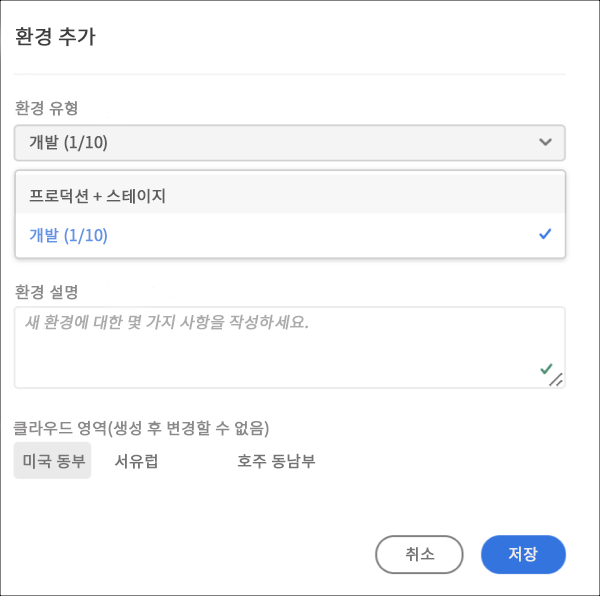
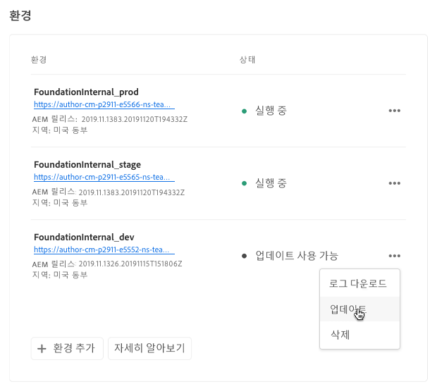
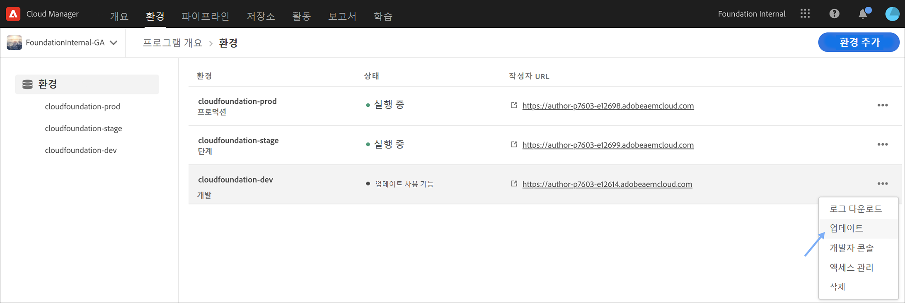
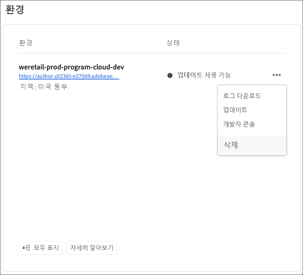
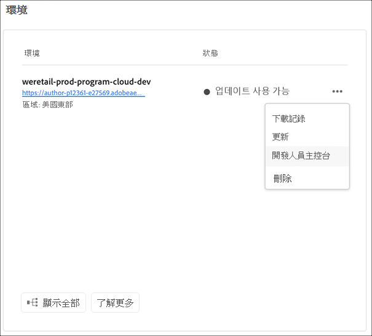

# 환경 관리 {#manage-environments}

다음 섹션에서는 사용자가 만들 수 있는 환경 유형과 사용자가 환경을 만드는 방법에 대해 설명합니다.

## 환경 유형 {#environment-types}

필수 권한을 가진 사용자는 다음 환경 유형을 만들 수 있습니다(특정 테넌트에 사용 가능한 범위의 범위 내).

* **프로덕션 및 스테이지 환경**:
프로덕션 및 스테이지는 듀오로 제공되며 테스트 및 제작 용도로 사용됩니다.

* **개발**: 개발 환경은 개발 및 테스트 목적으로 생성할 수 있으며 비프로덕션 파이프라인에만 연결됩니다.

   >[!NOTE]
   >샌드박스 프로그램에서 자동으로 생성되는 개발 환경은 사이트 및 자산 솔루션을 포함하도록 구성됩니다.

   다음 표에 환경 유형과 해당 속성이 요약되어 있습니다.

   | 이름 | 작성자 계층 | 게시 계층 | 사용자가 | 사용자가 | 환경과 연결할 수 있는 파이프라인 |
   |--- |--- |--- |--- |---|---|
   | 프로덕션 | 예 | 예 사이트에 포함된 경우 | 예 | 아니오 | 프로덕션 파이프라인 |
   | 단계 | 예 | 예 사이트에 포함된 경우 | 예 | 아니오 | 프로덕션 파이프라인 |
   | 개발 | 예 | 예 사이트에 포함된 경우 | 예 | 예 | 비프로덕션 파이프라인 |

   >[!NOTE]
   >프로덕션 및 스테이지는 듀오로 제공되며 테스트 및 제작 용도로 사용됩니다.  사용자는 스테이지 또는 프로덕션 환경만 만들 수 없습니다.

## 환경 추가 {#adding-environments}

1. 환경 **추가를** 클릭하여 환경을 추가합니다. 이 단추는 환경 **화면에서** 액세스할 수 있습니다.
   

   환경 **추가** 옵션 **은 프로그램에 환경이 없는 경우** 환경카드에서도 사용할 수 있습니다.

   

   >[!NOTE]
   >권한 **부족 또는 계약될 수 있는 사항에 따라 환경** 추가 옵션이 비활성화됩니다.

1. 환경 **추가** 대화 상자가 나타납니다.사용자는 **환경 유형** 및 **환경 이름** 및 환경 설명 **(특정 테넌트에 사용 가능한 항목 범위 내에 환경을 만드는 사용자의 목표에 따라)과 같은 세부 사항을 제출해야 합니다** .

   

   >[!NOTE]
   >환경을 만들 때 Adobe I/O에서 하나 이상의 *통합이* 만들어집니다. Adobe I/O 콘솔에 액세스할 수 있으며 삭제할 수 없습니다. Adobe I/O 콘솔의 설명에서 이러한 내용이 표시되지 않습니다.

   

1. 저장을 **클릭하여** 채워진 기준이 있는 환경을 추가합니다.  이제 *개요* 화면에 파이프라인을 설정할 수 있는 카드가 표시됩니다.

   >[!NOTE]
   >비프로덕션 파이프라인을 아직 설정하지 않은 경우 *개요* 화면에는 비프로덕션 파이프라인을 만들 수 있는 카드가 표시됩니다.

## 환경 업데이트 {#updating-dev-environment}

스테이지 및 프로덕션 환경 업데이트는 Adobe에서 자동으로 관리합니다.

개발 환경 업데이트는 프로그램 사용자가 관리합니다. 환경에서 공개적으로 사용 가능한 최신 AEM 릴리스가 실행되고 있지 않으면 홈 화면의 환경 카드에 있는 **UPDATE AVAILABLE이 표시됩니다**.

[ **업데이트** ] 옵션은 **환경** 카드에서 사용할 수 있습니다.
환경 **카드** 에서 세부 사항 **을** 클릭하면 이 옵션을 **관리** 단추에서도 사용할 수있습니다.

이 옵션을 선택하면 배포 관리자가 이 환경과 연결된 파이프라인을 최신 릴리스로 업데이트한 다음 파이프라인을 실행할 수 있습니다.

파이프라인이 이미 업데이트되면 파이프라인 실행 메시지가 표시됩니다.

## 환경 삭제 {#deleting-environment}

필요한 권한이 있는 사용자는 개발 환경을 삭제할 수 있습니다.

[ **삭제** ] 옵션은 [환경 카드]의 드롭다운 메뉴에서 **사용할 수** 있습니다.
환경 **카드** 에서 세부 사항 **을** 클릭하면 이 옵션을 **관리** 단추에서도 사용할 수있습니다.

>[!NOTE]
프로덕션 목적으로 설정된 일반 프로그램에 설정된 프로덕션/스테이지 환경에서는 이 기능을 사용할 수 없습니다. 하지만 이 기능은 샌드박스 프로그램의 프로덕션/스테이지 환경에 사용할 수 있습니다.

## 개발자 콘솔 액세스 {#accessing-developer-console}

환경 **카드** 의 드롭다운 메뉴에서 **개발자 콘솔을** 선택합니다. 그러면 브라우저에서 새 탭이 열리고 개발자 콘솔의 로그인 페이지가 **표시됩니다**.

개발자 역할의 사용자만 **개발자 콘솔에 액세스할 수 있습니다**. 클라우드 관리자 샌드박스 프로그램에 액세스할 수 있는 모든 사용자가 **개발자 콘솔에 액세스할 수 있는 샌드박스 프로그램에 대한 예외 사항입니다**.

자세한 내용은 [최대 절전 모드 및 최대 절전 모드 해제](https://docs.adobe.com/content/help/en/experience-manager-cloud-service/onboarding/getting-access/cloud-service-programs/sandbox-programs.html#hibernating-introduction) 환경을 참조하십시오.

환경 **카드** 에서 세부 사항 **을** 클릭하면 [관리] 단추에서 이 옵션을 선택할 수도 **있습니다** .

