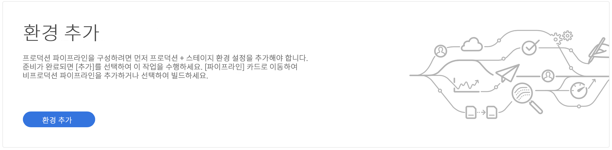
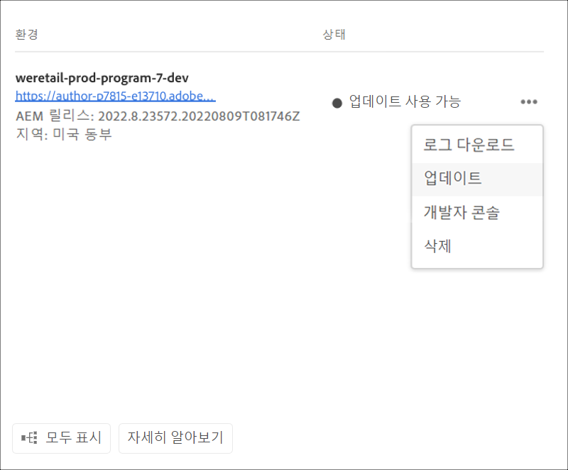

# 환경 관리 {#manage-environments}

다음 섹션에서는 사용자가 만들 수 있는 환경의 유형과 사용자가 환경을 만드는 방법에 대해 설명합니다.

## 환경 유형 {#environment-types}

필수 권한을 가진 사용자는 다음 환경 유형을 만들 수 있습니다(특정 테넌트에 사용할 수 있는 범위의 범위 내에서).

* **프로덕션 및 스테이지 환경**:프로덕션 및 스테이지는 듀오로 제공되며 테스트 및 제작 용도로 사용됩니다.

* **개발**:개발 환경은 개발 및 테스트 목적으로 제작될 수 있으며 비프로덕션 파이프라인에만 연결됩니다.

   >[!NOTE]
   >샌드박스 프로그램에서 자동으로 생성되는 개발 환경은 사이트 및 자산 솔루션을 포함하도록 구성됩니다.

   다음 표에는 환경 유형과 해당 속성이 요약되어 있습니다.

   | 이름 | 작성자 계층 | 게시 계층 | 사용자가 만들 수 있음 | 사용자가 | 환경과 연결할 수 있는 파이프라인 |
   |--- |--- |--- |--- |---|---|
   | 프로덕션 | 예 | 예 사이트 포함 | 예 | 아니오 | 프로덕션 파이프라인 |
   | 단계 | 예 | 예 사이트 포함 | 예 | 아니오 | 프로덕션 파이프라인 |
   | 개발 | 예 | 예 사이트 포함 | 예 | 예 | 비프로덕션 파이프라인 |

   >[!NOTE]
   >프로덕션 및 스테이지는 듀오로 제공되며 테스트 및 제작 용도로 사용됩니다.  사용자는 스테이지 또는 프로덕션 환경만 만들 수 없습니다.

## 환경 추가 {#adding-environments}

1. 사용자가 환경 추가 **버튼을** 클릭하여 환경을 추가합니다.

   

1. 환경 **추가** 대화 상자가 나타납니다.사용자는 환경 유형 **및** 환경 이름 **및 환경 설명** ( **** 특정 테넌트에 사용 가능한 항목 범위 내에서 환경을 만드는 사용자의 목표에 따라)과 같은 세부 사항을 제출해야 합니다.

   

   >[!NOTE]
   >환경을 만들 때 Adobe I/O에서 하나 이상의 *통합이* 만들어집니다.Adobe I/O 콘솔에 액세스할 수 있는 고객 사용자는 이를 볼 수 있으며 삭제할 수 없습니다. Adobe I/O 콘솔의 설명에서 이러한 내용이 표시되지 않습니다.

   

1. 저장을 **클릭하여** 채워진 기준이 있는 환경을 추가합니다.  이제 *개요* 화면에 파이프라인을 설정할 수 있는 카드가 표시됩니다.

   >[!NOTE]
   >비프로덕션 파이프라인을 아직 설정하지 않은 경우 개요 *화면에는* 비프로덕션 파이프라인을 생성할 수 있는 카드가 표시됩니다.

## 환경 업데이트 {#updating-dev-environment}

스테이지 및 프로덕션 환경 업데이트는 Adobe에서 자동으로 관리합니다.

개발 환경에 대한 업데이트는 프로그램 사용자가 관리합니다. 환경에서 공개적으로 사용 가능한 최신 AEM 릴리스가 실행되고 있지 않으면 홈 화면의 환경 카드 상태에 UPDATE AVAILABLE **이 표시됩니다**.

)

이 상태가 표시되면 **환경** 카드 및 관리 메뉴의 드롭다운 메뉴에서 업데이트 **옵션을 사용할 수 있습니다.** 환경 **카드의 세부** 정보를 **클릭하면** 관리메뉴가표시됩니다.

드롭다운 메뉴에서 이 옵션을 선택하면 배포 관리자가 이 환경과 연결된 파이프라인을 최신 릴리스로 업데이트하고 파이프라인을 실행할 수 있습니다.

파이프라인이 이미 업데이트된 경우 파이프라인을 실행하라는 메시지가 표시됩니다.
