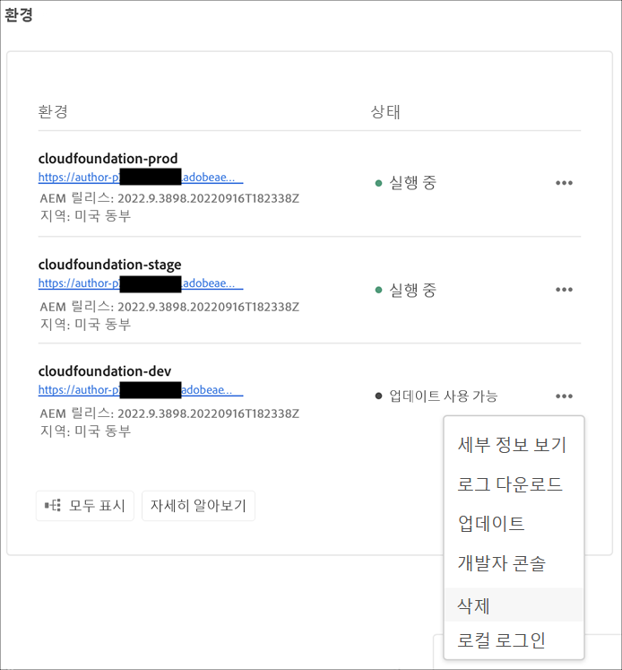

# 환경 관리 {#manage-environments}

다음 섹션에서는 사용자가 만들 수 있는 환경 유형과 사용자가 환경을 만드는 방법에 대해 설명합니다.

## 환경 유형 {#environment-types}

필수 권한을 가진 사용자는 다음 환경 유형을 만들 수 있습니다(특정 테넌트에 사용 가능한 범위의 범위 내).

* **프로덕션 및 스테이지 환경**:프로덕션 및 스테이지는 듀오로 제공되며 테스트 및 제작 용도로 사용됩니다.

* **개발**:개발 환경은 개발 및 테스트 목적으로 생성할 수 있으며 비프로덕션 파이프라인에만 연결됩니다.

   >[!NOTE]
   >샌드박스 프로그램에서 자동으로 생성되는 개발 환경은 사이트 및 자산 솔루션을 포함하도록 구성됩니다.

   다음 표에 환경 유형과 해당 속성이 요약되어 있습니다.

   | 이름 | 작성 계층 | 게시 계층 | 사용자가 | 사용자가 | 환경과 연결할 수 있는 파이프라인 |
   |--- |--- |--- |--- |---|---|
   | 프로덕션 | 예 | 예 사이트에 포함된 경우 | 예 | 아니오 | 프로덕션 파이프라인 |
   | 단계 | 예 | 예 사이트에 포함된 경우 | 예 | 아니오 | 프로덕션 파이프라인 |
   | 개발 | 예 | 예 사이트에 포함된 경우 | 예 | 예 | 비프로덕션 파이프라인 |

   >[!NOTE]
   >프로덕션 및 스테이지는 듀오로 제공되며 테스트 및 제작 용도로 사용됩니다.  사용자는 스테이지 또는 프로덕션 환경만 만들 수 없습니다.

## 환경 {#adding-environments} 추가

1. 환경을 추가하려면 **환경 추가**&#x200B;를 클릭합니다. 이 단추는 **환경** 화면에서 액세스할 수 있습니다.
   

   프로그램에 환경이 0인 경우 **환경 추가** 옵션도 **환경** 카드에서 사용할 수 있습니다.

   

   >[!NOTE]
   >**환경 추가** 옵션은 권한이 없거나 계약이 체결될 수 있는 항목에 따라 비활성화됩니다.

1. **환경 추가** 대화 상자가 나타납니다.사용자는 **환경 유형** 및 **환경 이름** 및 **환경 설명** 등의 세부 정보를 제출해야 합니다(특정 테넌트에 사용 가능한 항목 범위 내에서 환경을 만드는 사용자의 목적에 따라 다름).

   

   >[!NOTE]
   >환경을 만들 때 Adobe I/O에 하나 이상의 *통합*&#x200B;이(가) 만들어집니다.이러한 항목은 Adobe I/O 콘솔에 액세스할 수 있는 고객 사용자에게 표시되며 삭제하지 않아야 합니다. 이 내용은 Adobe I/O 콘솔의 설명에 설명되어 있지 않습니다.

   

1. 채워진 기준이 있는 환경을 추가하려면 **저장**&#x200B;을 클릭합니다.  이제 *개요* 화면에 파이프라인을 설정할 수 있는 카드가 표시됩니다.

   >[!NOTE]
   >비프로덕션 파이프라인을 아직 설정하지 않은 경우 *개요* 화면에 비프로덕션 파이프라인을 만들 수 있는 카드가 표시됩니다.

## 보기 환경 {#viewing-environment}

개요 페이지의 **환경** 카드는 최대 세 개의 환경을 나열합니다.

1. **모두 표시** 단추를 선택하여 **환경** 요약 페이지로 이동하여 전체 환경 목록이 포함된 테이블을 봅니다.

   

1. **환경** 페이지에는 모든 기존 환경의 목록이 표시됩니다.

   

1. 목록에서 환경 중 하나를 선택하여 환경 세부 사항을 확인합니다.

   

## 환경 {#updating-dev-environment} 업데이트

스테이지 및 프로덕션 환경의 업데이트는 Adobe에 의해 자동으로 관리됩니다.

개발 환경 업데이트는 프로그램 사용자가 관리합니다. 환경에서 공개적으로 사용 가능한 최신 AEM 릴리스가 실행되고 있지 않으면 홈 화면의 환경 카드에 있는 상태가 **UPDATE AVAILABLE**&#x200B;으로 표시됩니다.

**업데이트** 옵션은 **환경** 카드에서 사용할 수 있습니다.
이 옵션은 **환경** 카드에서 **세부 사항**&#x200B;을 클릭하면 사용할 수도 있습니다. **환경** 페이지가 열리고 개발 환경을 선택하면 **를 클릭합니다.** 아래 그림과 같이 **업데이트**&#x200B;를 선택하고

이 옵션을 선택하면 배포 관리자가 이 환경과 연결된 파이프라인을 최신 릴리스로 업데이트한 다음 파이프라인을 실행할 수 있습니다.

파이프라인이 이미 업데이트되면 파이프라인 실행 메시지가 표시됩니다.

## {#deleting-environment} 환경 삭제

필요한 권한이 있는 사용자는 개발 환경을 삭제할 수 있습니다.

**삭제** 옵션은 **환경** 카드의 드롭다운 메뉴에서 사용할 수 있습니다. **을(를) 클릭합니다...삭제할 개발 환경의**

**환경** 카드에서 **세부 사항**&#x200B;을 클릭하면 삭제 옵션도 사용할 수 있습니다. **환경** 페이지가 열리고 개발 환경을 선택하면 **를 클릭합니다.** 및 **Delete**&#x200B;를 선택합니다(아래 그림 참조).

>[!NOTE]
>
>프로덕션 목적으로 설정된 일반 프로그램에 설정된 프로덕션/스테이지 환경에서는 이 기능을 사용할 수 없습니다. 하지만 이 기능은 샌드박스 프로그램의 프로덕션/스테이지 환경에 사용할 수 있습니다.

## 액세스 관리 {#managing-access}

**환경** 카드의 드롭다운 메뉴에서 **액세스 관리**&#x200B;를 선택합니다. 작성 인스턴스로 직접 이동하고 환경에 대한 액세스를 관리할 수 있습니다.

자세한 내용은 [작성자 인스턴스에 대한 액세스 관리](/help/onboarding/getting-access-to-aem-in-cloud/navigation.md#manage-access-aem)를 참조하십시오.

## 개발자 콘솔 액세스 {#accessing-developer-console}

**환경** 카드의 드롭다운 메뉴에서 **개발자 콘솔**&#x200B;을 선택합니다. 그러면 브라우저에서 로그인 페이지가 **개발자 콘솔**&#x200B;인 새 탭이 열립니다.

개발자 역할의 사용자만 **개발자 콘솔**&#x200B;에 액세스할 수 있습니다. Cloud Manager 샌드박스 프로그램에 액세스할 수 있는 모든 사용자가 **Developer Console**&#x200B;에 액세스할 수 있는 샌드박스 프로그램에 대한 예외 사항입니다.

자세한 내용은 [최대 절전 모드 해제 및 최대 절전 모드 해제 환경](https://docs.adobe.com/content/help/en/experience-manager-cloud-service/onboarding/getting-access/cloud-service-programs/sandbox-programs.html#hibernating-introduction)을 참조하십시오.

이 옵션은 **환경** 카드에서 **세부 사항**&#x200B;을 클릭하면 사용할 수도 있습니다. **환경** 페이지가 열리고 환경을 선택하면 **를 클릭합니다.** 및 **개발자 콘솔**&#x200B;을 선택합니다.

## 로컬로 로그인 {#login-locally}

**환경** 카드의 드롭다운 메뉴에서 **로컬 로그인**&#x200B;을 선택하여 Adobe Experience Manager에 로컬로 로그인합니다.

또한 **환경** 요약 페이지에서 로컬로 로그인할 수도 있습니다.

## 사용자 지정 도메인 이름 관리 {#manage-cdn}

환경 요약 페이지에서 **환경** 세부 정보 페이지로 이동합니다.

아래의 설명에 따라 환경에 대한 게시 서비스에서 다음 작업을 수행할 수 있습니다.

1. **사용자 지정 도메인**
이름 추가사용자 지정 도메인 이름  [추가를 참조하십시오.](/help/implementing/cloud-manager/custom-domain-names/add-custom-domain-name.md)

1. **사용자 지정 도메인 이름 및 SSL 인증서**
보기 및 업데이트참조:
   * [사용자 지정 도메인 이름 보기 및 업데이트](/help/implementing/cloud-manager/custom-domain-names/view-update-replace-custom-domain-name.md)
   * [SSL 인증서 보기 및 업데이트](/help/implementing/cloud-manager/managing-ssl-certifications/view-update-replace-ssl-certificate.md)

1. **사용자 지정 도메인 이름 및 SSL**
인증서 삭제참조:
   * [사용자 지정 도메인 이름 삭제](/help/implementing/cloud-manager/custom-domain-names/delete-custom-domain-name.md)
   * [SSL 인증서](/help/implementing/cloud-manager/custom-domain-names/delete-custom-domain-name.md)

## IP 허용 목록 관리 {#manage-ip-allow-lists}

환경 요약 페이지에서 환경 세부 사항 페이지로 이동합니다. 게시 및/또는 작성자 서비스에서 사용자 환경에 대해 다음 작업을 수행할 수 있습니다.

### IP 허용 목록 적용 {#apply-ip-allow-list}

IP 허용 목록 적용은 허용 목록 정의에 포함된 모든 IP 범위가 환경의 작성자 또는 게시 서비스와 연관되는 프로세스입니다. IP 허용 목록을 적용하려면 비즈니스 소유자 또는 배포 관리자 역할의 사용자가 로그인해야 합니다.

>[!NOTE]
>IP 허용 목록을 환경 서비스에 적용하려면 Cloud Manager에 있어야 합니다. Cloud Manager의 IP 허용 목록에 대해 자세히 알아보려면 Could Manager](/help/implementing/cloud-manager/ip-allow-lists/introduction.md)에서 [IP 허용 목록 소개를 탐색합니다.

아래 단계를 따르십시오.

1. 환경 화면에서 특정 환경 세부 사항 페이지로 이동하여 IP 허용 목록 테이블로 이동합니다.
1. IP 허용 목록 테이블 상단에 있는 입력 필드를 사용하여 적용할 IP 허용 목록 및 작성자 또는 게시 서비스를 선택합니다.
1. 그런 다음 적용을 선택하고 제출을 확인합니다.

### IP 허용 목록 {#unapply-ip-allow-list} 적용 취소

IP 허용 목록 적용 취소는 허용 목록 정의에 포함된 모든 IP 범위가 환경의 작성자/또는 게시자 서비스와 연관되지 않는 프로세스입니다.  IP 허용 목록을 적용 취소할 수 있으려면 비즈니스 소유자 또는 배포 관리자 역할의 사용자가 로그인해야 합니다.

아래 단계를 따르십시오.

1. 환경 화면에서 특정 환경 세부 사항 페이지로 이동하여 IP 허용 목록 테이블로 이동합니다.
1. 적용하지 않을 IP 허용 목록 규칙이 나열되는 행을 식별합니다.
1. **선택...행의 맨 오른쪽 끝에 있는** 메뉴
1. 적용 취소 옵션을 선택하고 제출을 확인합니다.

