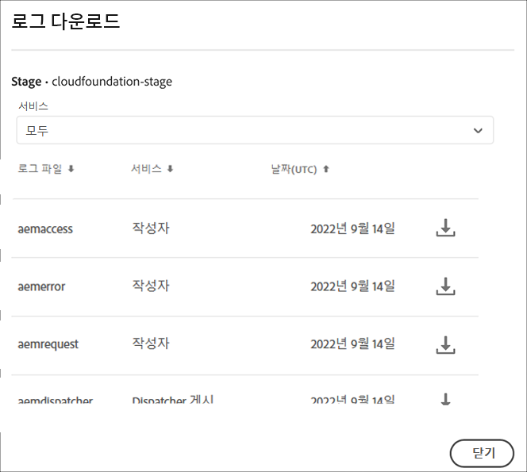

# 로그 액세스 및 관리 {#manage-logs}

사용자는 환경 카드를 사용하여 선택한 환경에서 사용 가능한 로그 파일 목록에 액세스할 수 있습니다.  사용자는 선택한 환경에 사용할 수 있는 로그 파일 목록에 액세스할 수 있습니다.

이러한 파일은 **개요** 페이지에서 UI를 통해 다운로드할 수 있습니다.


또는 **환경** 페이지:


>[!NOTE]
>열려 있는 위치에 관계없이 동일한 대화 상자가 나타나 개별 로그 파일을 다운로드할 수 있습니다.




## API {#logs-through-api}를 통해 로그

UI를 통해 로그를 다운로드하는 것 외에도 API 및 명령줄 인터페이스를 통해 로그를 사용할 수 있습니다.

예를 들어 특정 환경에 대한 로그 파일을 다운로드하려면 명령은

```java
$ aio cloudmanager:download-logs --programId 5 1884 author aemerror
```

다음 명령을 사용하여 로그를 추적할 수 있습니다.

```java
$ aio cloudmanager:tail-log --programId 5 1884 author aemerror
```

환경 ID(이 경우 1884) 및 사용 가능한 서비스 또는 로그 이름 옵션을 얻으려면 다음 작업을 수행할 수 있습니다.

```java
$ aio cloudmanager:list-environments
Environment Id Name                     Type  Description                          
1884           FoundationInternal_dev   dev   Foundation Internal Dev environment  
1884           FoundationInternal_stage stage Foundation Internal STAGE environment
1884           FoundationInternal_prod  prod  Foundation Internal Prod environment
 
 
$ aio cloudmanager:list-available-log-options 1884
Environment Id Service    Name         
1884           author     aemerror     
1884           author     aemrequest   
1884           author     aemaccess    
1884           publish    aemerror     
1884           publish    aemrequest   
1884           publish    aemaccess    
1884           dispatcher httpderror   
1884           dispatcher aemdispatcher
1884           dispatcher httpdaccess
```

>[!NOTE]
>**로그 다운로드**&#x200B;는 UI와 API를 모두 통해 사용할 수 있지만 **추적 로그**&#x200B;은 API/CLI 전용입니다.

### 추가 리소스 {#resources}

Cloud Manager API 및 Adobe I/O CLI에 대한 자세한 내용은 다음 추가 리소스를 참조하십시오.

* [Cloud Manager API 설명서](https://www.adobe.io/apis/experiencecloud/cloud-manager/docs.html)
* [Adobe I/O CLI](https://github.com/adobe/aio-cli-plugin-cloudmanager)